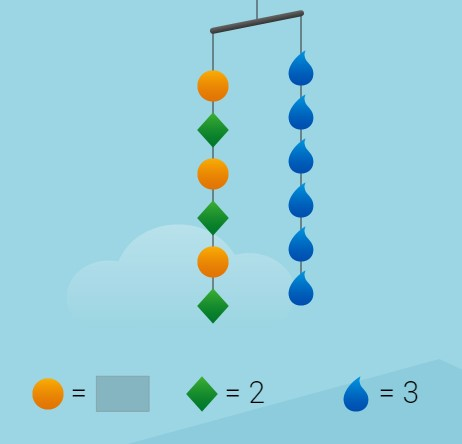

### Inequality from Equation 
We learned about equations and inequalities are very similar to them. If equal to sign is replaced with signs like , <,  ≤ etc. then inequality is formed. 
a>b means a is greater than b
a<b means a is less than b
a≤b means a is less than or equal to b
a≥b means a is greater than or equal to b

For example, 𝑥>5 states that the number “𝑥” is greater than 5. From an equation, we could get only one potential solution for the given variable. In case of 𝑥>5, 6 is also greater than 5, 7 is also greater than 5, 8 is as well, 9 is as well and so on. Therefore there are many solutions of 𝑥>5. 

 
Hanger diagram for inequalities
The coefficient of a term (numerical or algebraic) is shown in the hanger diagram by repeating that term multiple times in a group. Here the group of unknown number 𝑥 and 2 is repeated 3 times to get 3(𝑥 + 2).

For example the hanger diagram for 3(𝑥 + 2) > 18 will be as shown below.

1.18
The side with the heavier quantity is the side on which the arms will lean towards. 

### Solving inequalities
The processes of solving inequality and equation aren't very different from each other. The additive and multiplicative laws of equality are both applicable in the case of inequality as well.
We go through the process of solving the inequality given before.

3(𝑥 + 2)>18

We first convert it into an equation replacing the greater than sign with an equal.

3(𝑥+2)=18

The rest of the steps are the same as the equation.

or, 3(𝑥+2)/3=18/3

or, 𝑥+2=6

or, 𝑥+2-2=6-2

or, 𝑥=4

Now, this 4 that we got is what is known as a boundary point. Inequality is different from an equation, instead of the solution being at 4, it is anywhere but at 4. But that definition in itself isn't simpler either. If it isn't 4 then either it has to be greater than 4 or less than 4. For that we choose a test point, a test point can be any number that isn't 4, let's take 1. If we put 1 in the inequality initially given what do we get?

3(𝑥 + 2)>18

3(1+2)>18

3 x 3>18

9>18

9 is greater than 18. That is what the solution tells us. Is that true? No, it isn't. thus the solution doesn't contain 1. 1 is less than 4 so it should not contain any number that is less than 4. That means the solution is that 𝑥 is greater than 4.

𝑥 > 4
