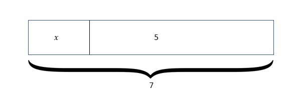
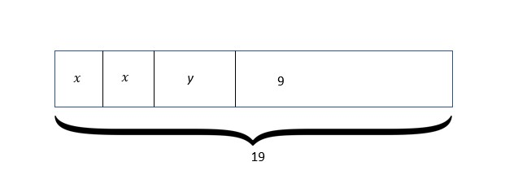
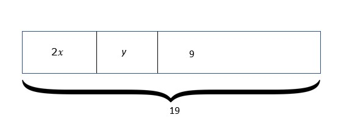

## Equation 
When two expressions are placed side by side separated by an equal sign, then it is called an equation. For example, 2+3=5 is a numerical equation.
The money earned by an electrician working on wiring a house takes 100 dollars for a house.

1.10 

If he completes the wiring of 3 such houses in a week, then the total earnings he made can be found out by adding 100 three times or multiplying 100 by 3. 

100+100+100=300 is also an equation and so is 100 x 3 =300
On the other hand, 3+7=9 is also an equation; it is not true that is another subject matter but nonetheless, it is an equation. It is a false equation. 

### Algebraic equations
All the equations discussed before are numerical equations. As with expressions, equations can also be algebraic and it is of different types. 

One way of categorizing equations is by observing how many different variables are used there. 𝑥=5 is one variable equation, and 𝑥-5=2y+7 is a two-variable equation because there are 𝑥 and y two variables in it. As we can see, there are two different expressions put side by side separated by an equal sign.
Equations can also be categorized into linear, quadratic, or cubic according to the highest index of the variables being used which we will learn later.

Equations can be demonstrated in different ways. One of them is a tape diagram. 

### Representing with tape diagrams

A tape diagram as the name suggests shows quantities shown in rectangular-shaped figures also known as "tape".

For example, 𝑥 + 5= 7 has tape diagram as below

1.11

The equation 2𝑥+y+9=19 can have either of the two diagrams below. 

1.12

1.13

As discussed while defining variables, it is only required when we need a placeholder for some quantity without a definitive value. 
Look at this statement: "A number when increased by 2, is equal to 5".
We will need a placeholder for the unknown number. 

Let us use 'x'. Writing this as an equation, we get;

𝑥 + 2 = 5

### Solving equations
Solving an equation means finding the appropriate value of the variable which when substituted into the equation will satisfy both sides of the equation. To find out the number that is equal to 5 when increased by 2, it would be common sense to decrease 2 from both sides so that the value of the variable gets revealed.

or, 𝑥 + 2 - 2 = 5 - 2

or, 𝑥 = 3

This process can also be shown in the diagram below. Firstly 𝑥 + 2 = 5 is shown when the two sides are balanced as the arm is completely horizontal but when two units are removed from the right side, the balance shifts towards the left as the left side is more heavier. After that when again 2 units are removed from the left-hand side as well, the balance is restored. 

1.14

The process applied here is associated with the additive property of equality which suggests that when a particular equal quantity is added/reduced from two equal quantities, then the resulting quantities are also equal. 
Another property of equality commonly used is the multiplicative property of equality in which a particular quantity is multiplied or divided by on both sides of the equation.

For example, 𝑥/5 = 20

Multiplying both sides by 5;

(𝑥/5) x 5 = 20 x 5

𝑥 = 100

Suppose that there is a picnic being planned for a class in a school. It is found that 500 dollars are required for a class of 25 people. Then what will be the share of each student that needs to be collected?

1.15

If we want to find out the answer, we have to divide 500 into 25 equal portions such that there is an equal load on all the students. In other words, it can also be said that some quantity that is added 25 times makes 500. Or what multiplied by 25 makes 500. If 𝑥 denotes the share of each student then

25 times 𝑥 =500

25𝑥=500

25*𝑥= 25*20

That is 𝑥=20

Each student has to contribute 20 dollars to the cause in order to make a total collection to be 500 dollars.

A variable will always be representing some kind of quantity according to its context. That quantity may be completely unknown or any number of a specified set suitable to the context.

For example, if 4r is an expression used to denote the profit earned by selling “r” t-shirts when the profit rate per t-shirt is 4 dollars then r can have any value but not a negative number because a negative number of t-shirts won't make any sense.

