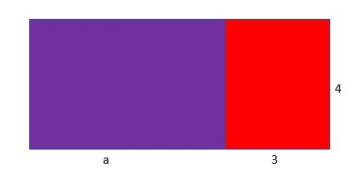

### Equivalent expressions
The way of getting simpler expression from a given expression, is done through symbolic transformation. In symbolic transformation, we perform the operations mentioned in the algebraic expressions. We follow the PEMDAS rule for symbolic transformation as well.
Remember when we mentioned that 3 x 4 is the same expression 4 + 4 + 4. That is because both expressions are equal to 12. 
For algebraic expressions, the value of expressions that we obtain by symbolic transformation are equal in all cases. For example, we write 𝑥+𝑥+𝑥 as 3𝑥 using the distributive property. We can choose any value to put in place of 𝑥 and we get the same value for both 𝑥+𝑥+𝑥 and 3𝑥. 

Suppose 𝑥 is taken to be 25,

then 25+25+25 is also 75, 
and 3 x 25 is also 75.

If 𝑥 is 3 
then 3+3+3 is also 9 and 
3 x 3 is also 9.

We find the same value for both 𝑥+𝑥+𝑥 and 3𝑥 in all values of 𝑥 and thus they are called equivalent expressions. 

#### Distributive property
The distributive property is the property by which expressions under multiplication/division can be written in the form of addition/subtraction. 
For example,

a(b+c)=ab+ac

(𝑥+z)/y=(𝑥/y) + (z/y)

Here is an example, the area of a purple rectangle is 4 x a because the dimensions of the rectangle are 4 units width and “a” length; The area of a red rectangle is 4 x 3 or 12 because the red rectangle is 4 units wide and 3 units long. 

1.9

The total area in the figure is 4a +12 if we add both the area of the rectangles. 
If we look at the dimensions of the whole rectangle (red + purple) we find that it is a+3 units long and 4 units wide. Thus the area of the whole rectangle is 4 x (a+3). Both 4 x (a+3) and 4a +12 must be equal. They are equal expressions.

The parentheses are used in place of the multiplication operator. If we want to know the real value of the area of the whole rectangle, then the value of a must be substituted.

Let's suppose that the value of a is 5 units. Then the value of the expression is 4 x (5+3) or 32. The value is the same even if we put a=5 in 4a+12. 

#### Commutative property
The commutative property is another property that helps in finding equivalent expressions. The placing of two quantities doesnt matter if the operation is commutative. Is it hard to understand? 
lets make it easier 

If addition is commutative, a + b is equal to b + a which is true.
If division is commutative, a/b is equal to b/a which is not true. 

The commutative property is valid in a lot of operations such as addition and multiplication whereas is invalid for operations such as subtraction and division. 

lets test the commutative property with numerical values. 

2 + 8 = 10 = 8 + 2 

2 - 8 =-6 ≠6= 8 - 2

We can represent subtraction as the addition of the negative quantity and in that case we can apply commutative property. 
2 - 8 = 2 + (-8) = (-8) + 2 = -8 + 2

Whenever we apply properties like the distributive property, commutative property and associative property, we get equivalent expressions. It is like writing '4ℓ' in place of 'ℓ + ℓ + ℓ + ℓ', both will amount to the same number, whatever value we substitute for 'ℓ'. We can also interpret them as repeated addition means multiplication. Any number added four times within itself is the same as multiplying the given number with 4. 
We can use the distributive law in order to verify that. 
Perimeter of a square = sum of all sides = ℓ + ℓ + ℓ + ℓ = ℓ  (1+ 1 + 1 + 1) =  ℓ x 4 = 4ℓ

We arent yet familiar with cases in which two expressions give the same value for one particular value for variable only. For example, 5𝑥 and 𝑥-8 both amount to 10 when we place -2 in place of 𝑥, 

5𝑥 = 5 x -2 =-10

𝑥-8 = -2 -8 = -10

That means these expressions are equal at 𝑥 = -2. Expressions are equal when they amount to one value at one particular point whereas in case of equivalent expressions, they will amount to same number for all values of variable. 
We can check if the expressions above are equal at another point as well. We can try  another value for 𝑥 such as 7

5𝑥 = 5 x 7 =35

𝑥-8 = 7 -8 = -1

At all other values for 𝑥 except -2, these two expressions wont give same value. So these expressions can't be termed as equivalent expressions. 
We can also differentiate equal and equivalent expressions with new terms; instance and pattern. If two expressions are equal, they are equal at one instance only and if two expressions are equivalent, then they are equal at all instances or the pattern of the expressions are same. 

We use pattern word normally to denote geometric figures but it is not just that. Pattern means the trend of a particular expression varying. 