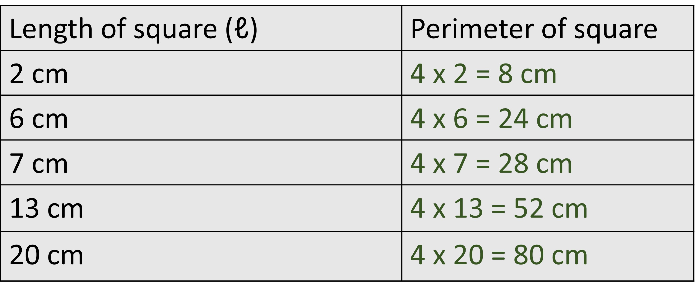
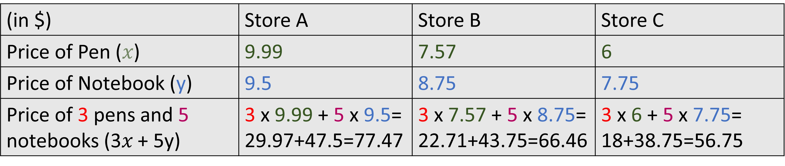

### Expression always represents a quantity
Expressions, either numerical or algebraic, carry some value to themselves. Whenever we are something with a number, it is very obvious to understand that number as a quantity. 

Algebraic expression may not always be one particular value, but they represent some quantity (may it be known or unknown). For the expressions that have thier values hidden due to the use of variable placeholder, then we just substitute the variable with a known value. 

For example the expression for the perimeter of a square of length 'ℓ' is '4ℓ'.
if we have to find the perimeter of a square that has its length as 6cm, we replace ℓ with 6
perimeter= 4x6 = 24 cm

24 cm is a quantity and we know that because we can show it with some distance. Quantity always comes with a unit here is cm or centimeters. 24 cm means it is 24 times long than 1 cm. 

The process of finding the value of expression is the same even when there are more than 1 variable as well. 

There are many ways of showing that expression represents quantity. Another way is with a table. We can transform any expression and its values into a table.

Basically a table shows the variable quantities at different points. For example, in case of the expression for the perimeter of square, a table shows different lengths of square and the corresponding perimeter values. 

1.21

Since an expression always corresponds to some quantity, the parts of the expression that form itself are also quantities. We can analyze the parts of the expression and the seperate quantities they represent. 

For example: If the cost of 3 pens and 5 notebooks is 3𝑥 + 5y then 𝑥 is the price of one pen or unit price of pen and y is the price of one notebook or unit price of the notebook. 3𝑥 is the total price of all pens and 5y is the total price of all notebooks. This applies to all stores that sell pens and notebooks at different prices. 

1.20

We can see that we can obtain different total price of the pens and notebooks with the same expression 

If you have the expression 3𝑥 + 5y, we may think of that as an expression that asks us to add 3𝑥 and 5y but it represents two numbers that are represented by placeholders 3𝑥 and 5y. We know 3𝑥 and 5y both represent the price of something. Even though 𝑥 and y seem different from each other, 3𝑥 + 5y represents a single value.  

If I tell that I am 2 years older than my brother and his age is 25-2, then i must be 25-2+2 years old where 2 is the gap in the age between me and my brother. 

Likewise if my brother says he is a-3 years old, we must not be puzzled with the expression that he is using to describe his age. It is a completely different question what the value of a is but a-3 is indeed a quantity and its unit is years. Since I am always 2 years older than him, I can add 2 to his age and get mine. 

a-3+2=a-1

I am 'a-1' years old in the above context. Of course, i know how much my age is; that expression is equal to that my age. 

