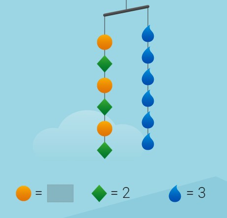

## Equation 
When two expressions are placed side by side separated by an equal sign, then it is called an equation. For example, 2+3=5 is a numerical equation.
The money earned by an electrician working on wiring a house takes 100 dollars for a house.

1.10 

If he completes the wiring of 3 such houses in a week, then the total earnings he made can be found out by adding 100 three times or multiplying 100 by 3. 

100+100+100=300 is also an equation and so is 100 x 3 =300
On the other hand, 3+7=9 is also an equation; it is not true that is another subject matter but nonetheless, it is an equation. It is a false equation. 

### Algebraic equations
All the equations discussed before are numerical equations. As with expressions, equations can also be algebraic and it is of different types. 

One way of categorizing equations is by observing how many different variables are used there. 𝑥=5 is one variable equation, and 𝑥-5=2y+7 is a two-variable equation because there are 𝑥 and y two variables in it. As we can see, there are two different expressions put side by side separated by an equal sign.
Equations can also be categorized into linear, quadratic, or cubic according to the highest index of the variables being used which we will learn later.

Equations can be demonstrated in different ways. One of them is a tape diagram. 

### Representing with tape diagrams

A tape diagram as the name suggests shows quantities shown in rectangular-shaped figures also known as "tape".

For example, 𝑥 + 5= 7 has tape diagram as below

1.11

The equation 2𝑥+y+9=19 can have either of the two diagrams below. 

1.12

1.13

As discussed while defining variables, it is only required when we need a placeholder for some quantity without a definitive value. 
Look at this statement: "A number when increased by 2, is equal to 5".
We will need a placeholder for the unknown number. 

Let us use 'x'. Writing this as an equation, we get;

𝑥 + 2 = 5

### Solving equations
Solving an equation means finding the appropriate value of the variable which when substituted into the equation will satisfy both sides of the equation. To find out the number that is equal to 5 when increased by 2, it would be common sense to decrease 2 from both sides so that the value of the variable gets revealed.

or, 𝑥 + 2 - 2 = 5 - 2

or, 𝑥 = 3

This process can also be shown in the diagram below. Firstly 𝑥 + 2 = 5 is shown when the two sides are balanced as the arm is completely horizontal but when two units are removed from the right side, the balance shifts towards the left as the left side is more heavier. After that when again 2 units are removed from the left-hand side as well, the balance is restored. 

1.14

The process applied here is associated with the additive property of equality which suggests that when a particular equal quantity is added/reduced from two equal quantities, then the resulting quantities are also equal. 
Another property of equality commonly used is the multiplicative property of equality in which a particular quantity is multiplied or divided by on both sides of the equation.

For example, 𝑥/5 = 20

Multiplying both sides by 5;

(𝑥/5) x 5 = 20 x 5

𝑥 = 100

Suppose that there is a picnic being planned for a class in a school. It is found that 500 dollars are required for a class of 25 people. Then what will be the share of each student that needs to be collected?

1.15

If we want to find out the answer, we have to divide 500 into 25 equal portions such that there is an equal load on all the students. In other words, it can also be said that some quantity that is added 25 times makes 500. Or what multiplied by 25 makes 500. If 𝑥 denotes the share of each student then

25 times 𝑥 =500

25𝑥=500

25*𝑥= 25*20

That is 𝑥=20

Each student has to contribute 20 dollars to the cause in order to make a total collection to be 500 dollars.

A variable will always be representing some kind of quantity according to its context. That quantity may be completely unknown or any number of a specified set suitable to the context.

For example, if 4r is an expression used to denote the profit earned by selling “r” t-shirts when the profit rate per t-shirt is 4 dollars then r can have any value but not a negative number because a negative number of t-shirts won't make any sense.

### Relating two quantities for making an equation
Equations are also used with two variables to show how two quantities depend on each other. 
For example, the bill of electricity is dependent on the units of electricity consumed. The traffic in the street is dependent on the time of the day etc.

The relation may not be as straightforward all the time but they can certainly be equated with an equal sign. 
For example, if a pen costs 2 dollars, two will cost 4 dollars, 3 will cost 6, and so on. 

1.16

No matter how big the number of pens will be, the price will exactly be twice that. We can choose any value for price of pens, we can find the number of pens. Alternatively we can find the price of pens by using any number of pens.  

To make it easier, we can choose a placeholder variable for both and relate them with an equation. 
price of pens = 2 x (number of pens)

If the number of pens is denoted by 𝑥, and their price is denoted by y, then the relationship would be given by;

y=2𝑥

If there are 240 candies to be distributed in a class of t students, the number of candies each student gets can be found out with an equation. 

1.17

We know that as the number of students increases, the number of candies that each student gets will get lesser and lesser. It's very obvious. 

We know that if there are two students they get 120 candies each, if there are 20 students, each gets 12 candies. We get an interesting type of relationship here. The number of times by which the number of students increases, the candies received by each student decrease by the same factor. In any case the product of the number of students and the candies received by each of them has to amount to 240.

Number of candies each student receives x number of students = total number of candies.

If we replace the Number of candies each student receives with a placeholder p
p x t = 240

Let's suppose another situation where in a university there is one professor each for 20 students. Then, which of the following would be correct?

Is it No. of students = 20 x (No. of professors)
OR, 
No. of professors = 20 x (No. of students)

The easier way of finding the right answer is to understand which is greater, the number of students or professors. If there is one professor for 20 students, two professors for 40 students, etc. It can be seen that students are always more in number than professors.

If the larger number (the number of students) is multiplied by 20, then it will become even larger and the quantity can never be equal to the smaller number (number of professors). Thus the smaller number is multiplied by 20, then it will become equal to the larger number. Thus,

No. of students = 20 x (No. of professors)

If f represents the number of professors and d represents the number of students then 

d=20 x f

The same equation can be written as f=d/20, if we divide both sides of the equation by 20.

Normally when an equation is written, one of the variable is operated while the variable written on the other side is written alone.
In f=d/20, we have to divide d by 20 to get f, so d is independent and f is dependent. Whereas in d=20f, f is independent and d is dependent. How the equation is written doesn't have much effect on the actual relationship between the two quantities.

Let's take another example, 
The height of a rectangular window is 6 inches less than the width. Let w represent the width of the window and h be the height.

We know that 6 is the difference between height and width in which the width is larger so either 6 has to be subtracted from the width or 6 has to be added to the smaller quantity that is the height. 

w-6=h

Or w=h+6 

Here when w=1, we get h=1+6=7

When w=2, we get h=2+6=8

### Inequality from Equation 
We learned about equations and inequalities are very similar to them. If equal to sign is replaced with signs like , <,  ≤ etc. then inequality is formed. 
a>b means a is greater than b
a<b means a is less than b
a≤b means a is less than or equal to b
a≥b means a is greater than or equal to b

For example, 𝑥>5 states that the number “𝑥” is greater than 5. From an equation, we could get only one potential solution for the given variable. In case of 𝑥>5, 6 is also greater than 5, 7 is also greater than 5, 8 is as well, 9 is as well and so on. Therefore there are many solutions of 𝑥>5. 

 
Hanger diagram for inequalities
The coefficient of a term (numerical or algebraic) is shown in the hanger diagram by repeating that term multiple times in a group. Here the group of unknown number 𝑥 and 2 is repeated 3 times to get 3(𝑥 + 2).

For example the hanger diagram for 3(𝑥 + 2) > 18 will be as shown below.

1.18
The side with the heavier quantity is the side on which the arms will lean towards. 

### Solving inequalities
The processes of solving inequality and equation aren't very different from each other. The additive and multiplicative laws of equality are both applicable in the case of inequality as well.
We go through the process of solving the inequality given before.

3(𝑥 + 2)>18

We first convert it into an equation replacing the greater than sign with an equal.

3(𝑥+2)=18

The rest of the steps are the same as the equation.

or, 3(𝑥+2)/3=18/3

or, 𝑥+2=6

or, 𝑥+2-2=6-2

or, 𝑥=4

Now, this 4 that we got is what is known as a boundary point. Inequality is different from an equation, instead of the solution being at 4, it is anywhere but at 4. But that definition in itself isn't simpler either. If it isn't 4 then either it has to be greater than 4 or less than 4. For that we choose a test point, a test point can be any number that isn't 4, let's take 1. If we put 1 in the inequality initially given what do we get?

3(𝑥 + 2)>18

3(1+2)>18

3 x 3>18

9>18

9 is greater than 18. That is what the solution tells us. Is that true? No, it isn't. thus the solution doesn't contain 1. 1 is less than 4 so it should not contain any number that is less than 4. That means the solution is that 𝑥 is greater than 4.

𝑥 > 4
