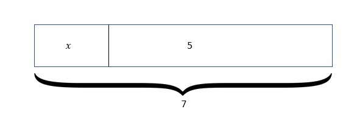
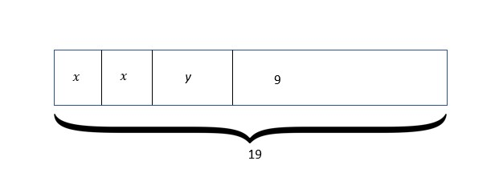
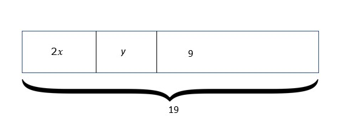

## Equations
 
When you equate an expression with another, implying that they are equal, you get an equation. For example, 2 + 3 = 5 is an equation. 

Let's say an electrician gets paid $100 for wiring one house. If he wires 3 houses in a week, we can figure out how much money he made by adding 100 three times or multiplying 100 by 3. Both 100 + 100 + 100 = 300 and 100 x 3 = 300 are equations. Such equations, where the two sides of the equation, or the two expressions are equal, are true equations. 
But not all equations are true! For example, 3 + 7 = 9 is an equation, but it's not true. Adding 3 to 7 does not give us 9. 

The equations we discussed above are numerical equations, containing actual numbers. But similar to algebraic expressions, equations can also be algebraic, which has variables in them. They are written/formed in a similar way as we form expressions, except this time we have two different expressions that are seemingly equal. Look at a simple example below. 

Look at this statement: “A number when increased by 2, is equal to 5”.
We know that variables are only required when we need a placeholder for some quantity without a definitive value. We will need a placeholder for the unknown number.
Let us use ‘𝑥’. Writing this as an equation, we get;
𝑥 + 2 = 5  

Basically, 2 added to an unknown value gives us 5. 
There are different types of equations, and one way to sort them is by how many variables they have. If there's only one variable, like 𝑥 = 5, it's a one-variable equation. If there are two variables, like 𝑥 - 5 = 2y + 7, it's a two-variable equation. 
Equations can also be linear, quadratic, or cubic, depending on the highest power of the variables present. 

## Representing equations with tape diagrams

Equations can be shown in different ways. Let’s at one of those here: the tape diagram.

A tape diagram, as the name suggests, shows quantities shown in rectangular-shaped figures, also known as “tape”.
For example, 𝑥 + 5= 7 has tape diagram as below

The equation 2𝑥 + y + 9 = 19 can have either of the two diagrams below. Since 2𝑥 is simply formed by adding 2 𝑥’s, we can either write them separately in boxes (that need to be equal!), or in one single box as 2𝑥. 

## Solving equations

Solving an equation means finding the appropriate value of the variable, which when substituted into the equation will satisfy both sides of the equation. For example,  the equation for this statement “A number when increased by 2, is equal to 5” is 𝑥 + 2 = 5. 
We want to find the number which becomes 5 when we add 2 to it. Our instinct would be to remove 2 from the left side. But there are consequences to changing just one side of an equation. If you think of the equation being balanced (since both sides are equal), removing or adding anything to one side would no longer keep the equation balanced. But there is a simple solution to this. You can copy the same step on the other side to maintain the balance. 

So, if we subtract (remove) 2 from the left side, we will also do the same on the right side.

𝑥 + 2 = 5    
𝑥 + 2 - 2 = 5 - 2  
𝑥 = 3  

The process applied here relates to the additive property of equality, which suggests that when a particular equal quantity is added/reduced from two equal quantities, then the resulting quantities are also equal. Basically, the fact that the equation above is still true even though we added (-2) (or subtracted 2) to both sides. The reason we added -2 was so that we could get 2 + (-2) on the left side, which would result in 0. We do this to isolate the variable, which helps us find its value.

Another property of equality commonly used to solve equations is the multiplicative property of equality. Here, as the name suggests, a particular quantity is either multiplied to or divided by both sides of the equation.
For example, to solve 𝑥/5 = 20, we have nothing to add or subtract here. But. we see that the variable is being divided by 5. We cannot change that to 0 here since anything divided by 0 is not what we want. Instead, we want it to be 1, since 𝑥 and 𝑥/1 are the same. To remove 5, we multiply  both sides by 5. 
(𝑥/5) x 5 = 20 x 5  
𝑥 = 100  
⅕ x 5 is 1, giving us just the variable on the left side. 

Some equations will also require use of both properties to solve the equation. Just make sure to use the correct property first.
