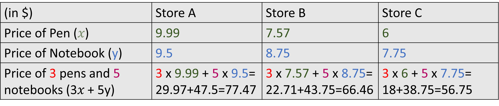

## Expression represents a quantity

Expressions, either numerical or algebraic, carry some value. It is easy enough to find this value when we are working with numerical expressions. For example, the value of 4 x 5 - 2 is 18. We simplify each of the operations present in the expression. 

The story is different in case of algebraic expression. Here we have variables with unknown values. So simplifying the expression is not possible, because how would you simplify something line 45 - x? 
For such expressions, we leave it as it is (after simplifying them to the simplest form that we can) and solve it once we have the value for the variable. 
For example, the perimeter of a square is given as l + l + l + l, where l is the length of each side. We can simplify this as 4l, but we cannot go further since we do not know the value of l here. Once we know that the length is 6 cm, we can find the perimeter by replacing l with 6 to get 4 x 6 = 24 cm. 

Since an expression always corresponds to some quantity, the parts of the expression that form the expression are also quantities. This means that we can analyze the parts of the expression and the separate quantities they represent as well.

For example: If the cost of 3 pens and 5 notebooks is 3𝑥 + 5y then 𝑥 is the price of one pen or unit price of pen and y is the price of one notebook or unit price of the notebook. 3𝑥 is the total price of all pens and 5y is the total price of all notebooks. This applies to all stores that sell pens and notebooks at different prices.

We can see that we obtain different total prices of the pens and notebooks even with the same expression. If we wanted, we could also just have found the prices for pens from all stores since we know 3x from the expression represents the price of pens. 
From the above example, we saw that the process of finding the value of expression is the same even when there are more than 1 variable (x and y in the above case). Do not get confused about the use of different variables in the same context. It should be obvious that we would use different variables for different quantities (here the price of pens and notebooks) since using the same would create confusion. 
