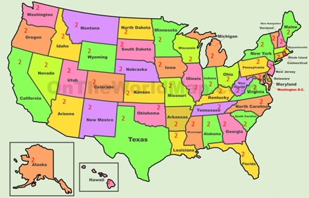
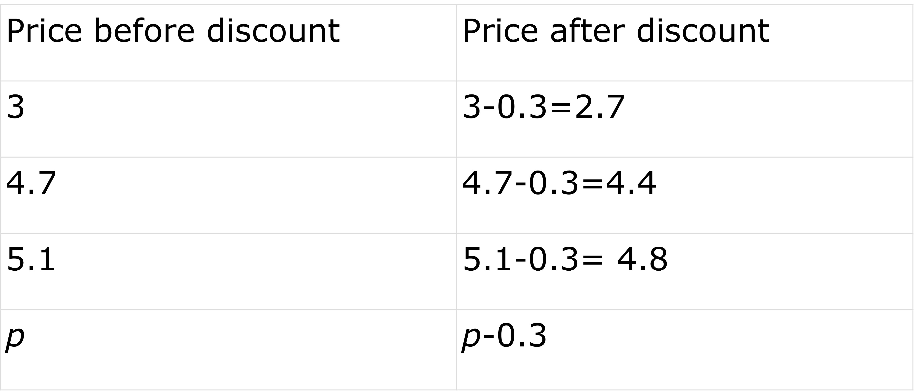

## What are expressions?
Expressions means the way of expressing and The ways of expressing can be of various types. There are certain ways of expressing things in terms of mathematics. Numerical expressions make use of numbers and operators to express something in mathematics. 

If somebody asks you “what is your age?” How do you respond?

You may mention some number such as 11 years, 12 years, or 13 years etc. If your age is 14 years, then 14 years is an expression. 

Suppose a T-shirt is priced at 10.99$ in a store during its sale. We know that 100 cents equal to 1 dollar. That means 1 cent is equal to 0.01 dollars and since the shirt costs 1 cent less than 11 dollars or (11-0.01)$ is also an expample of numerical expression. Expressions contain all kinds of operators such as addition (+), multiplication (x), subtraction (-), division (÷), etc. 

For example, we know that 12 is the result when 3 is multiplied by 4. Both 3x4 and 12 are numerical expressions. Numerical expressions are always equivalent to a quantity. They point to some value. 

Mathematics also uses expressions, made of numbers and symbols. Symbols used in mathematical expressions are done so for various purposes. 

For example, when we see 100-3, we understand it is trying to say that we have to reduce 100 by 3. Or it may also be trying to express that is 3 less than 100. There isnt a lot of difference between the two expressions. 

We can often simplify a given expression into an equivalent quantity (97 in the previous case), often known as the value of the expression.

Let's take another example.

There are 2 senators from each state in the US Senate. Now if we need to find out how many people that are in the senate, we need to find out the total number of states in the Nation.  As there are a total of 50 states under the American flag, how many members are there in total in the senate? 

1.1

As we can see that for each state there are two members, we have to add two 50 times which also means indirectly multiply 2 by 50.

2+2+2+2....... up to 50 times

or 2 x 50

Both numerical expressions are equal to 100. It can also be interpreted as a single member from each state will make 50 members. The final answer is just double of 50.  

It doesn't mean that we need to have some kind of operation between numbers like addition or subtraction to make an expression. It may simply be a number only and it expresses something. For example, 206 is an expression. It can be used to express the number of bones in a human body. 

1.2

### Letters in expressions
Apart from the operators and numbers we already know, there are letters/symbols used in the expression and they are known as variables. 

You may be puzzled why would letters be used in expression but there are situations in which we have perform operations on unknown number as well. 

Just like 9-3 means, we need to deduct 3 from 9 or a number that is 3 less than 9. 50-a means that we have to deduct “a” quantity from 50. It may also be expressing a number that is less than 50 by a. 

One thing can be validly coming to your mind, How can a letter be subtracted from a number? 

The answer to this question is that a letter is never subtracted, added, multiplied or divided by a known number. We perform those operations with numbers only. When we arent sure of true value of any quantity, we use a letter that holds the place for that quantity. Its like your friend keeping your seat secure in a resturant  

The real reason is that the letter used here isn't just another letter. It's the same as deducting one numerical quantity from the other, the difference is that we know all numbers in a numerical expression while we may not know the value of all quantities in an algebraic expressions. 

Let's consider a situation when we have some unknown value.
For example, you are being offered 30 cents discount on all chocolates being sold at a store and you want to know how much you need to pay for one chocolate.

1.3

For a chocolate marked $3, the amount to pay will be $(3-0.3). For another chocolate marked $4.7, we have to pay $4.4. We are sure that there are chocolates of different prices. If we have to express the price for different chocolates then either we calculate different values or we use a placeholder to make the expression up. 

1.19

It can be agreed upon that we can't explain the price of every toffee with one value or one number. The other thing that is for sure is that we have to $0.3 less than the marked price, whatever may the price of the toffee be. 

Thus, if we had something that could act as a placeholder for all the values of the toffee prices, it could help us immensely to express the value needed to pay for the chocolate and that is what p-0.3 gives assuming the price of a toffee before the discount is p.
Remember this table from before?

1.19

If we substitute the unknown or varying numbers with a letter such as p shown above, then all of the numbers of the rows above it can be explained properly. 

If the marked price of one toffee is p dollars, then the price you have to pay will be p-0.3 dollars. This expression will always give the final price after the discount for toffee of any initial price. 
p is just a placeholder that takes the place of the actual value of the price of the toffee. In contrast, if it was told that you have to pay 4 dollars then that is for those toffee only whose price is 4.3 dollars. If it is said that you have to pay 4.8 dollars then that is for chocolates of 5.1 dollars and so on. That is the reason why letters are used in an expression.
Suppose there is a 10 percent discount on all types of eye checkups and treatment fees.

1.4

If a treatment costs 100 dollars, then after the discount will become 10 dollars lesser that is the patient has to pay only 90 dollars.

100-10% of 100

=100- (10/100) x 100

=100-10

=90

If the cost of treatment was 75 dollars, then the patient has to pay

=75-10% of 75

=75-0.1 x 75

=75-7.5

=67.5

This process will be the same for all values. If the cost of treatments is denoted by a placeholder "d", then 

=d-10% of d 

=d-10/100 x d 

=0.9d

Now if we put 100 in place of d it will be 0.9 x 100 =90

and if we put 75 in place of d it will be 0.9 x 75 = 67.5

Now, 0.9d is an algebraic expression that gives the money a patient has to pay following the discount available.

