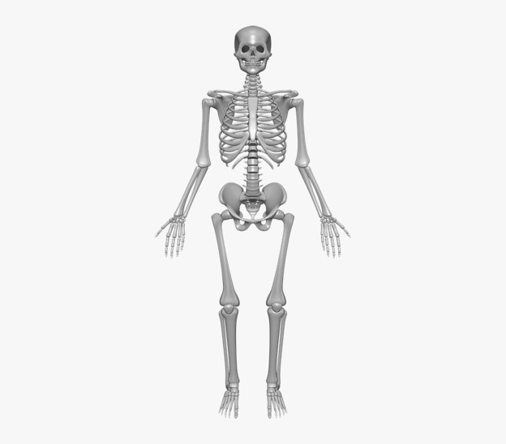

## What are expressions?
Expressions means the way of expressing feeling. The ways can be of various types. Oral, symbolic gestures, or facial etc. Numerical expressions make use of numbers and operators to express something. 

If somebody asks you “what is your age?” How do you respond?

You may mention some number such as 11, 12, or 13 etc. The number that you use to express your age is a numerical expression. In the same manner, your friend may express his/her age as 2 lesser than 14. It is also an example that makes use of numbers to make an expression. If your friend mentions his/her age as 2 less than 14 then we know we can find a lesser number by subtraction so the correct expression is 14-2 or what remains when 2 is reduced from 14. Expressions contain all kinds of operators such as addition, multiplication, subtraction, division, etc. We know 12 is the result when 2 is reduced from 14. Both 14-2 and 12 are numerical expressions. 

Numerical expressions are always equivalent to a quantity. They point to some value. 

It is an act of making people know about some feelings or thoughts. It acts as a medium so that somebody’s thoughts can be understood by others. We recognize facial expressions, written expressions, oral expressions, etc. You may make a different face when you are in pain as compared to when you are eating delicious food. The example mentioned here is mostly facial expression, but other forms of expression may be used for the same situation. Other forms include oral or written or symbolic forms as well. We use some language or sound for that. For example, if somebody says that he is hungry, he is using the English language as the medium to express his thoughts. For sure language developed earlier but soon in human civilization there was a need for counting and maths after that. 

Mathematics also uses expressions, made of numbers and symbols. Symbols used in mathematical expressions are done so for various purposes. 

For example, when we see 100-3, we understand it is trying to say that we have to reduce 100 by 3. Or it may also be trying to state a number that is 3 less than 100. We can often simplify a given expression into an equivalent quantity (97 in the previous case), often known as the value of the expression. 
Let's take another example.

There are 2 senators from each state in the US Senate. As there are a total of 50 states under the American flag, how many members are there in total in the senate? 

1.1

As we can see that for each state there are two members, we have to add two 50 times or it means that we must multiply 2 by 50.

2+2+2+2....... up to 50 times

or 2 x 50

That is 100 members in total in the senate. It can also be interpreted as a single member from each state will make 50 members. The final answer is just double that number. 

It doesn't mean that we need to have some kind of operation between numbers like addition or subtraction to make an expression. It may simply be a number only and it expresses something. For example, 206 is an expression. It can be used to express the number of bones in a human body. 

1.2

### Letters in expressions
Apart from the operators and numbers we already know, there are letters/symbols used in the expression and they are known as variables. 

Just like 9-3 means, we need to deduct 3 from 9 or a number that is 3 less than 9. 50-a means that we have to deduct “a” quantity from 50. It may also be expressing a number that is less than 50 by a.

One thing can be validly coming to your mind, How can a letter be subtracted from a number? 

The real reason is that the letter used here isn't just another letter. It's the same as deducting one numerical quantity from the other. 

Let's consider a situation when we have some unknown value.
For example, you are being offered 30 cents discount on all chocolates being sold at a store and you want to know how much you need to pay for one chocolate.

1.3

If the price of chocolate is 3 dollars, you may have to pay 2.7 dollars, if the chocolate is worth 4.7 dollars, then you may have to pay 4.4 dollars. 

1.19

It can be agreed upon that we can't explain the price of every chocolate with one value or one number but whatever the marked price of the chocolate may be, you need to pay 30 cents or 0.3 dollars lesser. Thus, if we had an entity that could act as a placeholder for all the values of the chocolate prices, it could help us immensely to express the value needed to pay for the chocolate and that is what p-0.3 gives assuming the price of chocolate before the discount is p.
Remember this table from before?

1.19

If we substitute the unknown or varying numbers with a letter such as p shown above, then all of the numbers of the rows above it can be explained properly. 

If the marked price of one chocolate is p dollars, then the price you have to pay will be p-0.3 dollars. This expression will always give the final price after the discount for chocolate of any initial price. 
p is just a placeholder that takes the place of the actual value of the price of the chocolate. In contrast, if it was told that you have to pay 4 dollars then that is for those chocolates only whose price is 4.3 dollars. If it is said that you have to pay 4.8 dollars then that is for chocolates of 5.1 dollars and so on. That is the reason why letters are used in an expression.
Suppose there is a 10 percent discount on all types of eye checkups and treatment fees.

1.4

If a treatment costs 100 dollars, then after the discount will become 10 dollars lesser that is the patient has to pay only 90 dollars.

100-10% of 100

=100- (10/100) x 100

=100-10

=90

If the cost of treatment was 75 dollars, then the patient has to pay

=75-10% of 75

=75-0.1 x 75

=75-7.5

=67.5

This process will be the same for all values. If the cost of treatments is denoted by a placeholder "d", then 

=d-10% of d 

=d-10/100 x d 

=0.9d

Now if we put 100 in place of d it will be 0.9 x 100 =90

and if we put 75 in place of d it will be 0.9 x 75 = 67.5

Now, 0.9d is an algebraic expression that gives the money a patient has to pay following the discount available.

