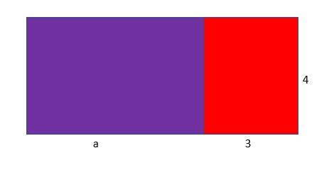

### Placeholder variables
We found some of the algebraic expressions in the patterns quiz. We found that letters could act as placeholders by substituting in place of a number. Such placeholder symbols or letters are known as variables. 

The kind of letter or symbol we choose is totally independent of whatever quantity we are assuming; it can be any letter or symbol. If we suppose the price of an apple to be p or a, it is just for convenience and not because it represents an abbreviation of the quantity. 

It must also be understood that the letters don't represent the object itself but an attribute of that object. If f  is used in some context involving fish then it may be expressing the weight of fish, the number of fish, the price of fish, or something like that. 

1.5

Not all letters represent variables, there are letters used as abbreviations for units such as 10 meters is written as 10 m. 20 pounds is written as 20 lb and so on.

It's also not necessary that a particular variable may be used for a particular quantity only. But the same variable cannot be used to depict two different quantities in the same context. 
For example you have the guess the age of two of your cousins. If you choose variable "x" for one of the cousin, the age of the other cousin cant be "x" just because it is unknown as well. The reason being its rare that both numbers turn out be chosen. 

In another example: If the number of oranges is denoted by “t” then "t" should not be used again to denote the weight of the oranges in that same scenario. 

1.6

There are two types of entities in an expression generally: variables and constants. Variables can be used as a placeholder for a quantity whose value isn't fixed and constants are those entities that represent one particular quantity.

One notion may be set up in your mind now that whenever letters are seen in an expression, they are variables. There are certain symbols, particularly Greek, that are used to represent constant values such as π (pi), prominent in formulae related to curved surfaces or circles. It represents 3.14 and is always equal to that value in whatever context it may be used.  Another such symbol is e is known as Euler's number which we will learn about in higher grades. 

Expressions, either numerical or algebraic, carry some value to themselves. It may not always be one particular value, but they represent some quantity (may it be known or unknown). In the case of algebraic expression, we must substitute the variable with a particular value to find the corresponding value of the expression. 

It's not mandatory that some statement or operation in algebra can always be expressed through a combination of variables and constants.
There are many ways of doing that. One such way is with a table or a graph. They both focus on the quantity denoted by the expression. The table is generated by writing down the value of the expresion compared to the value of the variable initially put in. 

It can also be done through tables or graphs. Expressions can be transformed into tables or graphs by finding the potential values of the variable and comparing that with the values of the expression.The expression can also be expressed by a graph where we plot the potential values of expression and the variables. We will learn about that in detail later.

Since an expression corresponds to some quantity, the parts of the expression that form itself are also quantities. Each part can be identified as a separate quantity.

For example: if the cost of 3 pens and 5 notebooks is 3𝑥 + 5y then 𝑥 is the price of one pen or unit price of pen and y is the price of one notebook or unit price of the notebook. 3𝑥 is the total price of all pens and 5y is the total price of all notebooks. 
If I tell that I am 2 years older than my brother and 25-2 represents his age, then 25 is my age and 2 represents the difference in the ages between me and my brother.  

### Symbolic transformation
What is the point of learning expressions then?
The whole point of expressions is that complex contexts become simpler and concise with expressions. You may be wondering the expressions worked out till now have been simple and how simpler are we trying to get. 

It is true that the expressions mentioned till now have been very simple. But there are contexts in which the expressions has many operators to use. It means we may require addition as well, we may require subtraction as well, multiplication as well and so on. PEMDAS helps in determining which operator has to be written first and which has to be written last. 

PEMDAS is an acronym for 
Parenthesis for P 
Exponents for E, 
Multiplication for M, 
Division for D, 
Addition for A, and 
Subtraction for S 

For example, if we are to find “5 less than 7 times a number”. Here, “less” is used for subtraction operations whereas “times” is used to represent multiplication.

It says 7 has to be multiplied by a number that isn't known. Therefore the unknown number is determined first and then we multiply that by 7. Thus, a variable is represented by the letter 𝑥. Only after the multiplication, the subtraction operation is expressed. 
 
We write 7𝑥 - 5 in this context and not 7(𝑥 - 5). 7(𝑥 - 5) is applicable to the statement: "7 times 5 less than a number". 

Here any letter or symbol can be used in place of 𝑥 unless it means any other thing already. 
If we have to find out a number that is 5 lesser than 7 times 6 then we just plug in the value of the variable in the expression.
7 x 6 - 5 = 37

Another example of simplification is 
7 (4 + 5) ÷ 14 -82

First the Parenthesis
=7 x 10 ÷ 14 -82

Then the Exponent
=7 x 10 ÷ 14 -64

Then the Multiplication
=70 ÷ 14 -64

Then Division
=5 - 64

Then, it must have been Addition but its not available so Subtraction
=-59

We can operate with addition after subtraction or vice versa. The case is similar with multiplication and division. 

Expressions always tell something about a situation mathematically. The operators used in expressions are a direct translation of the meaning that a statement provides. 

For example, if an expression says double the amount of an unknown number, we first need a placeholder variable for the number and then multiply that by 2. If we choose the placeholder for that number as "g", then double the number becomes 2g. 

If an expression says that the amount of food cooked is 50 kg less than that of yesterday and the amount of yesterday isn't known, then we need a placeholder variable to denote the unknown amount of food, double it and subtract 50 from it. 
amount of food cooked yesterday= f
double of that amount = 2 x f
50 less than double = 2 x f - 50

The expression would look something like 2f - 50 where f is the amount of food cooked today. 

1.7

The parts of expressions are separated by an operator. Operators can be addition “+”, subtraction “-”, multiplication “*” or “x”, division “÷” or “/”, the root “√” etc. Sometimes parts of an expression may not seem to use any operators, it is done in the cases of multiplication.

There are situations in which we require multiple placeholders for different quantities. Suppose you buy some number of blue, red and yellow t-shirts. If the number of blue t-shirts is “𝑥”, number of red t-shirts is “y” and number of yellow t-shirts is “z”, then the total number of t-shirts can be expressed as 𝑥 + y + z. If a blue t-shirt cost 3 dollars, a red one cost 2.5 dollars and a yellow one costs 2 dollars, the total cost of buying a blue T-shirt is 3𝑥, for the red one it's 2.5y and for the yellow one it's 2z dollars. 

Thus the total cost of all the t-shirts is 3𝑥+2.5y+2z dollars.

1.8 

### Equivalent expressions
The way of getting simpler expression from a given expression, is done through symbolic transformation. In symbolic transformation, we perform the operations mentioned in the algebraic expressions. We follow the PEMDAS rule for symbolic transformation as well.
Remember when we mentioned that 3 x 4 is the same expression 4 + 4 + 4. That is because both expressions are equal to 12. 
For algebraic expressions, the value of expressions that we obtain by symbolic transformation are equal in all cases. For example, we write 𝑥+𝑥+𝑥 as 3𝑥 using the distributive property. We can choose any value to put in place of 𝑥 and we get the same value for both 𝑥+𝑥+𝑥 and 3𝑥. 

Suppose 𝑥 is taken to be 25,

then 25+25+25 is also 75, and 
3 x 25 is also 75.

If 𝑥 is 3 
then 3+3+3 is also 9 and 
3 x 3 is also 9.

We find the same value for both 𝑥+𝑥+𝑥 and 3𝑥 in all values of 𝑥 and thus they are called equivalent expressions. 

#### Distributive property
The distributive property is the property by which expressions under multiplication/division can be written in the form of addition/subtraction. 
For example 

a(b+c)=ab+ac

(𝑥+z)/y=(𝑥/y) + (z/y)

Here is an example, the area of a purple rectangle is 4 x a because the dimensions of the rectangle are 4 units width and “a” length; The area of a red rectangle is 4 x 3 or 12 because the red rectangle is 4 units wide and 3 units long. 

1.9

The total area in the figure is 4a +12 if we add both the area of the rectangles. 
If we look at the dimensions of the whole rectangle (red + purple) we find that it is a+3 units long and 4 units wide. Thus the area of the whole rectangle is 4 x (a+3). Both 4 x (a+3) and 4a +12 must be equal. They are equal expressions.

The parentheses are used in place of the multiplication operator. If we want to know the real value of the area of the whole rectangle, then the value of a must be substituted.

Let's suppose that the value of a is 5 units. Then the value of the expression is 4 x (5+3) or 32. The value is the same even if we put a=5 in 4a+12. 

#### Commutative property
The commutative property is another property that helps in finding equivalent expressions. The placing of two quantities doesnt matter if the operation is commutative. Is it hard to understand? 
lets make it easier 

If addition is commutative, a + b is equal to b + a which is true.
If division is commutative, a/b is equal to b/a which is not true. 

The commutative property is valid in a lot of operations such as addition and multiplication whereas is invalid for operations such as subtraction and division. 

lets test the commutative property with numerical values. 

2 + 8 = 10 = 8 + 2 

2 - 8 =-6 ≠6= 8 - 2

If two expressions give the same value for only some of the numbers then such expressions aren't equivalent to each other. 5𝑥 and 𝑥-8 give equal values only when 𝑥 = -2, 

5𝑥 = 5 x -2 =-10

𝑥-8 = -2 -8 = -10

That means these expressions are called equal expressions at 𝑥 = -2. 

We can try any other value for 𝑥 such as 7

5𝑥 = 5 x 7 =35

𝑥-8 = 7 -8 = -1

Just like 35≠-1, at all other values for 𝑥, these two expressions will have different values. So these expressions can't be termed as equivalent expressions. 