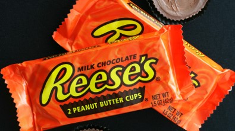

## What are expressions?
Expressions means the way of expressing feeling. The ways can be of various types. Oral, symbolic gestures, or facial etc. Numerical expressions make use of numbers and operators to express something. 
If somebody asks you “what is your age?” How do you respond?
You may mention some number such as 11, 12, or 13 etc. The number that you use to express your age is a numerical expression. In the same manner, your friend may express his/her age as 2 lesser than 14. It is also an example that makes use of numbers to make an expression. If your friend mentions his/her age as 2 less than 14 then we know we can find a lesser number by subtraction so the correct expression is 14-2 or what remains when 2 is reduced from 14. Expressions contain all kinds of operators such as addition, multiplication, subtraction, division, etc. We know 12 is the result when 2 is reduced from 14. Both 14-2 and 12 are numerical expressions. 
Numerical expressions are always equivalent to a quantity. They point to some value. 
It is an act of making people know about some feelings or thoughts. It acts as a medium so that somebody’s thoughts can be understood by others. We recognize facial expressions, written expressions, oral expressions, etc. You may make a different face when you are in pain as compared to when you are eating delicious food. The example mentioned here is mostly facial expression, but other forms of expression may be used for the same situation. Other forms include oral or written or symbolic forms as well. We use some language or sound for that. For example, if somebody says that he is hungry, he is using the English language as the medium to express his thoughts. For sure language developed earlier but soon in human civilization there was a need for counting and maths after that. 
Mathematics also uses expressions, made of numbers and symbols. Symbols used in mathematical expressions are done so for various purposes. 
For example, when we see 100-3, we understand it is trying to say that we have to reduce 100 by 3. Or it may also be trying to state a number that is 3 less than 100. We can often simplify a given expression into an equivalent quantity (97 in the previous case), often known as the value of the expression. 
Let's take another example.
There are 2 senators from each state in the US Senate. As there are a total of 50 states under the American flag, how many members are there in total in the senate? 

1.1

As we can see that for each state there are two members, we have to add two 50 times or it means that we must multiply 2 by 50. 
2+2+2+2....... up to 50 times
or 2 x 50
That is 100 members in total in the senate. It can also be interpreted as a single member from each state will make 50 members. The final answer is just double that number. 
It doesn't mean that we need to have some kind of operation between numbers like addition or subtraction to make an expression. It may simply be a number only and it expresses something. For example, 206 is an expression. It can be used to express the number of bones in a human body. 

1.2

### Letters in expressions
Apart from the operators and numbers we already know, there are letters/symbols used in the expression and they are known as variables. 
Just like 9-3 means, we need to deduct 3 from 9 or a number that is 3 less than 9. 50-a means that we have to deduct “a” quantity from 50. It may also be expressing a number that is less than 50 by a. 
One thing can be validly coming to your mind, 
How can a letter be subtracted from a number? 
The real reason is that the letter used here isn't just another letter. It's the same as deducting one numerical quantity from the other. 
Let's consider a situation when we have some unknown value.
For example, you are being offered 30 cents discount on all chocolates being sold at a store and you want to know how much you need to pay for one chocolate.

1.3

If the price of chocolate is 3 dollars, you may have to pay 2.7 dollars, if the chocolate is worth 4.7 dollars, then you may have to pay 4.4 dollars. 

1.19

It can be agreed upon that we can't explain the price of every chocolate with one value or one number but whatever the marked price of the chocolate may be, you need to pay 30 cents or 0.3 dollars lesser. Thus, if we had an entity that could act as a placeholder for all the values of the chocolate prices, it could help us immensely to express the value needed to pay for the chocolate and that is what p-0.3 gives assuming the price of chocolate before the discount is p.
Remember this table from before?

1.19

If we substitute the unknown or varying numbers with a letter such as p shown above, then all of the numbers of the rows above it can be explained properly. 
If the marked price of one chocolate is p dollars, then the price you have to pay will be p-0.3 dollars. This expression will always give the final price after the discount for chocolate of any initial price. 
p is just a placeholder that takes the place of the actual value of the price of the chocolate. In contrast, if it was told that you have to pay 4 dollars then that is for those chocolates only whose price is 4.3 dollars. If it is said that you have to pay 4.8 dollars then that is for chocolates of 5.1 dollars and so on. That is the reason why letters are used in an expression.
Suppose there is a 10 percent discount on all types of eye checkups and treatment fees.

1.4

If a treatment costs 100 dollars, then after the discount will become 10 dollars lesser that is the patient has to pay only 90 dollars.
100-10% of 100
=100- (10/100) x 100
=100-10
=90
If the cost of treatment was 75 dollars, then the patient has to pay
=75-10% of 75
=75-0.1 x 75
=75-7.5
=67.5
This process will be the same for all values. If the cost of treatments is denoted by a placeholder "d", then 
=d-10% of d 
=d-10/100 x d 
=0.9d
Now if we put 100 in place of d it will be 0.9 x 100 =90
and if we put 75 in place of d it will be 0.9 x 75 = 67.5
Now, 0.9d is an algebraic expression that gives the money a patient has to pay following the discount available.

### Placeholder variables
We found some of the algebraic expressions in the patterns quiz. We found letters that acted as placeholders that could be substituted in place of a number. Such placeholder symbols or letters are known as variables. 
What kind of letter or symbol we choose is totally independent of whatever quantity we are assuming; it can be any letter or symbol. If we suppose the price of an apple to be p or a, it is just for convenience and not because it represents an abbreviation of some sort. 
It must also be understood that the letters don't represent the object itself but an attribute of that object. If f  is used in some context involving fish then it may be expressing the weight of fish, the number of fish, the price of fish, or something like that. 

1.5

It is also not necessary that the variable chosen always be the first letter of that word. It's just done for convenience and nothing else.
Not all letters represent variables, there are letters used as abbreviations for units such as 10 meters is written as 10 m. 20 pounds is written as 20 lb and so on.  
It's also not necessary that a particular variable may be used for a particular quantity only. But the same variable cannot be used to depict two different quantities in the same context. 
For example: If the number of apples is denoted by “t” then it should not be used to denote the number of oranges or any other fruit in the same context. 

1.6

We can understand that expressions are generally made up of two types of entities: variables and constants. Variables can be used as a placeholder for a quantity whose value isn't fixed and constants are those entities that represent one particular quantity. 
One notion may be set up in your mind now that whenever letters are seen in an expression, they are variables. There are certain symbols, particularly Greek, that are used to represent constant values such as π (pi), prominent in formulae related to curved surfaces or circles. It represents 3.14 and is always equal to that value in whatever context it may be used.  Another such symbol is e is known as Euler's number which we will learn about in higher grades. 
Expressions, either numerical or algebraic, carry some value to themselves. It may not always be one particular value, but they represent some quantity (may it be known or unknown). In the case of algebraic expression, we must substitute the variable with a particular value to find the corresponding value of the expression. 
It's not mandatory that some statement or operation in algebra can always be expressed through a combination of variables and constants. It can also be done through tables or graphs. Expressions can be transformed into tables or graphs by finding the potential values of the variable and comparing that with the values of the expression.
Since an expression corresponds to some quantity, the parts of the expression that form itself are also quantities. Each part can be identified as a separate quantity. 
For example: if the cost of 3 pens and 5 notebooks is 3𝑥 + 5y then 𝑥 is the price of one pen or unit price of pen and y is the price of one notebook or unit price of the notebook. 3𝑥 is the total price of all pens and 5y is the total price of all notebooks. 

### Symbolic transformation
Expressions are used because they make complex statements simpler. And the meaning of the symbols isn't different in different circumstances apart from the variables. 
While finding the algebraic expression from a statement, the PEMDAS rule is followed in which the operation of division or multiplication comes ahead of addition or subtraction. 
PEMDAS is an acronym for 
Parenthesis, 
Exponents, 
Multiplication, 
Division, 
Addition, and 
Subtraction. 
For example, if we are to find “5 less than 7 times a number” then it is 7𝑥 - 5 and not 7(𝑥 - 5). Here, “less” is used for subtraction operations whereas “times” is used to represent multiplication. Since multiplication has to be done first, we focus on it first. It says 7 has to be multiplied by a number that isn't known. Thus, a variable is represented by the letter 𝑥. Only after the multiplication, the subtraction operation is expressed. 
Here any letter or symbol can be used in place of 𝑥 unless it means any other thing already. 
If we have to find out a number that is 5 lesser than 7 times 6 then we just plug in the value of the variable in the expression.
7 x 6 - 5 = 37
Another example of simplification is 
7(4 + 5)÷14 -82
First the Parenthesis
=7 x 10 ÷14 -82
Then the Exponent
=7 x 10 ÷14 -64
Then the Multiplication
=70 ÷14 -64
Then Division
=5-64
Then, it must have been Addition but its not available so Subtraction
=-59
The order of addition/subtraction or multiplication/division can be altered within each other. 
Expressions always tell something about a situation mathematically. The operators used in expressions are a direct translation of the meaning that a statement provides. 
For example, if an expression says double the amount of an unknown number, we first need a placeholder variable for the number and then multiply that by 2. Such as 2g if g is that placeholder. 
If an expression says that the amount of food cooked is 50 kg less than yesterday and the amount of yesterday isn't known, then we need a placeholder variable to assume the unknown amount of food, double it and subtract 50 from it. The expression would look something like 2f - 50 where f is the amount of food cooked today. 

1.7

The parts of expressions are separated by an operator. Operators can be addition “+”, subtraction “-”, multiplication “*” or “x”, division “÷” or “/”, the root “√” etc. Sometimes parts of an expression may not seem to use any operators, it is done in the cases of multiplication.
If “𝑥” blue t-shirts, “y” red t-shirts, and “z” yellow t-shirts are bought then the total number of t-shirts can be expressed as 𝑥 + y + z. If a blue t-shirt cost 3 dollars, a red one cost 2.5 dollars and a yellow one costs 2 dollars, the total cost of buying a blue T-shirt is 3𝑥, for the red one it's 2.5y and for the yellow one it's 2z dollars. Thus the total cost of all the t-shirts is 3𝑥+2.5y+2z dollars.

1.8 

### Equivalent expressions
Symbolic transformation is what we know as operations such as addition, multiplication, subtraction, etc. We change the symbols written in an expression with some rules of operations. Expressions obtained by such transformations are such that replacing the value of a variable with any number will satisfy both sides. For example, 𝑥+𝑥+𝑥 can be written as 3𝑥 using the distributive property. 
Suppose 𝑥 is taken to be 25, 
then 25+25+25 is also 75, and 
3 x 25 is also 75.
If 𝑥 is 3 
then 3+3+3 is also 9 and 
3 x 3 is also 9.
Putting any value in place of 𝑥 in both 3𝑥 and 𝑥+𝑥+𝑥 will give the same result and thus they are equivalent expressions. 
The distributive property is the property by which expressions under multiplication/division can be written in the form of addition/subtraction. 
For example a(b+c)=ab+ac
(𝑥+z)/y=(𝑥/y) + (z/y)
Here is an example, The area of a purple rectangle is 4 x a because the dimensions of the rectangle are 4 units width and “a” length; The area of a red rectangle is 4 x 3 or 12 because the red rectangle is 4 units wide and 3 units long. 

1.9

The total area in the figure is 4a +12 if we add both the area of the rectangles. 
If we look at the dimensions of the whole rectangle (red + purple) we find that it is a+3 units long and 4 units wide. Thus the area of the whole rectangle is 4 x (a+3). Both 4 x (a+3) and 4a +12 must be equal. They are equal expressions.
The parentheses are used in place of the multiplication operator. If we want to know the real value of the area of the whole rectangle, then the value of a must be substituted. 
Let's suppose that the value of a is 5 units. Then the value of the expression is 4 x (5+3) or 32. The value is the same even if we put a=5 in 4a+12. 
The commutative property is another property that helps in finding equivalent expressions. The commutative property is valid in a lot of operations such as addition and multiplication whereas is invalid for operations such as subtraction and division. 
a+b is the same as b+a whereas a-b isn't the same as b-a. In a similar way, a x b is equal to b x a whereas a/b is not equal to b/a. The statements may sound obvious but they are very useful while performing symbolic transformations on algebraic expressions. 
2 + 8 =10= 8 + 2 
2 - 8 =-6 ≠6= 8 - 2
If two expressions give the same value for only some of the numbers then such expressions aren't equivalent to each other. 5𝑥 and 𝑥-8 give equal values only when 𝑥 = -2, 
5𝑥 = 5 x -2 =-10
𝑥-8 = -2 -8 = -10
That means these expressions are called equal expressions at 𝑥 = -2. 
We can try any other value for 𝑥 such as 7
5𝑥 = 5 x 7 =35
𝑥-8 = 7 -8 = -1
Just like 35≠-1, at all other values for 𝑥, these two expressions will have different values. So these expressions can't be termed equivalent. 