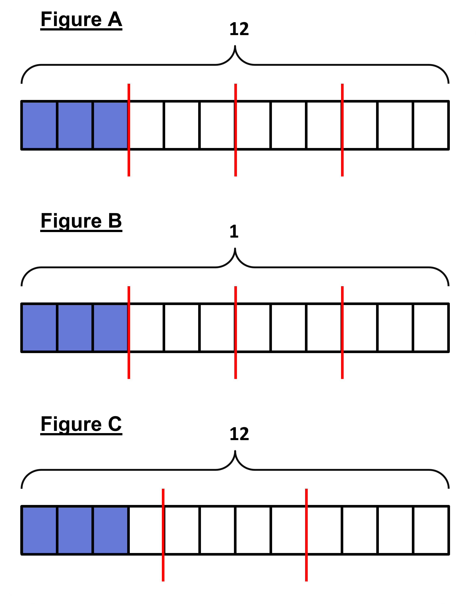
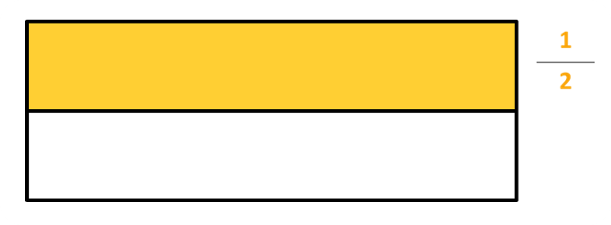
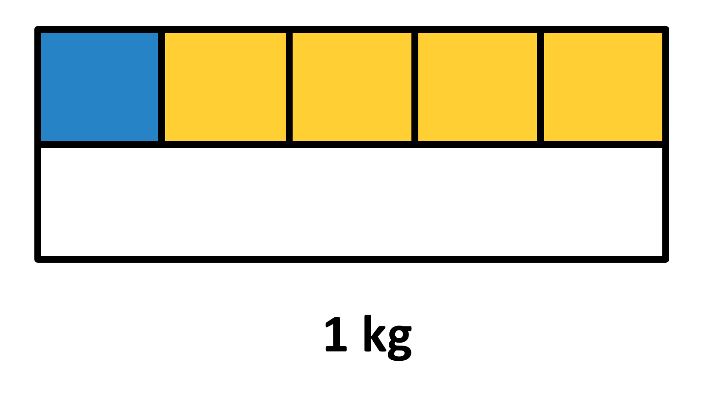
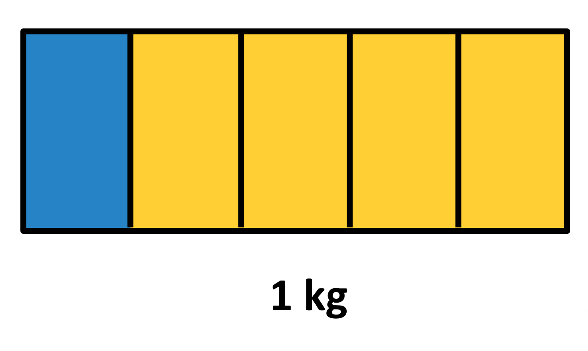
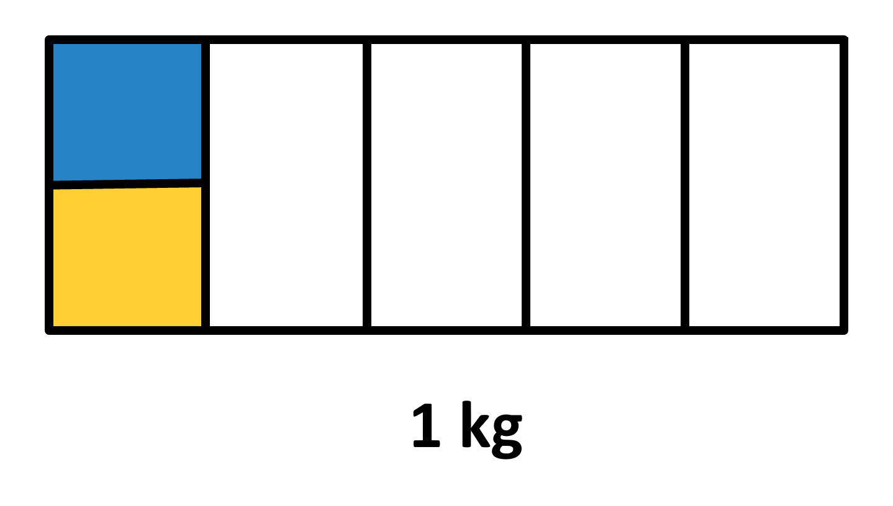
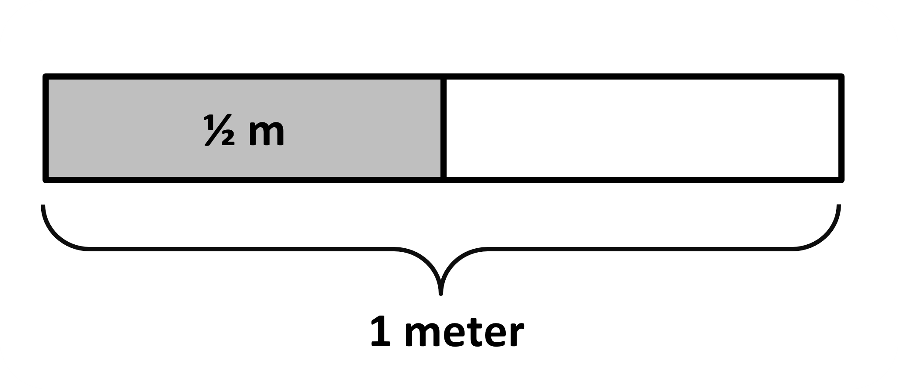
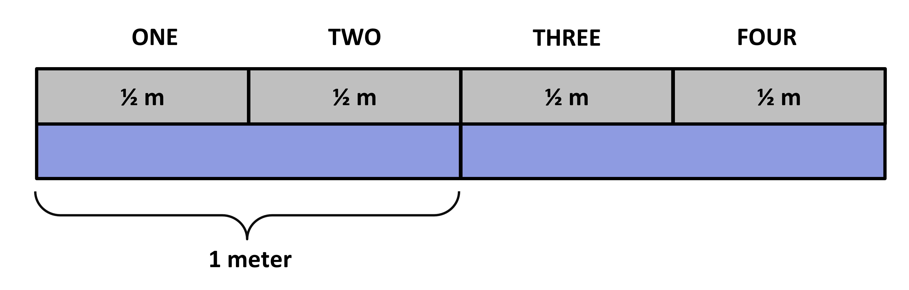

## Dividing Fractional Quantities into Parts

After being done with fraction multiplication, we will now talk about fraction division. There are different ways we can understand how to divide numbers when fractions are involved. In this part, we will look at the first and the most recognizable ones.  
Just like always, we will start by dividing whole numbers.  
You have 6 mangoes that are to be distributed between 2 people. What expression is correct when we need to find the number of mangoes each person gets? When six mangoes are divided equally among 2 people, we know that the whole, which is 6 here, has to be divided into 2 parts. This is the model of division that we are familiar with. It is called the partition model of division. The expression we get is 6 ÷ 2. We get the answer as 3 since dividing 6 mangoes among 2 people equally means that each person gets 3 mangoes each. We can see that through the image shown: 

 
We need not make actual mangoes or object every time. We can make block diagrams like we have grown familiar with. Let's see an example of that.  
Which block diagram correctly shows the answer to 12 ÷ 4 through the partition model? 

Here, the first figure is correct since the whole of size 12 has been divided into 4 parts and one part is taken. The diagram correctly represents 12 ÷ 4, giving us 3. Figure B shows a whole of size 1 divided into 4 parts. The diagram represents 1 ÷ 4. Be careful of the notation shown in the picture. While both whole look the same, one is 12 and the other is 1. Figure C shows the whole of size 12 is divided into 3 parts. The diagram represents 12 ÷ 3, giving us 4, so not our desired figure. This is how we can show objects as block diagrams and easily solve questions.   

We will now use the same concept to find the division of a fraction by any whole number. The same idea of dividing the quantity into an equal number of parts, with each part giving us the answer, is to be applied.  
Let's look at what we get when we divide half a kg of mangoes between 5 people. We first need to show half in the figure, which is given in the image below. The whole block is 1 kg of mango.

Now, we need to divide only the shaded portion into 5 parts and each part is now our answer. The blue is our answer.

If the image was instead as shown, then it is wrong since it shows the whole is divided into 5 parts and one part being taken. The diagram represents 1 ÷ 5.

Can you decide what the following image is showing and why it is wrong for our answer above?

This image shows 1/5 being divided into 2 parts, with one part taken. The diagram represents 1/5 ÷ 2.

Going back to our correct representation, what is the amount of mangoes that each person gets? OR What do you get when you divide half a kg of mangoes between 5 people?

Look at the given image. You may be tempted to say that dividing half a kg of mangoes between 5 people gives 1/6 kg of mangoes, since there are six parts, and one part is our desired answer. But keep in mind that the whole needs to be divided into equal portions for us to be able to express size in terms of the whole (here, 1 kg of mangoes). The portion shaded in blue (1/2 kg mangoes divided between 5 people) is 1/10 of 1 kg of mangoes, that is 1/10 kg of mangoes.

Look at the visual below to see how this works. 

## Relating Multiplication and Division

We cannot keep making diagrams for all such division questions since it will get tedious for bigger numbers. In such cases, we need to make a numerical generalization to help us find the answer. 
In the case of 1/2 kg of mangoes being divided into 5 parts, we had the equation 1/2 ÷ 5 = ?. 
So, ? x 5 should give us 1/2 for this case (If you are confused, think of 10 ÷ 5. To get 10 ÷ 5 as 2, we know that 2 x 5 should be 10). 
We can thus write,  
1/2 ÷ 5 = ?  
? x 5 = 1/2  
To keep only '?' on the left side, we can multiply both sides by 1/5 .  
? x 5 x 1/5 = 1/2 x 1/5  
? = 1/2 x 1/5 = 1/10 
This is the same answer we get from the diagram as well! And since both 1/2 ÷ 5 and 1/2 x 1/5 give us the same value, this mathematical process works for all division questions. 
So, in the case of a/b ÷ c, we can write it as a/b x 1/c , meaning, dividing by a divisor is the same as multiplying by the reciprocal of the divisor. We will see that the same works when we divide by a fractional divisor c/d , but more on that later.    

Finally, we will look at one more idea of why division works and how it is connected to multiplication. 
We know that in a case of n x a = b, n is the number of parts and a is the size of each part, which when multiplied gives us the total size. This applies to other multiplication problems too: if n x p/q = np/q , n is the number of parts, p/q is the size of each, and np/q gives us the total. 
Generalizing this, we can write,

number of parts x size of each part = total size 

With our previous knowledge, we know that 3 x 4 = 12 can be written as 12 ÷ 4 = 3 or 12 ÷ 3 = 4. 

Combining this with our recent idea of 'number of parts x size of each part = total size', we can say that for 3 x 4 = 12, 3 is the number of parts and 4 is the size of each part. Now, if we look at the equation 12 ÷ 3 = 4, we see that we have the total (12) when divided by number of parts (3) giving us the size of each part (4)! This is the basic idea of our partition model!  
This idea can help us convert division questions into multiplication questions and vice versa.   
total ÷ number of parts = size of each part  

--> number of parts x size of each part = total 

The second equation of 12 ÷ 4 = 3 is another type of division question. It says: total (12) divided by the size of each part (4) gives us the number of such parts that fit (3), or how many parts of size 4 fits in 12? This is the repeated subtraction model of division, since the idea is that we keep removing sizes of 4 from 12 until we get 0, thus giving us 3 (since we can remove three 4s from 12). We will learn more about this in the next section.

## Dividing Fractional Quantities by Removing Equal Parts

Let’s recall what we studied for the partition model of division:
We know that 3 x 4 = 12 can be written as 12 ÷ 4 = 3 or 12 ÷ 3 = 4. 

If we have: number of parts x size of each part = total size,  

In the case of 3 x 4 = 12, 3 is the number of parts and 4 is the size of each part. For the partition model, if we look at equation 12 ÷ 3 = 4, we see that we have the total (12) when divided by the number of parts (3) giving us the size of each part (4)!  
We will now move on to another way of understanding division, which is more helpful in making sense of a number divided by a fraction than the partition model from before.  
The second equation of 12 ÷ 4 = 3 is another type of division question. It says: total (12) divided by the size of each part (4) gives us the number of such parts that fit (3), or how many parts of size 4 fit in 12? This is the repeated subtraction model of the division since the idea is that we keep removing sizes of 4 from 12 until we get 0, thus giving us 3 (since we can remove three 4s from 12).  

Let’s look at an example to understand this better:  
You have 6 mangoes, and you give away 2 at a time. This means you need to make groups with 2 mangoes each. What expression will you use to find the number of people that will get the mangoes? 
In this case, the phrasing of the question is a bit different than the partition model of division. Rather than saying 6 mangoes have been divided among 3 people, which gives us 2 mangoes for each person, we are told that 6 mangoes have to be grouped into groups of 2 each and are asked how many such groups we can make. 
This is another way to represent a division problem. This is like removing 2 mangoes each time and seeing how many such groups can be made, which is why it is called the 'repeated subtraction model of division". So, the expression here for 6 mangoes being divided into groups of 2 groups will be 6 ÷ 2. The answer will give us the number of people that the mangoes are divided into -> 3 people. 
Hence, total ÷ size of each part = number of such parts

 

The same idea applies to and is an easier way to understand a whole number quantity divided by a fraction. 
Below is a diagram that shows strips of colored paper.  

The strip is 2 meters long. The paper strips will be cut into different-sized pieces. 
The strip will be cut into pieces that are 1/2 meter long. How many pieces do you think there will be?  
We’ll start by looking at what the size of 1/2 is. The image shows us the size of 1/2 m.  

 
How many of this ‘size’ will fit in the strip of 2 m OR how many sizes of 1/2 m can be made from the size of 2 m? Simply arrange the 1/2 strips to measure along with the 2 m strip as shown.  

We see that 4 strips of size 1/2 m can be cut out from a strip of 2 m OR 4 strips of size 1/2 m will fit in a strip of size 2 m.
What do you think is the expression from the previous situation? 
As we have already discussed before, the context of "how many x's will fit in a size of 'a' to give 'b' number of objects" can be thought of as a division problem, where 'a' divided by 'x' will give us 'b'. In this case as well, we need to know how many 1/2 m will fit in 2 m, so we will have to find the value of 2 divided by 1/2 . 
Do not confuse this with 1/2 divided by 2 (meaning the size of each part when ½ is divided into 2 parts), which will give us 1/4 . 1/4 cannot be what we are looking for, as obviously more than 1 halves are needed to make 2. 

## Dividing fractional quantities by removing equal parts [Part II]

Can we generalize such division questions to be solved numerically as well (like we did for the partition model)? Of course!
If we have a question -> 4 ÷ 1/3 , it means that we are asking how many 1/3s fit in 4. From the image below, we see that there are three one-thirds that make up 1, so to make up 4, we need to divide 4 by 3, giving us 4 x 3. So, 4 ÷ 1/3 = 4 x 3. 

This reinforces the idea that dividing by a fraction is the same as multiplying by its reciprocal.
Let’s look at a question where the divisor is not a unit fraction  
-> you can think of the question 4 ÷ 2/3 as follows: 
We already know that there are 4 x 3 groups of 1/3s in 4. To find how many 2/3s are in 4, we need to put together every 2 of the 1/3s into a group. Doing this results in half as many groups, which is 6 groups. In other words, we can think of 4 ÷ 2/3 as there is 4 x 3 groups of 1/3s . But since we need to find out how many 2/3s are there, we divide the answer by 2 to get (4 x 3) ÷ 2. This can be written as 4 x 3/2 , which is the multiplication of the reciprocal! So, the same idea applies to this method of division as well when we solve it mathematically. 
We can also come to the same conclusion with the same method we used for the partition model:
When we had to make ½ m strips of paper from a strip of 2 m, we had the equation 2 ÷ 1/2 = ?.  
So, ? x 1/2 should give us 2 for this case.  
We can thus write,  
2 ÷ 1/2 = ?  
? x 1/2 = 2  
To keep only '?' on the left side, we can multiply both sides by 2.  
? x 1/2 x 2 = 2 x 2  
? = 2 x 2 = 4  
This is the same answer we get from the diagram as well! And since both 2 ÷ 1/2 and 2 x 2 give us the same value, this mathematical process works for all division questions.  
So, in the case of a ÷ b/c , we can write it as a x c/b , meaning, dividing by a divisor is the same as multiplying by the reciprocal of the divisor.   

Finally, one important point that you need to remember that changes the idea of division from whole number division is that: When you divide two whole numbers, you are used to getting the quotient to be less than the dividend. This also applies when you divide a fraction by a whole number. This is because in all these cases, the dividend is being ‘divided’ into a said number of pieces, so of course, the quotient is smaller than the dividend. But look at the few examples you’ve done here:
2 ÷ 1/2 = 4 
4 ÷ 2/3 = 6 
In both these cases, the quotients are greater than the dividends. Why do you think that is? 
In such cases, we have asked how many fractional parts would fit in the dividend, which is a whole number. It is obvious more fractions will fit in the whole number, whose value will have to be greater than the whole number dividend. For example, two 1/2s will fit in 1, so 1 ÷ ½. Even when we do 1 ÷ 2/3 , we get the answer to be 3/2 , which is greater than 1. 
In conclusion, we need to know that rules that were true for whole number divisions might not always apply to fractional divisions. The quotient can be greater than the dividend.
