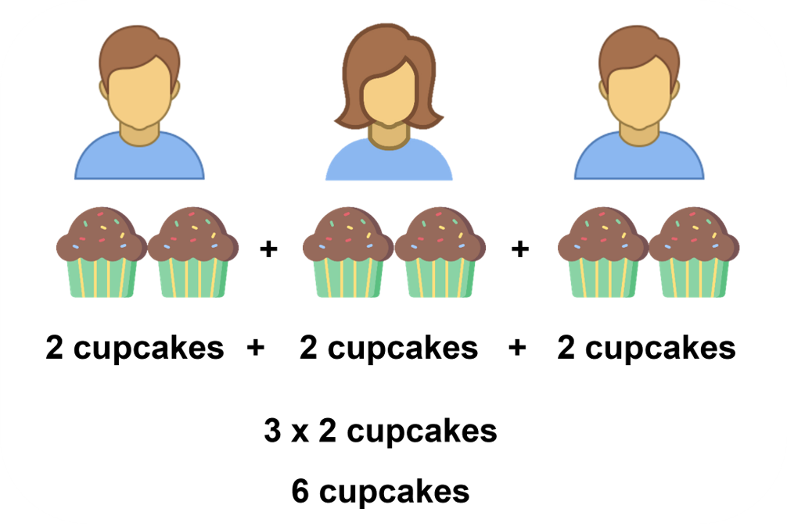
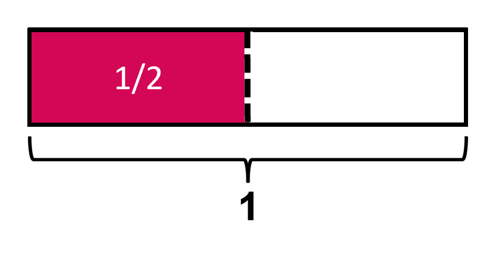
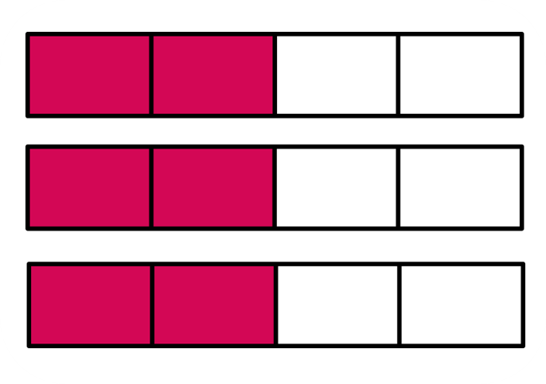
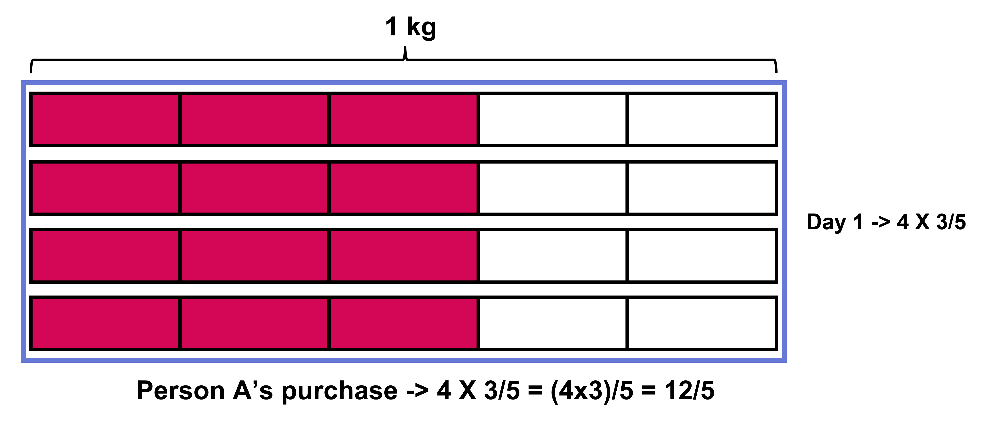
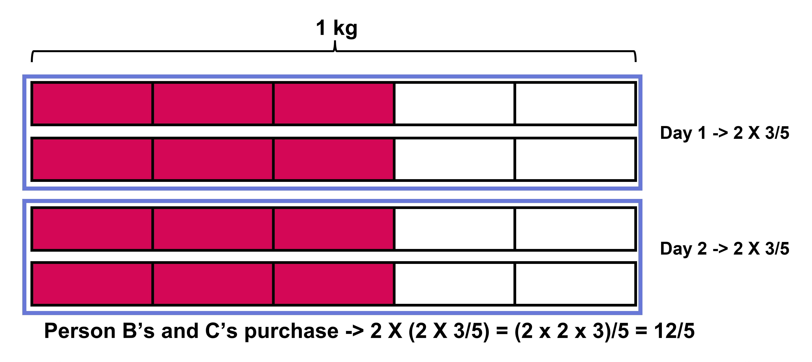
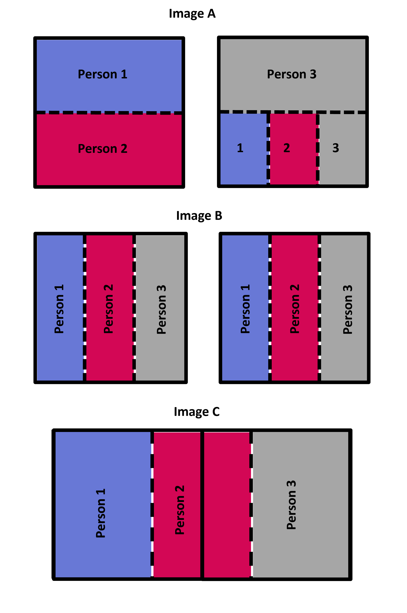
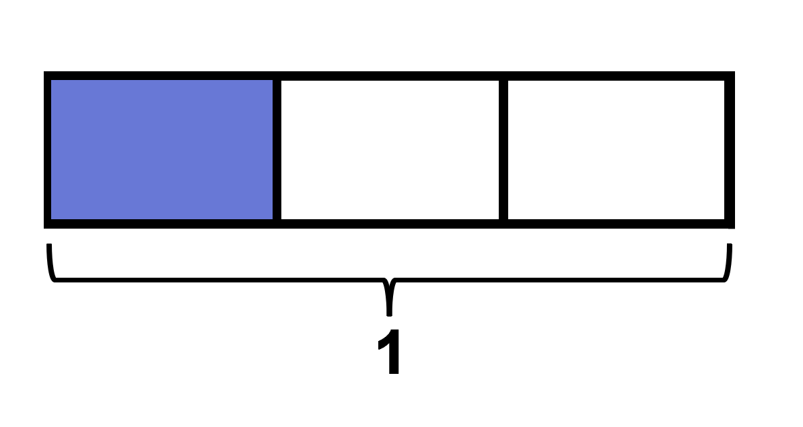

## Fraction as quantity

### Making Copies of Unit Fractions

To start with the multiplication of fractions, it would help if we revisited the multiplication of whole numbers once again.  We know that when we multiply a x b, we are taking 'a' group of 'b' and adding them, or simply 'a' times 'b'. For example, 3 x 5 means we are taking 3 groups of 5, that is, (5 + 5 + 5), giving us 15. The first term is the operator, it tells us how many copies of the second term we need to take (we can think of the second term as the quantity being operated on). 
Let's familiarize ourselves with this first and use the same method to find the product when fractions are involved.  
Let's look at this situation. Three children want to eat 2 cupcakes each. How many cupcakes are eaten altogether? Is it 2 x 3 or 3 x 2? Both of these expressions give 6 and seem to be correct. But we are being asked to find the total number of cupcakes when 3 children eat 2 cupcakes each. So, 2 is repeated three times (2 + 2 + 2), meaning we get 3 times 2 cupcakes, or 3 x 2. Here, 3 is the operator since we are making 3 copies of 2 cupcakes (the quantity). While 2 x 3 also gives us the same answer, the context is slightly different. It could be used for 2 people eating 3 cupcakes each (2 copies of 3 cupcakes, where "2" acts as the operator).  

Throughout the lesson, we will get familiar with real-life diagrams and understand how their multiplication works and what they could give. Then we will see how we can represent them using block diagrams since they are easier to make and can be used for any quantity.  
For example, 1/2 of an orange can be drawn using a block diagram as well. 

Block diagrams, while not equally as concrete as real images are still a more visual way to express fractions. We cannot keep making them over and over again, since it can get tedious.  
So, we move on to number lines! We know that any number, which includes whole numbers and fractions, can be shown in a number line. We are familiar with how fraction addition and subtraction can be shown in the number line, Likewise, the multiplication of fractions can also be shown on a number line. We will also look at multiplication of the whole numbers on a number line and use the same method for fractions through multiple examples. 

### Making Copies of Fractions

Now that we are familiar with multiplying a whole number and a unit fraction, we will move on to getting comfortable with multiplying whole numbers with any kind of fraction, not just unit fractions. The basic idea is the same as before, we take groups of fractions and see how many groups there are in total. This will help us write the final product. Let's look at the following examples to understand how this looks visually and how we can find the product of such a multiplication process.  
Look at the given block diagram.  

What would the three groups of the image look like?  
We simply make three copies of the image, giving us this block diagram.  

 We can also keep all the shaded portions together, as shown in the given block diagram.  

 

Let us again have a look at this block diagram. What expression can we write for the given diagram? 

We have 3 copies of size 2/4 each, so we write it as 3 x 2/4 .    
Can we write a single fraction that denotes the shaded portion? If we count the shaded portions, we see that there are 6 of those. The size of each of the shaded portions is 1/4 . So, this means that 3 x 2/4 will need to be 6/4 .    
You may be tempted to say that the single fraction that denotes the multiplication is 6/12. But the size of each part (denominator) does not change when the number of groups increases. We are still talking about 6 groups of size 1/4 , not 6 groups of size 1/12 . In other words, we are still writing the fraction in terms of the whole (and 4 parts of size 1/4 make 1 whole).  
We see that 3 x 2/4 gives 6/4 . This tells us that multiplying a whole number by a non-unit fraction means multiplying the numerator and the whole number to get a new numerator, while the denominator remains the same. This is because the number of shaded portions changes but the size of each of the portions is the same (hence the same denominator).   

This helps us generalize a multiplication of whole numbers and fractions as: 
n x a/b as (n x a)/b 

### Solving Some Word Problems

We have gotten familiar with multiplying fractions and whole numbers where the whole number acts as the operator, which tells us that we repeat the fractional quantity based on what the whole number operator is. 4 x 1/3 means taking 4 repetitions of 1/3 and adding them. 
Moving on, we will look at more real-life context-based examples and form expressions that are suitable for the said contexts. Through this, we will find specific forms of the equivalent expressions to represent the information in the given context and see how they differ from other expressions that end up giving us the same numerical value. 

For example, say a shop sells packets of biscuits that weigh 3/5 kg. Person A orders 4 such packets, so the expression we get for the total weight is 4 x 3/5 , which gives us (4 x 3)/5 = 12/5 .

 
Person B comes in with their friend Person C. They each buy one packet of biscuits and do the same for two days in a row. The expression for the total weight of biscuits they bought will be 2 x (2 x 3/5), which gives us (2 x 2 x 3)/5 = 12/5 ! The same as before!  

Even when the answer is the same, the contexts of both these cases are different, so we need to be careful while writing expressions for the given context.    
While we can easily multiply a whole number and a fraction now, it might be useful to know what our answer could be (roughly) without actually having to solve the expression. Unlike with multiplication of two whole numbers, where the product is always greater than the two numbers, it is not the same for when fractions are involved. Since we are taking repetitions of fractions, the product is usually smaller than the operator but bigger than the fractional value we are working on. We will look at how we determine the size of the product using the figures in the questions below.

### How is division related to fractions?

A fraction can be thought of as more than just a part of a whole or a measurement. When we divide a whole number by another whole number, we can also write that fractionally. When 'a' is divided by 'b', we get the quotient a/b . We will look at some questions that will help us understand this better. 
Let us look at this example. How many sandwiches would one person get if 6 sandwiches were divided between 3 people? Since the number of sandwiches is more than the number of people, it is obvious that each person gets more than 1 sandwich. Keep this in mind when we solve more questions. Each person gets exactly 2 sandwiches.  
If there were 2 sandwiches and 2 people to share with, it's obvious that each person gets one.  
How many sandwiches would each person get if there were 3 people and 2 sandwiches? If there were more sandwiches than people, each person would get less than 1 sandwich. If we were to write an expression to represent this situation, we get the number of sandwiches each person gets by dividing 2 by 3, that is, 2 ÷ 3. We do not get an exact whole number because they get less than 1 sandwich, meaning, each will get a fraction of a sandwich.  
Now, how can we represent this in a block diagram? Look at the following diagrams, which one do you think correctly represents 2 sandwiches being divided equally among 3 people?  

All images are correct in denoting how two sandwiches can be divided equally among 3 people. Remember that it does not matter how we divide the sandwiches. The only thing that matters is that each of the 3 people should get an equal amount of the sandwich and each of the ways shown above to divide two sandwiches into three parts have either a direct or indirect method of doing so.   

Let's look at the fraction 1/5 .   

The size denoted by 1/5 is equal to the size of one of the equal pieces when a single whole is divided into 5 equal portions. Written numerically, this gives us; 1/5 = 1 ÷ 5 Now, let's look at 1/3.

Here again, 1/3 and 1 ÷ 3 denote the size of the shaded portion. We can write 1/3 = 1 ÷ 3. Thus, 1/b = 1 ÷ b.  We know that the expression to show 2 sandwiches being divided among 3 people is 2 ÷ 3.  

What do you think the size of each part will be? We already know that each person will get some amount of sandwich, but it will be less than 1 sandwich. This means that each of the 3 people will get a fraction of a sandwich. But exactly how much is it? Based on what we learned before, 1 divided by 5 is one object divided into 5 parts. We related this to be equal to 1/5 , since 1/5 means the size of one part when one whole has been divided into 5 parts.  
Applying the same idea, we get 2 divided by 3 (2 ÷ 3) to be equal to 2/3 as well. Meaning the size of each part is 2/3 . In all the previous images A, B, and C, the amount that each person got was equal to 2/3 as well. 