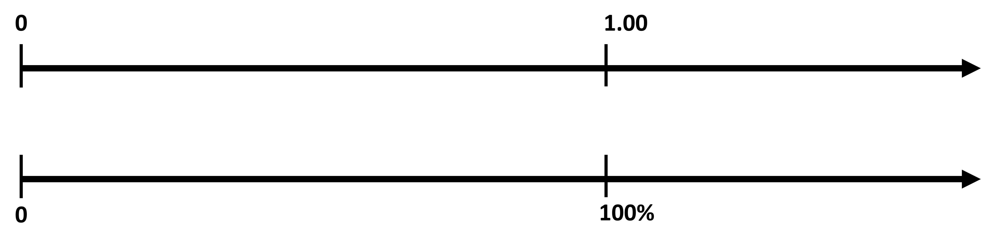
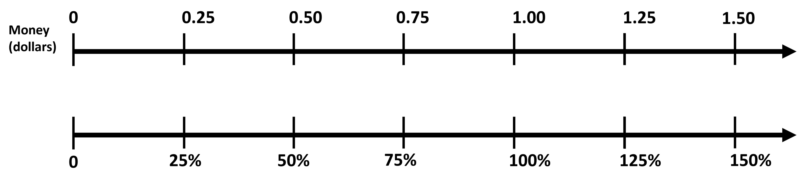
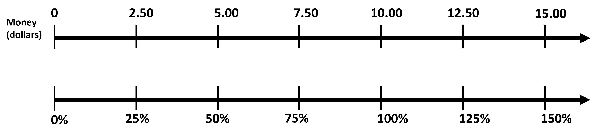
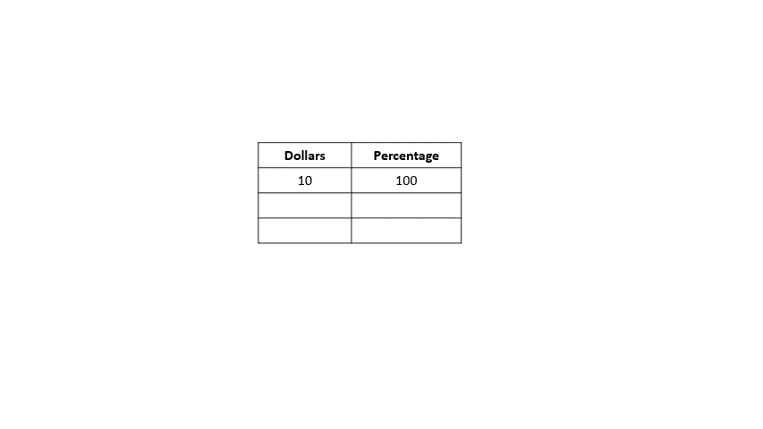
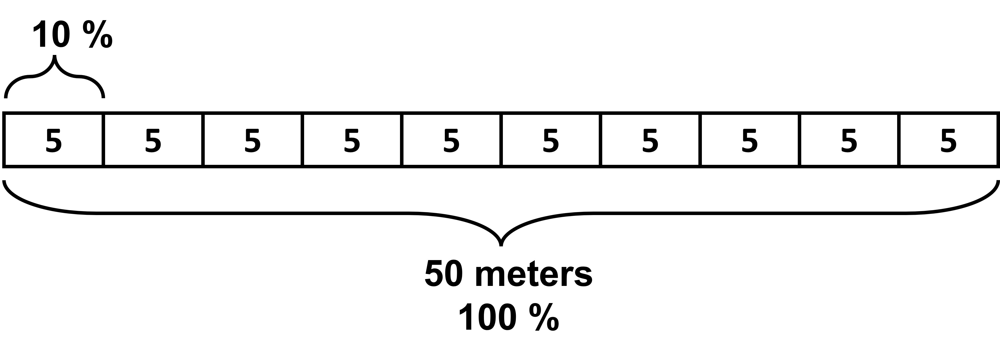
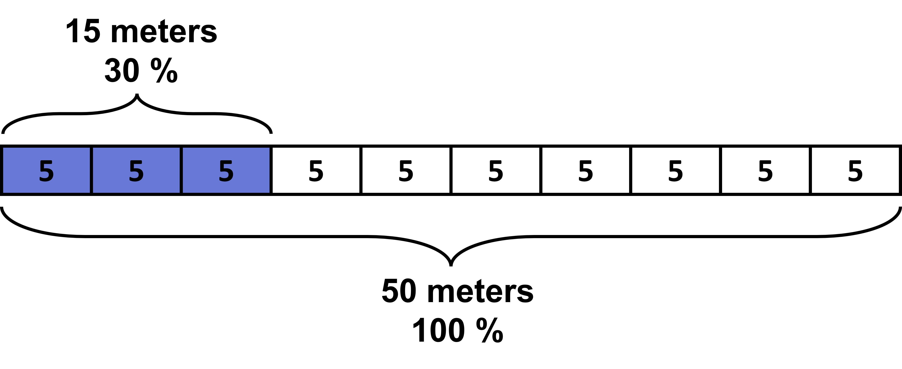

## Double number line

Let’s make a double number line diagram to all the ratios from above and to understand percentage better. 

Going back to the example of coins with different values, look at the double number line given.

Here, we see that 1 dollar corresponds to 100%, which makes sense since we established that we are looking for values of different coins per 100 cents. 100 cents is 1 dollar and 100 cents for every 100 cents is 100%. Hence giving us 1 dollar as 100 %.

Let’s say we divide the number line for percent into 4 equal parts with labels at intervals of 25%. This means we do the same divisions in the money line with each interval being 0.25 dollars. 

We see each corresponding percent for different values of money clearly in the double number line. This is a pretty straight forward number line diagram. 0.75 corresponds to 75%, 1.25 corresponds to 125%, and so on. The reason this diagram will be more useful later on is when our whole is not 100 (like 100 cents in this case). 

Let’s see an example of when 100% is not equal to 100. 
Look at the following number line. In this case, 100% does not align with 100 like before. What does this mean?

In this case, the whole is 10 dollars since it aligns with 100%. In the previous case, the whole was 1 dollar. The whole is basically what we compare all other values to. 
With the whole being 10 dollars, we can easily use the double number line to find the other values in comparison to the 10 dollars. Like, what percent of 10 dollars is 5 dollars? From the number line, we see that 5 coincides with 50%. So, 50 % of the value of 10 dollars is 5 dollars (This is just like before when we asked what 50% of 1 dollar was). In terms of ratio, we can think of this as, if the ratio of money to percent is 10 to 100, what is the equivalent ratio when money is 5? It is clearly 50%.  

What is 75% of 10 dollars? Meaning, what is the ratio of money to percent when percent is 75 % and you are given the ratio 10 dollars to 100 percent? From the number line, we see that the answer is 7.5 dollars.

Since they are ratios, we can also use a table to find the answer for two types of questions:

1. What is 75% of 10 dollars?
2. 12.50 is how many percent of 10 dollars?

You can see it in the animation below:

We thus see that the whole does not have to be 100 for it to be a percentage. We can convert it if needed and find the necessary percentage. 
Trying out some examples further will help us understand this concept better. More complex questions are also on the way!
We will also learn how to numerically solve such questions later on. Imagine having to draw a number line for numbers line 5475!
(Add question from lesson 11 sf last, last question in quiz)

## Tape diagram

Like the double number line, we can also use tape diagrams to help us find percentages. Let’s try out an example to see how. 

What is 30% of 50 meters?

For this, we make a tape diagram that represents the 50 meters. We can then divide this into smaller sections with equal parts, say 10 sections. So, each part will now have the value of 5 meters. 

Since the whole here is 50 meters, it is taken to be 100 percent as well. 100% divided into 10 parts means each 5 meter part here is 10% of 50 meters! Easy right? We need to find the 30% of 50 meters, which is given by 3 sections, or 15 meters. So, 30% of 50 meters is 15 meters. 

This also helps us get familiar with the idea of fraction of a whole being the percentage of a whole. Here, 3/10 of the whole means 30% of the whole. 

Another question type that can be easily solved using tape diagrams is:

Say 140% of some weight is 28 kg. What is 100% of the same weight? 
This is basically asking us what the whole is.

In such cases, we draw a tape diagram for 140%, which is 28 kg. To make it easier, we divide it into smaller parts, say 7 parts. Each part will then be equal to 4 kg and 20%. Keep in mind that you can divide it into any parts, this is done to make it easier to find the 100%. It need not be 7 parts. 

Now, we simply need to see how much is 100% of this diagram. 20% is one section, so 5 sections would make 100%, which is equal to 20 kg. 

If 140% of a weight is 28 kg, then 100% is 20 kg. 

