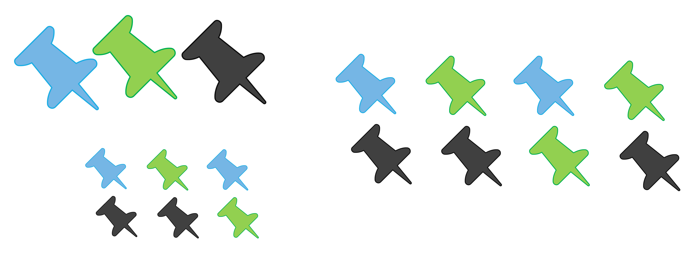
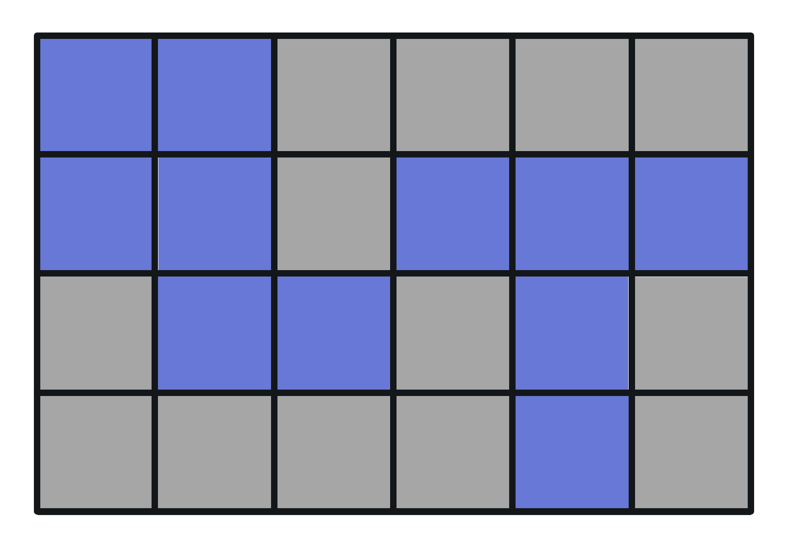
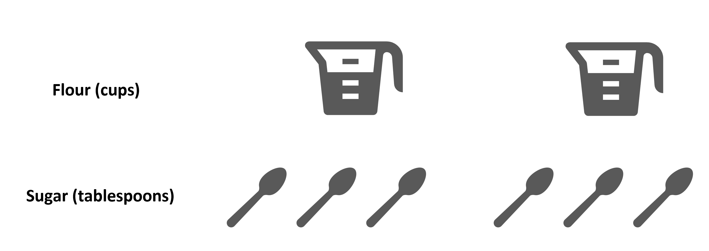
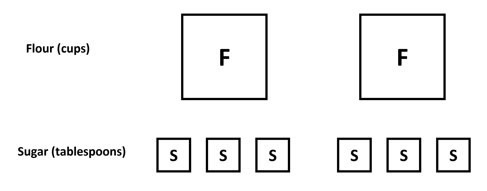

## What are ratios?

Let's start talking about ratios through the idea of ratio language and its notation through different examples. We will learn that a ratio is an association between quantities, and that this association can be expressed in multiple ways - using diagrams, sentences and numerically.  
Let's look at what 'association' means and how we can represent this association. 

Looking at the image, which statements do you think are correct from the list below?
a. There are an equal number of each sized pin.
b. There are 3 large pins and 8 medium sized pins.
c. There are 6 small sized pins and 3 large pins.
d. There are 6 green pins and 5 blue pins.
e. There are 6 black pins and 6 green pins.
Statements B, C, D, E are correct when we look at the image. These are simple sentences that describe the figure. 
This is where we can use the term 'ratio'. 

 “A ratio is an association between two or more quantities.” 

What this means is that there is a certain relationship between two or more things/quantities, and we write them as a ratio of one to the other. We use a colon, or the word “to,” between two (or more) values we are associating. For example, consider the green and blue pins. There are 5 blue pins and 6 green pens. We can say that "the ratio of blue pins to green pins is 5 to 6 or 5:6". This is how we write a ratio statement, using sentences and numbers. 
 
One other thing to know before moving on is that we can also associate two quantities using the phrase “for every 'x number' of these, there are 'y number' of those.” 
For example: For every 6 green pins, there are 5 blue pins OR there are 6 green pins for every 5 blue pins.

Finally, we can also group the ratios to show smaller numbers. For example, take the large and small pins, with a ratio of 3 to 6. When we group them in a way that each group is the same, we get 1 large pin and 3 small pins in each group. So, we can say that "for every 1 large pin, there are 3 smaller pins", instead of "for every 3 large pins, there are 6 smaller pins". In the end, they both mean the same thing. 
 
This works because a ratio gives us the relationship between different objects. Grouping them into smaller groups (or later, multiplying them) will not change the ratio, even when it seems like the numbers have changed (since the relationship has not). We can look at the image below to understand the grouping and why they are similar. 

When we group objects into smaller groups and represented them as 1: 2 for the ratio of large to small pins, it is called the simplest form of the ratio. 
 
Visually, we have already seen how making small groups with equal number of each object in each can give us this form. Numerically, we can simply find the highest common factor of the two and divided by it (like how we simplify fractions). For example, 3 : 6 can be divided by 3 to give us 1 : 2! 

Finally, one thing we need to know is that a ratio, say a : b, can be written in a fractional form a/b. This sometimes makes it easier to find the simplest form, since it is like finding the simplest form of a ratio. Also, it may be useful later when we talk about unit rates later. For now, just know that a ratio can be written fractionally, but a ratio and a fraction is not the same.  

 
## Part to part and part to whole
Let's look at one more example to understand a topic related to ratio. 
Look at the grid below, which has been filled in by different colors - purple and grey. 
 

These two colors make up the whole grid, so we can think of them as two parts of the whole grid. The ratio of purple to grey squares is 11 : 13. Since they are parts, this is also called a part-to-part ratio. If, however, you were to take the ratio of purple to all the squares, you would have 11 : 24. Here, purple is the part and the total squares are the whole. So, this is a part to whole ratio. While such names are not necessarily that important, it helps us understand that ratio can be taken of any quantity, part, or whole.

Additionally, not all quantities need to be part of some whole. Two quantities that aren't parts of any whole can also be ratios. Like the ratio of someone's height and weight.

## Which is better? Actual objects or block diagrams?

Remember using actual pins in the very first question? We have used the objects themselves to show the ratio. When talking about other real objects, we can easily do the same and show them as actual objects they refer to, like paint cans, measuring cups, etc. For example, the following diagram shows the ratio of cups of flour to spoons of sugar. 

Imagine if we had to show a ratio of say 250 to 750? Would you keep drawing the spoon and measuring cup all the time? That would be tedious. So, a similar way to visually show these is to draw simple shapes, like squares. 
The above can be shown as squares with the initial F and S for flour and sugar. 

These simple shapes give us enough information about the situation, 2 cups of flour and 6 spoons of sugar. 
You could also include different shapes, or color-coded boxes to represent each object within the set. It is helpful to organize the types of items in rows, and to arrange smaller groups so they are easier to see. Basically, the image does not need to be detailed, it can be a rough estimation. 
