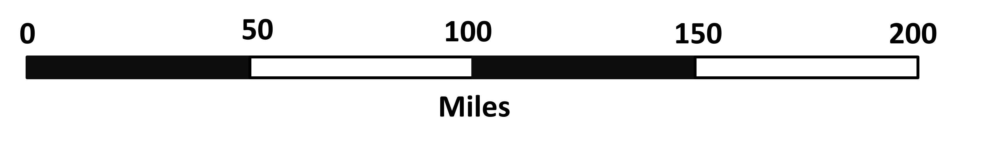

## Unit conversions/map scaling

Finally, we will look at some uses of ratios in real life examples (we have already seen many situations like these before). 

First, we will see how ratios can be used to convert from one unit to another. 
How many inches are in 20 feet?

For this, we first need to know the relationship between feet and inches. We know that 12 inches make up 1 feet. So we can write the ratio of inches to feet as 12 inches : 1 feet. 
So, we can now simply use the idea of equivalent ratios to find the amount of inches in 20 feet. Since we multiply feet by 20, we do the same for inches. Thus gives us 12 inches x 20 : 1 feet x 20 = 240 inches : 20 feet. So, 20 feet has 240 inches.  

## Scaling

Second, we will look at the idea of scaling, mostly used in maps and architectural structures. 

Say you need to make a model of a bridge for your class project. You make the model based on a bridge in your city. You cannot use the same dimensions obviously, so you decide to “scale it down” to make a small model. This means you need to decrease the lengths, breadths, heights, and all other measurements by the same amount! (Why?)

Let’s say you decreased the length in such a way that 150 cm of the real bridge is now 1 cm in the model. We can write a ratio for this as 1 : 150 which is the ratio of the model to the real structure. Now, if say a pillar on the model is 8 cm, can you find how much that would be in the real structure?
We simply multiply both terms of the ratio by 8!
1 : 150 = 1x8 : 150 x 8 = 8 : 1200
So 8 cm in the model is 1200 cm or 12 m in the structure!

You have probably seen a line with numbers when you look at maps. It gives us a scale so that we can assume how far two locations are based on the map we are looking at. 

In the image, we see the scale for miles. The distance between 0 and 50 miles in real life is the measure of the first black part of the scale. So if on the map, two locations are as far apart as the first black block, then the two locations are 50 miles apart. In ratio form, the ratio of distance on map to real distance can be written as 1cm : 50 miles (if we assume that the black line is 1 cm long). 

This is a good way of representing a scale on a map. Because a map that we look at one our phones is dynamic, meaning we can change it by zooming in or out, the scale changes with the changes we make. 

