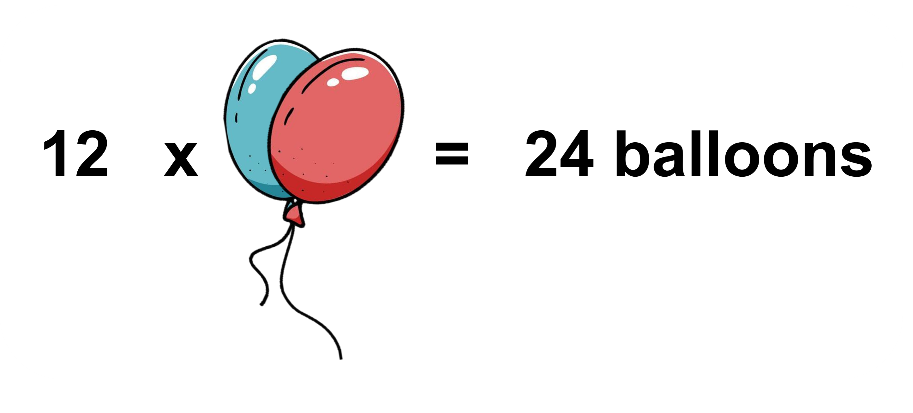
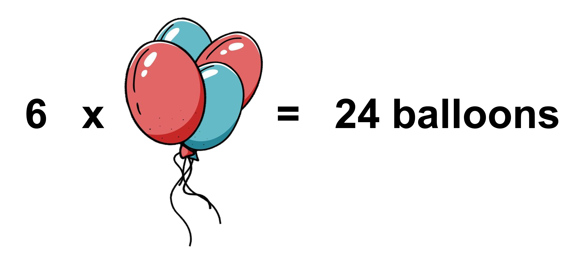
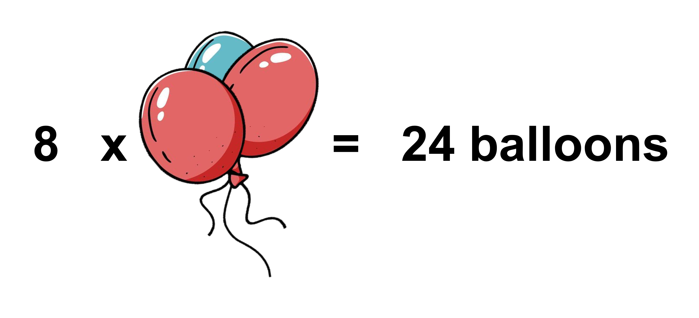
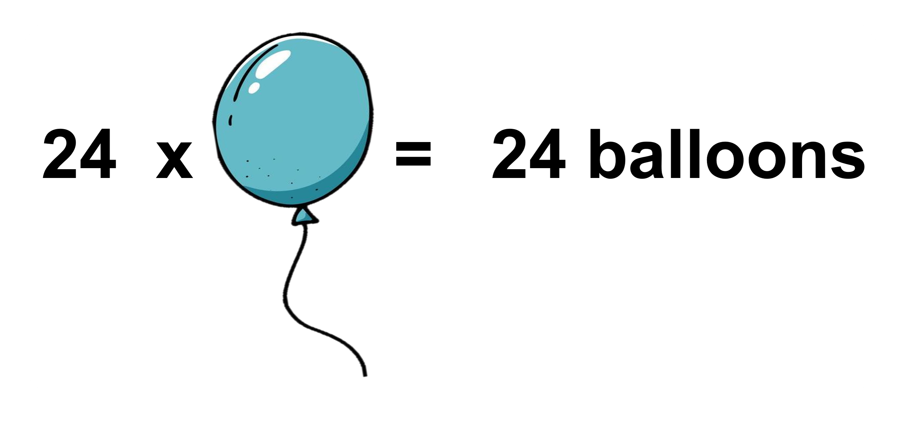
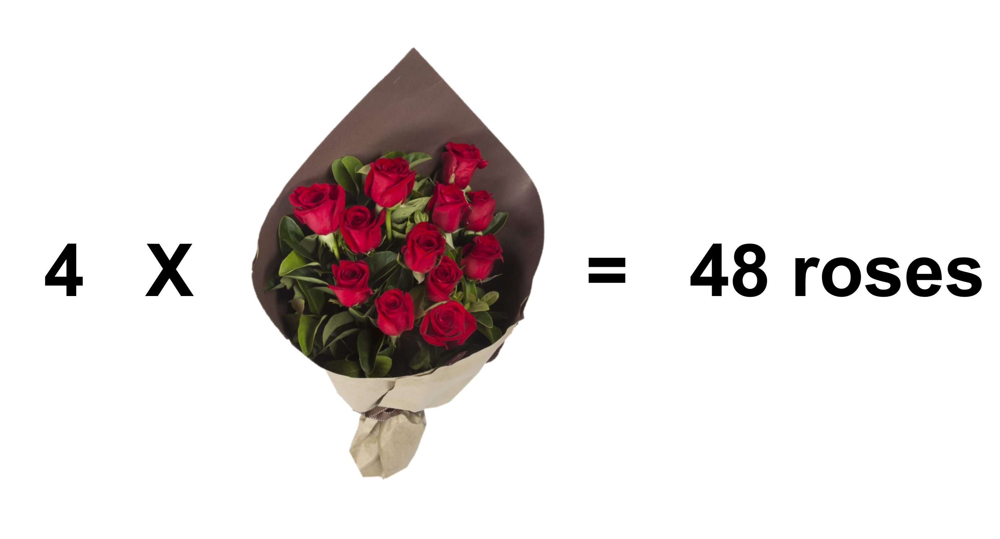
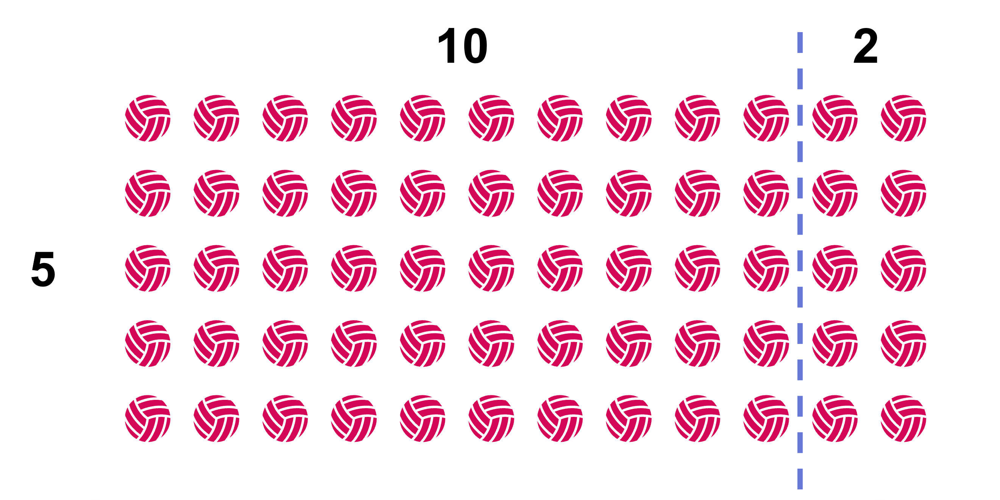
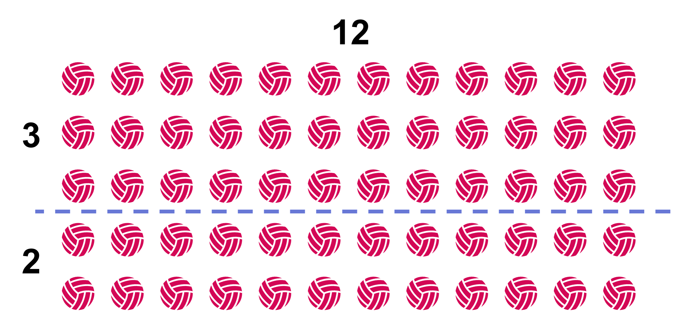

## Common Factors

Imagine that you are decorating for your sister’s birthday party. You have bought 24 balloons in total and you are confused about how you should place them on the wall but you are thinking of making certain bunches having equal numbers of balloons. Should you make 12 bunches with 2 balloons each?

Or would it look better if you made 6 bunches with 4 balloons each?

You could also make 8 bunches with 3 balloons each or simply place 24 balloons separately. 

There are even more combinations, you can always reverse the number of bunches and the number of balloons in each bunch, like 2 bunches with 12 balloons each,... The number of bunches we can equally break down from 24 balloons and the number of balloons in each bunch; 1, 2, 3, 4, 6, 8, 12, and 24 are all factors of 24. Each of them divides 24 evenly and without a remainder. 
A factor of a whole number ‘n’ is a whole number that divides ‘n’ evenly without a remainder. For example; When dividing 24 into 6 groups, we get 4 with no remainder. Also, when dividing 24 into 4 groups, we get 6 with no remainder. So, 4 and 6 are the factors of 24.     
Now, let us think about the color combination of the balloons as well. Suppose you have 30 blue balloons and 18 red balloons. How can you group all the 30 blue balloons and 18 red balloons so that each bunch has the same combination of items? How many bunches can you make, and how many of each will be in each bunch? 
The factors of 30 are; 1, 2, 3, 5, 6, 10, 15, 30. All of these numbers divide 30 evenly without a remainder. 
The factors of 18 are; 1, 2, 3, 6, 9, 18. All of these numbers divide 18 evenly without a remainder. 

What factors do they have in common? They are; 1, 2, 3, and 6. This means we can divide the balloons equally as follows; 
(i) 1 bunch of all 30 blue balloons and 18 red balloons in a single bunch. 
(ii) Or 2 bunches of 15 blue balloons and 9 red balloons in each bunch. 
(iii) Or 3 bunches of 10 blue balloons and 6 red balloons in each bunch. 
(iv) Or 6 bunches of 5 blue balloons and 3 red balloons in each bunch. 

A common factor of two whole numbers is a factor that they have in common. For example, 1, 2, 3, and 6 are factors of 30; they are also factors of 18. We call 1, 2, 3, and 6 common factors of 30 and 18. 
What is the largest number of combination bunches that you can make with no leftover balloons? The greatest common factor of 30 and 18 is 6. So, the largest number of combination bunches that you can make is 6 bunches of 5 blue balloons and 3 red balloons in each bunch. 
The greatest common factor (sometimes written as GCF) of two whole numbers is the greatest of all of the common factors. For example, 15 is the greatest common factor for 45 and 60.  One way to find the greatest common factor of two whole numbers is to list all of the factors for each, and then look for the greatest factor they have in common. 

Let’s try to find the greatest common factor of 18 and 24. First, we list all the factors of each number. 
Factors of 18: 1, 2, 3, 6, 9, 18 
Factors of 24: 1, 2, 3, 4, 6, 8, 12, 24 
The common factors are 1, 2, 3, and 6. Of these, 6 is the greatest one, so 6 is the greatest common factor of 18 and 24. 
Situations that involve having to divide two different numbers into equal groups with no remainders involve looking for a common factor. We will deal with such situations in this section.

## Common Multiples

Suppose a florist can order roses in bunches of 12. If she ordered 4 bunches of roses, how many total roses does she have? 

She has a total of 48 roses with her. 48 is a multiple of 12. 48 is also a multiple of 4. A multiple of a whole number is a product of that number with another whole number. For example, 20 is a multiple of 4 as well as of 5 because 20 = 5 x 4. 
The next day, the florist wanted to order tulips as well. She can order roses in bunches of 12 and tulips in bunches of 8. If she wanted an equal number of roses and tulips, how many bunches of each could she have ordered? 
The multiples of 12 (let us take multiples below 100 only) are; 12, 24, 36, 48, 60, 72, 84, and 96. 
The multiples of 8 (let us take multiples below 100 only) are; 8, 16, 24, 32, 40, 48, 56, 64, 72, 80, 88, and 96. 
If she wanted an equal number of roses and tulips, she should order either one of these combinations; 
(i) 2 bunches of roses (2 x 12 = 24 roses) and 3 bunches of tulips (3 x 8 = 24 tulips) 
(ii) 4 bunches of roses (4 x 12 = 48 roses) and 6 bunches of tulips (6 x 8 = 48 tulips) 
(iii) 6 bunches of roses (6 x 12 = 72 roses) and 9  bunches of tulips (9 x 8 = 72 tulips) 
(iv) 8 bunches of roses (8 x 12 = 96 roses) and 12 bunches of tulips (12 x 8 = 96 tulips)
We can see that 24, 48, 72, and 96 are common multiples of 12 and 8. A common multiple for two whole numbers is a number that is a multiple of both numbers. For example, 20 is a multiple of 2 and a multiple of 5, so 20 is a common multiple of 2 and 5.  
If she wanted an equal number of roses and tulips and also the least number of bunches possible, how many bunches of roses and tulips could she have ordered? 
Out of the four different possibilities from above, if she wanted to order the least number of bunches possible, she should go with the first combination. That is, she should order 2 bunches of roses and 3 bunches of tulips (giving a total of 24 roses and 24 tulips). Here, 24 is the least common multiple of 12 and 8.  
The least common multiple (sometimes written as LCM) of two whole numbers is the smallest multiple they have in common. For example, 30 is the least common multiple of 6 and 10. 
One way to find the least common multiple of two numbers is to list multiples of each in order until we find the smallest multiple they have in common. 
Let's find the least common multiple for 4 and 10. First, we list some multiples of each number. 
Multiples of 4: 4, 8, 12, 16, 20, 24, 28, 32, 36, 40, 44 . . . 
Multiples of 10: 10, 20, 30, 40, 50, . . . 
20 and 40 are both common multiples of 4 and 10 (as are 60, 80, . . . ), but 20 is the smallest number that is on both lists, so 20 is the least common multiple. 
Situations that involve different numbers that need to be multiplied to make the same number involve finding common multiples. We will deal with such situations in this section.

## Distributive Property and Greatest Common Factor

You have already learned about the multiplication of whole numbers, but do you know about the distributive property of multiplication? It is one of the most interesting properties of multiplication. 
To understand, let’s look at the array of balls arranged into 12 rows 

How many balls are there in total? 5 x 12 = 60 If we divide the row of 12 balls into rows of 10 balls and 2 balls, the array will look like this. 

We can still find out the total number of balls by finding out the products separately and then adding them together. 5 x (10 + 2) = (5 x 10) + (5 x 2) = 50 + 10 = 60.
According to the distributive property of multiplication, the product of two sums is equal to the sum of the individual products. In context of the example above, it simply means to convey that; 5 x (10 + 2) = (5 x 10) + (5 x 2). 
Generalizing; we get; a x (b + c) = (a x b) + (a x c). 
If we had broken down the 5 columns instead of rows, the distributive property would still be valid. 

The total number of balls can be calculated as; 
(3 + 2) x 12 = (3 x 12) + (2 x 12) = 60.

You already know how to find the greatest common factor of any two whole numbers. What is the greatest common factor of 36 and 8? 
Out of the common factors of 36 and 8, 4 is the greatest common factor. We can use this knowledge of the greatest common factor for simplifying any given calculation.
For example; on coming across a sum; 36 + 8, what do you see? Each of these numbers are made up of factors. When we know that the greatest common factor of 36 and 8 is 4, these numbers can be written as the product of 4 and another factor, individually.    
36 + 8 = (4 x 9) + (4 x 2) 
Using the distributive property, it can be written as; 
36 + 8 = 4 x (9 + 2)
This process makes the calculation simpler. We can simply move forward with 4 x 11 = 44.

