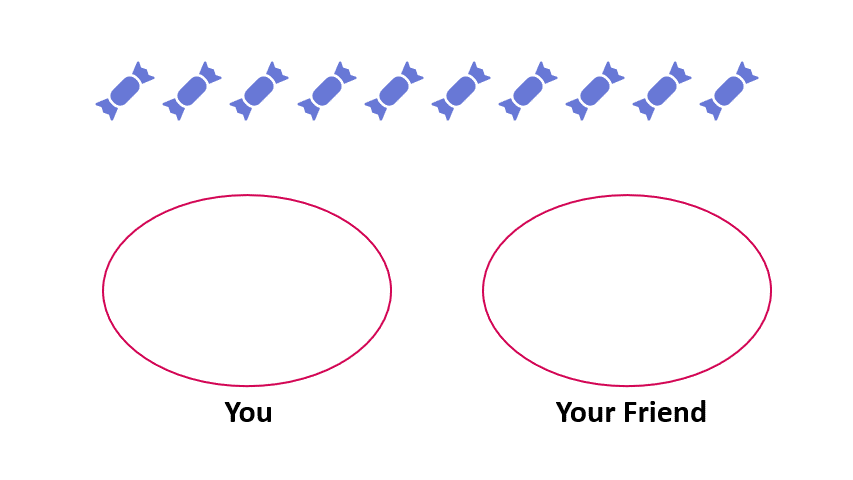
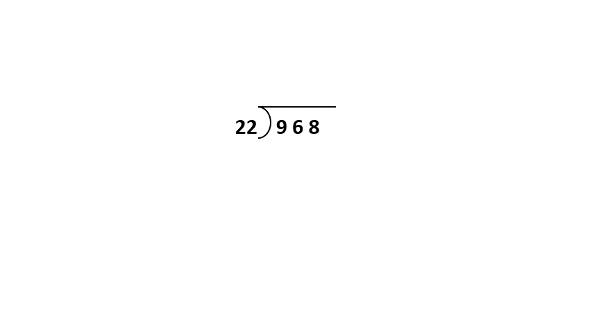
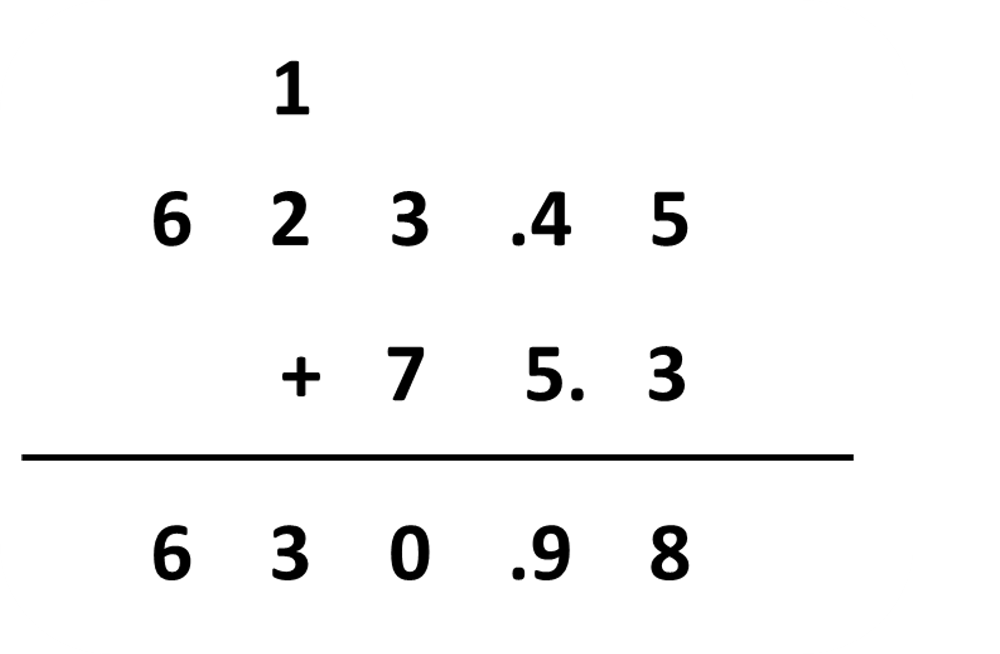
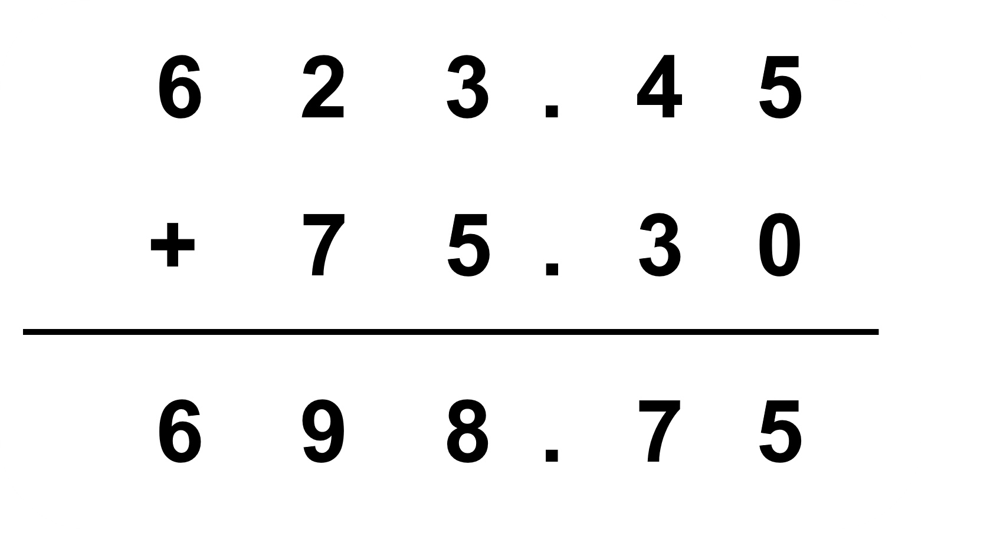
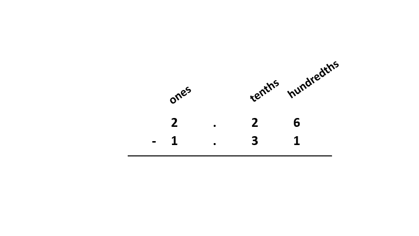
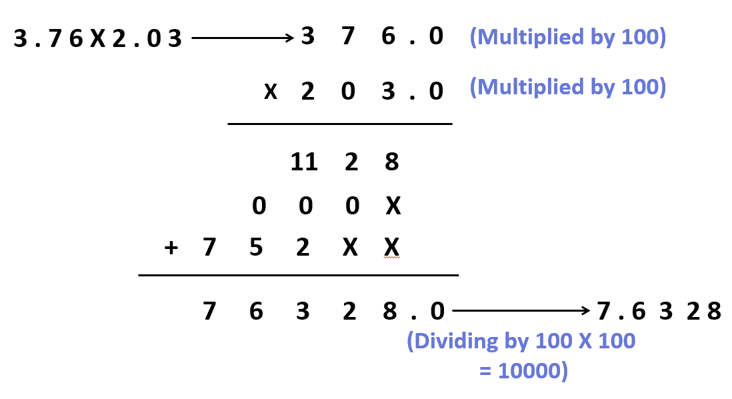
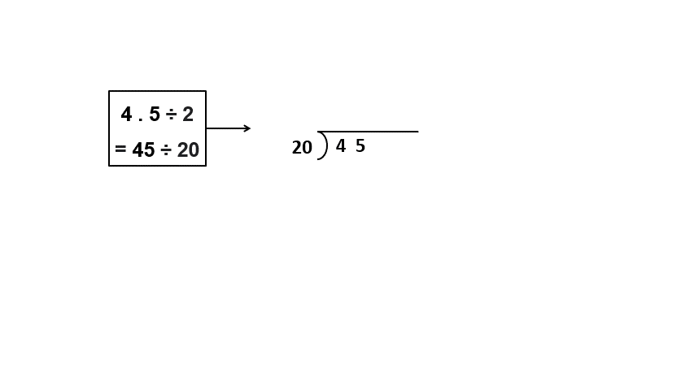

## Division of Multi-digit Whole Numbers

In this section, we will be learning to divide multi-digit whole numbers. You already know the process of basic division. But, as revision let us go back and look at the division of a two-digit whole number by a one-digit whole number. 
You and your friend need to divide 10 candies among the 2 of you. How will you do it? 
One way is you can start putting 1 candy in your friend’s hand and 1 in yours and repeat the process until all the candies are finished. 

Are any candies remaining at the end? No. 
10 candies can be evenly divided between the two of you without any remainder or extra candy remaining. When 10 is divided into 2 groups, we get 5. If you are used to dividing basic numbers, you can directly get two groups of 5 candies.  

When using the standard algorithm of long division, the division 10 ÷ 2 would look like: 

We want to know how many 2 make 10 or almost 10 (if any number of 2s cannot make exactly 10). Here, five 2s make 10. As we can see in the image, 5 is the quotient, 2 is the divisor, 10 is the dividend and the remainder here is 0.

Now, moving on to the division of larger numbers, let us look at 968 ÷ 22. We are dividing a 3-digit number by a 2-digit number. The process is the same as in the division of 10 ÷ 2. As the divisor is a 2-digit number, let us look at the first 2 digits of the dividend, that is, 96. Is it greater than 22? Yes. Then, we do not need to consider another remaining digit in this step of division.

How many 22s make (exactly) 96 or almost 96? We can use estimation to guess the number. 22 is close to 25 and 96 is close to 100. How many 25s would make 100? 4. Let’s try multiplying 22 by 4. We get 88. Subtracting 88 from 96, we get 8. Now, let us bring down the remaining digit 8 for this next step of division. We have 88 now. We already know 22 times 4 is 88, so no need of estimating here. In this way, we end up with a quotient of 44 while dividing 968 by 22. 
We will be addressing such division problems in this section. You will get a lot of practice, do not get intimidated by the thought of dividing larger numbers!

## Addition and Subtraction of Multi-digit Decimals

You have already learned to add and subtract decimals in earlier grades. Let us revise the basic process and perform more complex addition and subtraction of decimals.
How can we add 2.26 and 1.89? For this, you must be well aware of what these numbers mean. 2.26 means 2 + 2/10 + 6/100, meaning 2 ones 2 tenths and 6 hundredths. Likewise, 1.89 means 1 ones 8 tenths and 9 hundredths. Just like in whole number division, we must add numbers with the same place value and compose a new unit whenever needed. 
Let’s add 2.26 and 1.89 and see how this looks.

We first add the hundredths and get 15 hundredths. 1 tenths and 5 hundredths can be formed from this. The newly composed 1 tenth can be then added with the other tenths as shown, to get 11 tenths. 1 and 1 tenth can be formed from this. The newly composed 1 is then added with other ones resulting in 4 ones. 
Here, we could have estimated where the sum would lie without actual calculation. This would be helpful in avoiding mistakes while adding. For example; 2 and 1 give us 3 and 2 tenths and 8 tenths would give us 10 tenths, from which we could compose 1. So, we could have expected a total sum of a little more than 4. 
Now, let us look at another example. Let us add 623.45 and 75.3. 
Is the following correct? 

Something looks wrong. Can you say what is it? The decimal points are not lined up. This means that the sum has not been calculated according to the place values. Also, we can estimate the sum without the actual calculation and see that the sum is incorrect. Adding 623 and 75 would give 698 so the sum of 623.45 and 75.3 should be a little over 698. 
Estimating before the calculation gives us a reference of comparison and helps us avoid errors. This is a useful strategy. The correct way to perform 623.35 + 74.3 is given below: 

Now, let us move on to subtraction.
How can we subtract 2.26 - 1.31? From estimation, we should get a difference of a little less than 1. Now, let us revise the process by looking at the following animation:

We start subtraction from the hundredths; subtracting 1 from 6, we get 5 hundredths. Then, we move on to tenths. We cannot take away 3 tenths from 2 tenths, thus we take 1 ones from 2 ones and decompose it into 10 tenths. Taking away 3 tenths from 12 tenths gives us 9 tenths. Looking at the ones column, we see that we need to subtract 1 ones from 1 ones, resulting in zero. Thus, we get 0. 95 as the difference of 2.26 and 1.31. This aligns with our prior estimation. 
Subtracting larger decimals follows a similar process. 
Buckle up!! We will be practicing addition and subtraction of larger decimals in this section.

## Multiplication & Division of Multi-digit Decimals

You have already learned to multiply and divide decimals in earlier grades. Let us revise the basic process. 
How can we multiply 3.76 and 2.03? The standard algorithm for decimal multiplication requires an understanding of whole-number multiplication. We can simply consider this as a whole number multiplication of 376 x 203. But, what about the decimal points? Removing it changes the place value of the numbers, doesn’t it?
As mentioned before, we can simply consider decimal multiplication as any other whole-number multiplication. After we get the product, then we can place the decimal point as per the numbers we were multiplying. Here, we were multiplying 3.76 and 2.03; 3.76 has a decimal point after 2 numbers from the left, and 2.03 also has a decimal point after 2 numbers from the left. In product 76328, we then place a decimal point 4 numbers from the left, thus 7.6328. 

What is actually happening here is that we multiplied 3.76 by 100 and 2.03 by hundred to get 376 and 203 respectively, at the start. We did this to treat this multiplication process as a simple whole-number multiplication. In the end, we divide the product 76328 by 100 twice, that is, by 10000 to undo the multiplication we performed on 3.76 and 2.03 at the start. 

Even in the case of multiplication, the estimation can help us avoid any mistakes. In this case, we know that multiplying 3 tens and 2 tens gives us 6 tens. Thus, the product should be a little over 6. Rounding off 3.76 gives us 4 and rounding off 2.03 gives us 2. We can also estimate that the product should be less than 8 ( as 4 x 2 = 8).

Multiplying greater decimal numbers follows the same standard algorithm.

We can perform the division of decimal numbers through long division, as in the division of whole numbers. Let us revise the process. 
How can you divide 4.5 by 2 (that is 4.5 ÷ 2)? Whenever you get numbers in decimal form, you can always multiply both the dividend and the divisor by the same number so that you get both whole numbers and then perform the long division. This does not change the quotient, as a / b = (a x n)/(b x n).
For example; 4.5 ÷ 2 = 4.5 / 2 = (4.5 x 10) / (2 x 10) = 45/20 = 45 ÷ 20 4.5 ÷ 2 is equivalent to 45 ÷ 20. 
How would you know the number you need to multiply both the dividend and the divisor with? For simplicity just remember that if the decimal is up to the tenths (like in 4.5), multiply by 10; 4.5 x 10 =45. If the decimal is up to the hundredths (for example 9.03), multiply by 100; 9.03 x 100 = 903, and so on. 
Now, let’s perform the division. 

We have 20 as the divisor. In the first step, we need to find out how many 20s make 45 or almost 45. We know that two 20s make 40 and three 20s make 60. We need a number less than 45 so we go with 20 x 2 = 40 in the first step. This gives a remainder of 5. How many 20s make 5? Not even 1. 
So, what do we do now? In such cases, a decimal point is placed in the quotient whenever the divisor becomes greater than the dividend for the first time. In the second step of our division, we cannot divide 5 by 20, so we place a decimal point after 2 in our quotient. This allows us to add a 0 after the remainder, thus we now have 50. Two 20s make almost 50, we get a remainder of 10. The divisor 20 is again greater than the dividend 10 here. We simply add a 0 in the dividend and carry on the division. The division process is carried out in the same manner until we get the remainder of 0. 
All the decimal divisions follow this algorithm. 
No matter how many digits the decimals involved have, remember to convert them into whole numbers through multiplication first. Ready for some decimal division and multiplication challenges?

