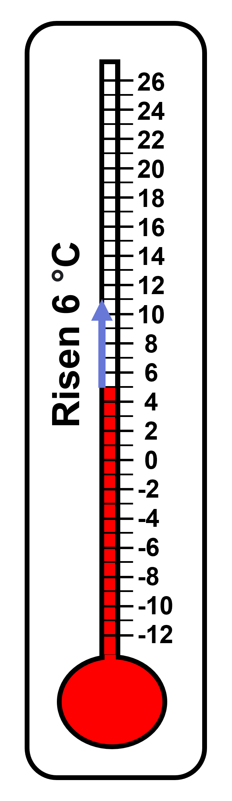

## Need of Negative Numbers

Given is a pile of coins. If we were to take away 4 coins from the given pile, how many would be remaining in the pile?

Taking away some amount indicates subtraction, as we are used to performing by now. 9 - 4 = ? We are really asking an addition question; "what can we add to 4 to make 9?" That would be 5. There would be 5 coins remaining in the pile. 

From this pile of 5 coins, if we were to remove 7 coins, what would that leave us with? 5 - 7 = ? 
We know taking 5 coins away from a pile of 5 coins would mean we would have 0 coins in the pile. But from this pile of 0 coins (Basically, at this point there would be no pile of coins at all. There would be nothing.), is it possible to take away 2 more coins? How can we take 2 away from nothing? In this context, it seems nonsensical. Let us look at another situation entirely. 
Here is today's temperature update of Narnia. At noon, the temperature was 5 degrees Celsius. By late afternoon, it had risen 6 degrees Celsius. What was the temperature late in the afternoon?

 
Look at the numbering on the thermometer. Each division represents 2 degrees and each sub-division represents 1 degree. Moving 6 degrees upwards, we find out that the temperature late in the afternoon reached 11 degrees Celsius. 
The temperature was 8 degrees Celsius at midnight. By dawn, it had dropped 12 degrees Celsius. What was the temperature at dawn?

 
Moving 12 degrees downwards, we find out that the temperature at dawn was -4 degrees Celsius. What felt nonsensical in the previous example (with a pile of coins) makes sense here, don't you think? Note that we are not talking about tangible objects that we can touch in real life, like a pile of coins that we can actually put together or take away. 
The reason why negative numbers seem to confuse people is because they don't actually exist in real life. We are talking about a measure of temperature, which is measured in reference to an arbitrary point, here, 0° Celsius. The numbers here are used to represent a physical situation rather than real objects. In this context, we have a need of negative numbers to denote temperatures less than the freezing point of water, that is, 0 degree Celsius.  
Negative numbers are numbers less than zero. The negative sign "-" is used to denote negative numbers. 
In contexts like temperature, elevation, floors in a building, recording money in and money out in your accounts book, etc. , we have been using these type of numbers in our real life. We will work with such examples in this section.

## Extending the Number Line

In the previous section, we understood why negative numbers are needed in the number system. We extended the number system as we needed numbers less than zero to represent certain situations.  
You have already worked with plotting numbers greater than zero (positive numbers) in the number line. We know that while drawing a number line, the line is divided into equally distanced divisions as shown below. 

Each division corresponds to 1 unit. And as we move to the right, the number increases by 1. Let us now extend the number line beyond zero in the left hand side. (We will plot the negative numbers as well in the number line and understand where they lie in reference to the 0 and numbers greater than 0. You may already have an idea about this from the thermometer scale we used in the previous section.) 
What does the point on the line to the left of 0 represent? 

The point lies in the same distance from 0 as 1 lies from 0 ( , 2 lies from 1, 3 lies from 2 and so on). We are moving 1 unit left from 0. It is already known that for any point on the number line, the point to its left is 1 less. For instance: 2 is 1 less than 3, 0 is 1 less than 1 and so on. So, the point to the left of 0 should be 1 less than 0. 
The point represents -1, which we call “negative one”, which can be thought of as the opposite of 1. Both 1 and -1 lie at equal distance from 0, that is, 1 unit away from 0 but in opposite directions. Likewise, -2 is the opposite of 2 and they both lie at equal distance from 0, that is, 2 units away from 0 but in opposite directions.

As per this, we can extend the number line on both sides of 0. Look at the given animation that shows the plotting of pairs of opposite numbers on the number line. 

A positive number has a negative number for its opposite. A negative number has a positive number for its opposite. The opposite of 0 is itself. We say that the opposite of 8.3 is -8.3, and that the opposite of -3/2 is 3/2. Any pair of numbers that are equally far from 0 are called opposites. 
Look at the given number line:

Points A and B are opposites because they are both 2.5 units away from 0, even though A is to the left of 0 and B is to the right of 0. Point A is -2.5 and point B is 2.5. Point A can also be written as -5/2 and B as 5/2.  
All of the numbers we have used here (5/2, -5/2, 2.5, -2.5, 0, 1, -1, 3, -3, 8.3, -8.3,...) are called rational numbers.
Rational numbers are defined as numbers that can be represented in the form a/b, where 'a' and 'b' are both integers and 'b' is not equal to 0.

Any integer 'n' can be written as n/1, so every integer is a rational number.

All rational numbers can be expressed in the fractional form (that is, a/b), but all fractions are not necessarily rational numbers. For example: π/4 , 1/(x + 3), etc.

## Comparing and Ordering Rational Numbers

In the previous section, we have learnt that the numbers increase as we move towards the right whereas the numbers decrease as we move towards the left in the number line. 
Look at the given number line:

Even though the values of ‘a’ and ‘b’ are unknown, can you say which number is greater? The number ‘a’ is to the left of the number ‘b’. Without knowing their corresponding values, we know that a < b or b > a.  
Look at the given number line:

The number 0.9 is the closest to 0. Does that mean it is the smallest number among the three? 
Do not get confused. If we were dealing with only positive numbers, we could reason in this way, the positive number closer to 0 would always be smaller than the positive number farther away from 0. 
But not in this case. When both positive numbers and negative numbers are involved, we must remember that the number in the rightmost position is the largest, whereas the number in the leftmost position is the smallest. 
Because 0.9 lies to the right of -2.3, we say 0.9 is larger than -2.3. We write; 0.9 > -2.3.
Because -4.4 lies to the left of -2.3, we say -4.4 is smaller than -2.3. We write; -4.4 < -2.3.
In general, any number that is to the right of a number ‘n’ is greater than ‘n’. This implies that any positive number is greater than any negative number. 
To order rational numbers from least to greatest, we list them in the order they appear on the number line from left to right. For example, we can see that the numbers -4.4, -2.3, 0.9 are listed from least to greatest because of the order they appear on the number line.

## Using Rational Numbers in Real World Contexts

Previously, we learnt to plot positive and negative numbers in the number line as well as ordering them. As you are already familiar, a negative number is written with a ‘-’ sign in front of the number. Positive numbers do not require a ‘+’ in front of them since we assume that any number without a ‘-’ is positive.  
In this section, we interpret given values without using the number line, by looking at their signs and quantity, in specific contexts. A major difference between positive and negative numbers that you need to keep in mind is that while in positive numbers a larger quantity means a larger value, in negative numbers, the larger the negative quantity, the smaller its value. 
For example, you easily know that 6 is greater than 2 because the quantity denoted by 6 is higher than 2. However, -6 is less than -3 because, depending on the context, you are short by more or you need to pay more. In other words, having -3 of something is more than having -6 of that thing.  
We can represent changes in a quantity with positive and negative numbers. If the quantity increases, the change is positive. If it decreases, the change is negative. 
Suppose 5 gallons of water is put in a washing machine. We can represent the change in the number of gallons as +5. If 3 gallons is emptied from the machine, we can represent the change as -3. 
It is especially common to represent money we receive with positive numbers and money we spend with negative numbers. 
Suppose Clare gets $30.00 for her birthday and spends $18.00 buying lunch for herself and a friend. To her, the value of the gift can be represented as +30.00 and the value of the lunch as -18.00. Whether a number is considered positive or negative depends on a person’s perspective. If Clare’s grandmother gives her $20 for her birthday, Clare might see this as +20, because to her, the amount of money she has increased. But her grandmother might see it as -20, because to her, the amount of money she has decreased. 
In general, when using positive and negative numbers to represent changes, we have to be very clear about what it means when the change is positive and what it means when the change is negative.

## Absolute Value of Rational Numbers

We compare numbers by comparing their positions on the number line: the one farther to the right is greater; the one farther to the left is less. 
For example; -3 is less than 1 because -3 lies to the left of 1. The number -3 gives us two pieces of information; that it lies to the left of 0 (direction gives us the sign, here ’-’) and that it lies 3 units away from 0 (distance gives us the magnitude). 
Sometimes we wish to compare which one is closer to or farther from 0. For example, we may want to know how far away the temperature is from the freezing point of 0 degree Celsius, regardless of whether it is above or below freezing. 
We are concerned about only the distance from 0, regardless of the direction. This is the absolute value of the number. 

The absolute value of a number tells us its distance from 0. For example, the absolute value of  -3 is 3 and the absolute value of 1 is 1. 

The absolute value of -3 is 3, because -3 is 3 units to the left of 0. The absolute value of 3 is also 3, because 3 is 3 units to the right of 0. 

Opposites always have the same absolute value because they both have the same distance from 0. The distance from 0 to itself is 0, so the absolute value of 0 is 0. Zero is the only number whose distance to 0 is 0. For all other absolute values, there are always two numbers—one positive and one negative—that have the same distance from 0. 
To say “the absolute value of 4,” we write: I4I 
To say that “the absolute value of -8 is 8,” we write: |-8| = 8

## Ordering and Finding Absolute Value

We have learnt comparing and ordering rational numbers as well as comparing two absolute values. If confused, one might say that -12 is greater than 5 because they see 12 as being the “bigger” number. While comparing rational numbers, we must take both the sign and the magnitude of the number into account.  -12 is the smaller number as it lies to the left of 5. Or simply, we can use the reason that any positive number is always greater than any negative number. 
The confusion arose because the person confused the actual numbers with their absolute values. The absolute value of -12 is greater than the absolute value of 5, that is, I-12I > I5I. The absolute value of -12 is greater than that of 5 because -12 is more than 5 units away from 0. 
We can use elevation to help us compare two rational numbers or two absolute values. Suppose an anchor has an elevation of -10 meters and a house has an elevation of 12 meters. 
To describe the anchor having a lower elevation than the house, we can write -10<12 and say “-10 is less than 12.” 
The anchor is closer to sea level than the house is to sea level (or elevation of 0). To describe this, we can write |-10| < |12| and say “the distance between -10 and 0 is less than the distance between 12 and 0.” 
We can use similar descriptions to compare rational numbers and their absolute values outside of the context of elevation. 
To compare the distance of -47.5 and 5.2 from 0, we can say: |-47.5|  is 47.5 units away from 0, and |5.2|  is 5.2 units away from 0, so |-47.5| > |5.2|. 
|-18| > |4| means that the absolute value of -18 is greater than 4. This is true because 18 is greater than 4.

