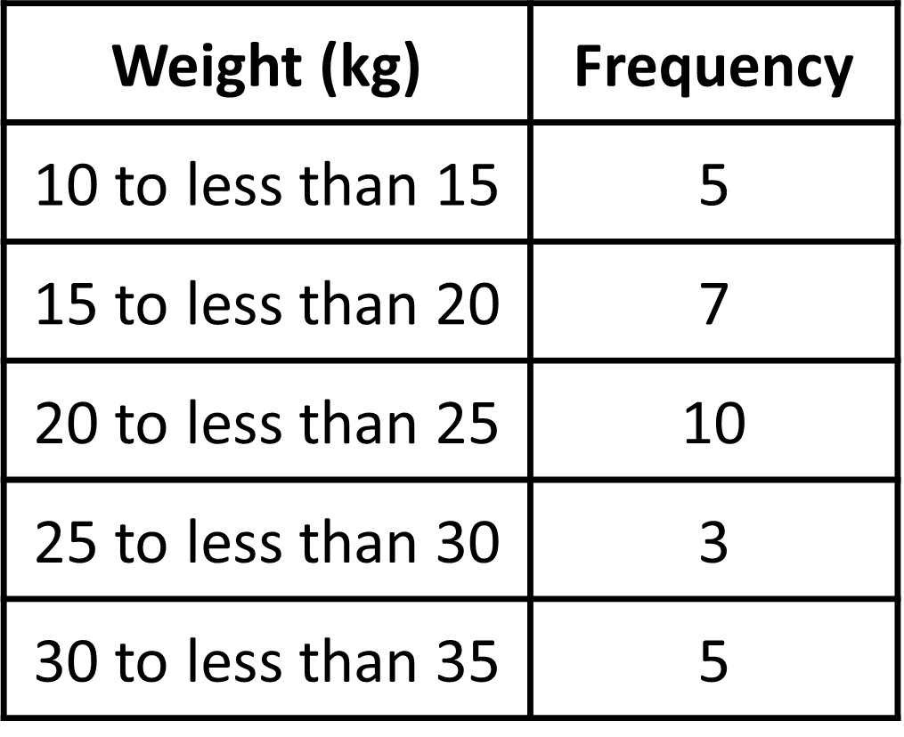

## Distribution of a data set

Let’s say you conduct a small survey in the class to understand the breed of dogs your classmates own and their respective weights. Here is the survey you asked your classmates to fill. 

Student Name: _______________  
Breed of Dog: _________________  
Weight of dog in pounds: _____________  

Below is the data collected from the survey. 

Hmm, quite a lot of data there.  What do we do about it now that we have it? When we look at it, it seems there are quite some Golden Retrievers as pets. What about the weight of the dogs? They vary quite a bit. All of the categorical and numerical data can be a bit overwhelming. 

[[Note: Which is categorical and which is numerical here?]]

When we analyze data, we are often interested in the whole data as a whole and finding any sort of pattern present, like, is there a breed that people prefer? Do all dogs have similar weights?

This is what we call the distribution of data. Distribution of the data is basically  information that shows all the data values and how often they occur. The above table does show us the distribution of data but it’s difficult to analyze the data in this raw form. So, what we do is we often organize and summarize such a distribution using a graph or a table or with numerical summaries. 

Graphs and tables help us to visualize the distribution of the data. Visual methods make it easy for us to see patterns and special features. 
Numerical summaries give us some key numbers which can tell us some important information about the distribution. Together, they give us powerful tools to analyze data distribution. 
We will look at each of them separately and in detail later.
We are particularly interested in three things when we talk about distribution:

What is a ‘typical’ value of a distribution? 
This is also called “center of distribution” or “measures of central tendency”. This is kind of like ‘one value’ from all the values that could be a good summary of the whole data. In one of the previous examples of the amount of time students’ spend doing homework,  we would be interested in a typical time students spend on homework. Maybe most students spend 4 hours doing their homework. 

How much does the data vary from one student to another? 
This is often called “spread of the distribution“ or “variability in data”. In the last example of the amount of time students’ spend doing homework, we would want to know how the time spent by students on homework varies from one student to another.

What is the general shape of the distribution? 
This deals with things such as asking for any general pattern that could be seen from the data, like “most students are spending more than 20 minutes a day”, or “only two students study more than 60 mins a day on homework” and so on.

Like mentioned before, the tabular and graphical representation of the distribution and numerical summaries helps us answer these questions. In particular, we will learn frequency distribution tables, dot plots and histograms as ways to represent a distribution. 

If we know about the center, spread and shape of the distribution, then we know how the data set behaves, even if we do not have information about all the data.  So, a lot of our lessons will center around understanding these three measures. 

## Summarizing data set and answering statistical questions using frequency distribution tables 

One way to visualize the distribution of numerical/categorical data is by using frequency tables. ‘Frequency’ refers to the number of times a data value occurs in a dataset. If 10 students said that they had German Shepherds as dogs, the frequency of German Shepherd would be 10. 

We can note the frequency of each of the values in a ‘Frequency Table’, which is essentially a very simple table. To make the table, let’s look at the answers for the type of dog that the student’s had. We first need to make sure to mark all unique observations that we get (the unique dog breeds). Then, all we do is count the number of times each particular value appears in the data. 

Let’s see what our frequency table looks like.

Even though creating a frequency table is pretty simple and may not seem like much, it allows us to look at the entire data values in a more ordered and easy manner so that we can see the pattern in the data. From the table, we can clearly see that the highest frequency is for Golden Retrievers, meaning this breed is common among the students surveyed.

Once you have the frequency table, we have the frequencies for all of the unique dog breeds. We can use this data to create a ‘Relative Frequency Table’, which differs from the Frequency Table in a way that rather than actual counts, we are interested in their relative occurrence.  The relative frequency of each value is determined by dividing the frequency for each value by the total number of data points. Relative frequencies can be reported as decimals but are often converted to percentages which makes it easy to understand. 

We see that there are a total of Golden Retrievers as pets as it occurs the most at 35%! The values for BullDog, German Shepherd, Dalmatian, and Beagle occur the least at 7%. 

As you see, frequency and relative frequency tables can be very useful to see patterns in the data. It can tell us which value occurs the most (and by how much) and which does not. 

## Summarizing data set and answering statistical questions using dot plots

Apart from tables, another representation that is very useful in representing numerical data is a dot plot. The dot plot (also called a line plot) is a fundamental graphical display for the distribution of  data. Like a frequency table, a dot plot also shows the distribution of a data set. 

So how do we create one?

A dot plot is basically the frequency table in graphical form. The names dot plot and line plot gives us hints on how to create this plot. 

This plot is essentially a number line with the data marked on it. Let’s use the data for the weight of dogs and show it on the dot plot. 

A dot plot uses a horizontal number line as shown and a point on the number line represents the value of a variable, i.e. weight of dogs in pounds in this case. A data value is marked on the line according to its position on the number line. For example, a weight of 15 pounds must be shown as a dot above 15 on the number line. We show the frequency of a value by the number of dots drawn above that value. Here, the two dots above the number 55 tell us that there are two dogs weighing 55 pounds. 

Basically, each dot represents the occurrence of a single value in the data. The dot plot displays the individual dog weight and the frequency of the various dog weights that were measured.

Unlike a frequency distribution table, we can get more information for the dot plot. 

One of the main reasons we collect and analyze data is that we are interested in learning what is “typical,” or what is common and can be expected in a group. One way to describe what is typical or characteristic for a data set is by looking at the center and spread of its distribution. 

So what does ‘typical’ even mean? Sometimes it is easy to tell what a typical member of the group is. At other times, it may not be obvious. Let’s look at some examples to understand it more. 

Let’s look at two distributions represented on dot plots. The first plot is a distribution of cat weights and the second one is a distribution of dog weights.

What do you observe? What do you think is the typical weight for cats and for dogs?

On the above dot plots, we see that the collection of points for the cat data is further to the left on the number line than the dog data. Based on the dot plots, we may describe the center of the distribution for cat weights to be between 4 and 5 kilograms and the center for dog weights to be between 7 and 8 kilograms. Center of distribution is basically what the name suggests, ‘which values are at the center of the collection of data shown?’.
We often say that values at or near the center of a distribution are ‘typical’ for that group (this of it as being a common data occurrence). This means that a weight of 4–5 kilograms is typical for a cat in the data set, and weight of 7–8 kilograms is typical for a dog.

Now, what does ‘spread’ mean in terms of the distribution of data?

Like the name suggests, it is basically how spread out the data is in general (or how close together it is). Think of it as looking at the collection of data and seeing how wide or narrow the collection is in terms of the shape we see in the dot plot. 

Looking at the two dot plot, we see that the dog weights are more spread out than the cat weights. 

The difference between the heaviest and lightest cats is only 4 kilograms, but the difference between the heaviest and lightest dogs is 6 kilograms. A distribution with greater spread tells us that the data have greater variability. In this case, the weight of dogs have a large range of values as compared to the weight of cats. This also means that we could say that the cats are more similar in their weights than the dogs.

In future lessons, we will discuss the different ways to measure the center and spread of a distribution, which gives us actual numbers as answers. Right now, we are only making guesses about the center and spread from the dot plots.

## Summarizing data set and answering statistical questions using histograms

In addition to using dot plots, we can also represent distributions of numerical data using histograms.

Here is a dot plot that shows the weights, in kilograms, of 30 dogs, followed by a histogram that shows the same distribution. Don’t worry, we’ll see how to build it as well. 

So how exactly does histogram work and how do we construct it?

In a histogram, rather than looking at individual values, data values are placed in groups or “bins” of a certain size (or width), and each group is represented with a bar. In the figure above, we have 5 bins, each of size 5. Why do you think the size of each bin is 5? Look at the histogram given. The first bin starts at 10 and ends at 15, so the range is clearly 5. The same applies for all bins since each bin has to be the same size. The choice for  the size of the bin depends on the problem at hand, and it is a convention to include the smaller value (lower bound) but exclude the bigger value (upper bound) in a bin when counting frequencies.

The height of the bar tells us the frequency for that group. The height of bin 10 to 15 is 6, meaning there are 6 values between 10 and 15. 

Let’s see how to build a histogram step by step. Below is the raw data of the weight of different dogs in kilograms.

11, 12, 13, 13, 14, 15, 16, 17, 17, 18, 19, 19, 20, 20, 20, 22, 22, 22, 23, 23, 24, 24,
25, 26, 28, 30, 32, 32, 34, 34

Like with a dot plot, we start with a number line for the values. The minimum value is 11 and the maximum is 34, so our number line for the histogram needs to extend from 10 to 35 at the very least. We could use bins of any size, however we choose the size of 5 because it is convenient and makes sense in the context. A size of 4 or 6 would also work. A bin size of 20 however would be too large for this problem as most of the weight of dogs would fall into one of the bins and it would be difficult to analyze variability in the data. Similarly a bin size of 2 would be too small as there would be too many bins and it would almost look like a dotplot.  

Let’s use bins of size 5 kilograms for the dog weights. This means that the bins will be 10-15, 15-20, 20-25, 25-30, 30-35. So the boundaries for our bins will be: 10, 15, 20, 25, 30, 35. We stop at 35 because 34 is our maximum value. 

Next, we find the frequency for the values in each group. It is helpful to organize the values in a frequency table based on which bin the values fall under. 

You can see that some numbers are present in two bins. Like 25 is present in both 20-25 and 25-30. So which bin does 25 lie in? 

Notice that in a range 20-25, we include all values that fall within the range including 20 but we do not include (Hence the frequency is 1010 and not 11). Since 25 is not included in the 20-25 bin, it will fall in the range 25-30. This has to apply to all numbers, meaning that in the 10-15 bin, 10 is included but 15 is not, as it is included in the 15-20 bin.
Again, this is just a generally accepted rule, and you may choose any rule as long as you are consistent throughout the problem and your audiences (including your teachers) are aware of your assumptions. This means that you could choose to add 25 in the 20-25 bin, but you would also need to make sure that 15 is included in the 10-15 bin and not the 15-20 bin. Basically, you need to ensure consistency.

For simplicity, we will follow the general convention to include the lower bound and exclude the upper bound (Here for the bin 25-30, 25 is the lower bound of the bin, which is included and 30 is the upper bound of the bin, which is not included).

Now that we have the frequencies, we can make a horizontal line starting from 10 and create bins up to a height that will determine its frequency. The bin 10-15 has a frequency of 6, so the height of that bin will be 6 (as shown in the vertical axis). This means that there are 6 dogs that have weights that lie between 10 and 15 kg. A height of 10 in the 20 to 25 bin means that there are 10 dogs with weights between 20 to 25 kg. 

Let’s look at the histogram and dot plot together again.

Notice that the histogram and the dot plot have a similar shape. The dot plot has the advantage of showing all of the data values, but the histogram is easier to draw and to interpret when there are a lot of values or when the values are all different. In a histogram, the individual data values are no longer available, and consequently the interpretation of the data cannot be as specific since we have grouped the values into bins. 
					
## Why use histogram over dot plot?

In the last example, we looked at a case of weight of dogs and created a histogram and dot plot for the same data as shown.

They both looked similar with a few key differences. 
But if we already have a dot plot, why make a histogram if the results are the same?
In this case, we did not have a lot of data, meaning the dot plot looked ‘nice’ and not over crowded or confusing. 

What if we had A LOT MORE data? Let’s look at another distribution, which is not so “nice”.

Below we have a dot plot showing the weights of 40 different dogs. This time we have more data as well as data values that are close to each other. 

Using the same data, the given histogram is made. 

In this case, which graph would you choose to explain the distribution?

It is difficult to make sense of the distribution from the dot plot because the dots are so close together and all in one line. Most are overlapping and it is difficult to see individual data values. But looking at the histogram, it is much cleaner. It does a much better job of showing the distribution of weights, even though we can’t see the individual data values. So, histogram is a more suitable representation when there are too many data points.

We can see that the histogram is a meaningful interpretation of the dot plot. On the dot plot, we can see a denser cluster from 15 to 25, which you can also see on the histogram. Similarly, there are fewer dots in the range 25-30, which you can see as the short bar in the histogram. The bins made by histogram makes it easier for us to see which group has higher frequency and which has a lower frequency.

To conclude, when there are many different weights and most occur only one time (meaning they have a chance of overlapping), a frequency table or even a dot plot would not be very informative. It would be too cluttered. On the other hand, a histogram groups these cluttered data and often reveals interesting patterns on the distribution. 

