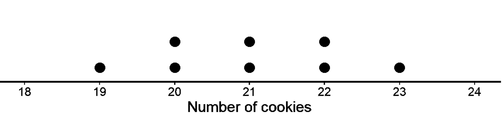
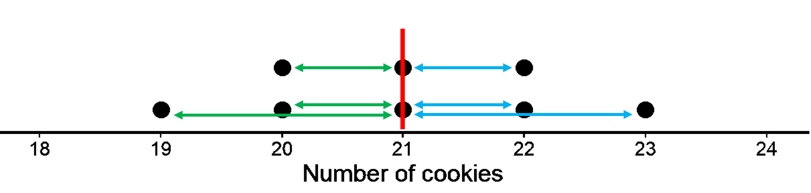
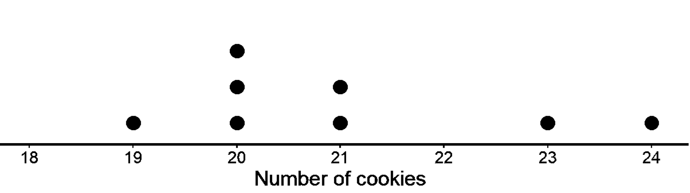
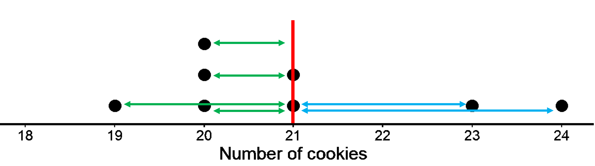
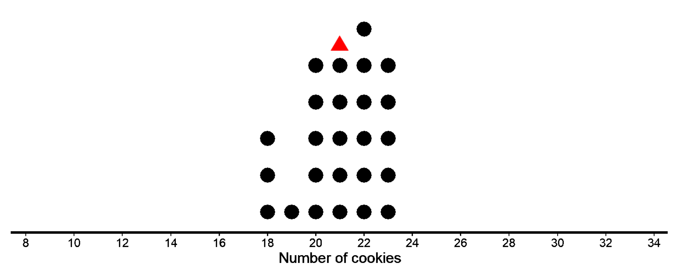
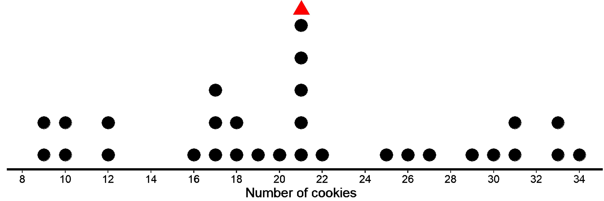
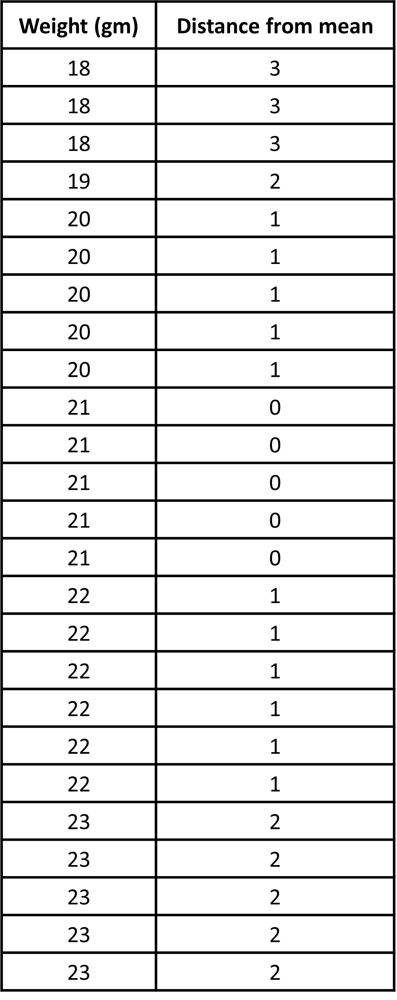

## Mean as a measure of center of distribution

In the last lessons, we represented distribution using dotplots and histograms and we interpreted those graphs to get an idea about the typical value that could represent the distribution as well as variability of the distribution. We also talked about the general shape of the distribution -  peak, symmetry and cluster in a distribution. We also looked at two distributions - weight in kg of cats and weight in kg of dogs and made estimations of the typical value or the center of distribution. We also made statements about the spread such as “the distribution of weight of dogs is more spread out than those for cats”. 

In this lesson, we want to be more precise when we talk about the center of distribution. 

Because numerical data has variability, it is useful to identify a single numerical summary to represent the complete data. Since we have already been talking about the ‘center’ of the dataset, a numerical quantity centrally located in the distribution often provides a representative value of the data. 

But how do we define the center of distribution? There are multiple ways of considering the notion of the center of a distribution for numerical data.

One numerical summary that provides information about the center of a distribution is the mean of the data. We will be looking at ‘mean’ in this chapter. 
A common interpretation of the mean is that it is the arithmetic average of the data. What this means is that basically, you add all the values in the data set and divide this sum by the number of data points and you get the mean. This interpretation informs us on how to calculate the mean, but it does not describe what the mean represents for the distribution. So, we will look at what ‘mean’ is in two important ways. 

## Understanding mean in terms of “fair share” or “leveling out”

Let’s start with an example.

Suppose there are 5 bottles which have the following amounts of water: 1 liter, 4 liters, 2 liters, 3 liters, and 0 liters. We want to find the typical amount of water in the bottle. 

What we can do is add up all of the values. We can think of this as putting all of the water together: 1 + 4 + 2 + 3 + 0 = 10. We can then divide the 10 liters equally into the 5 containers: 10 ÷ 5 = 2. 
So, if all bottles were to have equal share of water in it, the amount would be 2 liters. 

This is the mean of the dataset, where we have shared the total amount equally among all the bottles. This is one way to think about the mean, in terms of “fair share” or “leveling out.” That is, a mean can be thought of as a number that each member of a group would have if all the data values were combined and distributed equally among the members.  

For the distribution of weight of dogs given below, total total weight of the dogs is 645 kg. 

11, 12, 13, 13, 14, 15, 16, 17, 17, 18, 19, 19, 20, 20, 20, 22, 22, 22, 23, 23, 24, 24,
25, 26, 28, 30, 32, 32, 34, 34

We can calculate the mean by dividing the total by the number of dogs, i.e. 645/30 = 21.5 kg. 
The ‘mean’ of 21.5 kg basically says that if all the dogs were to be of the same weight but the total weight of the dogs were not to change, each of the dogs would be 21.5 kg. In other words, the weight of the typical dog is 21.5 kg. 

## Mean as the balance point of distribution

After getting familiar with the ‘fair share’ understanding of mean, we will look at the second understanding. Another way to think about the mean is as a number that corresponds to the balance point of the distribution represented in a dot plot. From this point of view, a mean is such a point that the total distances of all the points on the left of it is the same as the total distance of all the points on the right of it. Let’s have a look at two simple distributions to understand this. 

Let’s look at two different data points, both talking about the number of cookies that 8 children have.

First case:

19 20 20 21 21 22 22 23

Following is the dot plot for this data. 

The mean of the data is 21. 

On the dot plot, the red vertical line represents the mean. 

The green horizontal lines represent the distances from the mean to the points located at the left of the mean. We get 1, 1, and 2. The blue horizontal lines represent the distances from the mean to the points located at the right of the mean. We get 1, 1, and 2. Such a distribution where both sides of the mean are mirror images of each other is a symmetrical distribution.

We do not need to show the distances for the two points at 21 since 21 itself is the mean and the distance from 21 to 21 is zero.
If you add together measurements of all the green lines, it will be the same as the sum of the measurements of blue lines. We get 5 in both cases. In this sense, the data points balance at 21, since we have equal distance both to the left and right of the mean of 21. So, 21 is the center of the distribution. 

Another way you can think of this is by using negative numbers for one side. Say the distance to the left is written as -1, -1, and -2. Adding them gives us -5. Now when we add this to the distance to the right, which is 5. We get 0. So the mean can also be thought of as the value that gives equal distances at the left and right side, hence giving us a sum of 0. 

Second case:

19, 20, 20, 21, 23, 24, 20, 21

Following is the dot plot for this data. 

This distribution does not look symmetrical since no line would make both sides look like mirror images like before. Such a distribution is skewed. Since there are many more values on the left part of the dot plot than on the right, we say that it is skewed to the right. 

The mean of this data is also 21. 

The red vertical line represents the mean. Just like in the first dot plot, the green horizontal lines represent the distances from the mean to the points located at the left of the mean. We get 1, 1, 1, and 2. The blue horizontal lines represent the distances from the mean to the points located at the right of the mean. We get 2, and 3. We do not need the distances of 21 from 21 itself (for the two points shown at 21).
In this case, do you think the sum of magnitude of all the green lines is equal to the sum of magnitude of the blue lines?  Let’s see. On the left, we have 5, and on the right, we have 5 as well! In this sense, the data points could balance at 21 and therefore can be considered the center of distribution. So, it does not matter if the distribution looks symmetrical or not. The mean is always the balancing point.
Note that you will also get 0 in this case well when you consider the left side to be -5.

For both examples, we can then say that the distribution of the cookies has a center at 21 because that is its balance point, and that the eight children, on average, had 21 cookies.

Something to think about:  Are there an equal number of points to the left and to the right of the mean? 

## Measuring variability using mean absolute deviation (MAD)

Previously, we learned to find the typical value or the center of the distribution. We calculated the mean from the data as the arithmetic average and interpreted the mean in terms of both “fair share” and as the “balance point of the distribution”. But is knowing mean enough to make any meaningful conclusion about the center of the distribution? Let’s look at the two different distributions with the same mean and decide.

The first dot plot shows the weights, in grams, of 25 cookies. The mean weight is 21 grams. We see that the data is not that spread out, all the weights are within 3 grams of the mean, and most of them are even closer. These cookies are all fairly close in weight, meaning the data has less variability.

The second dot plot shows the weights, in grams, of a different set of 30 cookies. The mean weight for this set of cookies is also 21 grams, but we can clearly see that the data is much more spread out. Some cookies are half the weight of the mean and others are one-and-a-half times that weight. We see  a lot more variability in the weight of cookies in the second case.

So, even though the mean is the same for both distributions, the two distributions are quite different. One has more variability than the other. Also, as you may have noted, the mean does not tell us about the total number of cookies. Both the distributions of 25 cookies and 30 cookies have a mean of 21. 

Statistics is different from other branches of mathematics in the sense that statistics requires a different kind of thinking, because data are not just numbers, they are numbers with a context. The mean of 21 does not mean much without knowing the variability, size and shape of the distribution. Without context, 21 is just a random number without much meaning behind it. 

To give context to the mean, we need to understand variability or the spread of the distribution as well. But how do we define variability? Can we come up with a single number that describes the variability of the distribution, like we did with mean? One way of calculating variability is by measuring how far away or how spread out the data points generally are from the mean. This measure of variability is called the Mean Absolute Deviation (MAD).

Let’s see what MAD means and we can calculate it. 

In both the dot plots, the mean is 21, i.e. the sum of horizontal lines to the left of the mean is equal to the sum of horizontal lines to the right of the mean. In the first case, each side has a total distance of 16 each. In the second case, each side has a total distance of 90 each.

While we have already seen how to find the horizontal distances, let’s go through it again. 
The point that represents 18 grams is 3 units away from the mean of 21 grams. We can find the distance between each point and the mean of 21 grams and organize the distances into a table, as shown for the first dot plot. 

The values in the first row of the table are the cookie weights in grams. Their mean, 21 grams, is the mean of the cookie weights. The values in the second row of the table gives the distances between the values in the first row and the mean 21. All values to the left (less than 21) gives us a total of 16 as the horizontal distance and the same goes for all values to the right of 21. 

As you can see clearly, the total sum of horizontal lines in the second dot plot is much larger than the total sum of the horizontal lines in the first plot (16 vs 90). While looking at the dot plot, we can already see the data points in the second dot plot are more spread out. But how spread out exactly? Well, this is why we need MAD, which is the arithmetic average of the distances. 

We first add all the distances and then divide by the number of data points (Or we could just add the left and right horizontal distance that we found just now. It means the same thing). Then, we get the arithmetic average of the distances of all the points from the mean.  If we find the mean of this column, we get how individual values typically vary from the mean. 

For the first case, the distances are all between 0 and 3. MAD is 32/25 = 1.28 gm

So, for the 25 weights of cookies, the individual weights vary from 21 gm (the mean study time) on average by about 1.28 gm, which tells us that the cookie weights are typically within 1.2 grams of 21 grams. We could say that a typical cookie weighs between 19.72 and 22.28 grams (1.28 gm above and below 21).

For the second case, the distances are all between 0 and 13. MAD is 180/30 = 6 gm

So, for the 30 weights of cookies, the individual weights vary from 21 gm (the mean study time) on average by about 6 gm, which tells us that the cookie weights are typically within 6 grams of 21 grams. We could say a typical cookie weighs between 15 and 27 grams.

This is called ‘absolute’ because we do not care whether the data is located on the left or right of the mean and we are only concerned with the absolute value of the magnitude of the distances. If we had taken the signs for left and right to be negative and positive, we would have gotten 0 as the total value and the mean of this would be 0 as well. This average distance from the mean is called Mean Absolute Deviation or MAD. 

The MAD is a measure of the variability of the distribution. In these examples, it is easy to see that a higher MAD suggests a distribution that is more spread out, showing more variability.

Something to think about: 
Is there more variability in the data below or above the mean?
Can two different data sets have the same mean and the same MAD?
