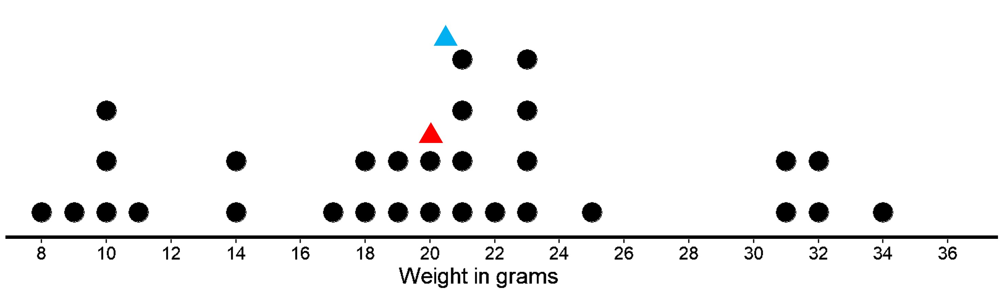
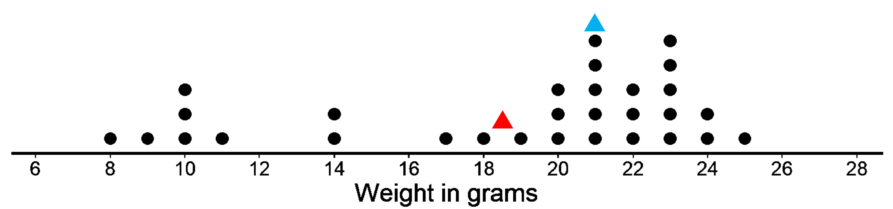
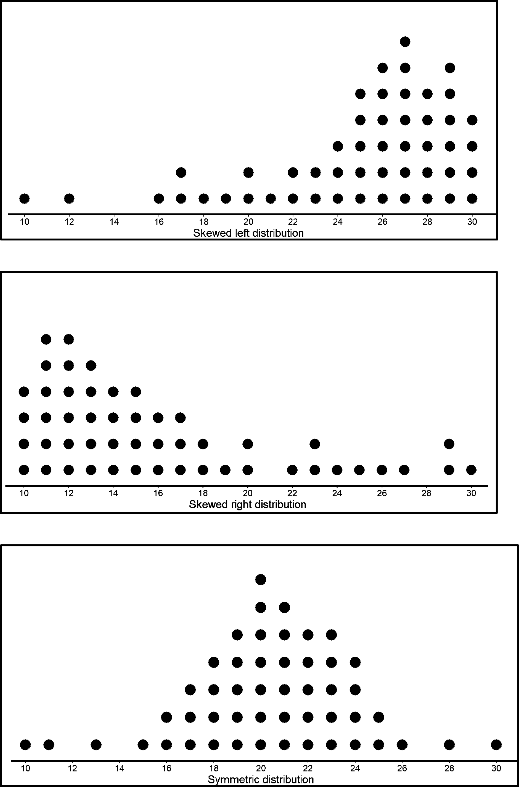

## Mean and median - what do they tell us?

So far, we know that both the mean and the median are ways of measuring the center of a distribution. Do we really need both then? Let’s see why both are important and how they tell us slightly different things. 

The dot plot shows the weights of 30 cookies. 

The mean weight is 20 grams (marked with a red triangle). The median weight is 20.5 grams (marked with a blue triangle). The mean tells us that if the weights of all cookies were distributed so that each one weighed the same, that weight would be 20 grams. We could also think of 20 grams as a balance point for the weights of all of the cookies in the set. The median tells us that half of the cookies weigh more than 20.5 grams and half weigh less than 20.5 grams. In this case, both the mean and the median could describe a typical cookie weight because they are fairly close to each other and to most of the data points.

But let’s look at another set of 30 cookies. 

This has a mean weight of 18.5 gm. The median weight is 21 grams. Which one do we choose in this case? It does not seem like they are that close to each other. In this case, the median is closer to where most of the data points are clustered and is therefore a better measure of center for this distribution. That is, it is a better description of a typical cookie weight. The mean weight is pulled down by a handful of much smaller cookies (weighing between 8 to 11), so it is farther away from most data points. The median however is not affected by that since it takes into account an equal number of data points below and above it. So we have an equal number of data points (15) below and above the median of 21 grams.

In general, when a distribution is symmetrical or approximately symmetrical (like in the first case), the mean and median values are close. In such cases, both are good ways to describe the center of distribution. 

But when a distribution is not roughly symmetrical (like in the second case), the two values tend to be farther apart. We usually tend to choose the median in such a case since it is less affected by the skewness. When there are a handful of extreme or unusual values (either smaller or bigger), the mean gets much more affected. 

When to use mean and when to use median for center of distribution 

Now that we know what mean and median are, the slight differences between the two  and the corresponding measures of spread, which one should we use? 

The decision mainly depends on two factors:
The shape of the distribution 
The presence or absence of outliers
Let’s look at why the two affect our decision one by one. 

## The shape of a distribution in describing mean and median

The shape of a distribution influences which summary measure is most appropriate for describing the center of a distribution for quantitative data. But what does it mean when we talk about the shape of a distribution? We have already seen dot plots looking different based on the data we have. Let’s look at a few of them and see what common shapes we can get and the cases in which we would use mean or median. 

In the last case where data is symmetrical, we know that the mean and median have similar (if not equal) values. In such cases, any of the two would be a suitable value to take as the center of distribution. 

But in the first and second case, the shapes are skewed to the left and right. Meaning that there are more data points to the right in left skewed and more data points in the left in the right skewed. So they are clearly not symmetrical. As we have already seen, such cases tend to have very different values for mean and median. 

In the left skewed case, there are a lot more values to the right. If we find the mean and the median of this, the median will be somewhere in the right with the most values but the mean will be shifted more to the left since it is affected by the values to the left.  

The same goes for the right skewed distribution as well, but this time the mean is more to the right and median is where most of the data are clustered (to the left). 

So we can see how the shape of the distribution has affected whether we choose mean or median. 

## Effect of outliers on mean and median

Let’s look at a dataset and see what is the best pick: the mean or the median.

Given is the data for different amounts of times that students spend studying on the weekend. 

20 25 35 40 45 46 50 55 56 56 57 60 60 60 62 62 63 64 65 65 65 66 66 68 69 70 71 75

Let’s see what a dot plot for this looks like.

Here, we see that the study times for two students of 20 and 25 minutes stand out as much lower than the study times of the other students. Data values like these that stand apart from the majority of the data in a set could be outliers. Outliers can affect the values for various numerical summaries (eg., they would shift the mean more to the left) and could lead to providing misleading information about characteristics of a distribution. 

Identifying outliers is important for two reasons:
+ Some outliers are due to measuring, recording, or copying errors, which makes sense since they are very different from the rest of the data. If it is detected that the outlier is an error, then it can be corrected. 
+ Some outliers are legitimate values and provide useful information about the distribution for addressing the question we have. Like if some students really do study very less from all others. However, they may not be representative of the overall data and can make it difficult to interpret the center and spread of the distribution. For example, let’s say a typical student spends 1 hour daily on homework but there is one student who spends 6 hours a day on homework. While it’s not an error, it might still make sense to exclude this student from the data because they are not representative of the data and can negatively affect our analysis. Similarly, if there is one dog that is as big as a horse, we could exclude this dog’s weight too. 

There are general rules you can use to identify outliers, but for this case we will simply choose the two values that are very far apart from the rest of the values. Now, let’s see how the numerical summaries change when we remove them. 

Initially the mean is 57.35 and median is 61. When we remove the two lowest points, the mean is 60.03 and the median is 62. Removing the outliers means that the mean and median are much closer to each other and both are good centers of distribution or ‘typical’ values for the dataset. We also see that the deletion of the outliers has less impact on the median. This illustrates the fact that the median is more resistant to the effects of outliers than the mean.
