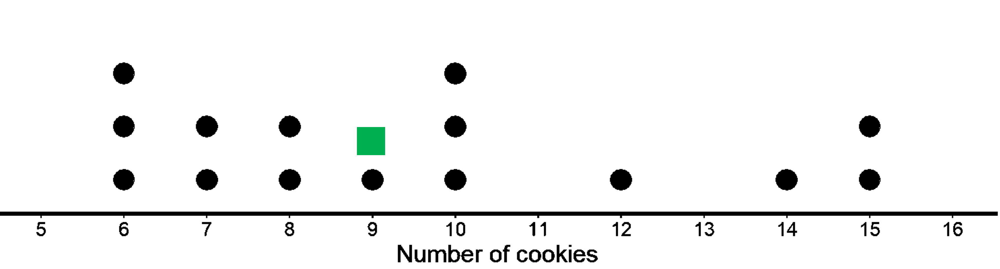
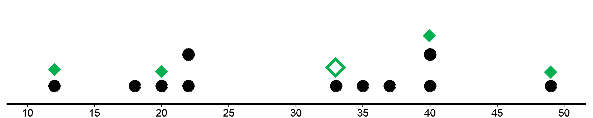
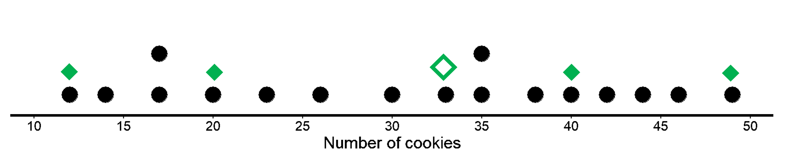
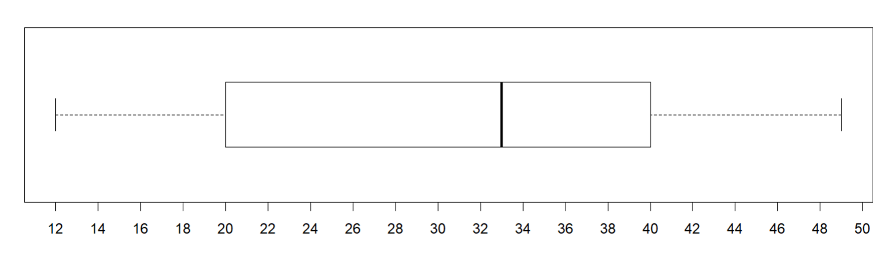
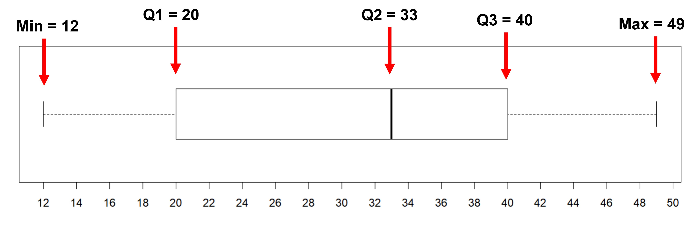
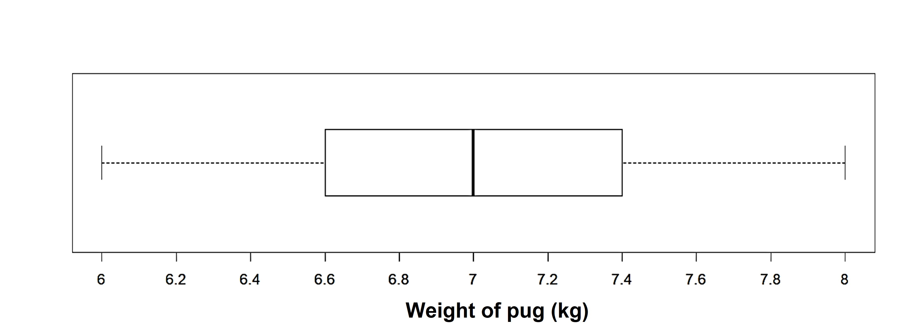
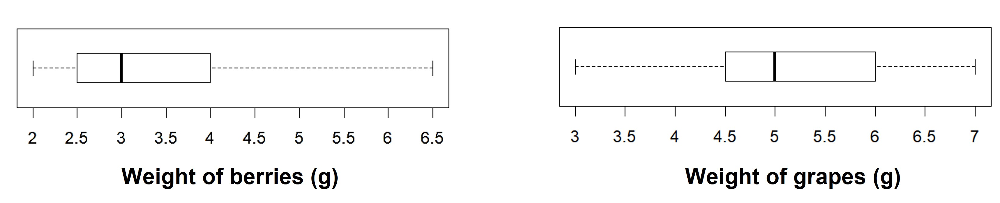
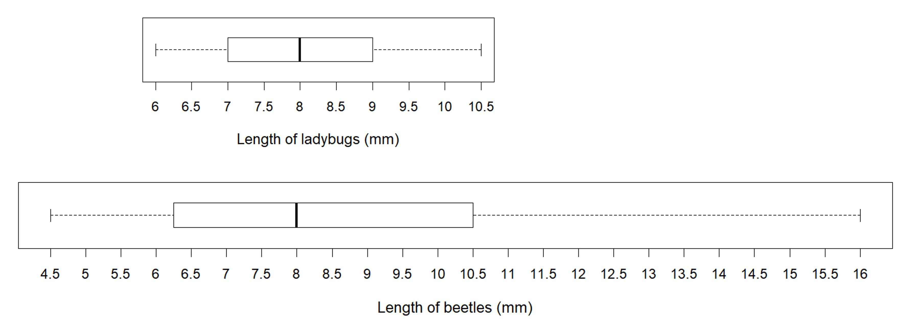

## Median as the center of distribution

In the last lessons, we learned about the mean as the center of distribution. We interpreted mean as representation of equal or fair reallocation of the total for all the data. We also saw the mean corresponds to the balance point of the distribution, i.e. the total distances of the points on the left of the mean is the same as those on the right.

You might however have noticed that in some cases, the number of points on the left of the mean was not the same as those on the right of the mean. Like in the example below where mean is 21, and there are 4 points to the left but only 2 to the right of the mean.

And you might have wondered “Shouldn’t the center of the distribution have an equal number of points on the left and right of it, since it's the ‘center’?”

Well, good news! There is another way to think about the center of a distribution, whereby we identify a value with approximately half the data on each side. This quantity is called the median (also called the 50th percentile), and it is the “middle value” when the data have been arranged in order. Half of the values in a data set are less than or equal to the median, and half of the values are greater than or equal to the median.

Great! Seems easy so far. But let’s actually try it out to make more sense of it. 

To find the median, we first need to order the data values from least to greatest. Then we find the number in the middle. Suppose we have 5 dogs whose weights, in pounds, are shown as below (already in ascending order). 

20, 25, 32, 40, 55

The median weight for this group of dogs is 32 pounds, since it is the middle value. There are three dogs that weigh less than or equal to 32 pounds and three dogs that weigh greater than or equal to 32 pounds.

Now suppose we have 6 cats whose weights, in pounds, are as shown below. Notice that there are two values in the middle this time: 7 and 8.

4, 6, 7, 8, 10, 10

So which one is the median?

In cases like these, when we have an even number of data points and there are two values in the middle, the median weight must be between 7 and 8 pounds. This is because half of the cats weigh less or equal to 7 pounds and half of the cats weigh greater than or equal to 8 pounds. In general, when we have an even number of values, we take the number exactly in between the two middle values. In this case, the median cat weight is 7.5 pounds because (7+8)/2 = 7.5.
Basically, find the mean of the two to get the median!

Let’s look at an example with more data. Below is the data for the different times taken by Eli to travel to school in 15 different days.  

6, 6, 6, 7, 7, 8, 8, 9, 10, 10, 10, 12, 14, 15, 15

They  look like they are in ascending order, so let's find the median. 

There are 15 data points, so the middle value is at the 8th position, which is 9.

In the dot plot given, you can see that there are 7 data points both to the right and to the left of the median (shown in blue).

## Interquartile range to measure variability

Earlier we learned that the mean is a measure of the center of a distribution and the MAD is a measure of the variability (or spread) that goes with the mean. There is also a measure of spread that goes with the median. This is called the interquartile range (IQR).

Finding the IQR involves splitting a data set into fourths. How do we go about doing this? Let’s look at it one step at a time using the given data. 

12	18	20	22	22	33	35	37	40	40	49

1. We first divide the whole data into half, which is done by the median.

12	18	20	22	22	**| 33 (Median) |**	35	37	40	40	49

2. We see that each side of the median now has 5 values each, these are the lower and upper halves.  We now further divide the two halves with the middle value as well.
12	18	**| 20 (First) |**	22	22	**| 33 (Median) |**	35	37	**| 40 (Third) |**	40	49

We now have four different divisions, each with 2 values and the three numbers that divide the data into the four sections. Each of the three values that splits the data into fourths is called a quartile. The first quartile (20) is Q1, the median (33) is the second quartile and also called Q2.  The third quartile (40) is Q3.

So what do these numbers/quartiles tell us?

The median is 33 and it divides the data in two halves. The first quartile is 20, which is the median of the numbers that are less than 33.  This means that a forth of the total data lies below 33 and the remaining ¾ lie above this value. The third quartile 40, which is the median of the numbers greater than 33. This means that ¾ of the data lies below this value and ¼ lie above it. 

In general, all data ranges from a minimum to a maximum value. The difference between the maximum and minimum values of a data set is the Range, which can also tell the spread of a dataset. Here, the range is 49 - 12 = 37 

Just like range, the interquartile range is a difference between two numbers in the dataset. Rather than the maximum and minimum, the difference between Q3 and Q1 is called Interquartile Range (IQR). Here, IQR is calculated as Q3 - Q1 = 40 - 20 = 20.

The distance between Q1 and Q3 includes the middle two-fourths  of the distribution (¼ + ¼), so the values between those two quartiles are sometimes called the middle half (or middle 50%) of the data. 

The IQR of 20 indicates that any data in the middle 50% of the data will differ by at most 20. The IQR provides an additional measure of variability for a distribution and is used when median is chosen as the measure of center. The bigger the IQR, the more spread out the middle half of the data values are. The smaller the IQR, the closer together the middle half of the data values are. This is why we can use the IQR as a measure of spread. 

There are several different methods for determining quartiles. For example, when n is odd, the ordered data cannot be evenly divided in half, since the single number in the middle is the median. For this lesson, we exclude the median from the lower and upper “halves” when determining the quartiles Q1 and Q3. We excluded 33 when finding Q1 and Q3 in the previous example since we have 11 values. 

So far, we have identified the minimum, first quartile, median, third quartile, and maximum of the data set. These measures together give us a “five-number summary”, which we can use to summarize a distribution. The five-number summary is great because it includes both the measure of center (median) and the measure of variability (IQR) as well as the range of the values. For the previous example, the five-number summary is 12, 20, 33, 40, and 49. These numbers are marked with diamonds on the dot plot. Median is marked as the bigger diamond. 
 

Just like how we saw that a different dataset can have the same mean, different data sets can also have the same five-number summary. 
For instance, here is another data set with the same minimum, maximum, and quartiles as the previous example, but we see that it looks different from the previous dataset.

## Box plot to represent the five number summary

While it is perfectly fine to show the five number summary in the dot plot as we have seen earlier, there is another graphical representation for this. Let’s look at it first and then understand what it represents.  We will be using the same example from before.  

Can you think where the five numbers are represented in the diagram given?
Our five number summary was 12, 20, 33, 40, and 49. Can you see any pattern that could help us distinguish these 5 numbers in the plot?

We see that the 5 vertical lines in the plot represent our five numbers. 

This is how a box plot can be used to visually represent the five-number summary of a data set. It shows the first quartile (Q1) and the third quartile (Q3) as the left and right sides of a rectangle or a box. The median (Q2) is shown as a vertical segment inside the box. On the left side, a horizontal line segment—a “whisker”—extends from Q1 to the minimum value. On the right, a whisker extends from Q3 to the maximum value. The rectangle in the middle represents the middle half of the data. We know that Q3 - Q1 is the IQR of the data. This means that the length of this box or its width is the IQR here. The whiskers represent the bottom quarter and the top quarter of the data set.

Let’s now look at a box plot for the weight of pugs. 

The five number summary for this distribution is:
Minimum -> 6
Q1 -> 6.6
Q2/Median -> 7
Q3 -> 7.4
Maximum -> 8

On the basis of the five-number summary and the box plot, what can we say about the distribution of weights of pugs?

Approximately 25% of pugs weigh between 6 and 6.6 kg.
The middle 50% of weights are between 6.6 and 7.4 kg. 
The range of the middle 50% (the difference between the third and first quartiles) or the IQR is 0.8 kg. ​​The IQR indicates that any two weights from the middle 50% of the data will differ by at most 0.8 minutes. 

We can also use the box plot to compare different groups. 

Case I: Two groups with the different median but the same IQR

Here are two sets of plots that show the weights of some berries and some grapes. 

The median berry weight is 3 grams and the median grape weight is 5 grams. But in both cases, the IQR is 1.5 grams. Because the grapes in this group have a higher median weight than the berries, we can say a grape in the group is typically heavier than a berry. Since both groups have the same IQR, we can say that they have a similar variability in their weights.

In the case of berries, we can see that the middle rectangle is more to the left, meaning that the data is right skewed. In the case of the grapes, it seems to be slightly left skewed. 

Case II: Two groups with the same median but different IQR

These box plots represent the length data for a collection of ladybugs and a collection of beetles. The medians of the two are the same, but the IQR of the ladybugs is much smaller (2 vs 11.5 for beetles). This tells us that a typical ladybug length is similar to a typical beetle length, but the ladybugs are more alike in their length than the beetles are in their length.
 