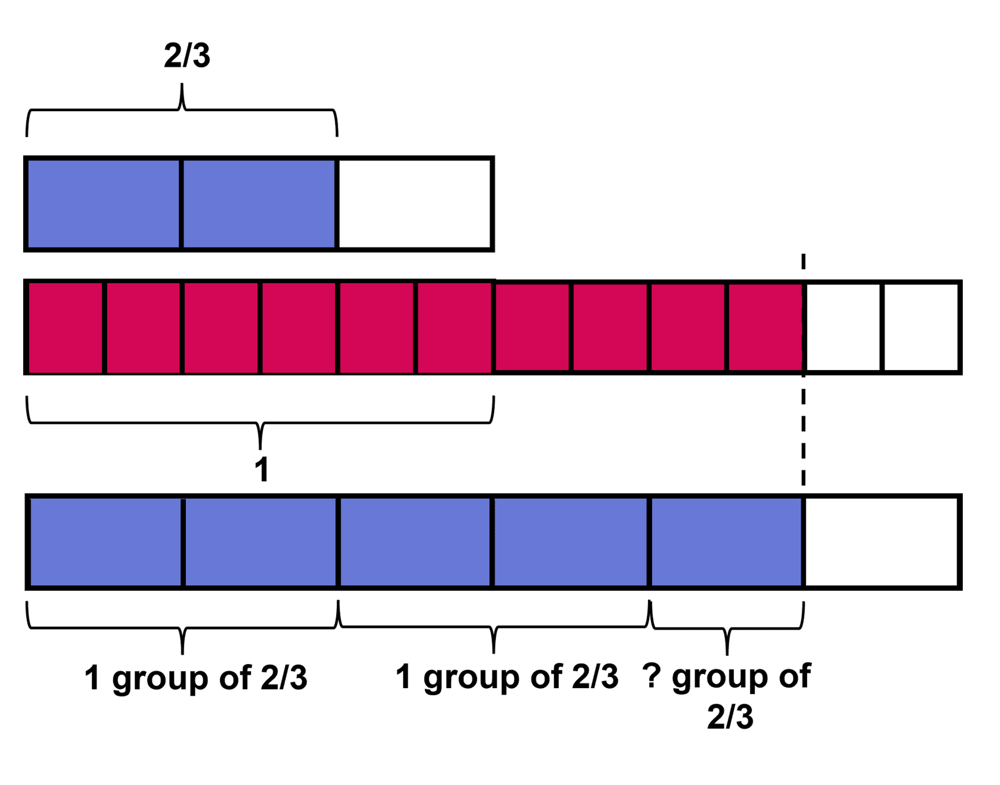

## Dividing by fraction

### Dividing a Fraction by Fraction

We will now talk about the division of a fraction by a fraction. Just like always, we will start by dividing whole numbers. 
A stack of books is 72 inches tall. Each book is 2 inches thick. Which expression tells us how many books are in the stack?  
We know the height of the stack. There are a certain number of books in the stack, but we do not know how many. We are given the thickness of each book, which is 2 inches. We need to divide to get the number of books. If you are confused, what should be the divisor and the dividend, 2 ÷ 72 does not make sense. It is obvious that there is more than 1 book in the book stack. The expression 72 ÷ 2 gives the number of books in the stack. It answers the question, "How many 2 inches fit in 72 inches?" 

 
Another stack of books is 43 inches tall. Each book is 1/2 inch thick. Which expression represents the number of books in the stack?  

Like in the previous situation, we are given the height of the stack of books as well as the thickness of each book. We can always use the multiplication equation at first to represent the given situation, as we are already used to with it. ? X 1/2 = 43 The division equation for the situation is; 43 ÷ 1/2 = ? The expression 43 ÷ 1/2 gives the number of books in the stack. It answers the question, "How many 1/2 inches fit in 43 inches?" 

If the thickness of each book was 2 inches here, would we need more books or fewer books to create a stack 43 inches tall? Think about it. It takes a thinner object and less number of thicker objects to reach the same height. So, it takes more number of 1/2 inch thick books to make a stack of 43 inches than 2-inch thick books. In general terms, we can say that, the greater the divisor, the smaller the quotient. And the smaller the divisor, the greater the quotient.   
We will now use the same concept in the division of a fraction by any fraction. It is not any different than the above two cases.  
How many 2/3 fit in 10/6?   
The multiplication equation for this is; ? X 2/3 = 10/6 ? Writing this as the division equation, we get; 10/6 ÷ 2/3 = ? 

From the block diagram, we can see that 5/2 number of 2/3s fit in the given size.   
Let's recall the equation; the number of parts x size of each part = total amount. 
In the above example, 5/2 (which can also be written as 2 1/2)  is the number of parts, 2/3 is the size of each part and 10/6 is the total amount. We need to understand division simply as a way of finding one of the missing factors, either the number of parts or the size of each part. Sometimes, we may even be asked to find out the total amount. All of this is based on the context, what information we are given and what are we required to calculate. We will be looking at all types of these questions below.  
In the previous sections, we have already shown that; a/b ÷ c can be written as a/b x 1/c, and a ÷ b/c can be written as a x c/b both numerically and diagrammatically. Likewise, a/b ÷ c/d can be written as a/b x d/c.