## Finding Fraction of a Quantity: An Introduction

Let's look at the previous question again. Lin and Han ran a 3 km relay race as a team. They each ran the same distance. This means that they each ran half of the 3 km. We already know what that means in terms of division; 3 divided by 2, with each person running 3/2  km. 
Another way of thinking of this is looking at the line "This means that they each ran half of the 3 km." How can we write this numerically? Half of 3 km = 1/2 of 3 km, which is the same as 1/2 x 3 . In this case, the fraction seems to be the operator, rather than the whole number. We are not taking 3 copies of 1/2 , rather we are taking half of 3, meaning we divided 3 into two parts and take one part.  
Let's take an example of whole numbers to understand this better. When we think of taking 2 groups of 3 apples, we think of this as multiplication, so 2 groups of 3 apples are 2 x 3 = 6 apples. We repeat 3 two times. Now, similarly, if we think of 1/2 of 3 miles, this can easily be thought of as taking a fraction of a whole or multiplying a fraction by a whole number, giving us 1/2 x 3. That means 3 has to be repeated half or 1/2 times. That is 3 has to be halved. The answer is simply 3/2 since 1/2 x 3 is the same as 3 x 1/2 . We will see more of this in the further question and understand this visually as well.   
Going back to the previous question of Lin and Han, which diagram do you think best describes taking half of 3?  

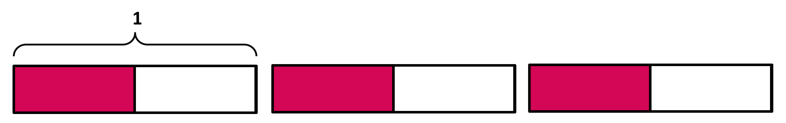

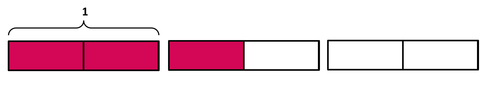

Both diagrams seem to be giving the same final amount. But when we think of taking half of 3, then Image B makes more sense. Image A explains the context of 3 x 1/2 better.   
Image B can also be thought of as 3 divided by 2, which is 3/2 . A division question can thus be rearranged and thought of as a multiplication problem. In such a case where the fraction is multiplied by the whole number (1/b x a), we can think of the fraction as the operator and the whole number as the quantity that is being operated on. 1/2 x 3 means 3 is being halved. 
Look at the diagram below.  

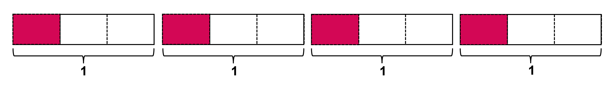

What expression do you think it shows? 
(i) Does it show 4 ÷ 3? How? It shows 4 ÷ 3 because there are 4 whole squares divided into 3 equal parts each with 1 of those parts shaded. 
(ii) Does it show 4/3? How? It also shows 4/3 as there are 4 pieces shaded and each is 1/3 of a unit rectangle. 
(iii) Does it show 4 x 1/3? How? It shows the multiplication expression 4 x 1/3 because there are 4 groups of 1/3 shaded.  
(iv) Does it show 1/3 x 4? How?  It shows the multiplication expression 1/3 x 4 since there is a total of 4, and 1/3 of the whole 4 is shaded.  
The different expressions all define one image, but we use the appropriate expression as the context demands, which we will be practicing all along. For now, let us focus on the multiplication expression of the form 1/b x a. As we have already started exploring, 1/b x a means taking a fraction of a whole number, where the fraction acts as the operator and affects the whole number quantity. Keep this in mind while solving problems ahead.  

## Finding Fraction of a Quantity

Let's recall the idea of expressing multiplication as finding the area of a rectangle with one side as a fraction and the other as a whole number. If we take an example of 1/2 x 4, we can first take a rectangle of one side as 4 and one side as 1. The area of this whole rectangle is 1 x 4 = 4. But since we need 1/2 x 4, it can be expressed as follows:

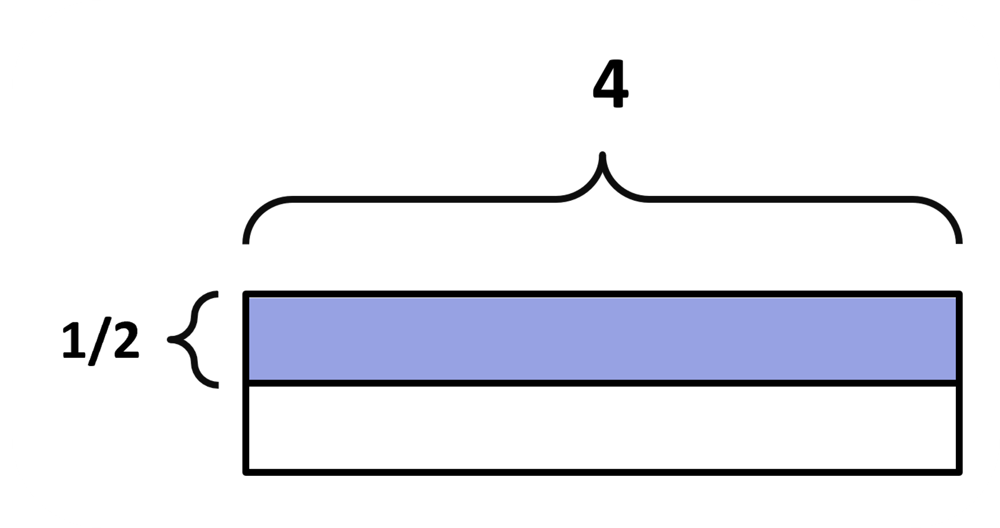

In this case, the side with length 1 has been divided into two parts and one part is shaded. The shaded portion can be written as 1/2 x 4, which is the area we need. This diagram doesn't quite help us in finding the answer.   
For that, we will look at another example. Can you find the area of the shaded region? 

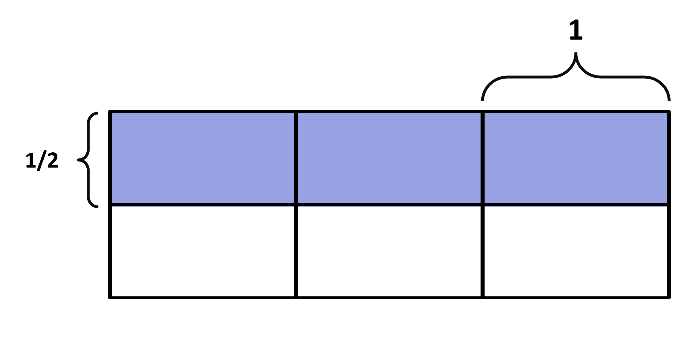

We see that half of the whole image is shaded. This already gives us the breadth. The length is three blocks each of size 1, so we have 1/2 x 3 as our area. Here, the whole 3 has been divided into smaller parts, each part being 1 whole. Everything else is the same as before. Now, we count the number of shaded parts -> 3.   
3 out of how many are shaded? Out of 6. Will our answer be 3/6 ? 3/6 is less than a whole but our shaded portions definitely make more than a whole. So, 3/6 is incorrect. This is because the denominator has to be the number of parts that makes the whole or the one, rather than 3. So, we will get 3/2 , since one whole is divided into 2 parts. 3/2 is more than 1, so it is correct. So, we can find the answer by simply counting the shaded parts as the numerator and the denominator will be the number of parts that make up the whole.  

The same can be done for fractions other than unit fractions multiplying whole numbers as well, the difference being that we take more than one part (based on the numerator of the fraction, if we have 2/3 , we divide the part of length 1 into 3 parts and take 2 parts).    

Numerically, we can find the answer by finding the product of the numerator and the whole number and keeping the denominator the same. a/b x n = (a x n)/b . This is the same as n x a/b since they are commutative, even if the context of the two is different. We have found the value of the expression through a block where one side is the whole number and the other side is divided based on the fraction operator. Finding the area gives us the product of the expression. This idea of the area of a rectangle model will help us further when we multiply a whole number by a fraction (fraction as operator) as well as when we multiply a fraction by another fraction.   

Just like with multiplying a proper fraction with a whole number, the same is done for the multiplication of improper fractions and whole to get our product. It is easier to understand this by taking the whole number as the operator, so keep that in mind. 
Look at the given image. Each small box (made using block lines) has a length and a breadth of 1. There are 4 of those lengthwise and 3 of these breadth-wise, giving us a rectangle of length 4 and breadth 3. we see that the whole figure is divided lengthwise into 16 divisions, with each length having 4 divisions. This means that 4 parts make a whole. Can you decide which statements can be correct for this image? 

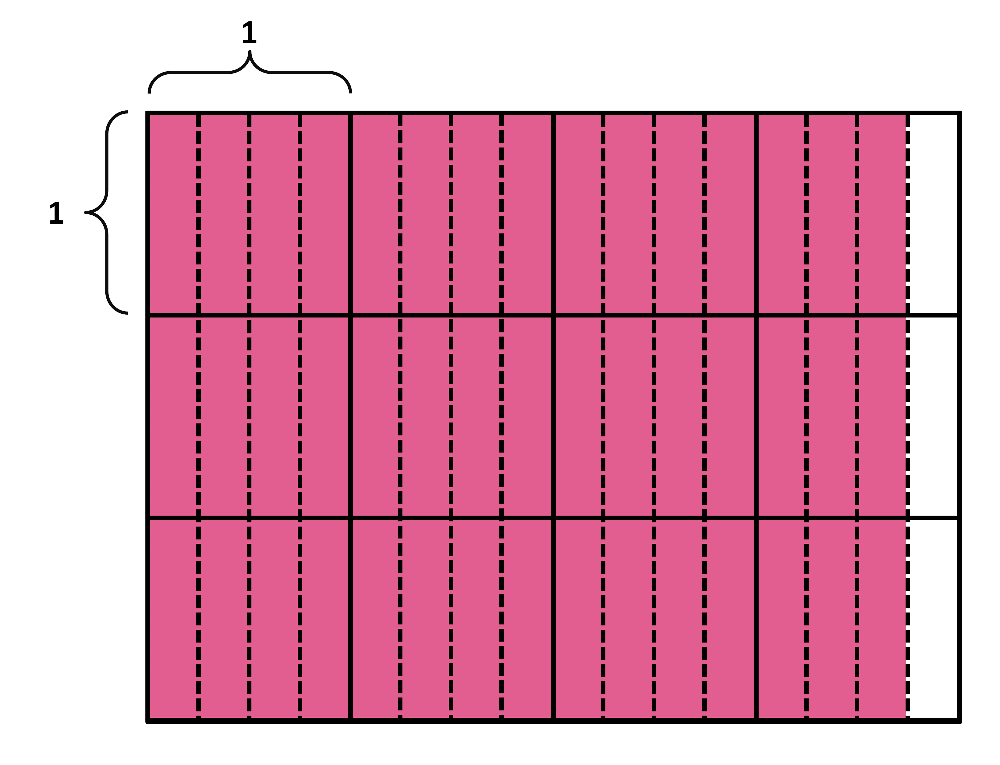

Look at each row first. We have 15 shaded portions where 4 parts make a whole, so we have 15/4 for the first row. We have 3 such rows, so the expression is 3 x 15/4 . The area of the shaded portion is 3 times 15/4 . 
Using this same idea, we can think of 15 as 3 3/4 which is taken 3 times. The area of the shaded portion is 3 times 3 3/4 .   
The answer for the multiplication of 15/4 x 3 is (15 x 3)/4  = 45/4. We multiply numerators and keep the denominator the same. If the same expression is in the form of a mixed fraction, we have 3 3/4 .   
One way is to simply write it as an improper fraction. But another way is to use the distributive property! Keep in mind that (a + b) x c = a x c + b x c.  
When we think of a mixed number 3 3/4 , we can write it as 3 + 3/4 . So our expression from before, 3 x ( 3 + 3/4) can be operated on using the distributive property. We get 3 x 3/4 + 3 x 3. We can then easily solve this to get 9/4 + 9 = 45/4 .    
In the image as well, we can only take 3 whole columns and multiply that with the 3 rows for the second part of 3 x 3/4 + 3 x 3 (shown in grey). We have the fractional part 3/4 for each row. For three rows, we have 3 x 3/4 (purple). Adding the two gives us the final area! 

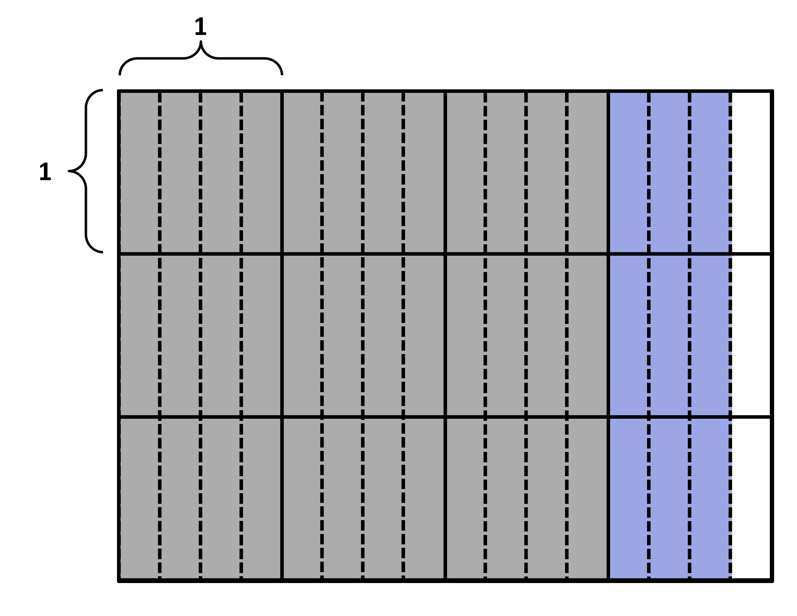

## Finding Fraction of a Fractional Quantity

We have yet to deal with multiplication problems where both factors are fractions. They seem completely different from what we have learned before, but it is the same as when we multiply a whole number by a fraction operation. Like whole number are measurements or quantities, so are fractions. So, we simply need to use the fraction as operator in the same way as we did for when we had fraction x whole number multiplication. We will start simple and go in a step wise manner. Let us look at the given example. 
Amanda has half a pan of cake leftover from a family gathering. How much cake is left? Look at the block diagrams below. 

Images A, B and D all correctly represent the amount of the remaining cake, that is, half of the pan.  
Image C shows two parts, one shaded and one not shaded, but they are not equal. The shaded portion does not represent half the pan of the cake, so this diagram is incorrect for the given situation.  
If she eats a third of that, how much did she eat? Look at the block diagrams below. Which of them represent the amount of the pan of cake she has eaten?  

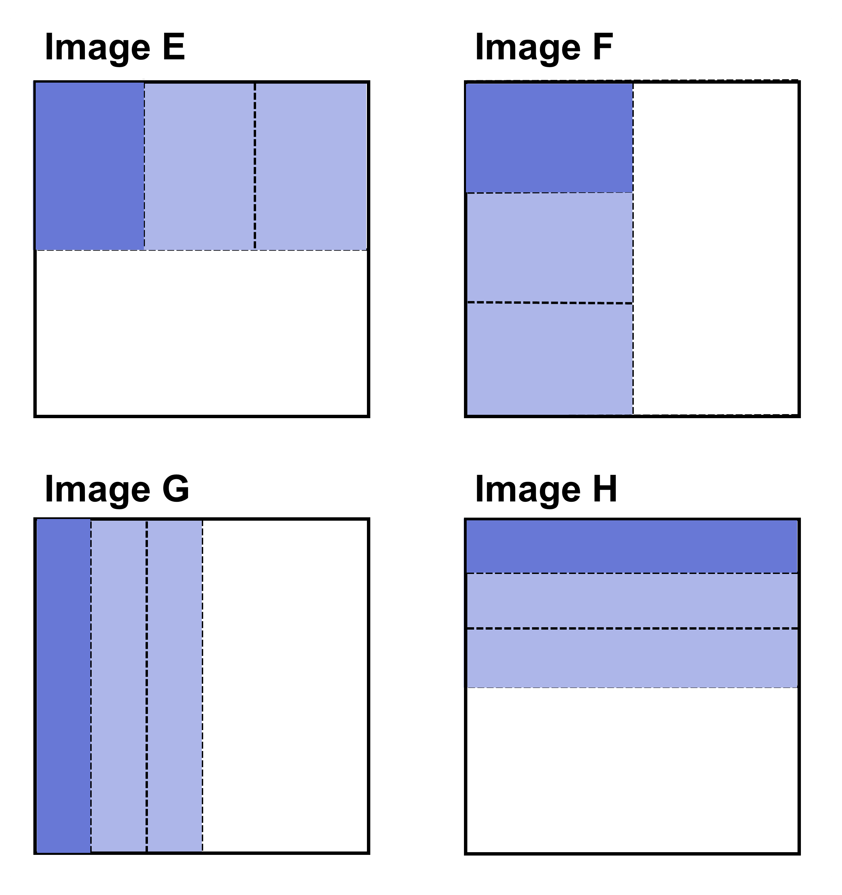 

They all show the full pan cut in half. Then they show a half cut into 3 equal pieces and one of those pieces is shaded. In Images F and H, the pan is cut in half horizontally and in the other two, it is cut in half vertically. The cuts into 3 equal pieces are also sometimes horizontal and sometimes vertical. Nonetheless, all of them represent the amount of cake she has eaten, that is, a third of half (1/3 of 1/2) of the pan of cake.   
By just looking at the diagram, can you now find out how much of the pan of cake had she eaten?  

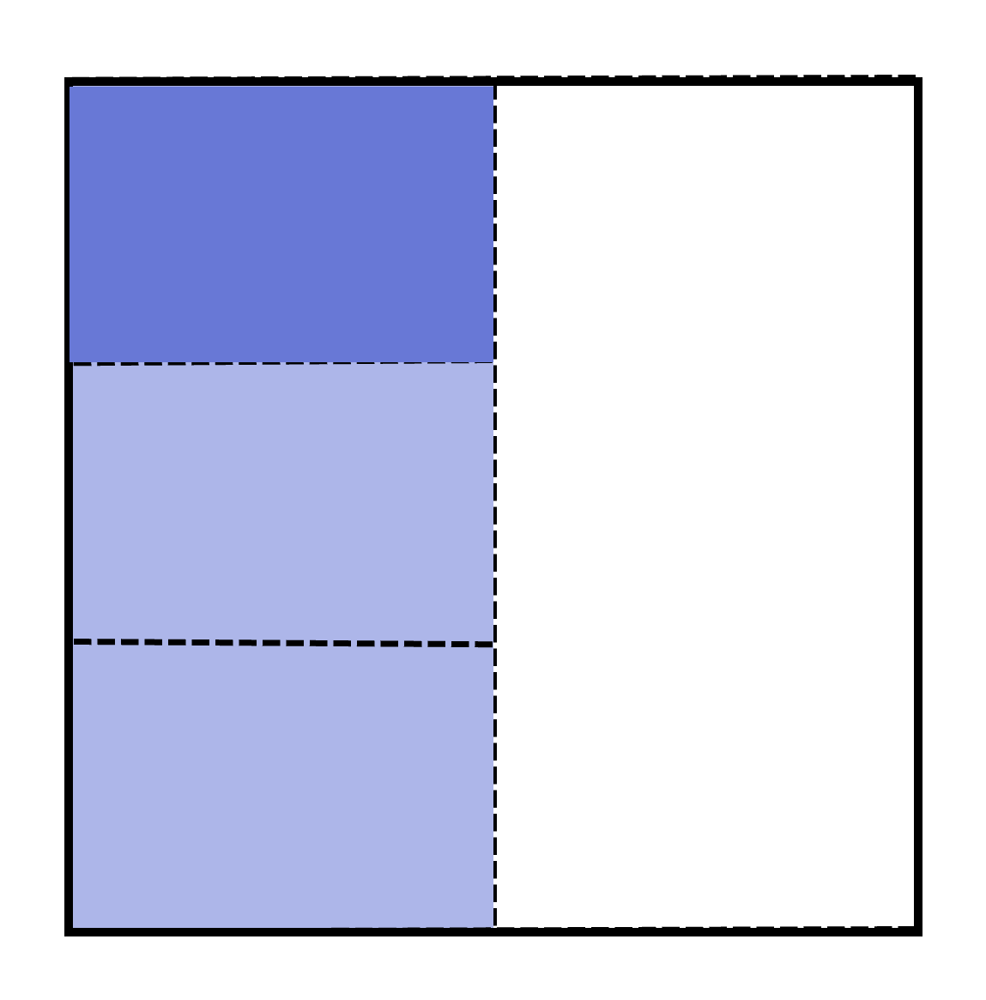

Looking at the above image, you may be tempted to say that the amount of the pan of cake she had eaten was 1/4, as there are 4 partitions shown. But you can easily see that they are not equal portions.   

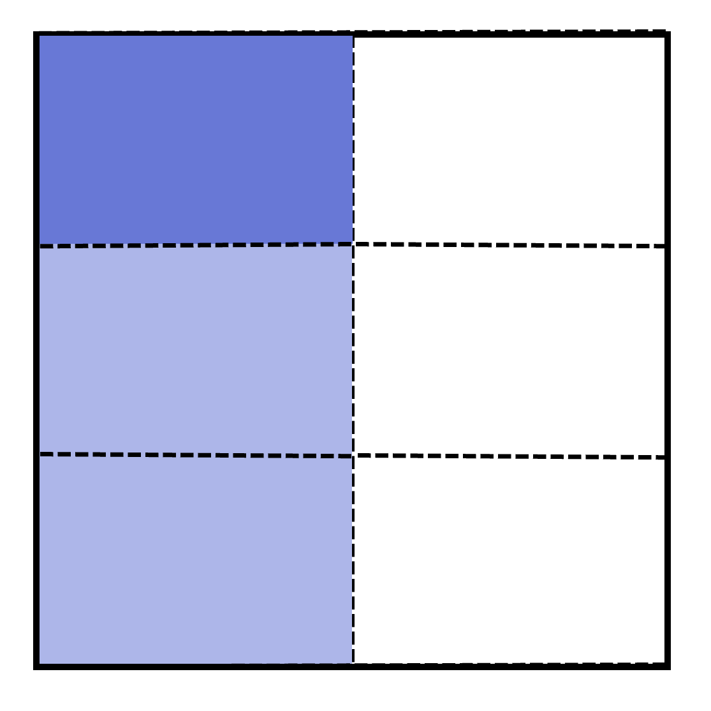

Amanda ate 1/3 of the remaining pan of cake. If we extend the partitions (denoting the thirds) to the whole pan as above, you can easily count that she had eaten 1/6 of the pan of the cake.  
If Amanda ate 2/3 of the half of the pan of cake, the image would be as follows:   

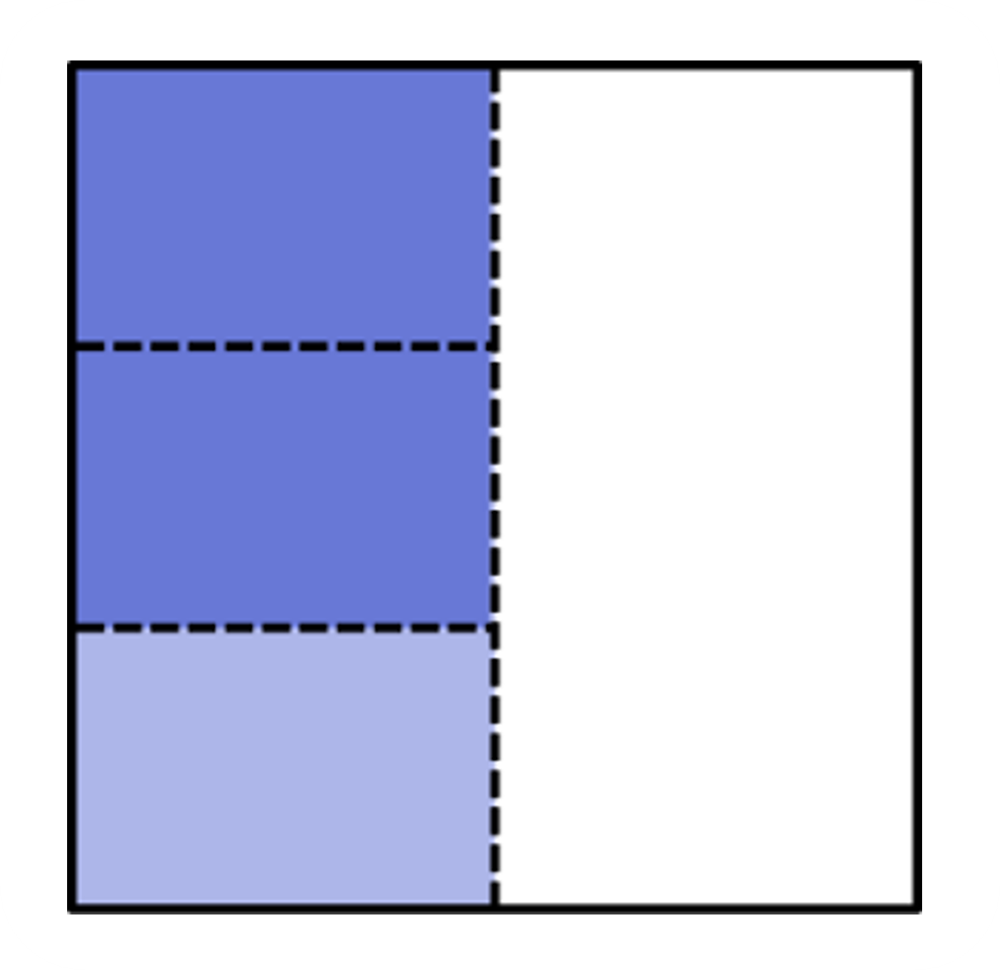

We simply take 2 parts out of the three. Out of the whole, it tells us that 2/6 have been eaten. What we did was take 2/3 of 1/2 , which is equal to 2/3 x 1/2 . Our answer was 2/6, when we can get by multiplying the numerator to numerator and denominator to denominator.   
2/3 x 1/2 = (2 x 1)/(3 x 2) = 2/6   
When we multiply fractions; a/b x c/d, we get (a x b)/(c x d) = (ab)/(cd). We can multiply in this manner to find the value of any multiplication expression without always using a diagram. This method works because when we multiply the numerators, we get the number of pieces that are shaded in and when we multiply the denominators, we get the size of each of these pieces.

## Using Multiplication to Scale Quantities

We will now move on to an alternative method of solving and understanding multiplication; multiplication as scaling. 
Let's take an example to understand this. We have a block of size 6 below. What does multiplying by 2/5 give us? First, let's divide the block into 5 equal parts. Then the size of each part has to be 6/5 (since 6 ÷ 5 gives 6/5 as the size of one part). Now we have the numerator 2 left. This means we need to take 2 of these parts, giving us 2 x 6/5 or 12/5 .   

What we have done is first, divide the quantity by the denominator and find the size of each part, then multiply by the numerator to get the total number of such parts, thus giving us the answer. This method of understanding multiplication is helpful even when we multiply two fractions. The same process applies. 

Furthermore, this method aligns with the idea of multiplication as scaling, rather than repeated addition, which is considered a better way to understand multiplication.   
We will look at the idea of scaling further with the three examples below. While the idea is the same as above, the process is slightly different. This also helps us estimate whether our new quantity is greater or less than the quantity that we operate on.  
There is a building measuring 10 m. You need to build a new building and are deciding the new height compared to the 10 m building. Can you tell which of the following options will give the highest and smallest product (building height): 5/5 x 10, 3/5 x 10, or 7/5 x 10?   
In all cases, the size 10 is being operated on.   

1. Finding 5/5 x 10:   
    1. First, we 'scale down' 10 by 5. It is similar to dividing 10 into 5 parts and taking one part, but we simply decrease the size by 5. We see this below: 
    
    

    2. This new size is 10/5 . We now have to 'scale up' by multiplying it by the numerator, 5. We can see this below: 

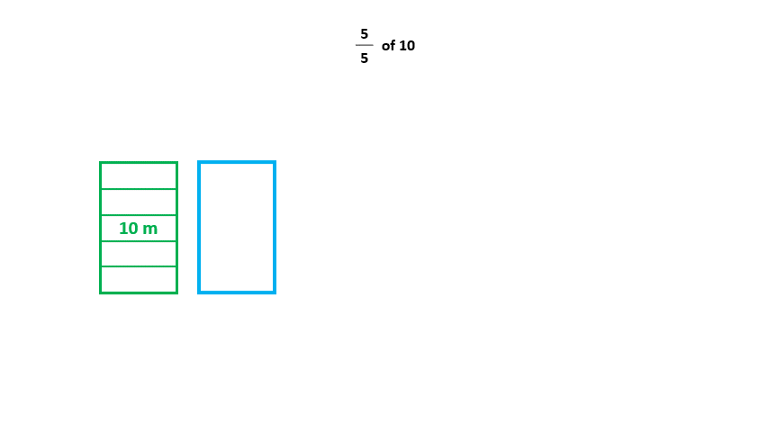

This gives us 10/5 x 5 , which is equal to 50/5 = 10 This shows us that 10 is scaled down to 5 and then scaled up to 5, meaning there is no change. This makes sense because multiplying by 5/5 means multiplying by 1, which gives us the same number.   
This is also consistent with the idea of equivalence, where n/n x a/b = (n x a)/(n x b) = a/b.   
The same idea is applied to find the other two expressions as well: 

2. Finding 3/5 x 10:  

    1. First, we 'scale down' 10 by 5. It is similar to dividing 10 into 5 parts and taking one part, but here we simply decrease the size by 5. 

    2.  This new size is 10/5 . We now have to 'scale up' by multiplying it by the numerator, 3. We can see the whole process below:   

 

We first have 10/5 , which is then multiplied by 3, giving us 10/5 x 3 = 30/5 = 6.  
You can check this using the multiplication method: 3/5 x 10 = 3x 10/5 = 30/5 = 6. You get the same answer! In this case, we see that we first scale down by 5 but only scale up 3, which makes it obvious that the new quantity will be less than 10.   

We should already be familiar with the idea that multiplying any quantity by a fraction smaller than 1 gives a value smaller than the quantity (here, 10). So, the idea of scaling is consistent with this. 

3. Finally, do the same for 7/5 x 10. 3. First, we 'scale down' 10 by 5. It is similar to dividing 10 into 5 parts and taking one part, but here we simply decrease the size by 5. This new size is 10/5. We now have to 'scale up' by multiplying it by the numerator, 7. We can see the whole process below:   

 
We first have 10/5, which is then multiplied by 7, giving us 10/5 x 7 = 70/5 = 1.  
In this case, it should be clear that the answer will be greater than 10 without any calculation. We first scale down by 5 but scale up by 7, which makes it obvious that the new quantity will be more than 10. We should already be familiar with the idea that multiplying any quantity by a fraction greater than 1 gives a value greater than the quantity (here, 10).  
7/5 is an improper fraction greater than 1. So, the idea of scaling is consistent with this as well. Just like with whole numbers, fraction scaling works with fraction values as well. We will see examples of this in the coming questions.