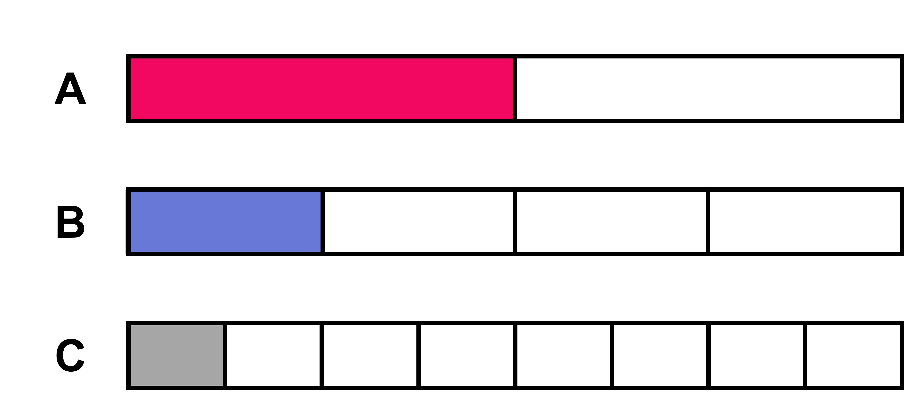
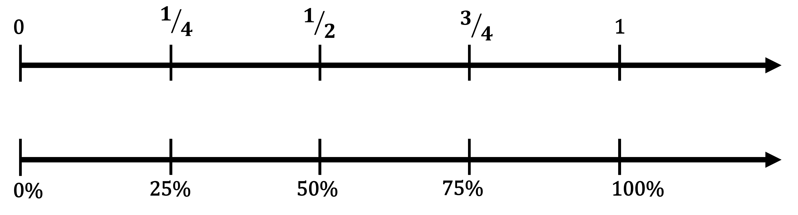
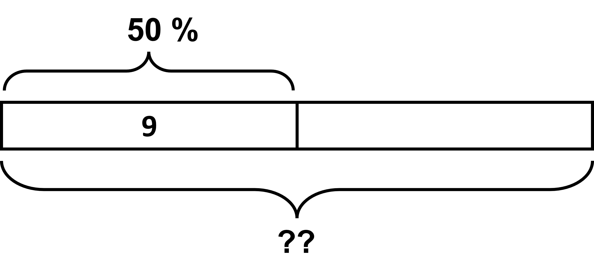
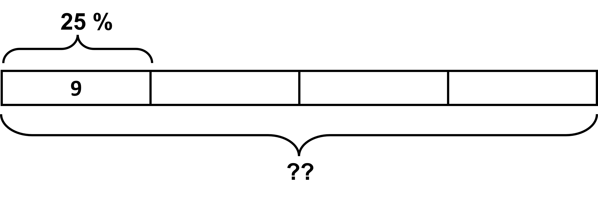
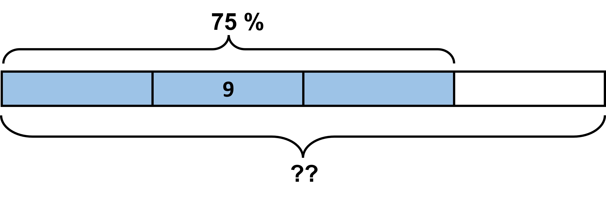
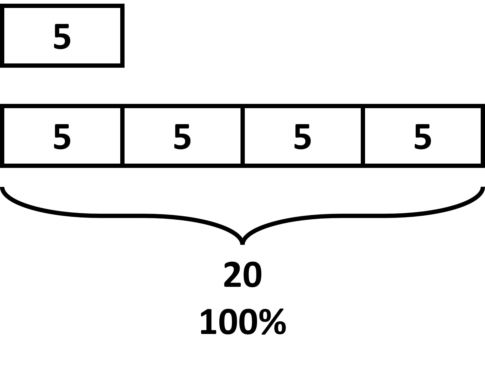
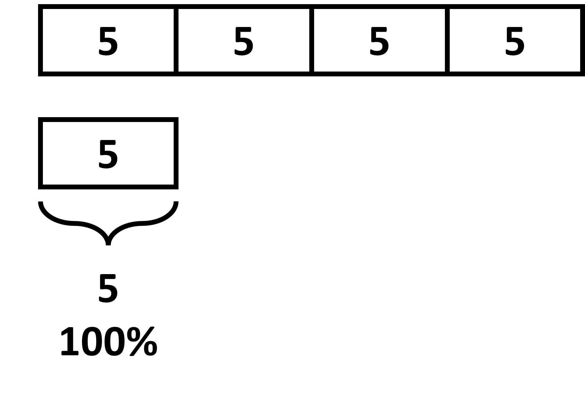

## What are benchmark percentages? ????!!!!!

TESTING

Let’s go back to fractions for a little bit here. When talking about fractions and in the process of getting more familiar with the topic, we got used to the idea of ½ being half, ¼ being quarter, etc. These were benchmark fractions that helped us compare others as well as easily solve questions. 

For example, ½ of 10 can be easily thought of as 5, since ½ of 10 means half of 10. 

We will now find such percentages as well. They are sure to make solving problems much easier, hence making our lives easier!

Look at the images given below. 

In the three cases, how much of the whole block is shaded? 

Block A has a half shaded, block B has a quarter shaded, and block C has eighth part shaded. 

We know that the whole also means 100%. So, what do you think are the percentages shaded in each case? 

Half of 100% is 50%, quarter of 100% is 25%, and an eighth of 100% is 12.5%.

Combining the two ideas, we can now use these percentages as benchmarks as well! If you are being asked to find the 50% of 300, you should know instinctively that it means half of 300, which is 150. Similarly, 25% of 20 means a quarter, giving us 20/4 = 5!

12.5% is not a commonly used benchmark, but you can obviously still use it to find eights of some quantity. 

Common benchmarks:

Let’s use a double number line to mark some common benchmarks and use it to solve some percent problems. We know that 100% is the whole, so we equate it to 1 or unit. 

25%, 50%, and 75% are the most commonly used benchmarks, since they are easy to understand and compare with. Keep in mind the fractions that align with these percentages. 

1. 25% and ¼ align, meaning that 25% of anything is a quarter of that value. So, 25% of a number will always be 1/4 of that number.
For example, 25% of 40 liters is a quarter of 40 liters, or ¼ x 40, which gives us 10 liters.

1. 50% and 1/2 align, meaning that 50% of anything is half of that value. So, 50% of a number will always be 1/2 of that number.
For example, 50% of 82 kilometers is half of 82 kilometers, or ½ x 82, which gives us 41 kilometers.

2. 75% and ¾ align, meaning that 75% of anything is three-quarters of that value. So, 75% of a number will always be 3/4 of that number.
For example, 75% of 12 pounds is three quarters of 12 pounds, or ¾ x 12. Which gives us 9 pounds.

We now know how to easily solve questions that ask us to find 50% of some value.
Let’s see if we can use benchmarks to find answers to questions such as “9 is 50% of what number?”. Basically, we know that 50% of some value is 9, and using this, we need to find what the 100% is! Easy enough to do. Let’s start.

9 is 50% of what number? If 50% of some value is 9, we can make a tape diagram as such:

We see that if 50% is 9, then 100% will be double of 9, 18! This was easy since we know that 50% is half of 100%!

Let’s try out a few more.

If 25% of some value is 9, what is the total value/100%?

Let’s make a diagram for this one. 

If 25% equals 9, 100% has to equal 4 x 9 = 36!

What about if we said that 9 equals 75% of some value? What would be 100% now?

This is slightly different from the cases before. 75% is three-fourths of 100%. In order to find the 100%, we can divide the value by 3 to get the one-fourth value and then multiply by 4 to get the complete (1) value. 

75% divided by 3 gives us 25%, which then multiplied by 4 gives us 100%. Applying the same to the value 9, we get 9/3 = 3, and 3 x 4 = 12.

So, 100% here is 12! 

Let’s now look at  how to solve such probelms with the help of benchmarks.

5 is what percentage of 20? 

To know the percent, first, what is the relation between 5 and 20? 

We see that 5 is one fourth of 20, which is the whole or the 100% here. This means 5 is also one fourth of 100%, giving us 25%. 

What about the opposite? 20 is what percentage of 5?

This time, we need to compare 20 with respect to 5. 20 is four times the value of 5, meaning we need to find four times the value of 100% as well, which is 400%. So, 400% of 5 is 20.  

Do not worry if you don’t get it in your first try. You will get better with more practice and familiarity. 