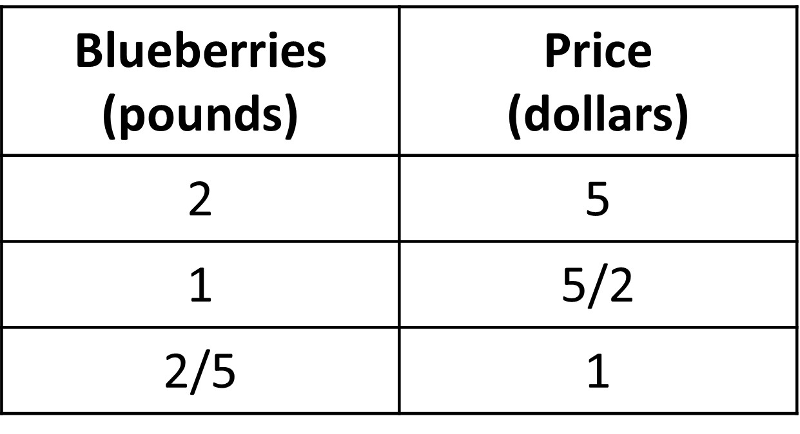
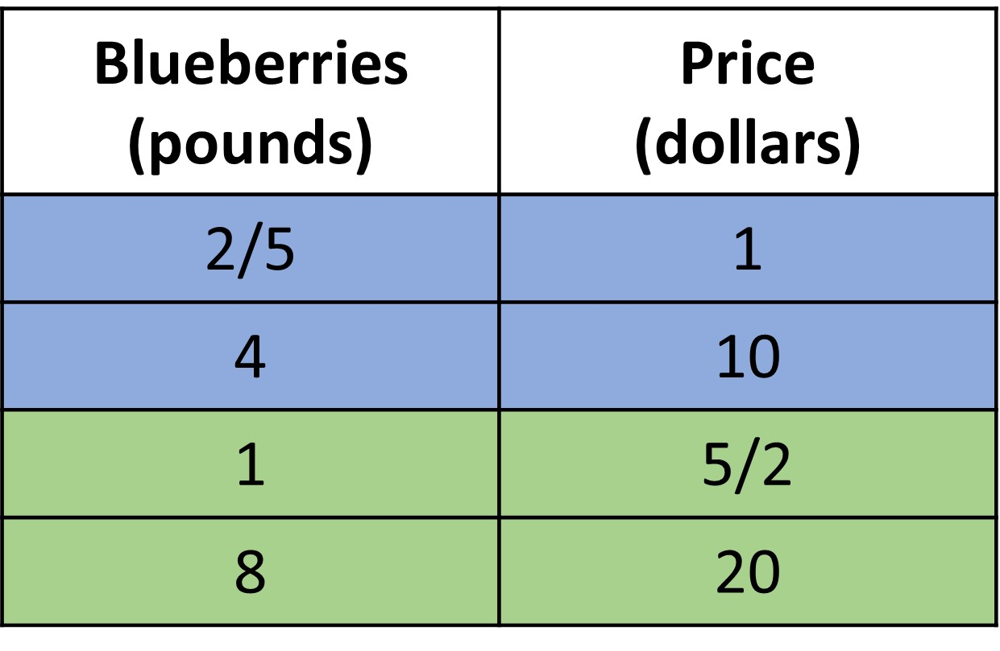
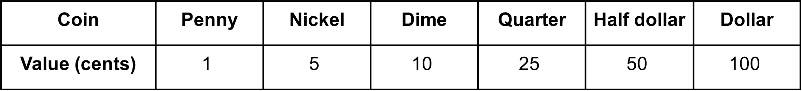
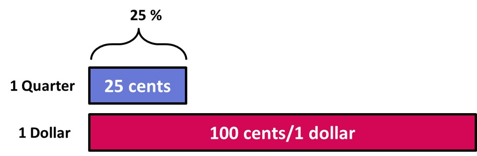

## Unit rates

Before getting into percentages, let’s refresh our learning of unit rates from ratios. 
Let’s start with a simple example concerning price.

Suppose a farm lets us pick 2 pounds of blueberries for 5 dollars. Using this information, we can find two different pieces of information when we consider unit rates. 
+ We can get the price of one pound of strawberries
+ We can get the amount of strawberries we get for 1 dollar.

The “cost per pound” and the “number of pounds per dollar” are the two unit rates for this situation. A ‘unit rate’ tells us how much of one quantity for 1 of the other quantity. Each of these numbers has its use depending on the context or what we are being asked. 
We can see all the information in tabular form as shown. 

Notice how the two unit rates are reciprocals of each other. This could come in handy when we need to find the one from the other. 
The different ways we can use the units rates is as given:

1. If we want to find out how much 8 pounds of blueberries will cost, it helps to know how much 1 pound of blueberries will cost.
2. If we want to find out how many pounds we can buy for 10 dollars, it helps to know how many pounds we can buy for 1 dollar.

Like said before,  the unit rate that is useful depends on what question we want to answer, so be ready to find either one!
The reason we are refreshing this idea is to get familiar with the idea of ‘per one’ so it gets easier to move onto the idea of ‘per 100’, which is what percentage is. 

## Introduction to Percentage

We have grown familiar with ratios and how to find unit rates. Now, let's look at an example that will help us understand the concept of percentage.

Given is a table with different types of coins. We know each of their values. Write them in terms of how much they are valued in cents. 

We can easily find the ratios of penny to dollar, nickel to dollar, dime to dollar, half dollar to dollar as well as dollar to dollar (all values in terms of cents). 
We get 1:100, 5:100, 10:100, 25:100, 50:100 and finally 100:100. 
We could find the unit rates for each of these, “how much is a penny, nickel, dime, quarter, half dollar, dollar for 1 dollar or vice versa?”

But, one other thing we can do is find the penny or nickel (and so on..) for each 100 cents OR 1 dollar. This rate per 100 is called percentage/percent.
The name comes from ‘per cent’ or ‘per 100’, and that is what it actually is!

So, what we get is 1 cent for every 100 cents, which can be written as 1%. This is read as 1 percent. This means that for every 100 cents, the value of 1 penny is 1 percent (1%) since there is 1 penny for every 100 cents. 

Rephrasing, the value of a penny is 1 percent (1%) of a dollar because there is 1 penny for every 100 cents or 1 dollar. 

Similarly, the value of a quarter is 25% of the value of a dollar (100 cents) because there are 25 cents for every 100 cents.

Given is the list of the coin that matches each percent expression. 

+ 25% of a dollar - quarter
+ 5% of a dollar - nickel
+ 1% of a dollar - penny
+ 100% of a dollar - dollar
+ 10% of a dollar - dime
+ 50% of a dollar - half dollar

Look at the fourth point -> 100% of a dollar = dollar

This seems strange, but the value of a dollar will be 100% of the value of a dollar (of itself) because there are obviously 100 cents for every 100 cents. 

This also helps us understand the idea of whole in this case. In the case of unit rates, one of the values was taken as 1, meaning, when value 2 is unit or whole, what is its corresponding value 1? In the case of percent, what is value 1 when the corresponding value 2 is 100?

Thinking of 100 as the whole makes it easier when we are given any percent since we can easily assume how much the value is in terms of 100.

Look at the image below to better understand percents. We have a tape for 100 cents/1 dollar and another one for 25 cents. 25 cents or a quarter is 25% of the whole (1 dollar/100 cents).

We can use this idea to now find the percent of other number of cents (like we used the unit rate to find other missing values).

Question: The value of 6 dimes is what percent of the value of a dollar?
If 1 dime is 10 % of a dollar, then 6 dimes are 10 x 6 % of a dollar - 60 %. Check this using values of dimes in cents. 6 dimes is 10 x 6 = 60 cents. 60 cents out of 100 cents is 60% of a dollar!

Let’s try out one more.

The value of 6 quarters is what percent of the value of a dollar?
We know that 1 quarter is 25 % of a dollar, so 6 quarters will be 6 x 25% = 150 % of a dollar. How is this possible though? This simply means that 6 quarters is more than 1 dollar, which is true! 6 quarters is 150 cents. So, 150 for every 100 cents is 150 % of 100 cents/1 dollar!

