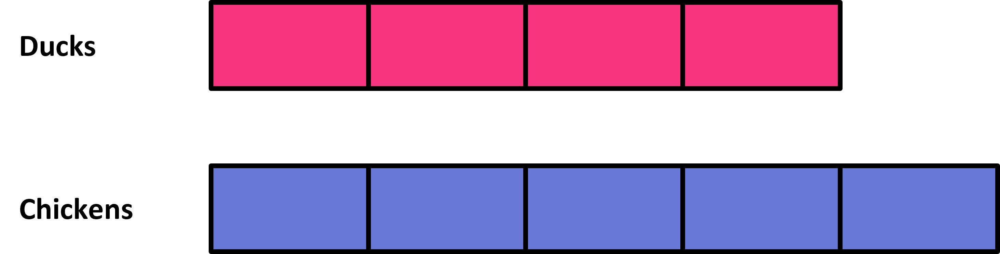
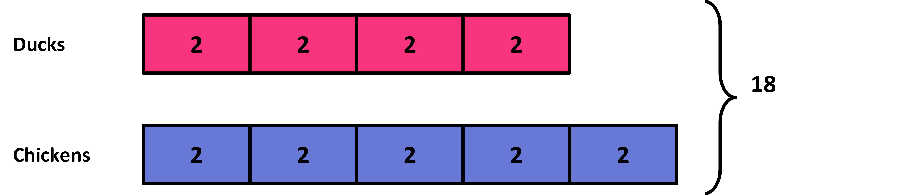

## Generalizing ratios: Part to part and part to whole

With the questions we have done, we are already familiar with quantities of a ratio having physical units like cups, spoons, meters, etc. We will now look at ratios where “parts” are used. For example: Recipe for lemonade calls for 3 parts lemon juice with 2 parts water. The ‘parts’ could be spoons, cups, buckets, anything. Ratio will be the same as long as the parts described are the same. These parts make up the whole quantity.

We can use tape diagrams to understand this reasoning, or can use other representations learned so far—discrete diagrams, number lines, or tables. 
Let’s look at a tape diagram for this. 

Let’s say that the following tape diagram shows the ratio of ducks to chickens in a farm. 

The first tape represents the number of ducks. It has 4 parts.The second tape represents the number of chickens with 5 parts. So the ratio of ducks to chickens is 4:5. There are 9 parts in all, because 4 + 5 = 9.
Note that all the parts of the diagram that are the same size have the same value.
We can use this to find the parts when we know the total. Suppose we know there are 18 of these birds in the farm, and we want to know the number of ducks. We are told that the ratio is the same, the ratio of ducks to chickens is 4:5. 
The 9 equal parts on the diagram need to give us the 18 total birds. This means that each part will need 2. Now, we just count the arts for ducks, which gives us 8 ducks in total.

We could also do this numerically. We know that the ratio of ducks to total animals will be 4:9. If the total is now 18, that means we need to multiply duck numbers by 2 as well to get 2x2 = 4 (because 9 x 2 = 18). 

