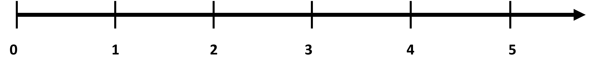
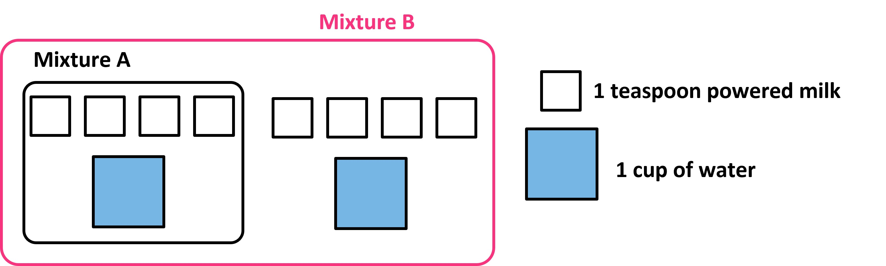
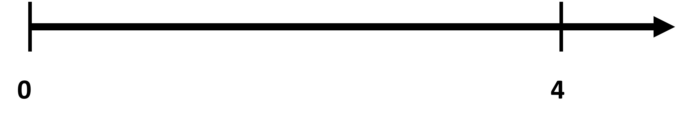
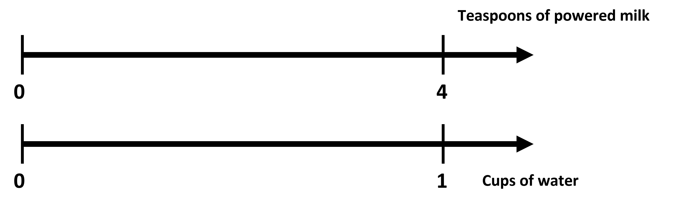
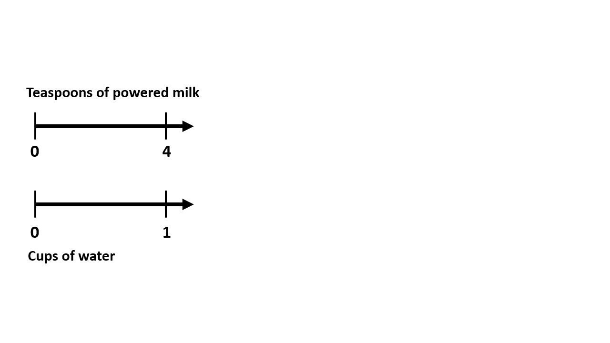
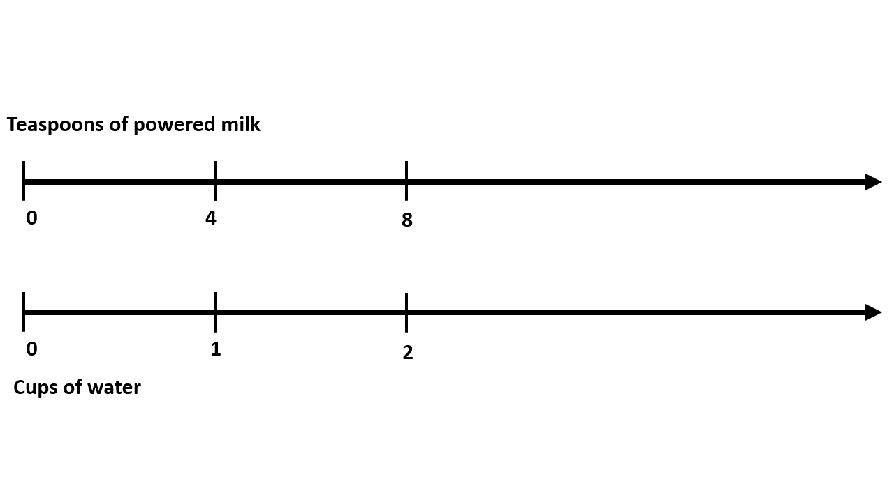
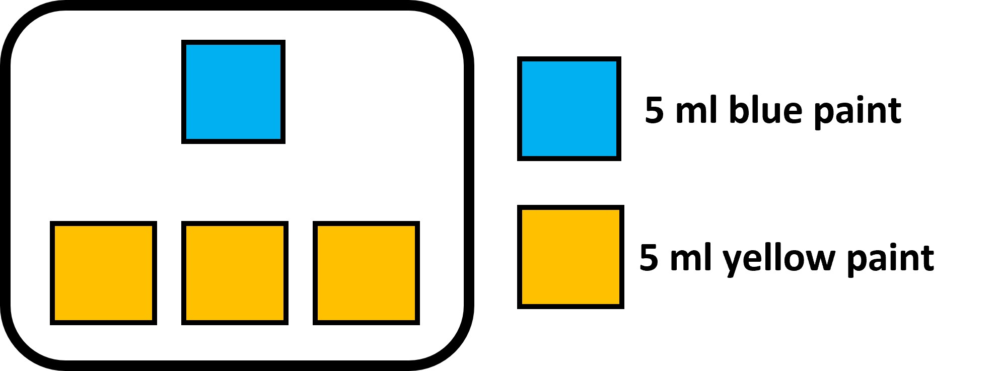
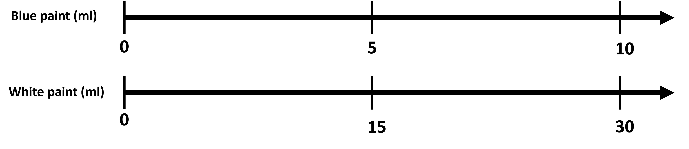
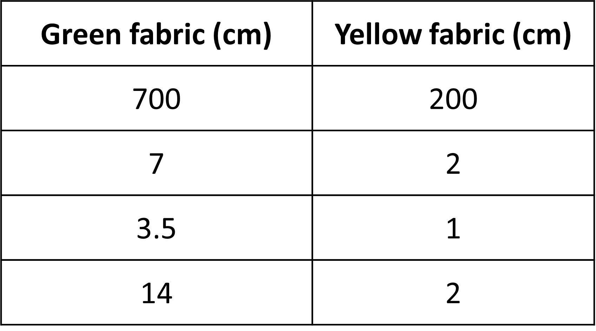
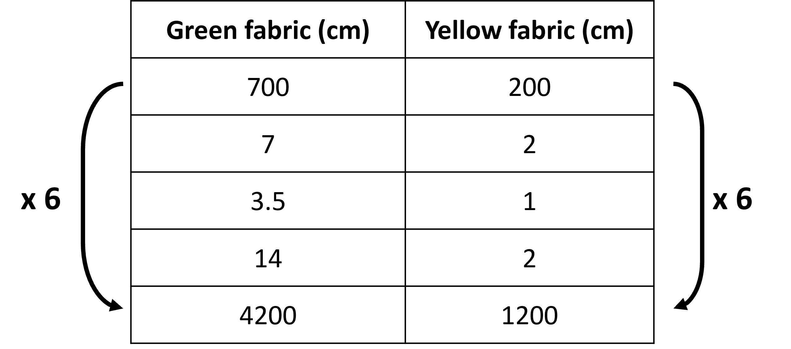

## Double number line 

We are already familiar with a number line. It simply lists out the numbers in a line at certain fixed intervals (either 1 or 5 or any other number).

It can also extend both ways when we introduce negative numbers. 

Any quantity can be expressed in a number line. But, we have been learning about how a ratio compares two or more quantities and forms a relationship. This means that just one number line is not enough. We need as many number lines as quantities we have in a ratio relationship. 

Let’s see why we need two numbers lines, or the double number line and how that helps us with ratios. 

Given is the image that shows the ratio of how two milk mixtures are made from milk powder and milk. 

We see that the ratio of milk powder to water is 4:1 for mixture A and 8:2 for mixture B. Let’s first look at mixture A and see how it can be shown using two number lines. 

First, we look at the milk powder. There are 4 spoons of that, so we can simply show it as:

For the cup of water, we do the same in a different number line as show the one cup as follows:

So why exactly is it called a double number line and why does it matter? This is because we need to make them together to show that the 4 and 1 are related. So we label the two lines and draw them together as shown:

This diagram now shows us that for one cup of water, 4 spoons of milk powder is used. We need to make sure that the 4 and the 1 coincide with each other since it is through this alignment that the association of two quantities are shown.  We do not coincide 1 with the 1, since that would tell us that 1 cup is mixed with 1 spoon powder. 

Just like discrete diagrams we made before, double number lines can also be used to represent equivalent ratios. Rather than making a new ‘double number line’, what we do is simply extend this one!

Keep in mind that the distance between the 4 and 8 and 1 and 2 is the same. In the top line, the interval increases by 4 and in the second, it increases by 2. This is because both have been multiplied by 2. This time, we see that along with 4 and 1. 8 and 2 also coincide. So the same number line shows us two different ratios! Notice that these coinciding pairs of numbers that have “lined up” vertically are equivalent ratios!
Double number lines are quicker to draw than discrete diagrams and can be extended easily to show many more equivalent ratios, so they are more efficient, especially for dealing with larger quantities. Like we multiply each number in the ratio by the same number to get new equivalent ratios, we do the same here and keep extending the double number line. Do remember to maintain the interval in the two lines. 

In the diagram, we see two quantities with 4, which could confuse us about which it is referring to. But we need to remember that each number line represents a different quantity, and that the two 4’s have different meanings, spoons of milk powder and 4 cups of water.

Ready for more questions?

Let’s look at one more question before starting out with the practice. 

For a paint mix of blue and yellow to get a shade of green as shown, we have the discrete diagram as well as the double number line. 

The equivalent fraction of 10:30 for the ratio of blue to yellow is also shown in the double number line. 

We can easily divide the number line for 5 into smaller intervals of 1 and label each. What do you think the corresponding tick mark on the yellow line would be? Would it also be 1? But then that would mean 1 ml blue and 1 ml yellow give green, which definitely would not be the same shade. We can easily fix this. Just like how the interval between 0 and 5 for blue was divided into 5 parts (by dividing 5 by 5, which gives each interval as 1), we can do the same for yellow. This time, we divide the interval between 0 and 15 by 5, which gives us each interval as 3. So each interval is now 3 ml. 1 ml blue and 3 ml yellow will give us the same shade of green since 1:3 is the simplest form of 5:15. So, just like how we multiplied to get bigger numbers, we can do the same to show smaller marks on the number line by dividing (or by multiplying the reciprocal). So, for every 1 ml blue, we need 3 ml of yellow, OR we need 3 ml yellow per ml blue. ‘per ‘ means for every or for each. Such languages and notations will be helpful for us later. We will get familiar with this idea of finding how much yellow is needed for 1 ml of blue (finding one value when the other is 1) with more questions. 

Here, the idea of a ratio written as a fraction comes in handy. Let’s say the ratio of red to yellow paint to make orange is 2 ml:4 ml. To find how much red paint you need for 1 ml yellow, we divide both by 4 (since we need to make 4 ml yellow as 1 ml). This gives us the first term as 2/4, which is the fractional form of 2:4!. So essentially, the fractional form of a ratio is the first term when we make the second term to be one!

## Tabular form

We will look at one more way to write ratios and show equivalent ratios. The TABULAR FORM!  They are similar to double number lines but also have their own perks. 
Let’s look at one example of how we express ratios in a table. 

To make a t- shirt, fabrics of two colors are used - green and yellow. Each shirt requires 700 cm of green and 200 cm of yellow fabric. Some equivalent ratios for green to yellow fabric are 7:2, 3.5:1, 14:4, etc. Now, we can show the two quantities in a table containing two columns. 

Here, each column heading is a quantity (here, green and yellow fabric). So each value in that column is for the specific quantity and they are equivalent. Each row has a value for each of the quantities, thus making a ratio!

One other thing about the tabular representation is that the numbers when going down the table are not in order. If this was a double number line, we would need to write the numbers in order when we increase the line in one direction. This makes it easier to find a missing value for an equivalent ratio when one of the values is given. We will not need to go in order even if we have to find an equivalent ratio with a value like 100 or 500. 

For example, say you want to make a t- shirt with 1200 cm of yellow fabric. How much green fabric would you need? If we used a double number line, we would have to continue to draw a line until we reached 1200, which would be pretty long. But, in the case of a table, we simply add one more row and find the missing value by multiplying both numbers with 6 (This is because 200 x 6 = 1200, so we multiply the quantity for green with 200 as well, giving us 700 x 6 = 4200 cm).

