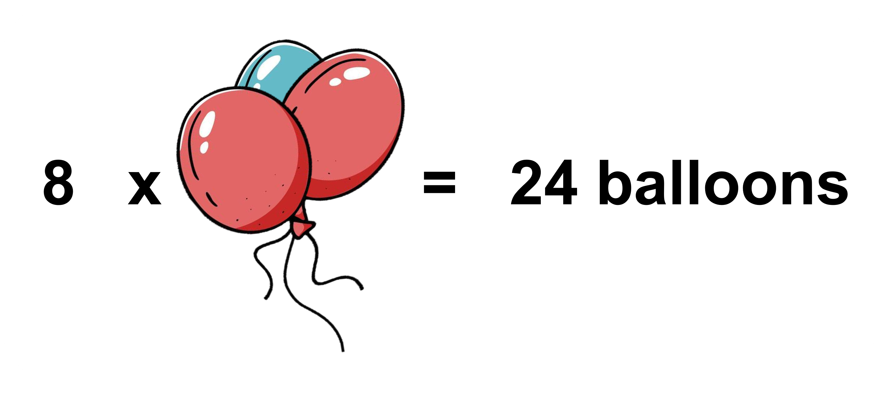

## Common Factors

Imagine you're getting ready for your sister's birthday party and you bought 24 balloons. You want to put them on the wall, but you're not sure how to arrange them. You want each bunch to have the same number of balloons. Would it work to make 12 bunches with 2 balloons in each one?

Or would it look better if you made 6 bunches with 4 balloons each?

You could also make 8 bunches with 3 balloons each or simply place 24 balloons separately. 

There are lots of ways to group balloons! You can switch up how many bunches you have and how many balloons are in each bunch. For example, you could have 2 bunches with 12 balloons each. When we talk about the number of bunches and balloons, we are talking about factors. Factors are whole numbers that divide another number evenly with no leftover bits (remainder). 1, 2, 3, 4, 6, 8, 12, and 24 are all factors of 24. That means you can divide 24 balloons into those groups without any leftovers. When dividing 24 into 6 groups, we get 4 with no remainder. Also, when dividing 24 into 4 groups, we get 6 with no remainder. So, 4 and 6 are the factors of 24.Cool, right? 
Now let's talk about the color combinations of the balloons. Imagine you have 30 blue balloons and 18 red balloons. How can you group them so each bunch has the same number of blue and red balloons? We use factors again! The factors of 30 are 1, 2, 3, 5, 6, 10, 15, and 30. The factors of 18 are 1, 2, 3, 6, 9, and 18. 

What factors do they have in common? 1, 2, 3, and 6 are factors common to 30 and 18.
These are called common factors, and as the name suggests, it is a factor common to both numbers. When we want to divide balloons into bunches with the same number of balloons in each bunch, we need to find the common factors of the total number of balloons. In this case, we can have:

1. 1 bunch of all 30 blue balloons and 18 red balloons
2. 2 bunches of 15 blue balloons and 9 red balloons
3. 3 bunches of 10 blue balloons and 6 red balloons
4. 6 bunches of 5 blue balloons and 3 red balloons

What is the largest number of combination bunches that you can make with no leftover balloons? The greatest common factor of 30 and 18 is 6. The greatest common factor (sometimes written as GCF) of two whole numbers is the greatest of all of the common factors. This means that we can make 6 bunches of 5 blue balloons and 3 red balloons with no leftover balloons, which is the biggest number of bunches we can make with an equal number of the two coloured balloons in each bunch. Mathematically, it is the biggest number that can divide both numbers without getting a remainder. To find the greatest common factor, we simply list all the factors of each number and find the biggest one they have in common. For example, the greatest common factor of 45 and 60 is 15.

Let's find the biggest number that can divide both 18 and 24 (the GCF). First, we write down all the numbers that can divide 18 and 24, essentially their factors. For 18, we have 1, 2, 3, 6, 9, and 18. For 24, we have 1, 2, 3, 4, 6, 8, 12, and 24. The numbers that are the same for both are 1, 2, 3, and 6. The biggest number out of those is 6, so that's the biggest number that can divide both 18 and 24. 

## Common Multiples

Suppose a florist can order roses in bunches of 12. If she ordered 4 bunches of roses, how many total roses does she have?

The florist has 48 roses and this number is both a multiple of 12 and 4. A multiple is when you can get a number by multiplying two whole numbers together. For example, 20 is a multiple of 4 and 5 because 20 equals 4 times 5. 

The next day, the florist wanted to order tulips too. She can only order roses in bunches of 12 and tulips in bunches of 8. If she wants the same number of roses and tulips, how many bunches should she order? 

The multiples of 12 (let's only use multiples below 100) are 12 (12 x 1), 24 (12 x 2), 36, 48, 60, 72, 84, and 96. The multiples of 8 (let's only use multiples below 100) are 8 (8 x 1), 16 (8 x 2), 24, 32, 40, 48, 56, 64, 72, 80, 88, and 96. If the florist wanted equal number of roses and tulips at the end, they could order the following combination:

1. 2 bunches of roses and 3 bunches of tulips
2. 4 bunches of roses and 6 bunches of tulips 
3. 6 bunches of roses and 9 bunches of tulips
4. 8 bunches of roses and 12 bunches of tulips

This is because 24 (12 x 2 and 8 x 3, hence 2 bunches of roses and 3 bunches of tulips), 48, 72, and 96 are common multiples of 12 and 8. A common multiple is a number that is a multiple of both numbers. For example, 20 is a common multiple of 2 and 5 because it is a multiple of both 2 and 5.

If they wanted to order the same number of roses and tulips, and they wanted to use the fewest number of bunches, how many bunches should they order? The answer is to get 2 bunches of roses and 3 bunches of tulips. This will give you 24 roses and 24 tulips, which is the least amount of bunches you can order. The number 24 is the least common multiple of 12 and 8.

The least common multiple (LCM) is the smallest multiple that two whole numbers share. For example, 6 and 10 have a LCM of 30. To find the LCM of two numbers, we can list multiples of each number until we find the smallest number they both have in common. Let’s find the LCM of 4 and 10. We list some multiples of each number: 4, 8, 12, 16, 20, 24, 28, 32, 36, 40, 44... and 10, 20, 30, 40, 50... Both 20 and 40 are common multiples of 4 and 10, but 20 is the smallest number that is on both lists, so 20 is the LCM. 

## Distributive Property and Greatest Common Factor

You already know how to multiply whole numbers, but have you heard of the distributive property of multiplication? It's a pretty cool property. Let's check out an example to understand it better. Imagine we have an array of 12 columns of balls. 

How many balls are there in total? We can find out by multiplying 5 by 12, which gives us 60. 

But here's where the distributive property comes in. We can divide the column of 12 balls into two smaller ones, one with 10 balls and the other with 2 balls, and we end up with an array that looks like this.

We can figure out how many balls there are by multiplying the new divided arrays and then adding them. 
We have 5 x (10 + 2), since 12 have been divided into 10 +2. 
We can multiply 5 by 10 and 5 by 2 separately, and then add them together. 
5 x (10 + 2) = (5 x 10) + (5 x 2) = 50 + 10 = 60

This is called the distributive property of multiplication.This tells us that  the product of two sums is equal to the sum of the individual products. So, 5 x (10 + 2) = (5 x 10) + (5 x 2). This works for any numbers, not just the ones in our example so we can generalize to get a x (b + c) = (a x b) + (a x c). 

If we had organized the balls into rows instead of columns, the distributive property would still work.

The total number of balls can be calculated as; (3 + 2) x 12 = (3 x 12) + (2 x 12) = 60.

You know how to find the greatest common factor of two whole numbers. Let's find the greatest common factor of 36 and 8. The answer is 4! We can use this to make use of the distributive property. For example, when we see the problem 36 + 8, we can break the numbers down into factors. Since 4 is the greatest common factor of 36 and 8, we can write 36 and 8 as 4 times another factor. Then we can use the distributive property to simplify the problem. So, 36 + 8 becomes (4 x 9) + (4 x 2), which is the same as 4 x (9 + 2). Then we can just multiply 4 by 11 to get 44.
