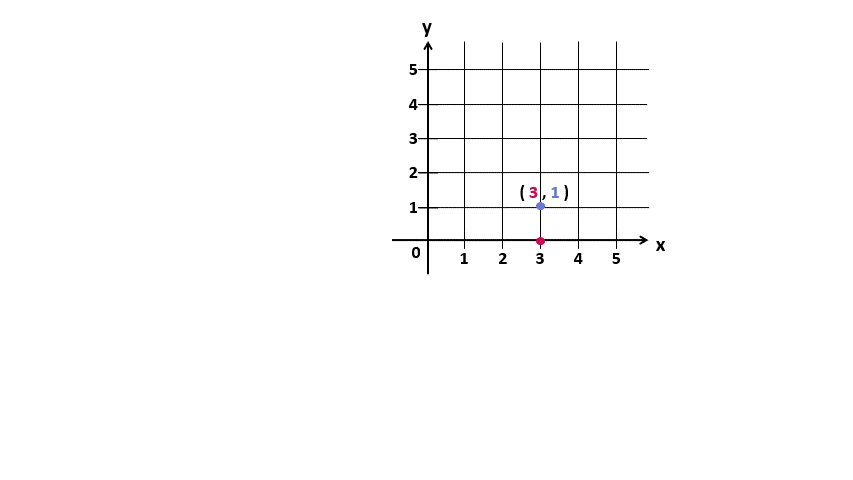
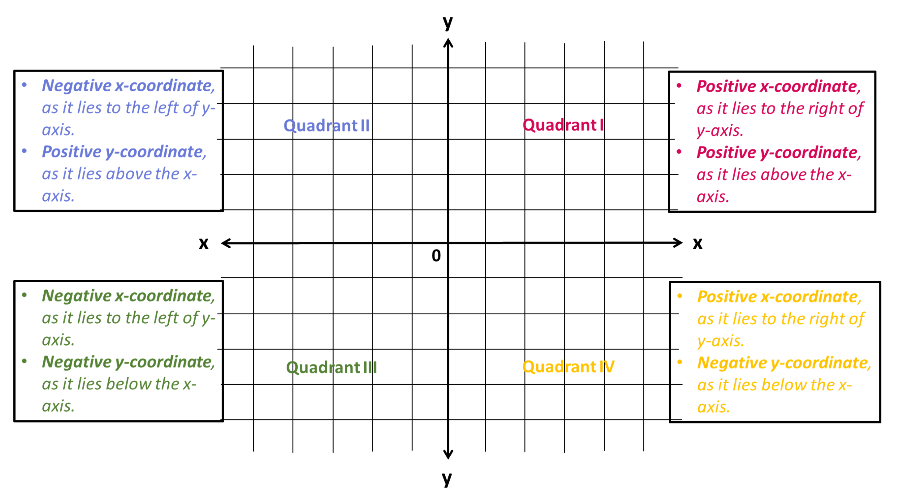
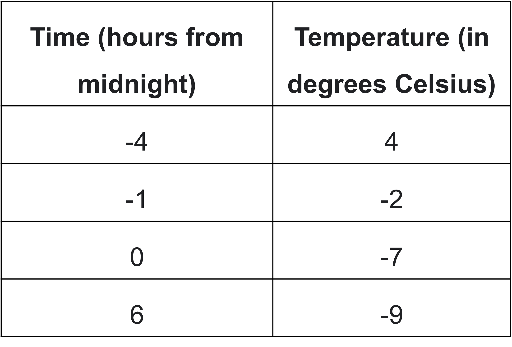
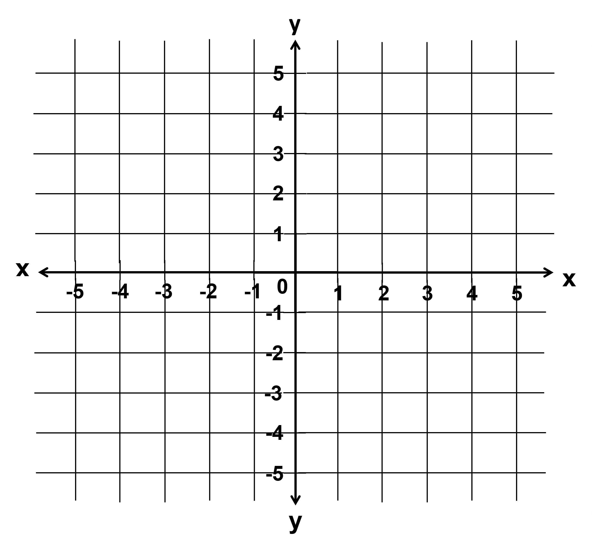
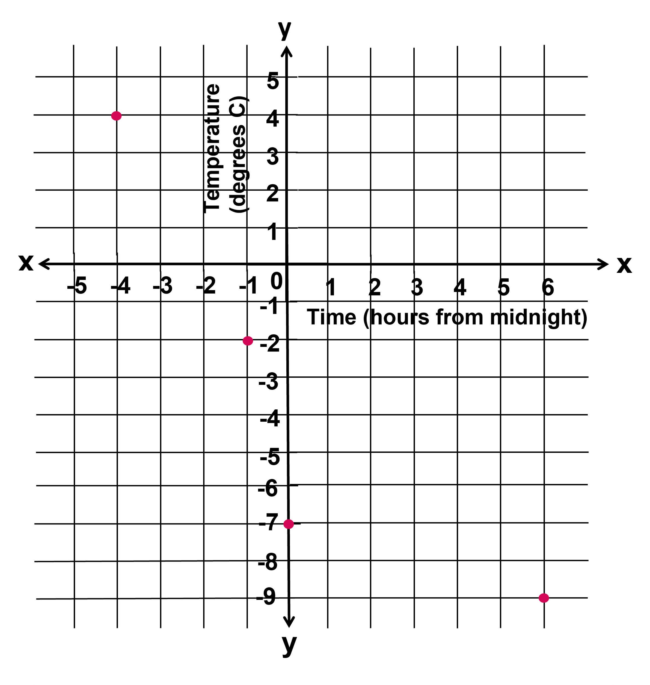
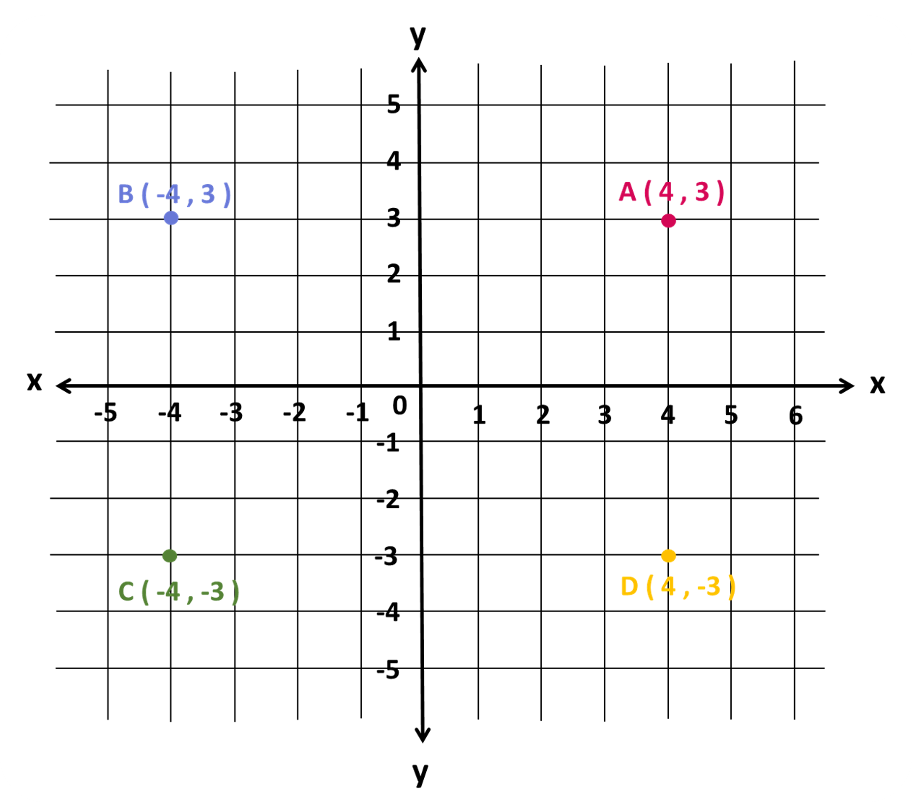
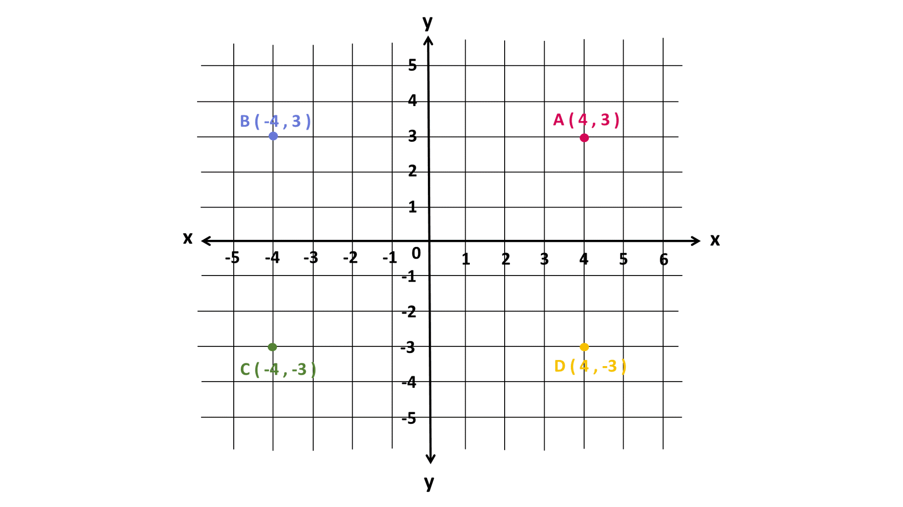

## Extension of the Coordinate Plane

You have already learnt about coordinate planes in grade 5. Did you know that the x-axis and y-axis are actually horizontal and vertical number lines, respectively? They have been placed such that they are perpendicular to each other and their intersection point is taken as the reference point (origin) for plotting the coordinates of any point. The following animation shows this clearly. 

Now, let us plot a given point; say (3,1). Remember that 3 indicates that we first move 3 units from 0 on the horizontal number line (x-axis). The distance we cover horizontally is called the x-coordinate, which is 3 here. And then, we move 1 unit on the vertical number line (y-axis). Likewise, the distance we cover vertically is called the y-coordinate, which is 1 here. This process is shown below.

The point (3,1) is 3 units away from the y-axis and 1 unit away from the x-axis. To be more specific, the given point is 3 units to the right of the y-axis and 1 unit above from the x-axis. Both the coordinates are positive here.  
Just like we extended the number line to include negative numbers, we can extend both the number lines of the coordinate plane (the axes) to include negative coordinates. 

This results in 4 different regions in the coordinate plane, which we call quadrants (The prefix “quad-” means 4). They are: 

(i) Quadrant I: 
(This is the region of the coordinate plane that you were introduced to in grade 5.) It lies above the x-axis and to the right of the y-axis. A point lying in the first quadrant would have positive x-coordinate as well as positive y-coordinate. For instance; (3,1), (5,11), (83,6), and so on. 
(ii) Quadrant II: 
It lies above the x-axis and to the left of the y-axis. A point lying in the second quadrant would have negative x-coordinate and positive y-coordinate. For instance; (-3,1), (-5,11), (-83,6), and so on. 
(iii) Quadrant III: 
It lies below the x-axis and to the left of the y-axis. A point lying in the third quadrant would have negative x-coordinate as well as negative y-coordinate. For instance; (-3,-1), (-5,1-1), (-83,-6), and so on. 
(iv) Quadrant IV: 
It lies below the x-axis and to the right of the y-axis. A point lying in the fourth quadrant would have positive x-coordinate and negative y-coordinate. For instance; (3,-1), (5,-11), (83,-6), and so on. This is just an introduction to the quadrants. 
You will get used to the position of the given points with practice, which will be our focus in this section.

## Constructing and Interpreting the Coordinate Plane

The coordinate plane can be used to show information involving pairs of numbers. When using the coordinate plane, we should pay close attention to what each axis represents and what scale each uses. 
For example: Suppose we want to plot the given data about the temperatures in New York one evening. 

How should we plot the given data on temperature? We first need to decide what the x-axis and the y-axis will represent. We can decide that the x-axis represents the number of hours in relation to midnight and the y-axis represents temperatures in degrees Celsius.
In this case, x-values less than 0 represent hours before midnight, and x-values greater than 0 represent hours after midnight. On the y-axis, the values represent temperatures above and below the freezing point of 0 degrees Celsius. The data involve whole numbers, so it is appropriate that each square on the grid represents a whole number. Now, we need to draw the x- and y-axes up  to the value that is demanded by the given data. 
Can we plot all the values in this coordinate plane? 

The axes span from -5 to 5 only. We need to plot data ranging from -4 to 6 in the x-axis and 4 to -9 in the y-axis. Thus, the given coordinate plane is inadequate in this context. On the left of the origin, the x-axis needs to go to at least -4. On the right, it needs to go to at least 6. Below the origin, the y-axis has to go as far as -9. Above the origin, it needs to go to at least 4. 
Here is a graph of the data with the axes labeled appropriately. 

On this coordinate plane, a point at (0,0) would mean a temperature of 0 degrees Celsius at midnight. The point at (-4,4) means a temperature of 4 degrees Celsius at 4 hours before midnight (or 8 p.m.). We will practice choosing the correct scale and adequate axes in different contexts in this section. 
What is the temperature difference between 4 hours before midnight and 6 hours after midnight? The temperature is represented by the y-coordinates. The difference in temperature is 13 degrees Celsius, that is, the temperature dropped by 13 degrees. 
In this way, points on the coordinate plane can give us information about a context or a situation.

## Distances on a Coordinate Plane

Look at the given coordinate plane. 

The four points are: A (4,3), B (-4,3), C (-4,-3) and D (4,-3). Notice that they all have almost the same coordinates, except the signs are different. They are all the same distance from each axis but are in different quadrants. 
Notice that the vertical distance between points A (4,3) and D (-4,3) is 6 units, because point A is 3 units above the x-axis and point D is 3 units below the x-axis. 
If two points have y-coordinates that are opposites (like 3 and -3), they are the same distance away from the x- axis, but one is above and the other below the x-axis. The horizontal distance between points A (4,3) and B (-4,3) is 8 units, because point A is 4 units to the right of the y-axis and point B is 4 units to the left of the x-axis. 
If two points have x-coordinates that are opposites (like 4 and -4), they are the same distance away from the y-axis, but one is to the left and the other to the right of the y-axis. 

When two points have the same value for the first or second coordinate, we can find the distance between them by subtracting the coordinates that are different. For example, consider (2.5,1) and (6,1). They have the same y-coordinate. If we subtract the x-coordinates, we get 3.5. These points are 3.5 units apart.

