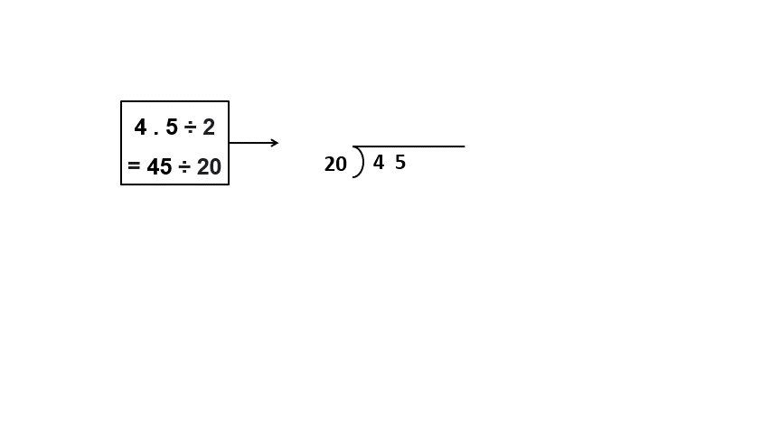

## Division of Multi-digit Whole Numbers

In this section, we will learn how to divide multi-digit whole numbers. Let's start by reviewing basic division, using an example of dividing a two-digit number by a one-digit number. Imagine you have 10 candies to share with your friend. You both want an equal amount of candy. You can take turns taking one candy until all the candies are gone. 

Are any candies remaining at the end? No. 10 candies can be evenly divided between the two of you without any remainder or extra candy remaining. When 10 is divided into 2 groups, we get 5. If you are used to dividing basic numbers, you can directly get two groups of 5 candies.  

We can also find the value of 10 ÷ 2, by using a standard algorithm called long division. We ask ourselves, "How many 2s make 10?" The answer is five 2s. We write 5 as the quotient, 2 as the divisor, and 10 as the dividend. The remainder is 0 because there are no candies left over.

Let's learn how to divide big numbers like 968 ÷ 22. It's just like dividing 10 ÷ 2, but with more digits. First, we look at the first two digits of 968, which are 96. Is that bigger than 22? Yes! So we don't need to worry about the last digit right now.

Next, we estimate how many 22s fit into 96 (either exactly or close enough). We can round 22 to 25 and 96 to 100 to help us here. How many 25s fit into 100? 4! So we try 22 x 4 = 88. We subtract 88 from 96 to get 8. We bring down the last digit, which is 8. Now we have 88 again. We know 22 x 4 = 88, so we don't need to estimate anymore. We end up with a quotient of 44. That's the answer!
Don't worry if dividing big numbers seems hard. You'll get lots of practice and soon it will be easy-peasy!

## Addition and Subtraction of Multi-digit Decimals

You already know how to add and subtract decimals from before. Let's go over it again and learn how to do more difficult problems. To add 2.26 and 1.89, we need to know what those numbers mean. 2.26 means 2 + 2/10 + 6/100, which is 2 ones, 2 tenths, and 6 hundredths. 1.89 means 1 one, 8 tenths, and 9 hundredths. Just like in whole number addition, we add the numbers with the same place value and make a new unit when we need to. Let’s add the two and see what it looks like.

First, we add the hundredths and get 15 hundredths. We can make this into 1 tenth and 5 hundredths. Then we add the tenths and get 11 tenths. We can make this into 1 one and 1 tenth. Finally, we add the ones and get 4 ones. We could have guessed what the answer would be without doing the math by estimating. For example, we know that 2 plus 1 is 3, and 8 tenths plus 2 tenths is 10 tenths, which is 1 whole. So we can expect the answer to be a little more than 4. 

Now let's try another problem. We want to add 623.45 and 75.3. Is the following way correct?

Oops, something looks off. Can you figure out what's wrong? The decimal points in the numbers aren't lined up, which means the sum isn't calculated correctly according to the place value. But we can estimate the answer before actually adding the numbers. If we add 623 and 75, we get 698. So the sum of 623.45 and 75.3 should be a little more than 698. Estimating helps us compare our answers and avoid mistakes. Here's how to correctly add 623.35 + 74.3: 

Now, let's talk about subtraction. How do we calculate 2.26 - 1.31? Our estimate tells us the answer is a little less than 1. Here's how to do it step-by-step:

+ Start with the hundredths column. Subtract 1 from 6 to get 5 hundredths.
+ Move on to the tenths column. We can't subtract 3 from 2 (cannot take 3 tenths from 2 tenths), so we borrow 1 from the ones column, or from 2 ones and decompose it into 10 tenths. Taking away 3 tenths from 12 tenths (2 tenths plus 10 tenths) gives us 9 tenths.
+ Finally, look at the ones column. We need to subtract 1 from 1, which gives us 0.
So the answer is 0.95, which matches our estimate. You can use this same process to subtract larger decimals too. 

## Multiplication & Division of Multi-digit Decimals

You might remember learning how to multiply and divide decimals in earlier grades. Let's go over the basics again. For example, how do we multiply 3.76 and 2.03? To do this, we use the standard algorithm for decimal multiplication, which requires the use of whole number multiplication. This means,  we treat the numbers like whole numbers and multiply 376 by 203. But what about the decimal points? We don't want to change their place value. So, we just ignore them for now and multiply like normal. After we get the product, we can then add the decimal point back in. For 3.76 and 2.03, we put the decimal point 4 numbers from the left in the product 76328 that we get. So, the answer is 7.6328.

Here's what's happening: We multiplied 3.76 by 100 and 2.03 by 100 to get 376 and 203. Then we multiplied those two numbers together to get 76,328. To undo the multiplication we did at the start (or 100 in both numbers to remove decimals), we divided 76,328 by 100 twice or by 10000. 
Estimation can help us avoid mistakes when we're multiplying. For example, we know that 3 tens times 2 tens is 6 tens, so the answer should be a little over 6. Additionally, we can round 3.76 to 4 and 2.03 to 2, since those are close estimates. We can then estimate that the answer is less than 8, since 4 times 2 is 8.

Multiplying greater decimal numbers follows the same standard algorithm.

To divide decimal numbers, we can use long division like we do with whole numbers. Let's go over the steps. For example, how do you divide 4.5 by 2 (4.5 ÷ 2)? When you have decimals, you can multiply both the top and bottom numbers by the same number to get whole numbers. This doesn't change the answer as a / b = (a x n)/(b x n).

For instance, 4.5 ÷ 2 = 4.5 / 2 = (4.5 x 10) / (2 x 10) = 45/20 = 45 ÷ 20. So 4.5 ÷ 2 is the same as 45 ÷ 20. 

But how do you know what number to multiply by? It's easy! If the decimal goes up to the tenths (like 4.5), multiply by 10; 4.5 x 10 = 45. If the decimal goes up to the hundredths (like 9.03), multiply by 100; 9.03 x 100 = 903. Now let's try it out!

Let's do some math! We're going to divide 45 by 20. First, we see how many 20s we can fit into 45. Two 20s make 40, so we use that in our first step. We have a remainder of 5. But 20 can't fit into 5, so in such cases, we put a decimal point in our answer and add a 0 to the dividend. Why do we do these two steps? Whenever the divisor becomes greater than the dividend (20 > 5), we cannot divide 5 by 20, so we place a decimal point after 2 in our quotient which then allows us to add a 0 after the remainder, giving 50.

Now we have 50, and two 20s almost fit into that. We have a remainder of 10. Again, this is less than 20, so we repeat the process of adding a 0 and getting 100. This time, we will not be adding a decimal to the quotient since the presence of one decimal already gives us access to adding the 0 to the dividend. We keep going like this until we get a remainder of 0. Here, we get an answer after doing it twice, giving us 2.25. This is how you do decimal division! The most important thing to remember is that if you have a decimal, you can turn it into a whole number by multiplying. 
