## Triangles
### Area of right-angled triangle
We have a right-angled triangle as shown in the figure. A right-angled triangle consists of one right angle that is 90°.  How do we find the area for such a shape? 
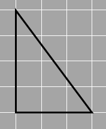
1_35

One way is to count, but not having complete squares can be kind of difficult. (You can still try it out though!)
Let’s try another method instead.  
If you make a copy of the triangle and place it as shown below, we can form a rectangle. 
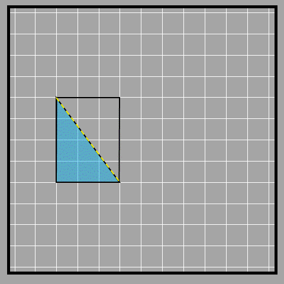
1_36

We see that the diagonal shown in yellow divides the rectangle into two equal halves, which are the two triangles. 
We know that the formula of the area of a rectangle is ℓ x b. The length and width of the rectangle are called the base and height of the right-angled triangle. Interchangeably, the length can be the base and the width can be the height as well. 
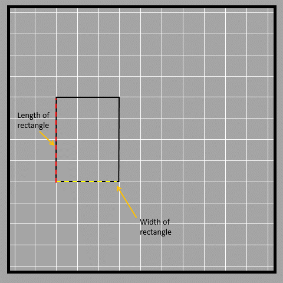
1_37

Since we created the rectangle using two triangles, the rectangle has an area that is double the area of the given triangle.
This means that the area of the right-angled triangle is half of the rectangle since there are two triangles of the same shape and size, inside the rectangle.
The area of right-angled triangle will thus be half of b x h = ½ x b x h
The base and height of any triangle have to be perpendicular to each other. They happen to be two sides of the given rectangle in this case. 

We can also use decomposition to find the area of the triangle. 
We’ll use the same triangle as an example.
Say we divide the triangle at half of its height (or length), basically at height 2 units. We can then rotate this and join it to the remaining part as shown. This gives us a new rectangle. What do you think the area of this rectangle would be?
The base of the triangle is the length of our rectangle, 3 units. The height is half of before since we cut it in half, so we have ½ x 4 units. 
Now, the area of rectangle is b x h = (½ x 4) x 3 = 6 square units
We also know that because of decomposition, the area of the rectangle and that of the triangle is the same. So we can write the area of triangle as ½ x 4 x 3 as well. 
We know that 4 is the height of the triangle and 3 is the base. This means that we have ½ x h x b, which is what we got earlier as well!
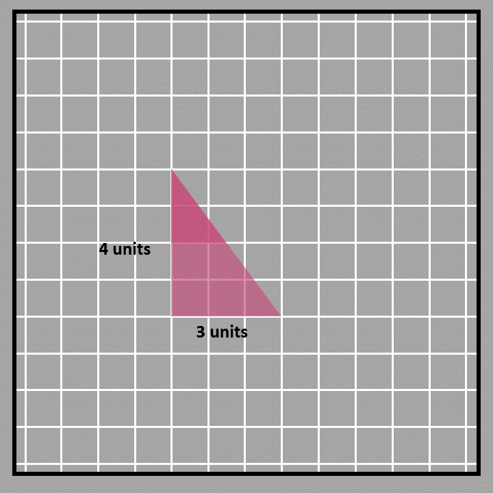
1_38

### Area of a triangle 

We have seen how we can find the area of a right-angled triangle before. We’ll now see if the same method/formula applies to other types of triangles as well. 

We just learned to calculate the area of a parallelogram by multiplying one of its sides (base) with the corresponding height of the parallelogram. Since rectangles are also parallelograms, we can use the area of a parallelogram to derive the area formula for a triangle as well. 
 
Firstly, we can divide a parallelogram into two triangles by joining their opposite corners (by a diagonal). We have one such parallelogram with its diagonal and the resulting triangles shown below. Also, note that the two triangles are not right-angle triangles like before.
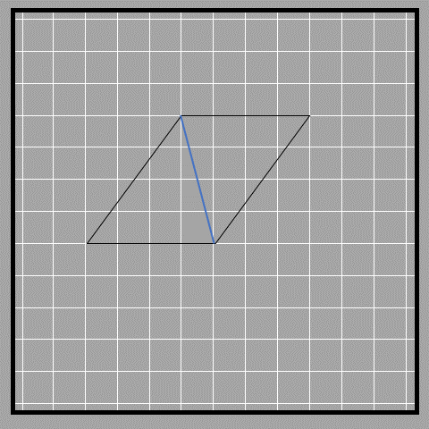
1_54

From the figure, we see that the two triangles have equal area, and therefore the area of each triangle must be half of the parallelogram’s area.
 
Area of parallelogram = 2 x area of triangle
Therefore, area of triangle = ½ x area of parallelogram

Since the area of parallelogram = base x height, 
The area of triangle = ½ x base x height 

The base and height of the parallelogram are the base and height of the triangle as well.

So we see that this formula applies to all kinds of triangles and not just right angled triangles. But the issue of identifying base and height is straightforward only in right angled triangles. 

The issue that could arise here is, what is the base and height of the triangle. Finding the base and height of a triangle that is not a right-angled triangle could be difficult. 

Remember that we could take any of the four sides of the parallelogram as its base? The same applies to the triangle where any of the three sides can be the base, and depending on which base you choose, you will get the height. The corresponding height will be the perpendicular line from the opposite vertex to the chosen base. 

Look at the three different bases and their corresponding heights.
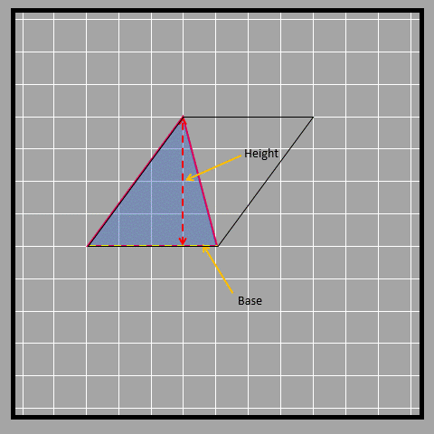
1_55

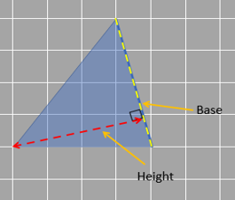

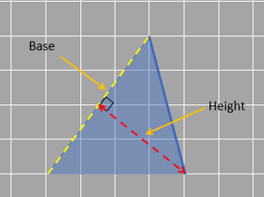
1_56 and 1_57

Let’s look at an obtuse-angled triangle in which it isn't that obvious to identify the base and height.
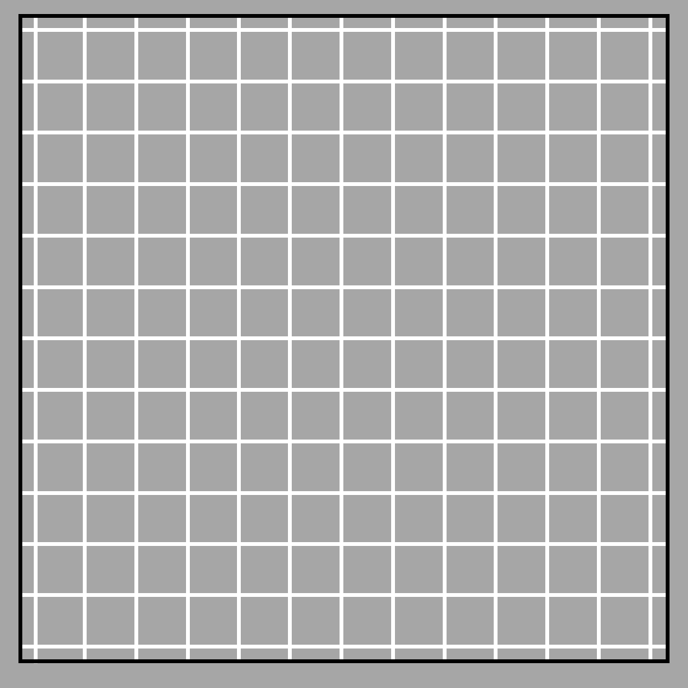
1_58

As you can see, sometimes the height might be shown outside the triangle. This is because the height always needs to be perpendicular to the base and in some cases, that perpendicular line does not lie inside the triangle itself. 

Alternatively, we can use decomposition to find the area of the triangle as well. 

Like before, we can derive the same formula by decomposing the triangle to form a parallelogram with the same base but with half the height. We first mark the midpoint of the height of the triangle. After that, we decompose the triangle and rearrange it on the other side to form a parallelogram as shown in the figure below.
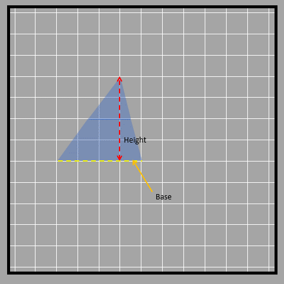
1_59 

Visually, it is proved that the area of the triangle is equal to that of the parallelogram that has the same base as that of the triangle but the height is halved.

Mathematically:
Our new height of the parallelogram is h/2 and the base is the same (b).

Area of the parallelogram formed = b x h/2 = Area of triangle

or, Area of triangle = b x (h/2) 
		=½ x b x h

Similar to parallelograms, the area of the triangle remains the same as long as the height and base remain the same even though the inclination of the sides change. This is possible when the vertex from which the height is drawn lies on the parallel line opposite to the base. 
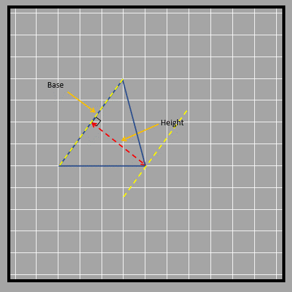
1_60