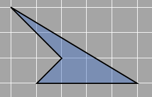
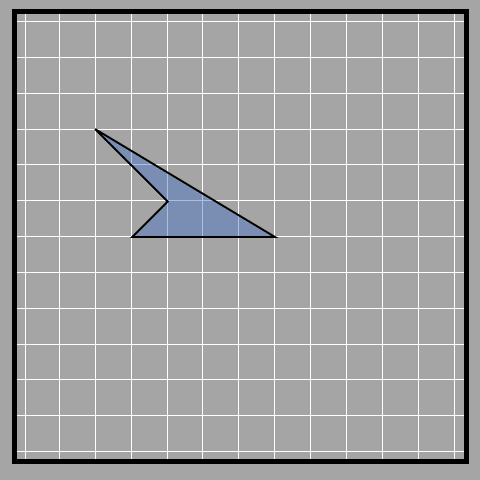
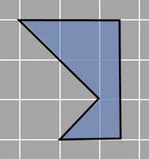
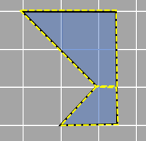
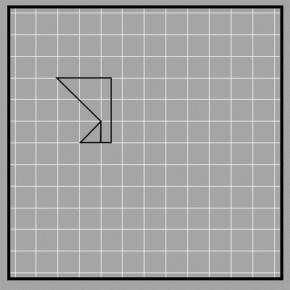
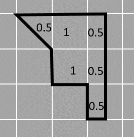

## Finding area using decomposition (complex shape)

We can apply decomposition to find areas of other kinds of shapes as well. When we are not familiar with the shape whose area has to be found out, decomposition becomes very useful like the one example given below. 

Let’s take an example in which we may have to decompose and rearrange the shape more than once. 

1_69

Our main aim is to get as many complete unit squares in the shape as possible. We can do that by introducing more horizontal and vertical lines in the final rearranged figure. 

First, we draw a vertical line as shown in the figure, and then apply the decomposition and rearrangement process so that we get a pentagon. 

1_70

 
We get a figure somewhat like the one shown below.

1_71
 
This figure is composed of two trapeziums as shown. We can directly use the formula of trapezium on them and add their calculated areas. 

1_72

Alternatively, we can further decompose the figure transforming the half triangle from the trapezium at the bottom to make a complete square as shown. 

1_73

After the decomposition, we get the figure below which comprises of a triangle (half a unit square), 3 rectangles (half of unit square), and 2 squares (one unit square). 

1_74

When we add the areas of all the individual pieces we get:

Total area= 0.5 +1 + 1 + 0.5 + 0.5 + 0.5 = 4 square units. 

It is always a matter if an incomplete square can be combined with another incomplete square to make a complete square! Easy right? Sometimes we may need more than two pieces to complete a unit square but we can definitely do that by some trial and error. As you have already seen, you can rotate the decomposed shape as well while rearranging. The principle of decomposition can be applied to any polygon. 
