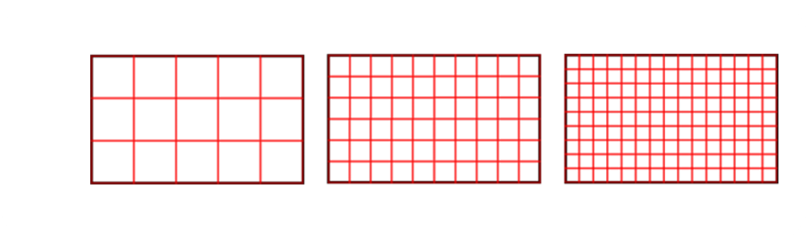
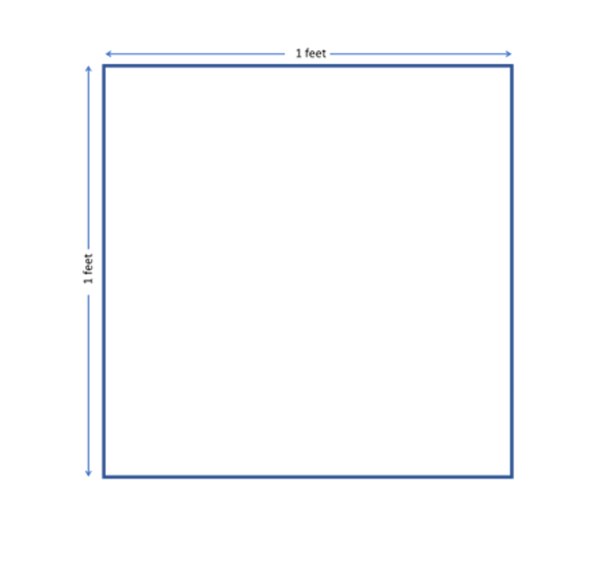
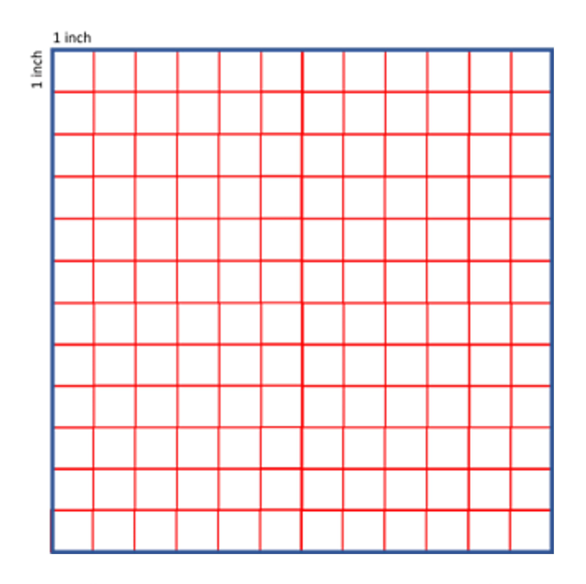

## Area
### What is area?

Given are a few different shapes. 

1_1

We can clearly see that all of the sizes of the shapes are not the same. Think of each shape being placed on a large piece of paper, or even the floor. Which shape do you think occupies more space on the paper/floor?   

We can make a pretty good estimate for this just by looking at some of the images. Bigger shapes obviously occupy more space right? So let’s try arranging them in ascending order by how much space they occupy. Don’t worry if it turns out to be wrong, this is just an estimate.

1_2 

Seems like a good order, but can we be absolutely sure that this order is correct?

Knowing exactly how much space a shape occupies is an important thing to know in mathematics. For example, you have to cover all the walls of all classrooms with wallpaper. How are you going to know how much wallpaper is needed? How are you going to explain to the shopkeeper?
There are several other kinds of problems in which we have to measure different surfaces. So how do we go about finding it? 

This is where we use ‘area’. Area basically tells us how much space a shape occupies. 

So how do we go about finding it?

We’ll start simple. 

When you draw a shape on a piece of paper, it is difficult to find the space it occupies since it is blank. As we have seen before, by sight, we may be able to tell when shapes have bigger or smaller areas. The bigger the shape, the more space it occupies, hence more the area will have. The method of visually deciding which is bigger is useful and makes sense when the shapes we compare are considerably different in terms of the space they cover. 

But this may not be the case all the time, sometimes the shapes look way too similar for us to correctly decide if one is greater or not, all we can do is estimate. In math, we need to be precise.

So how do we do this?

For this, let’s go back a few topics to the idea of measuring length.

When we measure the length of a line, we do so by using a unit, say a meter. So, to measure a line, we count how many 1-meters there are in the line. If the total length of the line can occupy five 1-meters then the line has a length of 5 meters. This helps us correctly measure the length of the line, rather than just blindly estimating. We can see that below.

1_3 

The main idea of measuring area is the same. We need some standard like the 1-meter unit against which we can compare the area of any object. Could we not use the same?
 
Let’s try it out for a rectangle. 

1_4

We know that a rectangle has a length and a breadth/width. Here,  length means the horizontal side and vertical side is the width but the names can be interchanged. The rectangle has its side 3 times the standard 1 meter. We can thus measure length to be 3 meters. But what about the width? We would need to measure that as well. The width is observed to be 2 meters. But now we know just the length and width of the rectangle. How do we express how much space it occupies? What is the area? 

Since our shape itself has a new dimension (width is addition to length), it makes sense for the unit of measure to have a new dimension as well, rather than using the one for length. Dimensions of a figure provide an idea about the size occupied by an object. We need a new quantity for defining the space occupied by an object because we can change space occupied by the object by two ways. 

So, instead of using 1 meter, we add an additional dimension when we work with shapes. Adding a new dimension but with the same length gives us a square, with both sides being 1 meter.	 Now we have a measurement unit with length and width. 

1_5

In the case of length, we checked how many 1-meter lines fit in the line we wanted to measure. Similarly, in the case of the area of a rectangle, we check how many squares of side 1 meter (shown above) fit in it.   
So let’s take a rectangle for example and let's try to see how many of the given squares will fit in it.

1_6

We see 15 squares of side 1 meter in this rectangle. This is what area is -> the number of squares that the rectangle (or shape) can fit inside it. The area of a given rectangle is 15 squares of unit side. (Kind of long, right? Don’t worry, we’ll make it shorter and easier to remember soon).

### Unit used to measure area
Like with length, you can use any unit to measure area. In length, we use cm, inch, foot, meter, km, etc. To generalize, we can take the context about how we measure the length in ‘units’. This is because a ‘unit’ means 1. But it has to be a standard value that acts as a reference value with which we compare all other lengths. So, if we know that the length of a line joining two points is 5 units, then we know that it is 5 times more than a standard unit (which could be a centimeter, or an inch or a kilometer). Based on that, the given value may be 5 mm, 5 inch, 5 cm or 5 meter etc.
 
Area will be referred to as “square units” in this whole lesson, but what does “square units” actually mean?

The square that we use for measuring the area has a side length of 1 meter. To generalize, let’s say it's 1 unit (like with length). So, do we say the unit of measurement of area is 1 unit as well? This would definitely get confused with length since 5 units could mean both area or length. So what do we do instead?

Since we use a square of side 1 unit to measure other areas, we use square units! Easy right? The small square itself has an area, which will obviously be 1 square unit (since both sides are of length 1 unit). So a rectangle that fits 10 of these squares will have an area of 10 square units! If we used a square of size 1 cm, the area would be 1 cm square or 1cm2, with the superscript 2 being a symbol for ‘square’. If we use this square to measure the area of a shape and we can fit 500 squares of 1 cm side, the area of the shape is 500 cm^2. (We’ll see more about this later as well).

Now that we know to use squares to measure area, let’s use this method to find the area of the four shapes from the beginning and see if we ordered them correctly. For this case, let’s just use square units and not any particular physical unit like cm or m. 

image 1_7

It seems we were mistaken about the last two. 

Keep in mind that you need to use the same-sized square to compare all the shapes. It doesn't really matter what size square you choose, but just make sure to use the same for all shapes. 

So how do we know which sized square we should use? 

Let’s see using an example of a rectangle. 

Which way of finding the area of the rectangle do you think is correct? Note that they are all the same rectangle. 

1_8

The first one maybe? Since it has the least amount of squares?

We are not being asked to compare them, just to find the area of the rectangle. Maybe they’re all incorrect since we get different areas for the same rectangle. 

But technically, they’re all correct. 

Let’s go back to the line example from before.

If a line is given and you measure it against a 1-meter line, you get 5 meters. But if you measure it against a 1 cm line, you get 500 cm! The same line is shown using different numbers, which works because the units are different. The same theory applies here. In order to measure the area of a rectangle, we can use any sized square. Changing the size does change the number that represents the area (15, 60, 135 from before) but the area does not change. What we are changing is the way we represent the area. 

Say in the first case the size of the square is 1 ‘a’ (it’s a made up unit). So the area of the square is 15 square ‘a’s. In the second case, say the size of the square is 1 ‘b’, so the area is 60 square ‘b’s. Finally lets say the size of the final square is 1 ‘c’, making the area of the rectangle to be 135 square ‘c’s. 

Basically, the area of the rectangle is the same, but the way we are expressing them using different units gives us different values for area. 
What it means is that the area covered by 15 square ‘a’s is the same as the area covered by 60 square ‘b’s and 135 square ‘c’s. 

We see that if we use a smaller square we get a higher numerical value, and if we use a larger square we get a smaller numerical value for the area.
 
Let’s now look at units that actually exist and see how they relate in terms of area. 

We know that one foot is equal to 12 inches, so how many square inches would be equal to 1 square feet?

The obvious answer would have been 12 square inches but can we be sure? Let’s see visually if this is correct.

1_9

1_10

We can see in the figures that each side would be filled by 12 squares in both directions making the total number of squares filling the figure completely 144 squares of side 1 inch. The space covered by 144 squares of 1 inch side is equal to the space covered by 1 square of 1 foot side. 

So, 1 square feet = 144 square inches
1 feet2= 144 inch2

Did you see the relationships required to convert the unit from square feet to square inches? 

In length, 1 feet = 12 inches

This means that to find any length in inches, we multiply the unit given in feet by 12. 

In area however, 1 feet2= 144 inch2

So simply multiplying by 12 is not enough. We need to multiply the unit given in square feet by 12 x 12 since that many squares of square inches can fit in a square of 1 foot. 

Using this reasoning, we can say that the space that can hold 12 squares of 1 feet length can also hold 12 x 12 x 12 = 1728 squares of 1-inch length. 

12 feet2 = 12 x 1 ft x 1 ft = 12 x 12 inch x 12 inch = 1728 inch2

The question of which square to choose depends on the area we have to measure. If you want to find the area of your room’s floor, using 1 foot squares could be useful. If you want to find the area of a football field, maybe 1-meter squares would be useful. The reason is that the number of 1-meter squares covering the football field is neither too large nor too small. Imagine measuring a football field with 1 cm squares. So many squares!! Would you like to count each and every square of 1 cm squares in the football field? It’s tedious, isn't it? 

This is why we avoid using a smaller square to measure a large area. But if we used 1-meter squares, we would need to use fewer squares. 

This also applies to using larger squares to measure smaller areas. It would not make sense to measure the area of your room’s floor with a square that has a side of 1 km right?

So, think of what units would be appropriate before you measure area.