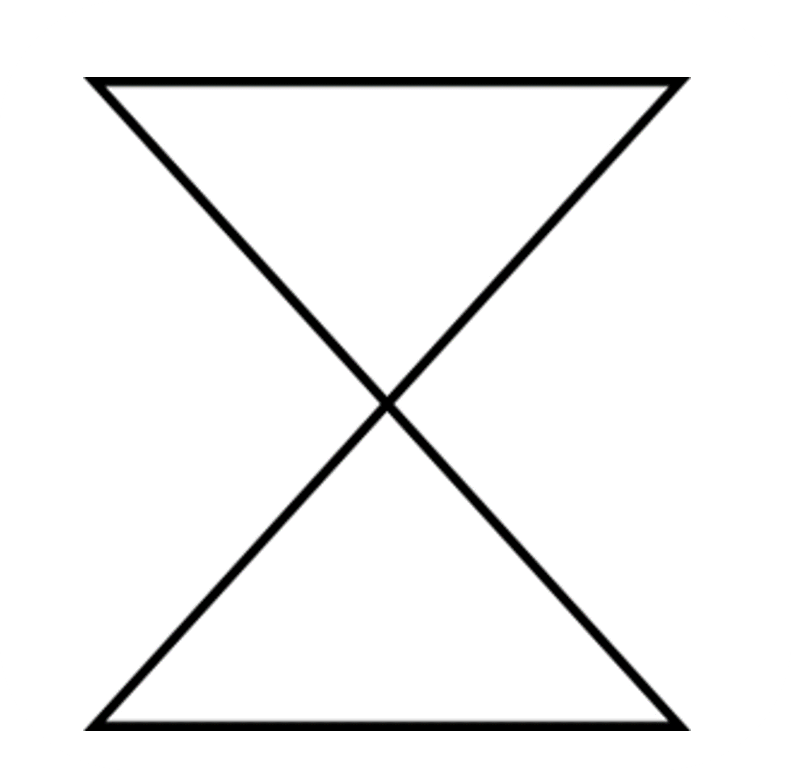
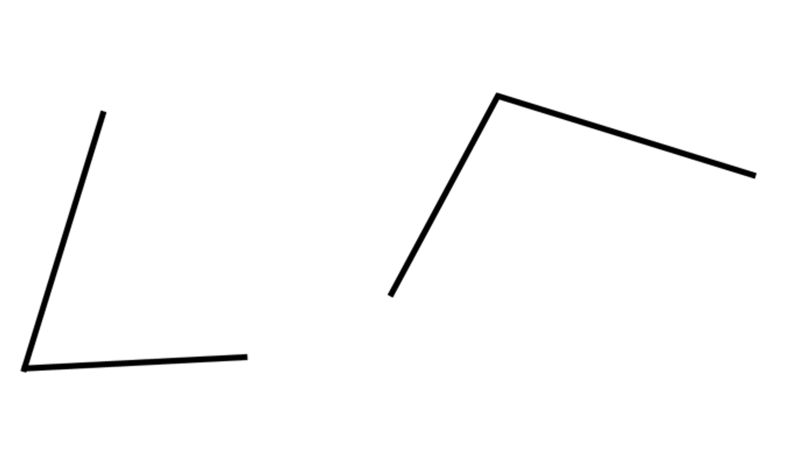
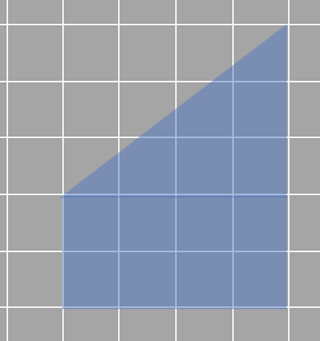
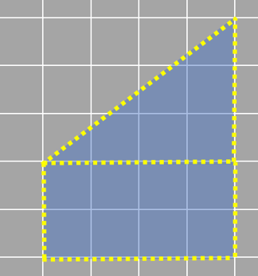
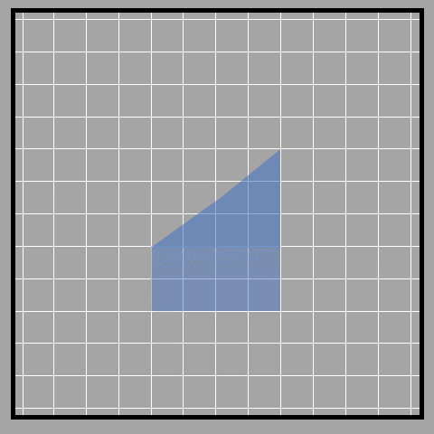
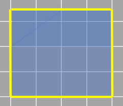
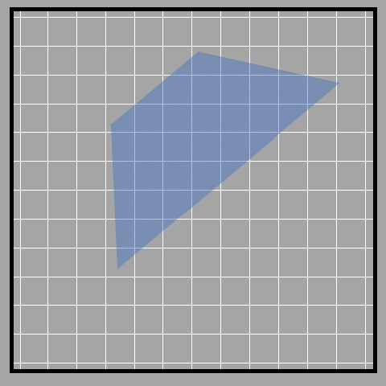
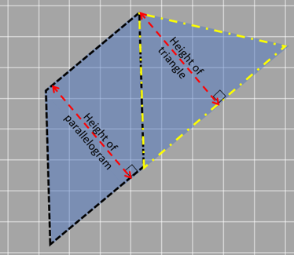
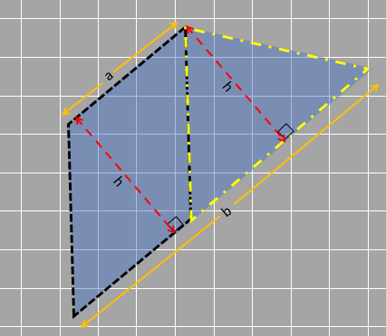
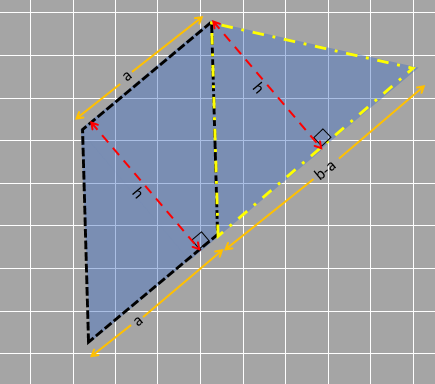

## Polygon
A polygon that has four sides is called a quadrilateral. But what is a polygon?

We have already seen triangles and rectangles, so it is obvious that lines can combine to form closed shapes. And based on the number of lines used, we get different shapes. These shapes are called polygons.

We can understand the word polygon by breaking it down into two parts. ‘Poly’ means plural and ‘gon’ means the number of sides or simply sides. So simply, a polygon is something that has multiple sides! 

Some things to note about polygons:
To be a polygon, the shape must be a closed figure made of straight lines only. So a circle is not a polygon and so is any shape that is made up of curved lines.
The straight lines are joined end to end and no line can cross the other. These lines are the sides of a polygon. 

Image 1_39

The shape shown crosses in the middle, so it is not a polygon.

So how many sides do you need to make a polygon? 1? 2? 10? 100?

The maximum number can be any number of sizes. You can keep adding more and more sides, and it will be a polygon as long as the sides connect end to end (or intersect!). 

But what about the smallest number of sides? Let’s try it out, starting with one side.

1_40

Well, that clearly is not a polygon since a closed shape is not formed. 

What about two sides?

Image 1_41

It seems like two sides are not enough either. The two lines cannot form a closed shape. 

When we try out three sides, we know that it finally is able to make a closed shape - a triangle!

So, it seems like we cannot form a polygon with less than 3 sides. 

Polygons have names based on the number of sides they have.
A polygon with 3 sides is a triangle, a polygon with 4 sides is a quadrilateral, a polygon with 5 sides is a pentagon, and so on. 

A polygon that consists of ‘n’ sides can be decomposed into ‘n-2’ triangles. If we have to find the area of the polygon, we can find the area of each of the triangles and add them together. However. there may be smarter ways of decomposing the same polygon into other shapes such as rectangles or squares which is totally dependent on the type of polygon. 

### Area of trapezium

When we have shapes that do not have any formula to find the area, we decompose and rearrange them, hopefully to a form that can give a formula. 

While applying decomposition we try to get familiar shapes such as rectangles or triangles or even a parallelogram so that it is easier to calculate their area using known formulae.

For example, the figure given here is a trapezium with one pair of opposite sides parallel to each other while the other pair is not parallel (the two vertical sides are parallel). 

1_61

The given trapezium can be decomposed into a triangle and a rectangle. We could find the area for this by using the formula for the triangle and the rectangles and adding the areas we get. 

1_62

But, we could add one more step, so only one formula is needed.

We can decompose the triangle at the midpoint of the height of the triangle. We then take the triangle formed to rearrange it such that we get a parallelogram (rectangle in this case). The process is demonstrated below. 

1_63

Now that we have a rectangle, we can either count the unit squares or simply use the length times width formula.

1_64 

The length and width of the figure are 4 and 3.5 units respectively, so the area = 3.5 x 4 =14 square units. 
Even if we count the number of square units that it occupies, it gives us 14 square units as the area. 

Trapeziums don’t always come with horizontal or vertical sides (like shown above) and in those cases, we can either decompose it into a triangle and a parallelogram or a rectangle and two triangles, whichever way is easier.

1_65

By using one of these ways, we can also find the formula for finding the area of a trapezium. We will use the technique of decomposing the trapezium into a parallelogram and a triangle. 

Before that, let’s first define the dimensions of the trapezium. 

The distances between the two parallel lines will be our height (denoted with ‘h’). 
Let’s also measure the parallel sides -> ‘a’ is the shorter side and ‘b’ is the longer side. 

Let’s now decompose the trapezium into a triangle and parallelogram as shown. For this, the line that decomposes the shape needs to be parallel to one side of the trapezium so we get a parallelogram. 

1_66

 

It should be obvious by now that the height of the parallelogram is the same as that of the triangle because they lie between the same parallel lines. This will be ‘h’, since that is the height of the trapezium.

1_67

Since the opposite sides of a parallelogram are equal, the base of the parallelogram can be taken as ‘a’ (as the smaller side of trapezium is ‘a’). 

For the triangle, the base is ‘b-a’ (since the longer side of the trapezium is b and we have removed a). 

[Base of the parallelogram + base of triangle = b
a + base of triangle = b
Therefore, the base of triangle = b - a]

1_68

Now, the area of the trapezium 
= area of the parallelogram + area of triangle
= base x height + ½ x base x height
= a x h + ½ x (b-a) x h
=h x (a + b/2 - a/2)
=h x (a/2 + b/2)
=½ x h x (a+b)

When writing in terms of the dimensions of the trapezium, we have the area of trapezium as:

= ½ x distance between parallel sides (or height) x sum of parallel sides

In case we are not looking to use the formula, we can use the decomposition process easily. We are already familiar with the process of finding the area for a rectangle, a parallelogram, or a triangle. So, the total area of the trapezium is the sum of the decomposed shapes whichever way we may do it. 
