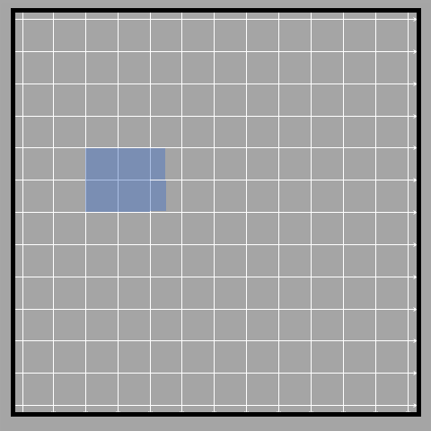
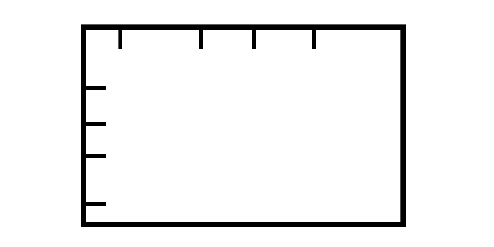
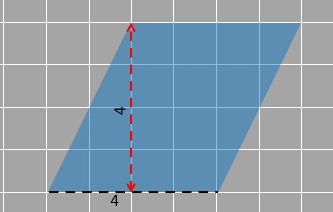

## Area of rectangles

### The formula

We now know how to find the area of a rectangle by counting the number of squares we can place inside the rectangle. But imagine having a huge rectangle. It would get tedious and a lot of work to see how many squares fit inside it. So, like everything in mathematics, we need the formula to find the area of a rectangle. 

In order to find a formula to find the area of a rectangle, let's focus on a problem where we have a rectangle over unit squares.
This is basically to show how many squares it overlaps. Each square has an area of 1 square unit, also called unit squares. 
These unit squares will help us in finding the area of the rectangle.  

1_19

The given rectangle covers three units in the horizontal direction and 1 unit in the vertical direction. The two sides are length and width/breadth. Normally the longer side is called the length (and that is what we will be doing here) but the names can be interchanged; Any side can be called length and the other side joined to it is called the width. 
Three squares mean the length is 3 units and the breadth is 1 unit.

1_20 

The area of the rectangle is 3 square units or it can also be said that three squares of unit length can fit inside the rectangle. 

When we find the area, we can also think of this as adding 1 three times. Think of it like taking a square unit and adding it 3 times. We can write this as:

1 + 1 + 1

1_21

This is essentially repeated addition, which we know can be written as 3 x 1. 

In this case, 3 x 1 means we are multiplying length and breadth together, which gives us 3 square units (Since 1 square unit = 1 square unit + 1 square unit = 3 square units and 3 unit x 1 unit = 3 square units). 

Does this mean that multiplying the length and breadth of a rectangle gives us the area? Let’s continue and see if this is true for all cases or is a fluke or some coincidence only this time. 

3 is also the result we get when we multiply 1 and 3. 
 
What happens to the area of the rectangle when we double one of the sides of the previous rectangle? 

Here is a rectangle that is made by doubling the width of the previous rectangle. 

1_22

Here the rectangle covers 3 units in the horizontal direction and 2 units in the vertical direction. We can see that there are 6 unit squares in the rectangle meaning 6 squares of unit length can fit inside. 

If we use our previous method, we can think of this as adding 2 square units 3 times.

1_23 

2 + 2 + 2

We use 2 because that is the number of square in each vertical column. 

2 + 2 + 2 gives us 3 x 2, which is again length times breadth of the given rectangle. 

2 + 2 + 2 = 3 x 2 = 6

We get 6 as the product when we multiply 2 and 3. Thus the area of the rectangle is 6 square units.

1_24 

On the basis of the calculations above, we can say that the area of the rectangle is the product of length and width. 

If the rectangle has its length as ‘ℓ’ units and width as ‘w’ units, the area of the rectangle will be ‘ℓ x w’ square units. Keep in mind that while length and width are measured in units, area is measured in unit x units, so the unit changes after you multiply ℓ and w, giving us square units. 

As mentioned at the beginning, this process of multiplying the dimensions (length and breadth) of the rectangle is very useful when we want to avoid counting the unit squares (if there are too many).

This formula is also helpful when incomplete square(s) are present inside the shape as shown below. 

The given rectangle here has a length of 2.5 units and breadth of 2 units. The length of rectangle is 2.5 because it spans exactly upto the middle between 2 and 3 horizontally. 

The total area of the rectangle is 2.5 x 2 = 5 units. 

1_25 

### Decomposition into rectangles
We have already looked at decomposition a little earlier. Let’s go through it a bit again and see how and why it is useful. 
Decomposition involves breaking any shape into smaller parts. Generally, the pieces can be of any shape but we try to get the pieces into one of the geometrical shapes we are familiar with so that it's easier for us to find the area. 
One more thing to note here is the idea of rearrangement. As the name suggests, rearrangement is basically arranging the decomposed pieces into a different orientation and location than the original. We have already seen that earlier with the tangram pieces. As long as you don't change the actual shape and size of the piece, you are allowed to rotate and move the pieces. 
So, why exactly do we decompose? We have seen that decomposing does not affect the overall area of the shape, but why do we need that?
Till now we are familiar with the process in which we count the unit squares that lie in a given shape to find the area. We have also seen that we sometimes need to estimate the number of squares when the shape is not familiar or doesn't have straight sides (like with the irregular shape from before). 
In cases where shapes are irregular, we can use decomposition to change them into a form where it makes it easier for us to find the area. Generally, we find it easier to calculate the area for familiar geometrical shapes. We’ll see how this works using simple examples. 
Let’s start with an example where the unit squares are occupied only partially.  
Since it is easy for us to count complete squares, we decompose and rearrange them in order to get as many full unit squares as possible. 
As we have two half squares, it is obvious that we can decompose one-half square and rearrange it to form a complete square with the other half square.

1_26 

There are two rectangles at the right that are incomplete. The incomplete squares make up a rectangle that spans half units horizontally and two units vertically, we decompose and rearrange it. We move them to make one complete square as shown below.

1_27  

Then the figure will become something like this. 

1_28

We can now easily count the squares present in our shape and the area will not change since we have decomposed and rearranged. 

The area of the figure is 5 square units since there are 5 unit squares that can fit in the space occupied by the figure. 

We can decompose all polygons (any kind of shape) that have vertical and horizontal sides to get multiple rectangles so that finding the area is easy. Let’s try it out with the shape given below.
  
  1_29
  
There is no formula like with a rectangle to easily find the area of this shape. So, let’s make rectangles!
We draw two horizontal lines such that the given figure is decomposed into three rectangles with lengths and breadths as shown. This helps us use the formula for the three rectangles, without having to count each square.

1_30

The area of the whole figure is  
2 x 1 + 5 x 2 + 10 x 3
=2+10+30 = 42 square units
There is no rule as to how we can decompose a shape. We could have also decomposed the same figure with vertical lines. We draw two vertical lines inside the figure and we get three rectangles each of lengths and breadths as shown.  

1_31

Thus the area of the whole figure is  
2 x 6 + 3 x 5 + 5 x 3
=12+15+15=42 square units
We obviously get the same result!
Both figures showed that the area of the figure is 42 square units. If we count all of the squares inside the figure as well, we will find that there are 42 unit squares inside the figure. Even though the methods seem different from each other, essentially, all of them follow the same logic -> the sum of the areas of decomposed pieces inside a figure is equal to its total area. 

Dividing a rectangle into unit squares and counting them is a tedious process when the figure is larger than the one shown above. This is why we use the formula of multiplying length and breadth. 

But so far, we’ve only counted the squares themselves to find the length and breadth of the rectangle. But this isn’t exactly necessary. 

For example, the given rectangle has its side as 5 units and 4 units respectively. The unit square division isn't shown, just the sides are divided into the unit length scales. This is enough for us to know the length and breadth, and hence enough to know the area as well. 

1_32 

We can find the area by multiplying the measurements of the two sides. 
Area= 5 x 4 = 20 square units.

Does the rectangle really fit 20 unit squares in it? How can we tell without the squares to prove it? Let's find out by extending the side divisions throughout the rectangle.

1_33 
  

When we extend the divisions shown, we see that it is filled with 20 such unit squares. 

In such cases, do make sure that the divisions shown are of equal length. You cannot have uneven divisions since they will not extend to become unit squares and then the area will be completely wrong!. You can't measure the area with uneven length/breadth divisions. 

1_34

### Area of parallelogram

So, we have looked at a rectangle, which is a polygon with 4 sides. 
You are also familiar with a square, which is basically a rectangle but with all sides equal. But, there are other four sides shapes that do not have right angles. 

To generalize, all four-sided polygons are called quadrilaterals. We have already looked at how to find the area of a rectangle, which is a special type of polygon. Now, we’ll look at another one.

A quadrilateral that has opposite sides equal and parallel to each other is a parallelogram. This sounds like a rectangle, right? A rectangle is a special type of parallelogram, where all angles are 90°. But when the angles are not 90°, we have a shape with only opposite angles equal and opposite sides parallel and equal. A parallelogram is shown below.

1_42

How do we go about finding the area of such a shape? There’s always the option of simply counting the square units present inside it. But it would be easier to find a formula that could be used easily (and spend less time counting squares). 

For that, lets decompose and rearrange the parallelogram into a rectangle so we can use the formula. Let’s see if we can achieve that.

We can decompose the parallelogram in a way that we get a right-angled triangle and then move that triangle from one side of the parallelogram to the other to complete the rectangle. Here, the triangle on the right is moved to the left side.

1_43

After the rearrangement of the decomposed triangle, we obtain the rectangle (square) of 4 by 4 size as shown below. 

1_44 
  

1_45

Once we have a square (rectangle), we can easily find the area by multiplying the length and width, both of which are 4 units in measurement. 
Area of rectangle = 4 x 4 = 16 square units

So we essentially used the formula for rectangles to find the area of a parallelogram. Can we then say that they have the same formula? Let’s confirm and look at how to relate the formula of the area of the rectangle with that of the parallelogram. 

Let’s look at another parallelogram that has one of its sides horizontal 4 units and horizontal parallel lines at a distance of 4 units. 

1_46

            
We’ll do the same thing we did before and get a rectangle (square) of length and height 4 units each.

1_47  

         

This means the area is the same. Strange right? The two parallelograms do not look alike but somehow have the same area.

Let’s look at what actually is similar between the two. 

The base is clearly the same - 4 units. And the horizontal parallel lines are at the same distance - 4 units. 

The only difference between the two parallelograms discussed before is the angle of inclination of the sides. 

Since we used the concept of decomposition and rearrangement for getting the rectangle from the parallelogram in both cases, we can be sure that the areas of both figures are also the same. 
If we have a look at the parallelogram again, we find that the area is dependent on one of the sides of the parallelogram (shown in the black dotted line) and the distance between it and its opposite side (shown in the red dotted line). The distance, between the side, measures 4 units, and its opposite side is 4 units as well. They are shown in the figure below. 

1_48

The horizontal side which remains common in both the parallelogram and the rectangle is called the base. 

1_49

The vertical arrow (shown in red) that gives the distance between the base and the side parallel to the base is called height.

So, if we want to find the area of a rectangle, we simply use the same formula as that of a rectangle. 

Thus the area of a parallelogram = base x height

What we can conclude is that the rectangle we get after decomposing and rearranging multiple parallelograms will remain the same as long as the base of each parallelogram is the same and the distance between this base and its opposite side is always the same. The inclination of the parallelogram does not have an effect on the final rectangle we get. 

Let’s call that perpendicular distance “the height” of the parallelogram. 

This means a parallelogram that has the same base and the same height as a rectangle will also have the same area.

We can also say that the area of a parallelogram is the same as the rectangle which is standing on the base and enclosed within the same parallel lines. 

Here is an example showing multiple parallelograms and a rectangle having an area of 15 square units. The distance between the parallel lines, which is the height, does not change even though the sides become more inclined.  All of them have a base of 3 units and a height of 5 units.

Therefore, as concluded earlier, the area of each parallelogram will be  3 units x 5 units = 15 square units.

1_50
 

A small note before we move on:

Is the base of the parallelogram always fixed? Does it always have to be the horizontal line?

Not necessarily. It can be any of the four sides of the parallelogram. What we need to keep in mind is that after we decide which side is the base, we use that to decide the height associated to it.  

One type of pairing of base and height is given below (this is the same parallelogram as before, so our original height and base were 4 units each). 

1_51

The base is now the inclined side (marked in black). Using this as the base, we know that the perpendicular distance between this base and the opposite side is the height. This is marked in red. 

The only condition that we must fulfill while drawing the base and height is that they must be making 90 degrees with each other and the base is one of the sides of the parallelogram. 

Keep in mind that this does not mean that the base is 4 units. (obviously, because it is inclined). The same goes for the height. But nonetheless, the product of the two will be equal to 16 square units. If you want to know the measurement of the base and height in that orientation, you can rotate the shape so it aligns with the unit squares given. 

1_52
 

1_53
