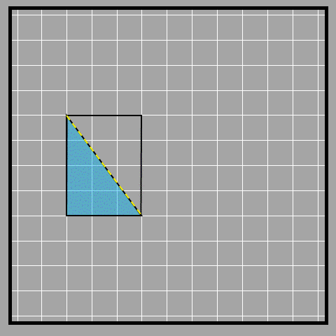
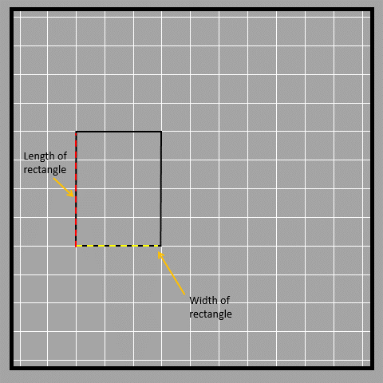
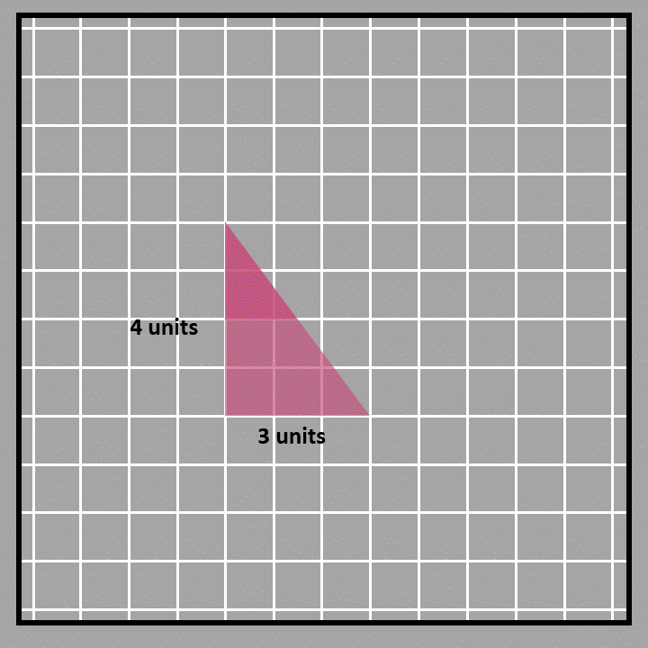
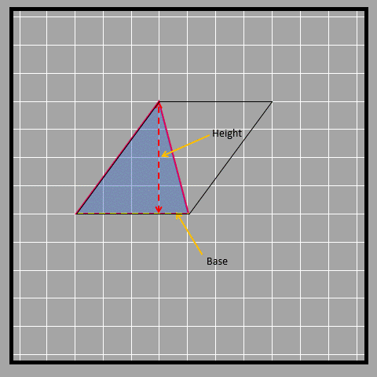
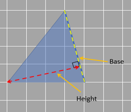
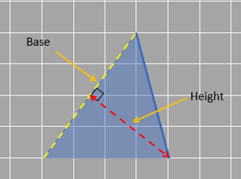
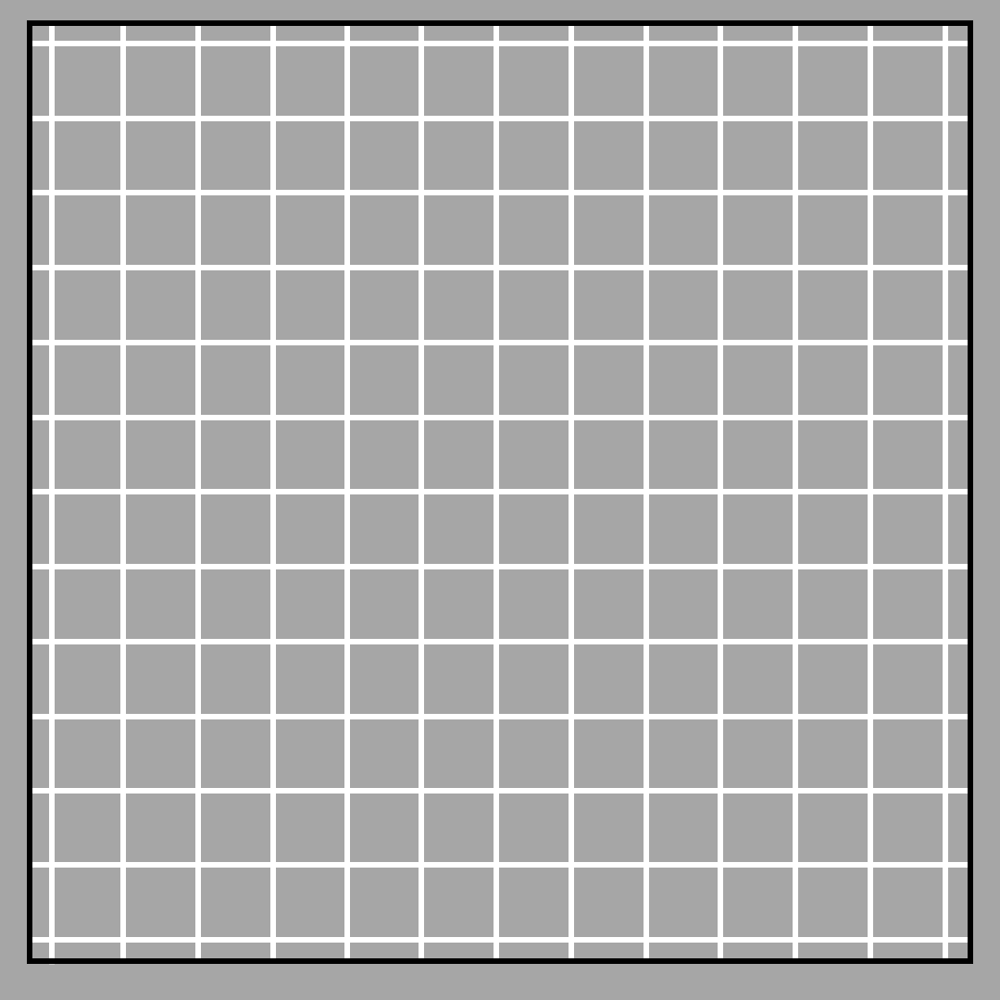
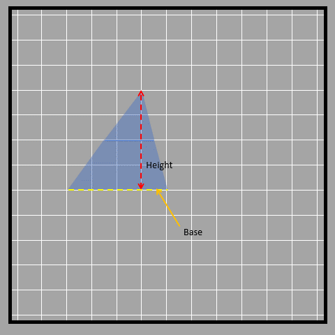
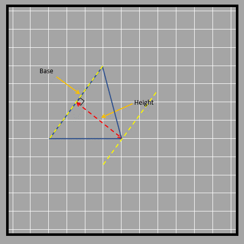

## Triangles

### Area of right-angled triangle

We have a triangle with a right angle that measures 90° shown in the picture (hence the name of the triangle). How can we find the area of this shape? 

We could count, but it's tricky when we don't have full complete squares. (But you can still give it a try!) There's another way we can do it though. 

If we make a copy of the triangle and put it like in the picture below, we can make a rectangle.

Look at the yellow line in the picture. It cuts the rectangle into two equal triangles. We find the area of a rectangle by multiplying the length and width. The base and height of a right-angled triangle are the length and width of the rectangle. We can call the length the base or the width the height as well.

We made a rectangle using two triangles, which means the rectangle's area is twice the area of one triangle. Since there are two triangles inside the rectangle that are the same size and shape, the area of each triangle is half of the rectangle's area. To find the area of a right-angled triangle, we use the formula ½ x base x height, which is just half the area of the rectangle. In this case, the base and height of the triangle are two sides of the rectangle that are perpendicular to each other.

We can also use decomposition to find the area of a triangle. We'll use the same triangle as an example. First, we'll cut the triangle in half at its height of 2 units. Then, we'll rotate one half and attach it to the other half to make a rectangle. The base of the triangle is the same as the length of the rectangle, which is 3 units. The height of the rectangle is half of the original height, so it's ½ x 4 units. To find the area of the rectangle, we multiply the base and height, which is (½ x 4) x 3 = 6 square units. Since the rectangle and triangle have the same area, we can use this formula to find the area of the triangle too: ½ x 4 x 3. This means the height of the triangle is 4 units and the base is 3 units. So, the formula for the area of a triangle is ½ x height x base.

### Area of a triangle 

We know how to find the area of a right-angled triangle, but what about other types of triangles? Let's see if the same method works for them too.

To find the area of a parallelogram, we multiply one of its sides (base) with the height. Since rectangles are also parallelograms, we can use this formula to find the area of a triangle too.

First, we can split a parallelogram into two triangles by drawing a diagonal. In the picture below, we have a parallelogram with its diagonal and the resulting triangles. Note that these triangles are not right-angled like before.

From the figure, we see that the two triangles have equal area, and therefore the area of each triangle must be half of the parallelogram’s area.
Area of parallelogram = 2 x area of triangle 
Therefore, area of triangle = ½ x area of parallelogram
Since the area of parallelogram = base x height, the area of triangle = ½ x base x height
The base and height of the parallelogram are the base and height of the triangle as well.

So we learned that a formula can be used to find the area of any type of triangle, not just ones with a right angle. But it's easier to figure out which side is the base and which is the height only when dealing with right-angled triangles. Sometimes it can be tricky to figure out which side of a triangle is the base and which is the height, especially if the triangle doesn't have a right angle.

Remember how we can pick any side of a parallelogram to be the base? The same goes for triangles! Any of the three sides can be the base and depending on which side you choose as the base, the height will be the line that is perpendicular  from the opposite corner to that base.

Look at the three different bases and their corresponding heights.

------------------------------------------------------------

------------------------------------------------------------

------------------------------------------------------------

Let’s look at an obtuse-angled triangle in which it isn’t that obvious to identify the base and height.

As shown, sometimes the height of a triangle is shown outside of it. This is because the height always has to be perpendicular to the base and sometimes that straight perpendicular line doesn't fall inside the triangle.
Another way to find the area of a triangle is to break it down into smaller shapes.
We can use the same formula we learned before by breaking the triangle into a parallelogram with the same base but half the height. First, we find the middle point of the height of the triangle. Then, we rearrange the triangle on the other side to form a parallelogram as shown in the picture below.

Visually, when we compare a triangle to a parallelogram with the same base and half the height, we can see that they have the same area. Mathematically, we can say that the height of the parallelogram is half the height of the triangle, but the base is the same. So, the area of the parallelogram is base times height divided by 2, which is also the area of the triangle. We can write this as ½ x base x height.

Just like parallelograms, the area of a triangle stays the same as long as the height and base stay the same. Even if the sides of the triangle are tilted, the area will remain constant as long as the height is drawn from the vertex opposite to the base and is parallel to the base. 

