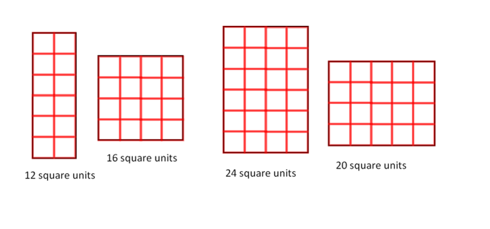
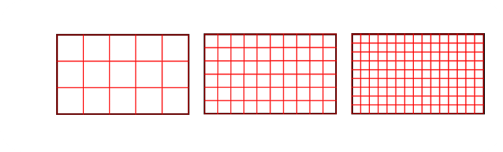

### Unit used to measure area

Just like with length, we can use any unit to measure area. In the case of length, we use units such as centimeters, inches, feet, meters, kilometers, and so on. To generalize the concept, we consider the "unit" as a standard value that serves as a reference for comparing other lengths. For example, if the length of a line joining two points is 5 units, it means it is five times greater than the standard unit, which could be a centimeter, an inch, or a kilometer. Based on this, the given value could be expressed as 5 mm, 5 inches, 5 cm, 5 meters, and so on.

In the context of area, we refer to the unit of measurement as "square units" throughout this lesson. But what does "square units" actually mean?

The square we use for measuring area has a side length of 1 meter. To generalize, let's consider it as 1 unit (similar to length). However, if we use "unit" to refer to both area and length, it can lead to confusion. Therefore, instead of using "1 unit" as the unit of measurement for area, we use "square units" to differentiate it from length. It's quite simple, really! The small square itself has an area of 1 square unit since both sides have a length of 1 unit. So, if a rectangle can fit 10 of these squares, its area would be 10 square units. If we were using a square with a side length of 1 centimeter, the area would be expressed as 1 cm² (cm square) or 1 cm², where the superscript 2 denotes "square." If we use this square to measure the area of a shape and find that 500 squares with a side length of 1 centimeter can fit, the area of the shape would be 500 cm². (We'll explore this further later on.)

Now that we know how to use squares to measure area, let's apply this method to find the area of the four shapes from the beginning and determine if we ordered them correctly. In this case, we'll use square units without specifying any particular physical unit like centimeters or meters.

It seems we were mistaken about the last two.

When finding the area of a shape using squares, it's important to use the same-sized square for all the shapes being compared. The actual size of the square doesn't matter as long as it's consistent for all the shapes.

So how do we know which sized square we should use?
In the example of a rectangle, there are different ways to find the area using squares, as shown. 

The first approach may seem correct because it uses the least number of squares. However, we are not asked to compare the different methods or determine which one is the largest or smallest. We are simply asked to find the area of the rectangle.

Surprisingly, all the methods shown are correct, even though they yield different areas for the same rectangle. This is because the area is ultimately determined by the number of squares that can fit inside the shape, regardless of the specific method used. As long as we consistently use the same-sized square for all the shapes, the calculated areas will be valid.

So, while the methods may yield different numerical results, they are all technically correct in terms of finding the area of the rectangle using squares.

Just like in the case of measuring length, the choice of unit for measuring area can result in different numerical values, but it doesn't change the actual area of the shape being measured. The underlying concept remains the same.
Using your example, when measuring a line against a 1-meter line, we get a measurement of 5 meters. However, if we measure the same line against a 1 cm line, we get a measurement of 500 cm. The difference in numerical values is due to the difference in units used for measurement, but the actual length of the line remains unchanged.

Similarly, when measuring the area of a rectangle, we can use squares of different sizes as our unit of measurement. Changing the size of the square will result in different numerical values representing the area (15, 60, 135 in your example), but the actual area of the rectangle remains the same.

So, the key point to understand is that the choice of unit affects how we represent the area numerically, but it doesn't alter the intrinsic size or space occupied by the shape itself.

In our example, you used different units (a, b, c) to represent the size of the squares used for measuring the area of the rectangle. Let's recap:

- In the first case, the size of the square used is 1 'a'. Since there are 15 squares that fit within the rectangle, we can express the area as 15 square 'a's.
- In the second case, the size of the square used is 1 'b'. With 60 squares fitting within the rectangle, the area can be expressed as 60 square 'b's.
- Finally, in the third case, the size of the square used is 1 'c'. The rectangle accommodates 135 squares, so the area is 135 square 'c's.

The area of a shape remains the same regardless of the unit or size of the square used to measure it. The numerical value of the area will change depending on the unit or size of the square used, but the actual amount of space covered by the shape remains constant. What it means is that the area covered by 15 square ‘a’s is the same as the area covered by 60 square ‘b’s and 135 square ‘c’s.

Using a smaller square unit will result in a higher numerical value for the area because it takes more of those smaller squares to cover the same space. Conversely, using a larger square unit will give a smaller numerical value for the area because fewer of those larger squares are needed to cover the same space.

Let's explore the relationship between different units of area using real-world measurements.

We know that one foot is equal to 12 inches. Now, we want to find out how many square inches are equal to 1 square foot.

At first, it might seem like the answer is 12 square inches. However, let's confirm this visually using some figures.

By examining the figures, we can see that each side of the square with 1-foot length can be filled with 12 squares in both directions. This means that the total number of squares needed to completely fill the figure is 144 squares, each with a side length of 1 inch.

Therefore, we conclude that the space covered by 144 squares, each with a side length of 1 inch, is equal to the space covered by 1 square with a side length of 1 foot. 
So, 1 square feet = 144 square inches 
1 feet^2= 144 inch^2

Let's analyze the relationships required to convert units from square feet to square inches.

In the case of length, we know that 1 foot = 12 inches

This means that to convert a length from feet to inches, we multiply the given value in feet by 12.

However, when it comes to area, the conversion is a bit different. We have,
 1 square foot = 144 square inches

So, simply multiplying the unit given in square feet by 12 is not sufficient. We need to multiply it by 12 x 12 because that's how many squares of 1-inch side length can fit in a square of 1 foot.

To illustrate this, consider that the space that can accommodate 12 squares of 1-foot length can also hold 12 x 12 x 12, which equals 1728 squares of 1-inch length.

12 feet^2 = 12 x 1 ft x 1 ft = 12 x 12 inch x 12 inch = 1728 inch^2

The choice of which square to use for measuring area depends on the size of the area we want to measure. If we want to find the area of a small space like a room's floor, using 1-foot squares could be practical. On the other hand, if we want to measure a large area like a football field, using 1-meter squares would be more suitable. 

The reason for selecting the appropriate square size is to strike a balance. If we were to use tiny 1-centimeter squares to measure the football field, it would be an overwhelming task to count each and every square. It would be tedious and time-consuming. That's why we avoid using a smaller square for measuring large areas. 

Similarly, using larger squares for measuring smaller areas doesn't make sense either. For instance, measuring the area of a room's floor with a square that has a side length of 1 kilometer would be impractical and unnecessary. 

Therefore, it's important to think about the appropriate units before measuring an area and choose a square size that matches the scale of the area being measured.

