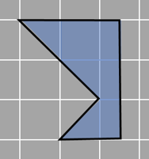

## Finding area using decomposition (complex shapes)

We can use decomposition to find the area of different shapes. It's really helpful when we don't know the shape well. For example, let's say we have a shape we don't know how to find the area of. We can break it down into smaller shapes we do know how to find the area of.

Sometimes, we have to break down and rearrange the shape more than once to find the area, like given below.

Our goal is to get as many complete squares in the shape as we can. To do this, we can add more lines to the shape to make it easier to work with. 
To start, we draw a vertical line in the shape. Then, we use decomposition and rearrangement to turn it into a pentagon shape.

 
We get a figure somewhat like the one shown below.

The shape we're looking at is made up of two trapeziums. We can use a formula to find the area of each trapezium and add them together to get the area of the whole shape. 

Another way to find the area of the shape is to break it down into smaller parts. We can turn the half triangle at the bottom of one of the trapeziums into a whole square.

Now, we have a new shape that's made up of a triangle (half a unit square), 3 rectangles (half of a unit square), and 2 squares (one unit square). 

When we add the areas of all the individual pieces we get:
Total area= 0.5 +1 + 1 + 0.5 + 0.5 + 0.5 = 4 square units.
It is always a matter if an incomplete square can be combined with another incomplete square to make a complete square! It's like a puzzle! Sometimes you need more than two pieces to make a complete square, but you can figure it out by trying different combinations. You can even rotate the pieces to make them fit. This idea of breaking shapes into smaller pieces can be used for any polygon.

