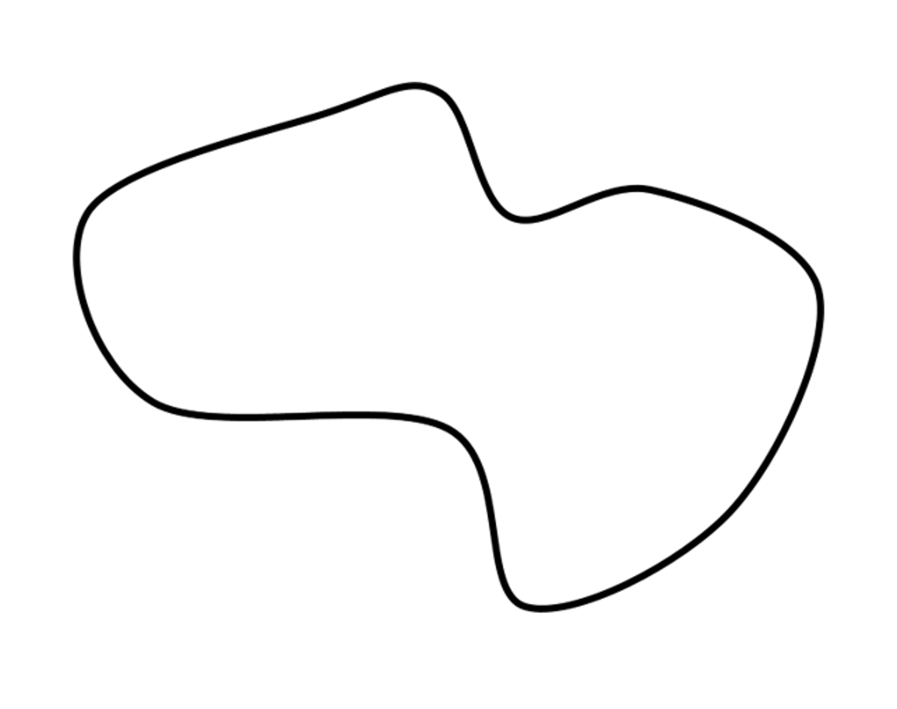
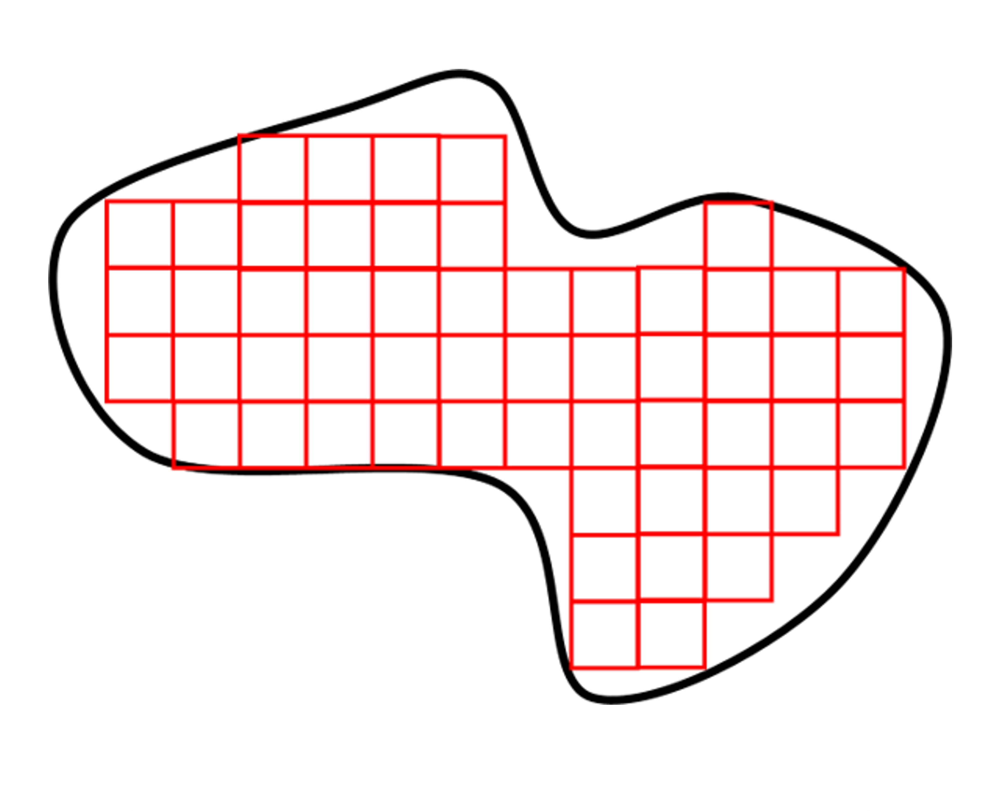
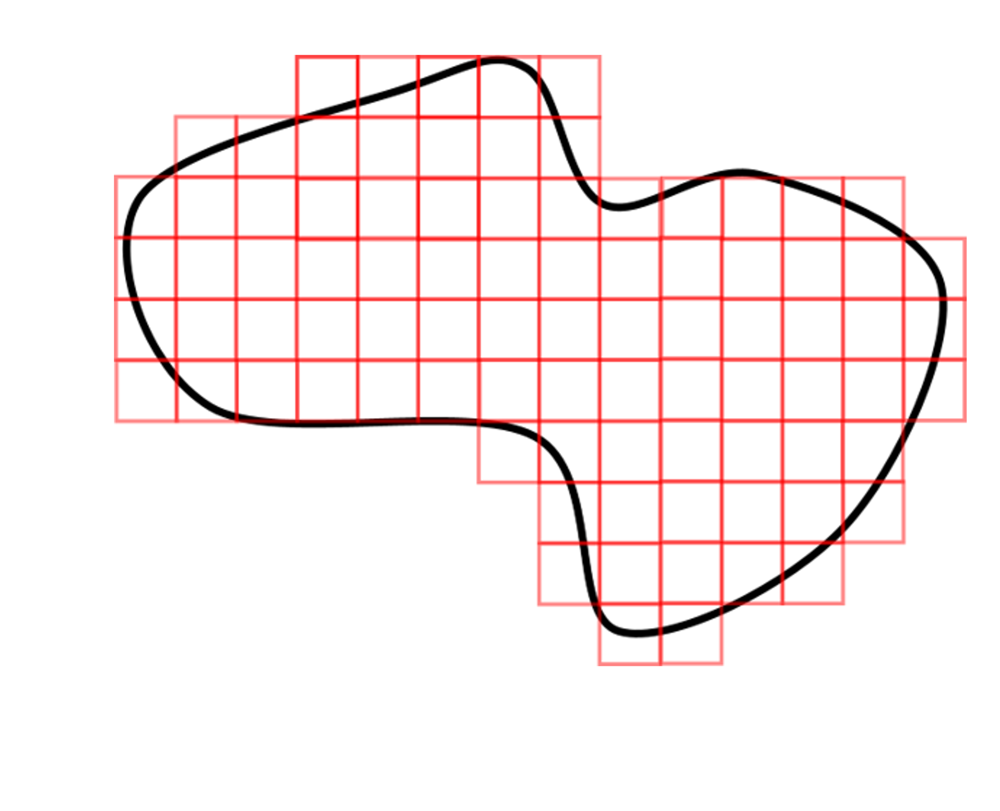
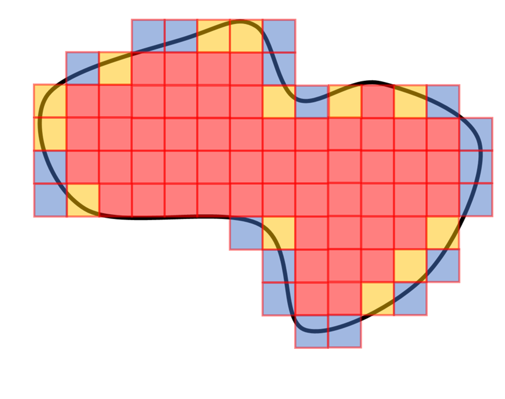
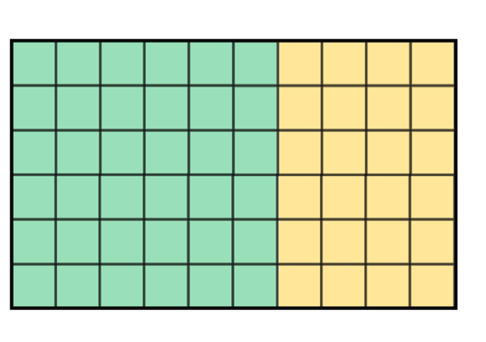
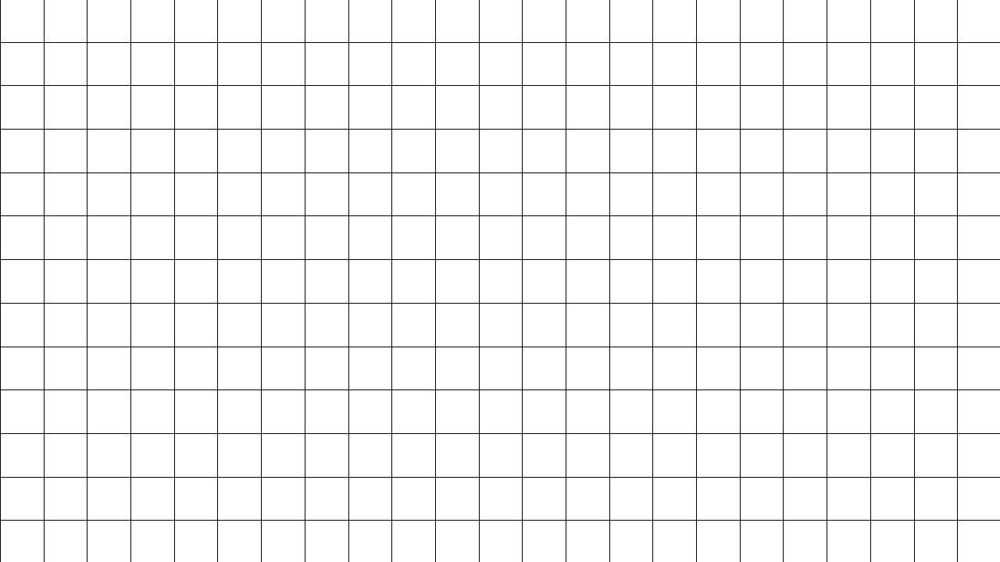

## Area of different shapes
### How to count unit squares?

Just because we used the example of a rectangle does not mean that it only works for a shape with straight edges like rectangles or squares. It can be used for any kind of shape.

Let’s use an example:

1_11

For finding the area of the shape above, would you still use squares? Or would you use an irregular shape like the one above? A square is always used to measure area, no matter what the shape is like.

So let's try seeing how many squares fit in the above shape. 

image 1_12

Unlike before, we see that there are some missing spaces without squares and somewhere the squares are outside the shape itself. But that’s okay. There are two ways you could solve this.

Method I:

Just add squares to completely cover the shape first, even if they are outside the outline. 

Image 1_13

Then we count all the complete squares inside the shape along with more than half that are complete and less than half that are complete. I’ll highlight them below.

Image 1_14

We see that we have 54 complete squares inside the shape (marked as red). 
There are 13 squares that are more than half included in the shape. 
Finally, there are 19 squares that occupy an area of less than half a square unit included in the shape. 
Using this information, we can estimate the area. For all ‘more than half included’ squares, we can consider them to have a value of 0.75 on average. The same goes for ‘less than half includes’ squares, for which we can provide a value of 0.25 on average. 
Now, let’s add up the squares with their respective values.
54 + 13 x 0.75 + 19 x 0.25 = 68.5 

The area occupied by the irregular shape is nearly equal to 68.5 squares or 68.5 square units. The value may not be totally accurate because the values we took for incomplete squares (0.25 and 0.75) were just estimates and not exact ones. 
Also, try not to forget the unit since that is what tells us if we are measuring area or length, or any other physical quantity. Since we did not have the standard unit for the length of the squares drawn, we wrote 68.5 square units only. 

While measuring the area of a curved shape is slightly more work, it works just the same!

We will see other types of shapes (triangle, parallelogram) and how to find their areas later. 

### Decomposition
So far, we have only looked at geometric shapes without actual contexts or examples. Let’s see one now and learn a new topic on the way as well!

Given is an image of a garden. The area marked green is used for growing vegetables and the area marked yellow is for growing flowers. We also see squares being shown in the two areas, and each square is 1 square foot in size. 

image 1_15

By counting the number of squares, it is easy enough to find the area of the vegetable growing part and the flower growing part. 

We have 36 squares of size 1 square foot filling the vegetable area, so the area is 36 square feet. Similarly, the area of the flower growing section is 24 square feet. 

We could also find the total area of the garden by counting all the squares.  This gives us the area of the garden as 60 square feet as the answer. 

Here’s a question for you. 

Do you think that you could have found the area of the garden by adding the areas of the vegetable part and the flower part? It makes sense right? Since the area representing these two parts make up the whole garden itself, if we add the areas of the two together, we get the area of the total garden. 

We can also show this using the values we found earlier.

Area of vegetable part + Area of garden part = 36 + 24 = 60 square feet
The same as the total number of squares that fit the whole garden. 

Even though the concept seems obvious, this is the basic idea behind ‘decomposition’. Decomposition means breaking down a shape into smaller ones as we do with the garden to create vegetable and flower parts. This becomes a very useful concept for finding the area of difficult shapes.

As we say, decomposing a shape into smaller parts does not change the overall area of the shape. Simply adding the smaller areas will give us the total area. We can see this clearly below.

1_16

While this may seem kind of obvious in our previous example, the idea of decomposition is very helpful when we have to find the area of unusual shapes. We will see this later.

Let’s look at something interesting. 

Image 1_17

Here, we have a square, a cat-like shape, and a house-like shape. 

The house seems to have the smallest area. And the cat seems to have the largest area. 

But look at the animation below.

1_18

The same pieces make up the square, the cat and the house!

So even when shapes look completely different, they could have the same area if they have been decomposed and rearranged. 