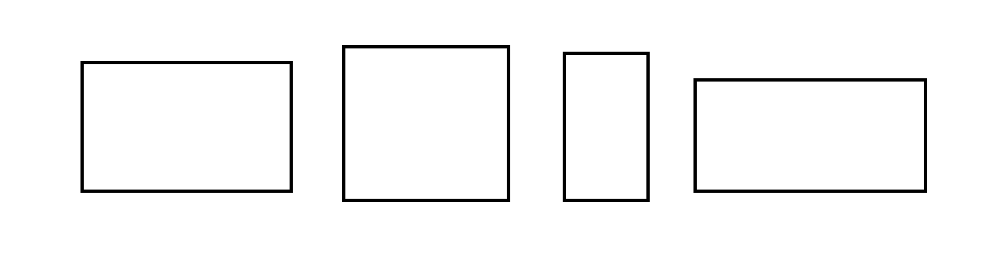
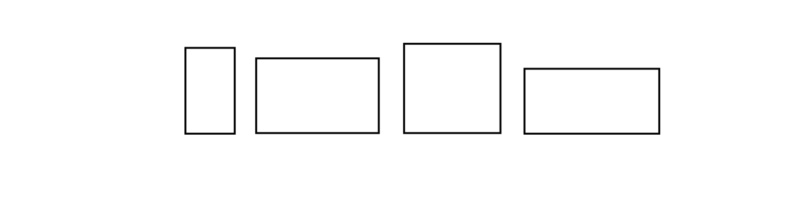
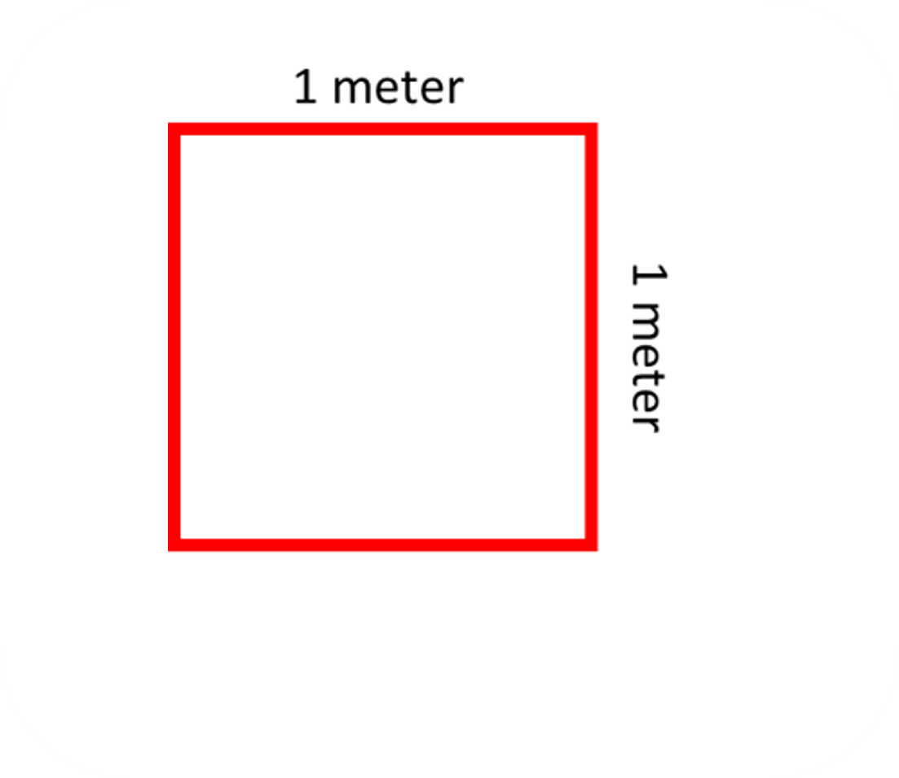

## What is area?

To understand area, let's look at different shapes.

You can see that the sizes of these shapes are not the same. Now, imagine placing each shape on a large piece of paper or the floor. Which shape do you think takes up more space?

We can make a good guess just by looking at the images. Generally, bigger shapes occupy more space, right? So, let's try arranging them in order from smallest to largest based on how much space they seem to occupy. But remember, this is just an estimate.

It looks like a reasonable order, but can we be absolutely certain that this order is correct?

Knowing the exact amount of space a shape occupies is important in mathematics. For instance, imagine you need to cover all the walls of classrooms with wallpaper. How will you know how much wallpaper to buy? How will you explain it to the shopkeeper? There are many other situations where we need to measure different surfaces. So, how do we find the measurement?

This is where we use 'area.' Area tells us how much space a shape occupies.

Now, let's learn how to find the area of a shape.

When you draw a shape on a piece of paper, it's hard to determine the space it occupies because the paper is blank. However, by visually comparing shapes, we can usually tell which one has a larger or smaller area. The bigger the shape, the more space it occupies, so it has a greater area. This method of visually comparing sizes is useful when the shapes are noticeably different in terms of the space they cover.

However, sometimes shapes look very similar, and it's difficult to determine which one is larger. In math, we need to be precise.

So, how do we achieve this precision?

For this, let’s go back a few topics to the idea of measuring length.

To measure length, we use a unit of measurement, such as a meter. When measuring a line, we count how many 1-meter units fit into the line. For example, if the line can occupy five 1-meter units, then the length of the line is 5 meters. This allows us to accurately measure the length instead of just estimating. Here's an illustration of this concept:

The concept of measuring area is similar. We also need a standard unit of measurement against which we can compare the area of any object. Can't we use the same unit as for length?

Let's try it out with a rectangle:

A rectangle has a length and a breadth (or width). Here, the length refers to the horizontal side, and the vertical side is the width (although the names can be interchanged). In this example, the sides of the rectangle are three times the length of the standard 1 meter. Therefore, we can measure the length to be 3 meters. But what about the width? We need to measure that as well. From observation, we can determine that the width is 2 meters. Now we know the length and width of the rectangle, but how do we express the amount of space it occupies? What is the area?

Since the rectangle has a new dimension (width in addition to length), it makes sense for the unit of measure to also have a new dimension, rather than using the one for length alone. The dimensions of a figure provide an idea of the size occupied by an object. We need a new quantity to define the space occupied by an object because we can change the space occupied by the object in two ways.

Instead of using 1 meter as the unit, we introduce an additional dimension when working with shapes. Adding a new dimension with the same length gives us a square, with both sides measuring 1 meter. Now we have a measurement unit with both length and width.

In the case of length, we determined how many 1-meter lines could fit within the line we wanted to measure. Similarly, when calculating the area of a rectangle, we determine how many squares with a side length of 1 meter (as shown above) can fit within it. Let's take an example of a rectangle and see how many of the given squares can fit within it:

In this particular rectangle, we can observe that 15 squares with a side length of 1 meter fit inside it. This is what area represents—the number of squares that can fit inside the rectangle or any given shape. In this case, the area of the rectangle is 15 squares with a side length of 1 meter.

I understand that this explanation might seem a bit lengthy. However, we'll simplify and provide an easier way to remember the concept of area soon.

