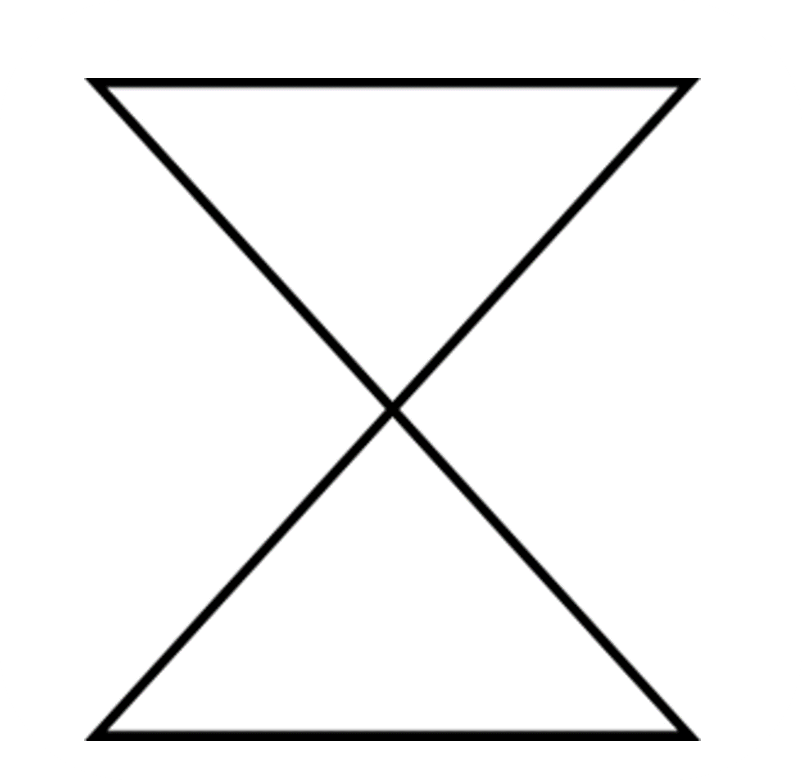
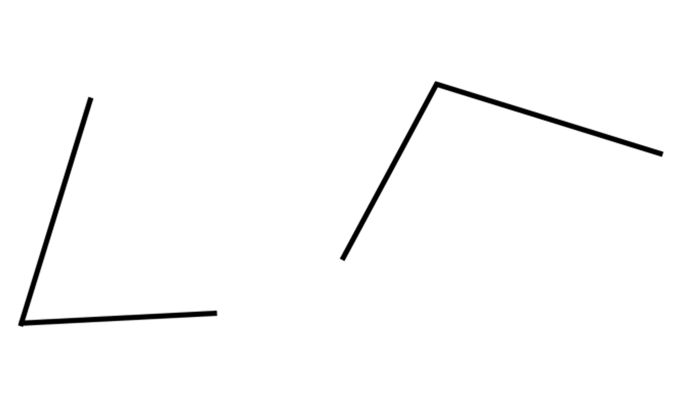
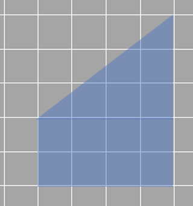
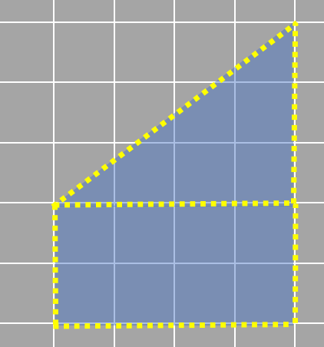
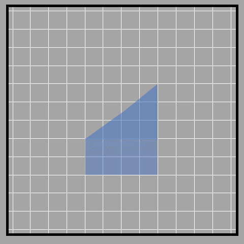
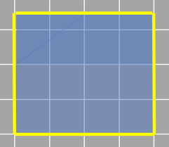
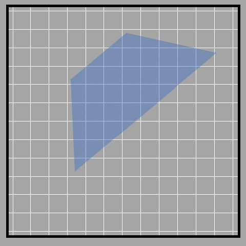
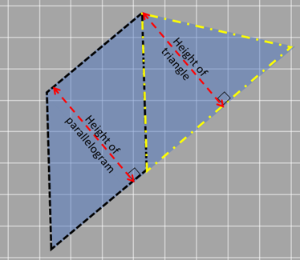
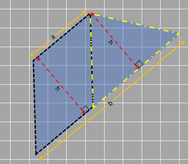
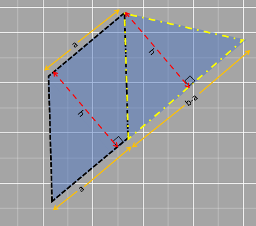

## Polygon

A quadrilateral is a polygon with four sides. But what is a polygon? We've already learned about triangles and rectangles, which are both types of polygons. Essentially, a polygon is a closed shape made up of lines. Different polygons have different numbers of sides.

The word "polygon" is made up of two parts (makes it easy to understand). "Poly" means many, and "gon" means sides. So a polygon is a shape with many sides!

Some things to keep in mind about polygons: Polygons are shapes made of straight lines that are connected end to end. To be a polygon, the shape must be closed and have no curved lines. This means that circles are not polygons. The straight lines that make up a polygon are called its sides. It's important to remember that none of the lines can cross each other.

The shape shown crosses in the middle, so it is not a polygon.

Let's talk about polygons! Do you know how many sides a polygon needs? Is it just one side or a hundred? The maximum number can be any number of sides; as long as the sides connect, it's a polygon. 

But what about the smallest polygon? Can you have a polygon with just one side? Let's find out! 

We'll start with one side and see if it still counts as a polygon.

Well, that clearly is not a polygon since a closed shape is not formed. 

What about two sides?

Have you ever tried drawing a closed shape with only two lines? It's impossible! Two lines can't make a closed shape. So it is not enough to make a polygon either. 

But when we add a third line, something magical happens. We can finally make a closed shape - a triangle!

It turns out that we need at least three sides to make a shape called a polygon. 

The number of sides also determines the name of the polygon.  A polygon with 3 sides is a triangle, a polygon with 4 sides is a quadrilateral, a polygon with 5 sides is a pentagon, and so on. Cool, right?

### Area of trapezium

Sometimes we come across shapes that don't have an easy way to find their area. But don't worry, we can break them down and rearrange them to make it easier! 

When we break down a shape, we try to make it look like a shape we already know how to find the area of, like a rectangle or triangle. Then we can use the formulas we already know to find the area.

For instance, the shape we're looking at right now is called a trapezium. It has two sides that are parallel to each other and two sides that aren't (the two vertical sides are parallel).
 

Let's break down the trapezium into a triangle and a rectangle to find its area. We can use the formula for triangles and rectangles to find their areas and then add them up. 

But there's an easier way! We can divide the triangle in half by drawing a line from the top corner to the midpoint of the bottom side. Then, we can move that triangle over to make a parallelogram (a rectangle in this case). 

Now that we have a rectangle, we can either count the unit squares or simply use the length times width formula.

This shape has a length of 4 units and a width of 3.5 units. When we multiply the length and the width together, we get the area of the shape. In this case, the area is 14 square units. That's how much space the shape takes up, and we get the same if we count the number of square units it occupies as well!

Sometimes,  trapeziums don't have straight horizontal or vertical sides like the one we just talked about. But don't worry! We can still figure out the area by breaking it down into smaller shapes. We can either make it into a triangle and a parallelogram or a rectangle and two triangles. It's up to us to decide which way is easier!

By using one of these ways, we can also find the formula for finding the area of a trapezium. First we need to find the area of a trapezium by breaking it down into a parallelogram and a triangle. For that, we need to know the measurements of the trapezium. 
The height is the distance between the two parallel lines (called ‘h’), and the shorter and longer sides are called ‘a’ and ‘b’.

To decompose the trapezium, we draw a line parallel to one of the sides. This creates a parallelogram and a triangle, like in the picture.

Lucky for us, the height of the parallelogram is the same as the height of the triangle since they lie between the same parallel lines So, we'll call that height 'h' for both, just like we call the height of the trapezium 'h'. 

Now, let's talk about the base of the parallelogram. Since the opposite sides of a parallelogram are equal, we can call one of the sides 'a' as the base. Easy enough! 

Finally, we need to figure out the base of the triangle that's in the trapezium. We know that the longer side of the trapezium is 'b', and we've already called one side 'a'. So, the base of the triangle is 'b-a'. 

[Base of the parallelogram + base of triangle = b 
a + base of triangle = b 
Therefore, the base of triangle = b - a]

Now for the area of a trapezium. We can obviously just add the areas of the two shapes together to get the total area of the trapezium. 

Area of the trapezium = area of the parallelogram + area of triangle 
= base x height + ½ x base x height
= a x h + ½ x (b-a) x h 
= h x (a + b/2 - a/2) 
= h x (a/2 + b/2) 
= ½ x h x (a+b)

When writing in terms of the dimensions of the trapezium, we have the area of trapezium as:
= ½ x distance between parallel sides (or height) x sum of parallel sides

This formula uses the height and the sum of the parallel sides to find the area. 

But don't worry if you don't want to use the formula! We can just find the area of a trapezium by breaking it down into shapes we already know how to find the area of. We can add the areas of these shapes together to find the total area of the trapezium.

