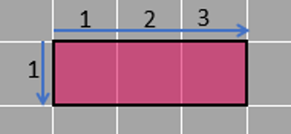
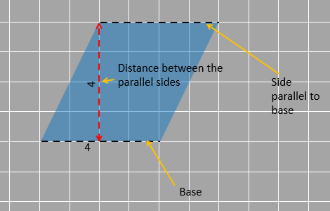

## Area of rectangles

### The formula

We can find the area of a rectangle by counting the squares inside, but for large rectangles, that can be time-consuming. That's why we use a formula to find the area, like we do for most things in mathematics.

To understand the formula, let's consider a rectangle drawn over unit squares. This is basically to show how many squares it overlaps. Each square represents one square unit, and they help us determine the rectangle's area.
  

The given rectangle has a length of 3 units in the horizontal direction and a width of 1 unit in the vertical direction. (The two sides are length and width/breadth. Normally the longer side is called the length (and that is what we will be doing here) but the names can be interchanged; Any side can be called length and the other side joined to it is called the width.) Three squares mean the length is 3 units and the breadth is 1 unit. 

The area of the rectangle is 3 square units or it can also be said that three squares of unit length can fit inside the rectangle.

When we find the area, we can think of it as adding 1 three times. It's like taking a square unit and adding it three times, which we can write as:

1 + 1 + 1

This is essentially repeated addition, which can be written as 3 x 1.

In this case, 3 x 1 means we are multiplying the length and breadth together, which gives us 3 square units (since 1 square unit = 1 square unit + 1 square unit = 3 square units and 3 units x 1 unit = 3 square units).

Does this mean that multiplying the length and breadth of a rectangle always gives us the area? Let's continue and see if this holds true for other cases or if it's just a coincidence.

Interestingly, when we multiply 1 and 3, we also get 3 as the result.

Now, let's explore what happens to the area of a rectangle when we double one of its sides. Here is a rectangle that is formed by doubling the width of the previous rectangle.

Here, the rectangle covers 3 units horizontally and 2 units vertically. We can observe that there are 6 unit squares within the rectangle, indicating that 6 squares of unit length can fit inside.

Using our previous method, we can consider this as adding 2 square units three times.

2 + 2 + 2

We use 2 because that is the number of squares in each vertical column. By adding 2 + 2 + 2, we obtain 3 x 2, which represents the length multiplied by the breadth of the rectangle.

2 + 2 + 2 = 3 x 2 = 6

Multiplying 2 and 3 gives us 6 as the product. Therefore, the area of the rectangle is 6 square units.

Based on the calculations above, we can conclude that the area of a rectangle is found by multiplying its length and width.

If the rectangle has a length of 'ℓ' units and a width of 'w' units, the area of the rectangle will be 'ℓ x w' square units. Remember that while length and width are measured in units, area is measured in unit x units, so the unit changes after multiplying ℓ and w, resulting in square units.

As mentioned earlier, this method of multiplying the dimensions (length and width) of the rectangle is useful when we want to avoid counting individual unit squares, especially when there are too many of them.

This formula also works when there are incomplete squares inside the shape, as shown in the example below.

In the given rectangle, the length is 2.5 units and the width is 2 units. The length of the rectangle is 2.5 because it extends exactly halfway between 2 and 3 horizontally.

The total area of the rectangle is calculated as 2.5 x 2 = 5 units.

### Decomposition into rectangles

We have previously discussed the concept of decomposition, but let's revisit it to understand its usefulness. Decomposition involves breaking down a shape into smaller parts. These parts can have various shapes, but we try to fit them into familiar geometric shapes to make it easier to calculate their areas. Another important aspect is rearrangement, which means repositioning and rotating the decomposed pieces without changing their shape or size.

Why do we decompose shapes? Well, so far, we have determined the area of a shape by counting the unit squares it covers. However, in some cases, the shape may be unfamiliar or have irregular sides, making it difficult to count the squares accurately. That's where decomposition comes in handy. By decomposing a shape, we can transform it into a more familiar form, making it easier to calculate the area. We tend to find it simpler to work with regular geometric shapes.

Let's explore an example where the unit squares are only partially occupied. Since counting complete squares is easier, we decompose and rearrange the partially occupied squares to maximize the number of full unit squares. In this case, we have two half squares, and by decomposing one of them and rearranging it with the other half, we can form a complete square.

On the right side, there are two rectangles that are not complete. The incomplete squares together form a rectangle that is half a unit wide and two units tall. We break it apart and rearrange the pieces. By doing this, we can create one complete square, like shown below.

After rearranging the pieces, the figure looks like this.

Now, we can easily count the squares in our shape, and the area remains the same because we have taken it apart and rearranged it.

The figure occupies an area of 5 square units. We know this because there are 5 unit squares that fit perfectly within the figure.

We can break down any shape with straight sides (like polygons) into multiple rectangles, both vertically and horizontally. This makes it easier for us to find the area. Let's give it a try with the shape given below.

There isn't a straightforward formula to find the area of this shape, like we have for rectangles. So, let's use rectangles instead! We can draw two horizontal lines to break down the given figure into three rectangles. The lengths and widths of these rectangles are shown below:

By using the formulas for the three rectangles, we can calculate the total area of the figure without having to count each square. The calculation is as follows:

2 x 1 + 5 x 2 + 10 x 3 = 2 + 10 + 30 = 42 square units.

There's no specific rule on how we should break down a shape. We could have also used vertical lines to decompose the same figure. If we draw two vertical lines inside the figure, we get three rectangles with lengths and widths shown.

Thus, the area of the entire figure can also be found by using the formulas for these rectangles:

2 x 6 + 3 x 5 + 5 x 3 = 12 + 15 + 15 = 42 square units.

The results are the same! Both figures demonstrated that the area of the shape is 42 square units. If we count all the squares inside the shape, we will also find that there are 42 unit squares. Although the methods may appear different, they all follow the same logic: the combined areas of the smaller pieces inside a shape are equal to its total area.

When a figure is larger than the one shown above, dividing it into unit squares and counting them becomes a tedious process. That's why we use the formula of multiplying length and width.

However, we don't necessarily need to count the squares themselves to find the length and width of a rectangle. For instance, in the given rectangle, its sides are divided into units on the scales, shown as divisions without the unit square representation. This is sufficient for us to determine the length, width, and consequently, the area.

We can calculate the area of a rectangle by multiplying the measurements of its two sides. In this case, the area is found by multiplying 5 and 4, which equals 20 square units.

But does the rectangle really contain 20 unit squares? How can we be sure without the squares to prove it? To find out, let's extend the divisions shown throughout the rectangle.

When we extend these divisions, we can see that the rectangle is indeed filled with 20 unit squares.

It's important to ensure that the divisions shown are of equal length in such cases. Uneven divisions won't extend to become unit squares, resulting in an incorrect area calculation. So, it's crucial to have equal length or width divisions to accurately measure the area.

### Area of parallelogram

We have examined a shape called a rectangle, which is a type of polygon with four sides. You are also familiar with a square, which is essentially a special kind of rectangle with all sides equal. However, there are other four-sided shapes that don't have right angles.

To generalize, any polygon with four sides is called a quadrilateral. We have already learned how to find the area of a rectangle, which is a specific type of quadrilateral. Now, let's explore another one.

A quadrilateral where opposite sides are equal in length and parallel to each other is called a parallelogram. This might sound similar to a rectangle, right? Well, a rectangle is actually a special type of parallelogram where all angles are 90°. However, when the angles are not 90°, we have a shape with only opposite angles equal and opposite sides parallel and equal. The picture below shows an example of a parallelogram.

How can we find the area of such a shape? One option is to count the square units inside it, but that can be time-consuming. It would be easier if we could find a formula to calculate the area more quickly.

To do that, let's decompose and rearrange the parallelogram into a rectangle so we can use a formula. Let's see if we can accomplish that.

We can break down the parallelogram in a way that we obtain a right-angled triangle. Then, we can move that triangle from one side of the parallelogram to the other side to complete the rectangle. In the picture given, you can observe the triangle on the right being moved to the left side.

After rearranging the decomposed triangle, we obtain a rectangle (which is actually a square) with dimensions 4 by 4, as shown below.

In the given image, you can see the resulting rectangle (square) more clearly.

Once we have a square or rectangle, we can easily find the area by multiplying its length and width, both of which measure 4 units. The area of the rectangle is calculated as 4 multiplied by 4, which equals 16 square units.

So, in essence, we used the same formula for rectangles to find the area of a parallelogram. Can we then say that rectangles and parallelograms have the same formula? Let's confirm and explore how the formula for the area of a rectangle is related to that of a parallelogram.

Now, let's examine another parallelogram that has one of its sides measuring 4 units horizontally, with parallel lines at a distance of 4 units.

Similar to our previous approach, we will decompose the parallelogram and obtain a rectangle (or square) with a length and height of 4 units each, as shown below.

It's indeed strange, but both parallelograms have the same area. Even though they may appear different, there are similarities between them.

Firstly, the base of both parallelograms is the same length, which is 4 units. Additionally, the horizontal parallel lines in both parallelograms are also at a distance of 4 units.

The only difference between the two parallelograms is the angle of inclination of their sides.

By using the concept of decomposition and rearrangement, we obtained a rectangle from the parallelogram in both cases. Consequently, we can be certain that the areas of both figures are equal. 

When we examine the parallelogram closely, we find that its area depends on one of its sides (represented by the black dotted line) and the distance between that side and its opposite side (represented by the red dotted line). In the figure, these measurements are highlighted.

In both the parallelogram and the rectangle, the common horizontal side is referred to as the base, as shown below.

The vertical arrow (highlighted in red) represents the height, which is the distance between the base and the side parallel to the base.

Therefore, to find the area of a parallelogram, we can simply use the same formula as that of a rectangle.

Hence, the area of a parallelogram is calculated as: base x height.

From our observations, we can conclude that when we decompose and rearrange multiple parallelograms, the resulting rectangle will always be the same as long as the base of each parallelogram is equal, and the distance between this base and its opposite side remains constant. The inclination of the parallelogram does not affect the final rectangle we obtain.

Let's refer to the perpendicular distance between the base and its opposite side as "the height" of the parallelogram.

Therefore, a parallelogram that has the same base and height as a rectangle will also have the same area as that rectangle.

We can also state that the area of a parallelogram is equivalent to the area of the rectangle that stands on the same base and is enclosed within the same parallel lines.

To illustrate this, consider the example shown in the picture below. It displays multiple parallelograms and a rectangle, all having an area of 15 square units. Despite the increasing inclination of the sides, the distance between the parallel lines, which represents the height, remains constant. All of these shapes have a base of 3 units and a height of 5 units.

As a result, following our previous conclusion, the area of each parallelogram will be calculated as 3 units multiplied by 5 units, resulting in 15 square units.

 
Before we continue, let's address a small note:

Is the base of a parallelogram always fixed? Does it have to be the horizontal line?

Not necessarily. The base can be any of the four sides of the parallelogram. What's important is that once we choose a side as the base, we use it to determine the associated height.

In the example below (which is the same parallelogram as before, with an original height and base of 4 units each), we have a different pairing of base and height. 

Now, the inclined side (marked in black) serves as the base. Using this base, we can determine the perpendicular distance between it and the opposite side, which represents the height. This is indicated by the red line.

It's crucial to note that this doesn't mean the base is 4 units (since it is inclined). The same applies to the height. However, the product of the base and height will still be equal to 16 square units. If you're curious about the actual measurements of the base and height in this orientation, you can rotate the shape to align it with the given unit squares, as shown below.

 
<!-----

------>

