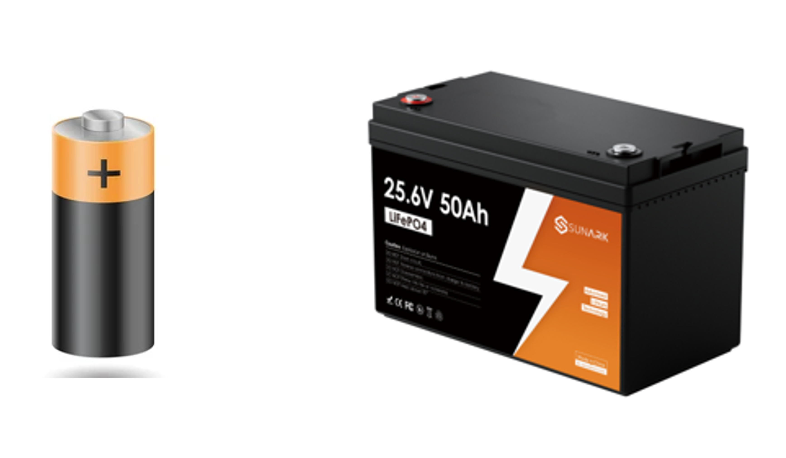
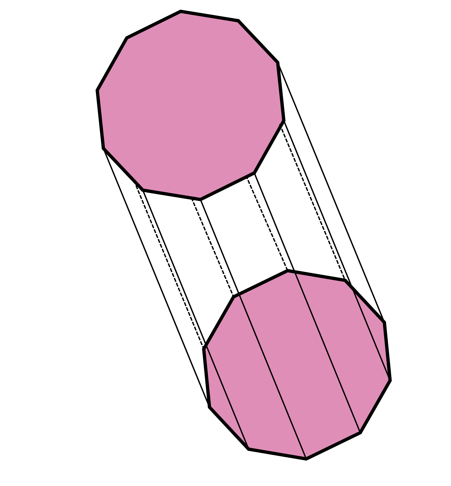

## What are 3D objects?
### Jumping from 2D to 3D
We learned the methods of calculating the area of a surface in different shapes. All of the shapes could be drawn in a sheet of paper and they covered space in that sheet only. But very rarely will things look like a sheet of paper in the real world. Have you seen a real triangle around yourself? Or maybe a rectangle? You may say yes but they aren't perfect rectangles. There is some thickness of a very thin sheet as well. 
                                                                                                                                                                      

2.1
You must be familiar with the object above, it's called the Rubik’s cube. It has its faces in three different directions.

2.2
 
If we are to describe the size of this object, we must define the measurement of the length of the sides in each direction. These measurements are called dimensions and since the object spans over three directions, this object has three dimensions. So these types of objects are called 3D objects in short. 
The first property of a 3D object is its face. Faces are the surfaces of the 3D object. If we limit our side of the view to only two of three directions, then we get a face. For example, if we place the cube such that we see the pink and green lines only and not the white line, we find that the cubes are colored in red only. In the same way, if we place the cube such that we see the white and green line only and not the pink one, then we find that the cubes are colored in blue only. In similar ways, there are six ways of looking at the cube: front, back, top, bottom, left and right and hence there are six faces of a cube. We can only see three of those faces from this picture, whereas the other three are hidden on the other side and we can see them by rotating the cube only. 
We can see that there are smaller squares on the different faces. We also see that each of the squares is of the same size. As you remember we measure surfaces with the number of squares that can cover the respective surface. If we look at the red square face that can be seen from the front, there are 9 squares. Likewise there are nine squares on each of the faces .

2.3

If each square has a unit surface area, then the red face covers an area equivalent to 9 squares. Like the red face, it is the same with the blue, yellow and other remaining faces. Each face has an area of 9 square units. There are six different faces on that cube which means 9 has to be added 6 times. If all of the squares are counted then there willD be 9+9+9+9+9+9 or 54 squares. 
This value of 54 square units which we obtained is the total surface area of the cube. Total surface area is defined as the sum of all visible surfaces of an object. Visible faces mean all faces that are on the object, even the hidden ones that can’t be observed without rotating the object. 
We can analyze which surfaces are part of the total surface area by questioning ourselves “if this object has to be covered with a sheet of paper, which surfaces are required to cover or can be covered?”
If we have a 3D object with faces that have different shapes, then we find the area of those shapes and add them together for its total surface area. 
Each of the square faces meets at a straight edge. Edges means we can draw a line that joins the blue and yellow faces, yellow and red face, red and blue faces and so on. The edges are highlighted below. There are 12 edges on a cube; only 9 can be seen in the figure below. 

2.4
  
The edges meet at certain points lying on the extreme areas on the face of the cube. They are called corners. There are 8 corners in the cube of which 7 are visible and 1 is not. There are three edges intersecting at each corner. The number of edges and corners in a particular object is dependent on the number of faces it has.   

2.5
If the three sides of a cube aren't equal to each other then such an object is known as a cuboid. The method of finding the total surface area of a cuboid is given later. 

### What are polyhedra?
We introduced 3D faces with objects that have flat faces. But , faces may not always be flat in a 3D object. What is the difference between the shapes of the two batteries that can be seen in the figure below? 

2.6 2.7

Apart from the height of the two batteries, we can see that the outer surfaces of the two batteries aren't the same. We can clearly see that one of them has a curved type surface whereas the other has all of its surface flat. If we look at the battery on the left from the top we see a circle. 

2.8

Polyhedra are 3D objects that have flat surfaces only and the battery shown on the right is a polyhedra while the other battery is not. Polyhedra in itself is of two types. We categorize them on the basis of the shape of the faces that the object is made up of. 
Let’s observe two types of polyhedra. 

2.9 2.10 

You must be familiar with the pyramids of Egypt, what shapes are the different faces of the pyramid? Well, one thing is certain they contain flat faces only. That is why it is a type of polyhedron. 
Look at the two wooden boxes in the above figure.  The figure on the left side above resembles a pyramid whereas the one on the right is a box/chest similar to how a Rubik’s cube shape is but with rectangles. Such objects are known as cuboids. 
The pyramid-type box on the left has triangular faces joined with one another while the box on the right has rectangular faces only. The shape of the chest is cuboid and one such cuboid is given below. 

#### It depends on how we look at the objects
If we look at the object straight from the direction shown with the blue arrow, we are certain that we will see a rectangle, and the thickness of the box behind it won't be visible.

2.11 

Do you remember any object that is just like a rectangle? If you have then you must have noticed that even the thinnest of objects are not perfect 2D figures because they have some thickness as well. The figure below shows a door that looks like a rectangle from the front but has ‘t’ thickness. 

2.12

We have no doubt that the front of the door is rectangular. We see the rectangle at all times when the door is closed but when the door is opened and we observe from the same direction as shown in the figure, it feels like the door is trapezium.

2.13 

That is normally the case with a lot of 3D objects. We don't see actual shapes when we see multiple views at once. For instance, have a look at the cuboid below which is made from rectangles yet all of them look like parallelograms.
### What is a volume? 

2.14

As area gives the space occupied or covered by a 2D object, we have a similar quantity for 3D objects as well. As we know 3D means 3-dimensional objects that occupy some space in three different directions. 

2.15

For example, we have a rectangle of dimensions ℓ and b as shown in the figure. If we copy the same rectangle in the direction shown by the arrow and join them all, we find that it makes up a box. The rectangles are copied upto ‘h’ units which is also known as the height of the prism. If ℓ x b was the area covered by one rectangular face, there are multiple rectangles upto ‘h’ thus the ℓ x b has to be added h times. These types of 3D objects make themselves seem like a collection of the same shape and same size polygons are known as prisms. 
That new quantity gives the space occupied by a 3D object and it is called volume = ℓ x b + ℓ x b + ℓ x b + ℓ x b +......... upto ‘h’ units 
= (ℓ x b) times h
= ℓ x b x h
The formula is applicable for box shape objects as shown above. Suppose we have the box of dimensions 
ℓ = ⅓ cm, b = ⅓ cm, h = 1 cm

2.16

Volume = (⅓ cm x ⅓ cm x 1 cm) = 1/9 cubic cm
This volume can be interpreted as nine such cubes are required to cover the space occupied by a cube of 1 cm length without overlapping and leaving gaps. 
9 x volume of the cube = (9 x 1/9) cm3 = 1 cm3
Therefore, volume also can be defined in terms of the number of cubes of unit length that can be fitted into a given object or the numbers of that objects that can be fitted inside a cube of unit length.  
In a cube ℓ, b, and h are equal, thus 
Volume = ℓ x ℓ x ℓ = ℓ3
Since each of ℓ, b, and h is measured in “units”, the unit of volume is cubic units. It means that if length is measured in centimeters, volume is measured in cm3, likewise if the length is measure in feet, then the volume is measured in ft3 and so on. 

An object of 6 cm3 volume can accommodate 6 cubes of 1 cm length inside itself. Here are two objects made up of unit cubes both having their total volumes equal. We don’t typically use the formula of cuboids for these two objects because they aren't prisms entirely. A simpler way of calculating the volume of objects of this type is to count the number of cubes. Both have six such cubes. 

2.17 2.18

A prism may be made up of shapes other than rectangles as well. For instance, a hexagonal prism has two hexagonal bases, and joining these bases are six rectangles (because a hexagon has six sides). Both hexagons are the base for the prism. 

2.19

A decagonal prism contains 12 faces of which 10 are rectangles and 2 are decagons. So we can conclude that a prism will have the same number of rectangles as the sides of a polygon. Both decagons are the base for the prism. 

2.20

The base extends in a perpendicular direction to itself in prisms. In the object shown earlier, the area of the base is ℓ x b.
We can derive a general formula for different prisms using the formula derived for the cuboid. 
Volume = ℓ x b x h 
The base of the cuboid was taken as the rectangular face having dimensions ‘ℓ’ and ‘b’
Thus the formula can also be written as 
= base area x height
Where the base area is “ℓ x b” the area of the rectangle in that figure 
That means that the base may be of any shape, we find its area  and multiply with the height to find the total volume. 
For example, we have a pentagonal prism with a base area of 30 square units and a height of 7 units.
 Volume = 30 x 7 cubic units = 210 cubic units
