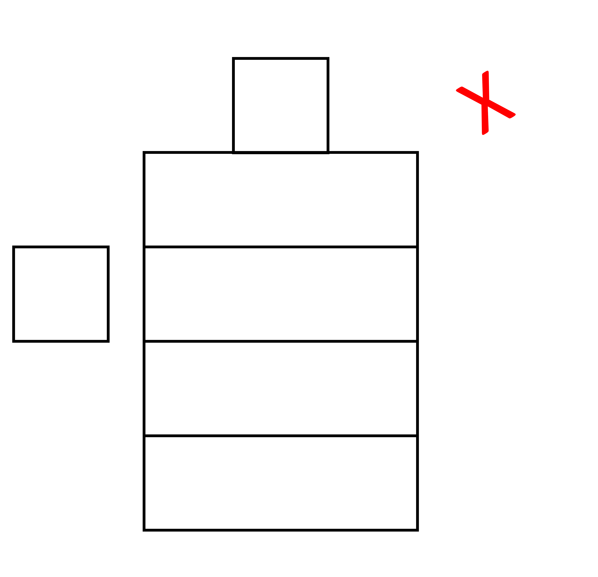

## Net diagrams

We know that showing all the sides of a 3D shape is difficult. We usually assume (and know for a fact) that the unseen sides are present as well. Net diagrams are a way to show all the faces of a 3D object on paper. Nets help us understand the actual shape of 3D objects and their areas since they are essentially what we might get if we opened up a 3D shape. Confused? Let’s try clearing it up. 

The picture shows a net diagram of a pentagonal pyramid. There are five triangles and a pentagon in the middle. If we fold the triangles together so the tops meet, we get the pyramid as shown.

To find the total surface area of the pyramid, we simply find the areas of each triangle and the pentagon. We have already discussed this previously. But simply looking at the net makes it easy, since we now look at 2D shapes. 

When making a net diagram, we have to be careful to place each face in a way that when folded, gives us the object again. It's like unwrapping and packing a 3D object. The picture below shows some ways to do this for a cube.
 

To form nets, we can unfold a 3D shape in any way we want. But when we fold it back, the faces must form a closed shape. For example, a cube can be unfolded into six squares, like in the picture. The following net, when folded, also gives us a closed cube.

To make a correct net diagram, we need to know the shapes and sizes of the faces. We also need to make sure that the edges where two sides meet are the same length. If we don't do this, the faces will overlap when we fold them back. For a cuboid, the net diagram would look different than for a cube, something like this. 

Sometimes people make net diagrams that aren't correct, even when the number and size of each face is the same. Here are a few examples of incorrect net diagrams for the same object.

### Finding Area from Net Diagrams

Another advantage we get from the Net diagram is that we get the actual idea of the dimensions of the faces and eventually their area. When we look at a 3D object from different angles, we see different shapes of the same types of faces. 
For example,

The dimensions of the diagram can be given in many ways because there are multiple sides that are equal to each other. 

The diagrams above and below are equivalent to each other because they show the same sides when folded. There are 4 rectangles that have the same area and 2 squares that are also identical. This helps us see the object in a different way and understand it better.

In this diagram, there are two squares and four rectangles. The squares are 2 units long and the rectangles are 2 units wide and 5 units long. 

To find the surface area of the cuboid, we add up the area of all the faces. 
Total surface area of cuboid = 2 x 2 + 2 x 2 + 2 x 5 + 2 x 5 + 2 x 5 + 2 x 5 =48 square units 
We get the same answer if we put l = 2, b = 2, and h = 5 in the formula 
TSA = 2(ℓb+bh+ℓh) =2 (2x2 + 2x5 + 2x5) = 48 square units 
The total surface area is thus 48 square units. This means if the cuboid was to be covered with squares of 1 unit length, we would need 48 of them to cover all the faces of the cuboid.
The advantage of using a net to find the surface area is that we can see all the faces at once without having to move the cuboid around. 

