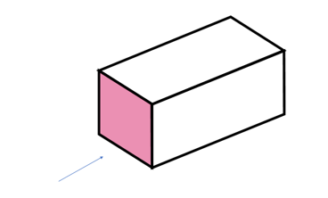
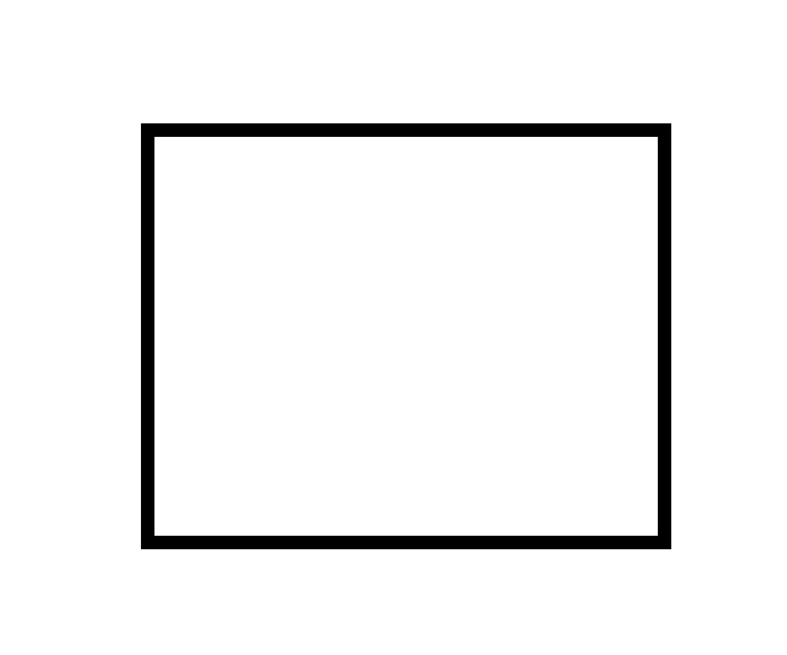
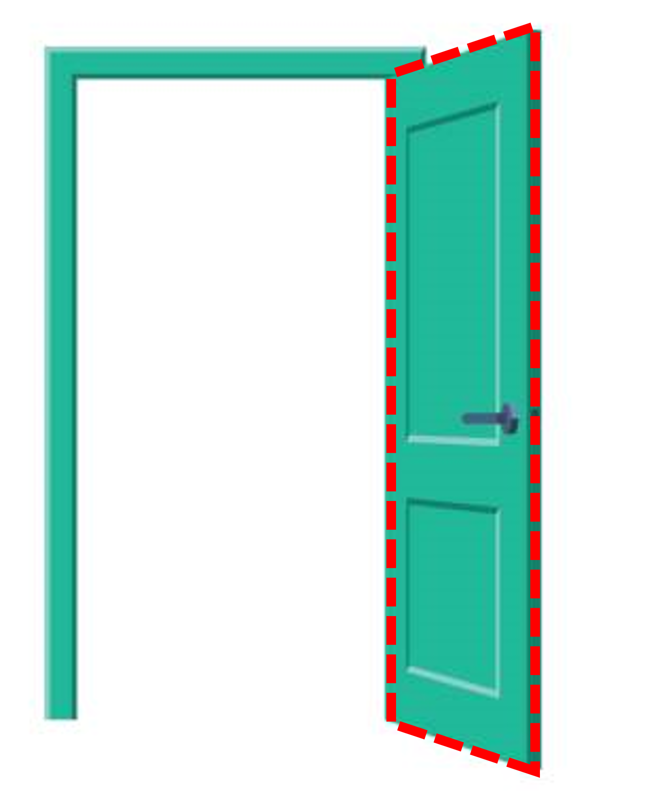

### Perspective when it comes to 3D objects

When we look at a cuboid straight on, we usually see a rectangle and not the box behind it. 

 
But did you know that even thin objects have some thickness? (Could there possibly be a shape without any kind of thickness? Would not even exist.) This means they're not just 2D shapes. Check out the picture of the door below. It looks like a rectangle from the front, but it has some thickness too!

Even though the front of the door is a rectangle, when we open it and look at it from a certain angle, it looks like a trapezium. 

This happens with a lot of 3D objects. When we see them from different views, they don't look like their actual shape. We can see different shapes from different angles, even for the same object. 