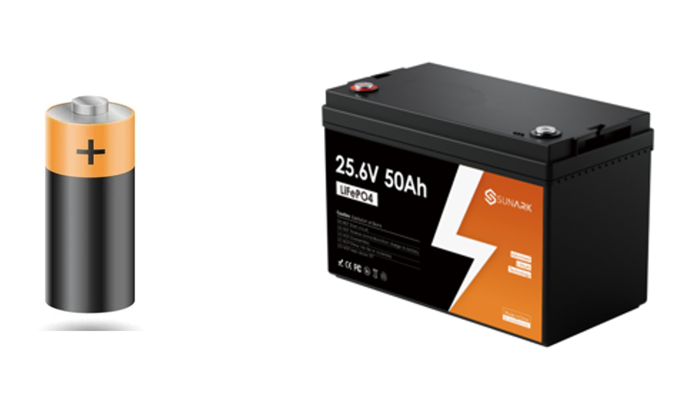
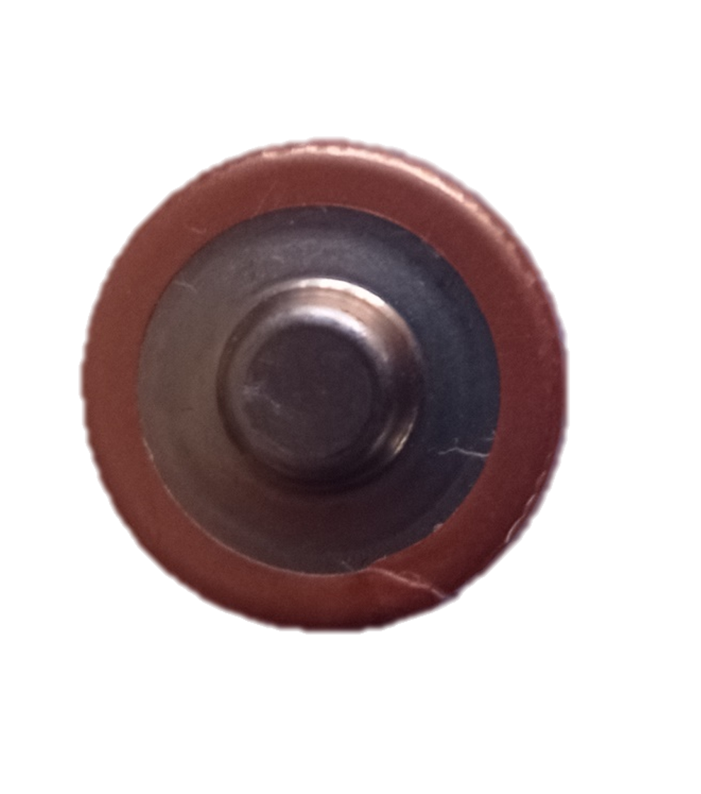
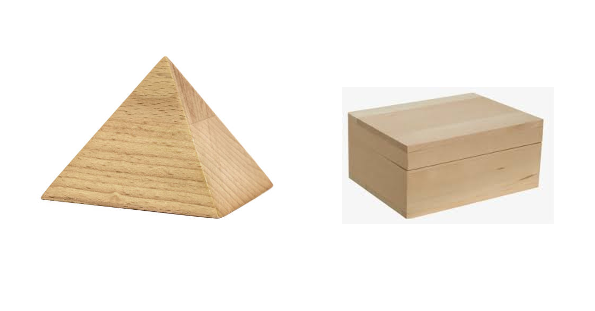

### What are polyhedra?

We’ve talked about 3D objects with flat faces before, but not all faces in a 3D object are flat. Take a look at two batteries in the picture below. Can you spot the difference? 

Apart from the height, we see that one has a curved surface while the other is completely flat on all sides. The battery on the left, however, is not a polyhedron because it has a curved surface. If you look at it from the top, you’ll see a circle, which could explain the curve. 

The battery on the right is called a polyhedron. This means it has only flat surfaces, which is the definition of a polyhedra. Polyhedra can be divided into two types based on the shape of their faces. 
Do you know the pyramids in Egypt? The faces of a pyramid are all flat, which means it’s a type of polyhedron. 
Now, take a look at the two boxes in the picture above. 
 

The one on the left looks like a pyramid, while the one on the right looks like a Rubik’s cube, but made of rectangles. The box on the left has triangular faces joined together, while the one on the right has rectangular faces. The triangular polyhedra, shaped like a pyramid, is actually called a pyramid! The one made of rectangles is called a cuboid (more generally a prism). 