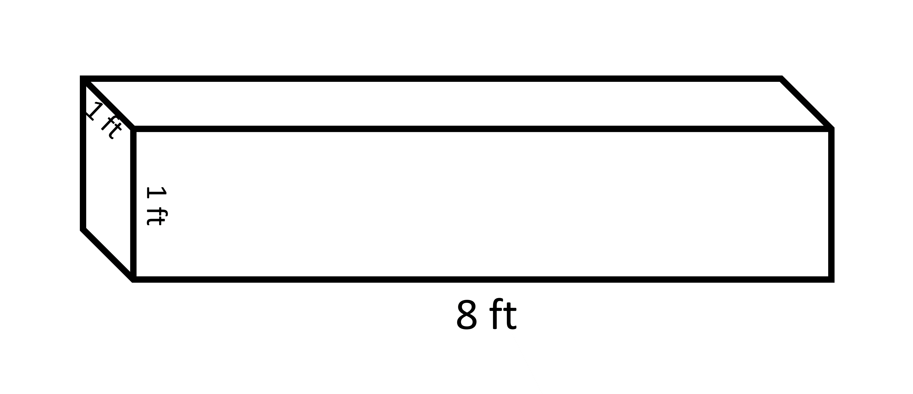

## Net diagrams
We have found difficulty showing all the faces of a 3D object at once. Some faces lie on the back side and that cant be shown in a plane such as a paper. Net diagrams are the figures that show all the faces of a 3D object with their exact areas on one paper. Nets are one of the useful ways of understanding the actual shapes of 3D objects and their areas.

2.31
 
The given net diagram is of a pentagonal base pyramid. There are five triangles in a pentagonal pyramid along with the pyramid base and those triangles are laid flat on its net diagram. If we fold triangular faces again joining edge to edge, we get the pyramid as shown. 

2.32

If we have to find the total surface area of the pyramid, then we must find the areas of each of the five triangles and the pentagon in the middle. 
While making the net diagram, we must be careful in placing each face in a way that they can be folded to form the object again. It is like unwrapping and packing a 3D object. The image below shows some ways of doing that for a cube. 

2.33
 
We can unfold the object in any manner, we just need to make sure that when the faces are refolded, they must form a closed figure. One of the folding ways for a cube gives the following net diagram with 6 squares. 

2.34

We need to identify the shapes of the faces and their accurate sizes in order to make a correct net diagram. The edges in which two sides join must be chosen with reference to equal sides. If that isnt followed, then when folding the shapes, the faces will interfere with each other. 
If it was for a cuboid, the net diagram would be something like shown below. 

2.35
 
Some of the incorrect net diagrams for the same object are

2.36 2.37 2.38

### Area from Net diagrams
Another advantage we get from the Net diagram is that we get the actual idea of the dimensions of the faces and eventually their area. When we look at a 3D object from different angles, we see different shapes of the same types of faces. 
For example,

2.39 

In this cube 3 out of 6 faces are visible but two out of those three seem like it is a parallelogram, however, we know that all of the faces of the cube are squares and cover an equal area as well. Thus, in such cases, if we have the net diagram, then we can calculate the area of those faces easily. We can easily calculate the total surface area of an object by observing the net diagram.
The dimensions of the same diagram can be given in numerous ways because there are many sides that are equal to each other

2.40

The diagrams above and below are equivalent to each other because they refer to the same sides when folded. There are 4 rectangles that have the same area and 2 squares are also identical to each other.  

2.41

There are two squares and four rectangles in the net diagram. The square measures 2 units in length whereas the rectangles measure 2 units and 5 units in width and length respectively.

2.42

Total surface area of cuboid 
= 2 x 2 + 2 x 2 + 2 x 5 + 2 x 5 + 2 x 5 + 2 x 5 
=48 square units
We get the same answer if we put l = 2 b = 2 and h = 5 in the formula TSA = 2(ℓb+bh+ℓh) =2 (2x2 + 2x5 + 2x5) = 48 square units
That means if the cuboid was to be covered with squares of 1 unit length, we would need 48 of them to cover all the faces of the cuboid. 
The main advantage of a net over having an actual polyhedron while calculating the area is that we are able to see all of the faces at once and we don't have to rotate the polyhedron or visualize the hidden faces in our mind. 
In a similar manner since we know about the length, breadth and height of the cuboid as 2, 2, and 5 units respectively. The volume of the cuboid can be calculated using the formula. 
Volume of the cuboid = 2 x 2 x 5 = 20 cubic units. 
It means that if the net is folded to form a cuboid, 20 cubes of unit length can be fitted inside it.

2.43

## Why do we study area and volume for 3D objects?
Measuring a 3D object is important in various aspects. It’s more important to find which of them is required in different applications. We choose to measure material filling or occupying some space with volume. For example, oil/water filled in a container, number of boxes that fit inside the cargo truck etc. 
When we want to know how much area has to be covered while covering a 3D object, then we measure the total surface area of that object. For example, tiling the walls, carpeting the floor etc.  
The most appropriate example would be a gift and the paper wrapped around it. Suppose you have a box for a gift that has to be wrapped in wrapping paper. How big a gift can be inserted into the box? The largest gift that can be put inside the box is equal to the volume of the box. How much wrapping paper in minimum is required to cover the box that has a gift inside? That is given by the surface area of the box. You may be thinking “what about the paper that we fold during the wrapping process?” Of course, in that case, the wrapping paper required will be larger than the surface area of the box. 
How much concrete can be put into a frame of beam made of wood that has a length of 8 feet, width of 1 foot, and height of 1 foot? How much paint will be required to paint the concrete beam if 17 square feet can be painted by 10 gill paint?

2.44

The concrete fills inside of the frame and that space can be defined in terms of volume. 
The volume of the cuboid is given by the multiplication of length, breadth, and height.
Volume = length x breadth x height
=8 x 1 x 1 cubic feet
=8 cubic feet

All of the surfaces of the beam have to be painted and that is given by total surface area 
= 2 (length x breadth +breadth x height + length x height)
= 2 (8 x 1 + 1 x 1 + 8 x 1) 
= 2 x 17 = 34 square feet

If 17 square feet is painted by 10 gills paint then 34 (or 2 x 17) square feet is painted by 2 x 10 gills. 
=20 gills