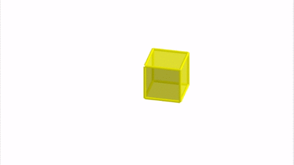
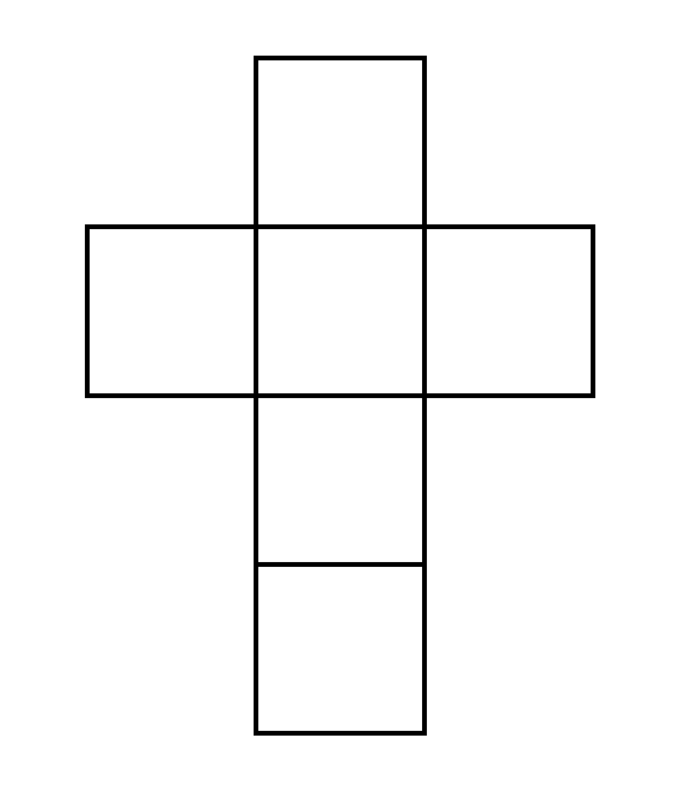
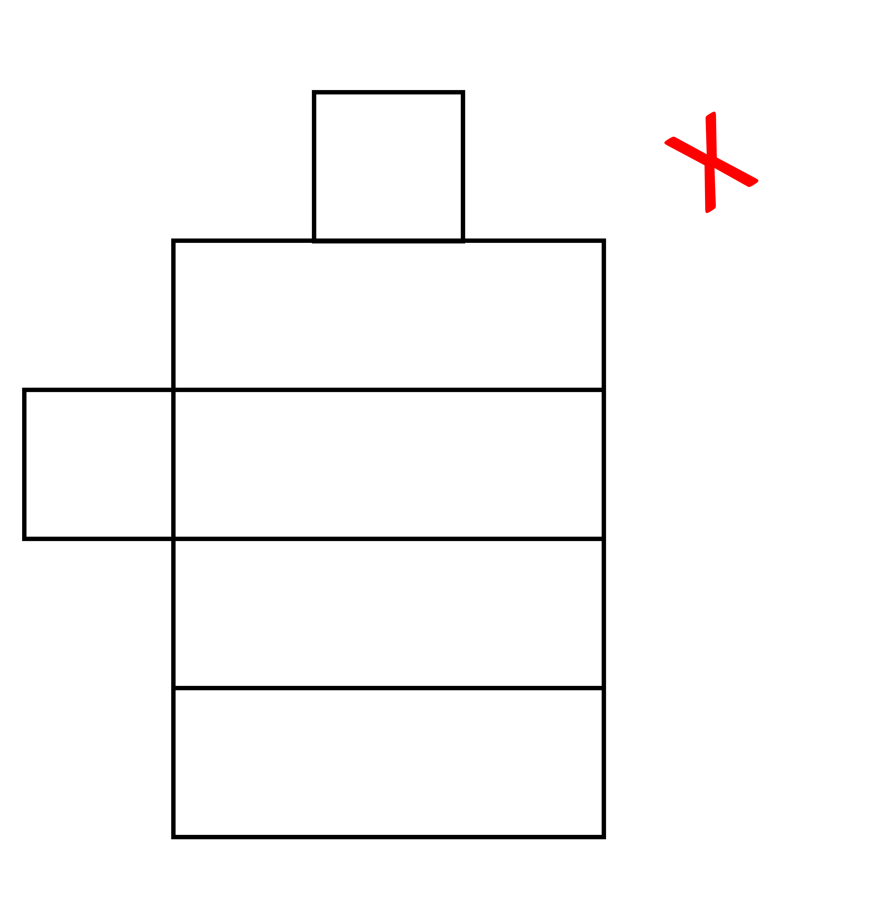
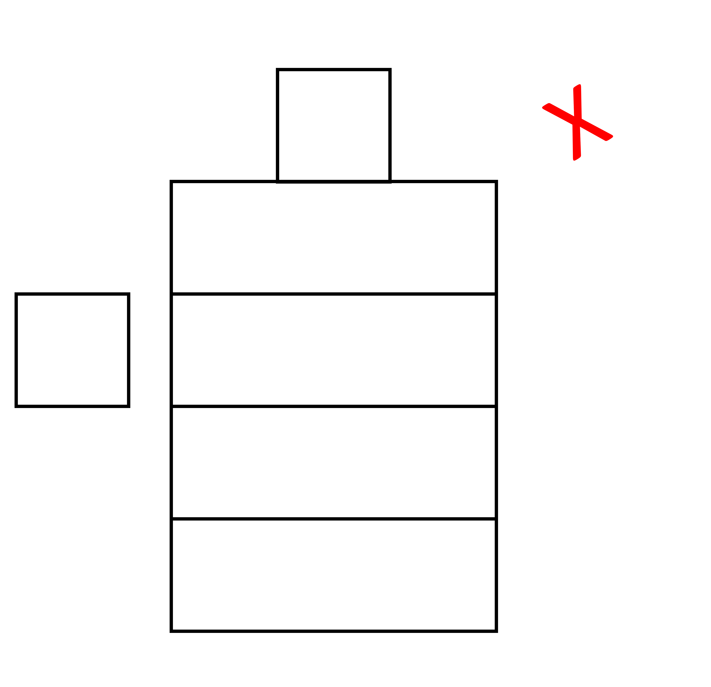
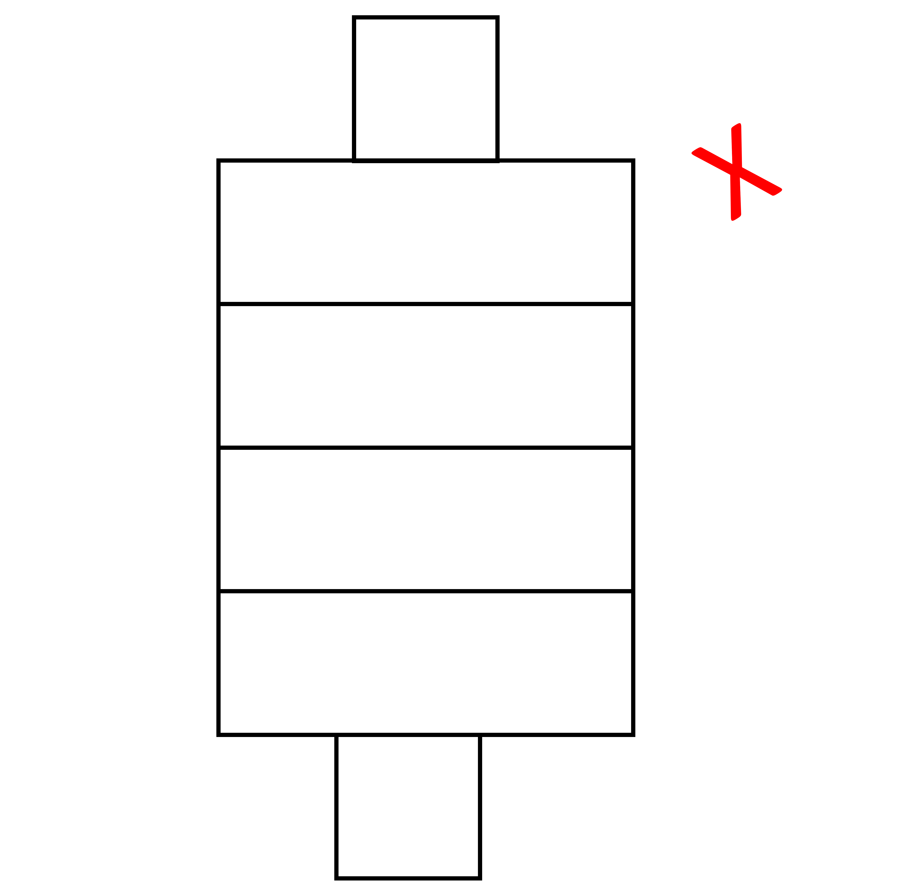
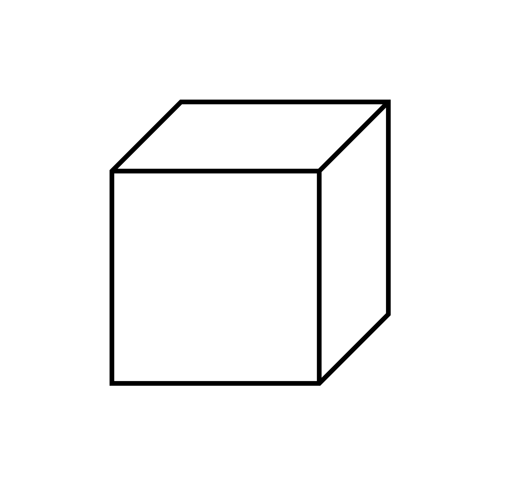
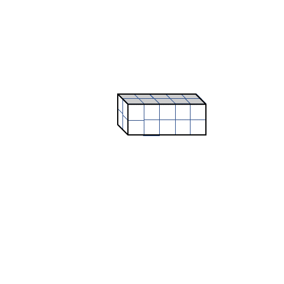

## Pyramids

Let's talk about pyramids (and not the ones in Egypt). 

The given shape shows us that it has a square base and 4 triangular faces (although we can only see two in the image) that meet at a point, which is called the apex. There are 8 edges and 5 corners in this pyramid (you should know by now what edges and corners mean). When you look at the image,  while moving from the bottom (or base) to the top, it looks like the square base gets smaller and smaller until it reaches the point at the top (the apex). This is what differentiates a pyramid from a prism. In case of a prism, the base was consistent throughout the height of the prism. 
There are other types of pyramids too, like ones with a hexagonal base. These have 6 triangular faces that connect the hexagon base to the apex. Hexagonal pyramids have 6 triangles, while hexagonal prisms have 6 rectangles.

Note: Have you noticed the dotted lines on pictures of 3D shapes? Those lines show us the faces that we can't see because they're hidden from view.

Similar to prisms, to find the surface area of a pyramid, we need to add up the areas of all the faces. Unlike a prism though, pyramids have triangular faces and only one base. If we look at the square prism given below, we have a square base, with each side equal (say a). 

This side of the square is also the base of each of the triangles. The height of each triangle is also the height of the pyramid (h). Or is it? When you look at a pyramid, the triangles are slightly tilted so the tops of all triangles can meet at the apex. So the height of the triangles and the height of the pyramid is not the same. Instead, we have a new height of each triangle, called the slanted height (s) (named correctly so, right?).

So, the total surface area = ½ x a x s + ½ x a x s + ½ x a x s + ½ x a x s + a x a = 
= ½ x s x (a + a + a + a) + a^2
= ½ x slant height x perimeter of base + area of base
 
This formula applies to any kind of pyramid with any base. 
Like for prisms, the lateral surface area of the pyramid is given by ½ x s x (a + a + a + a) or ½ x slant height x perimeter of base. Basically, the surface area of all the shapes except the base. So, to find the total surface area of the pyramid, we add the lateral surface area to the area of the one base.

Let's look at an example. If we have a square pyramid with a base side of 5 cm and a slanted height of 8 cm, we can use the formula to find the surface area. The perimeter of the base is 4 x 5 = 20 cm. The area of the base is 5 x 5 = 25 cm². So, the surface area is ½ x 8 x 20 + 25 = 85 cm².

## Net diagrams

We know that showing all the sides of a 3D shape is difficult. We usually assume (and know for a fact) that the unseen sides are present as well. Net diagrams are a way to show all the faces of a 3D object on paper. Nets help us understand the actual shape of 3D objects and their areas since they are essentially what we might get if we opened up a 3D shape. Confused? Let’s try clearing it up. 

The picture shows a net diagram of a pentagonal pyramid. There are five triangles and a pentagon in the middle. If we fold the triangles together so the tops meet, we get the pyramid as shown.

To find the total surface area of the pyramid, we simply find the areas of each triangle and the pentagon. We have already discussed this previously. But simply looking at the net makes it easy, since we now look at 2D shapes. 

When making a net diagram, we have to be careful to place each face in a way that when folded, gives us the object again. It's like unwrapping and packing a 3D object. The picture below shows some ways to do this for a cube.
 

To form nets, we can unfold a 3D shape in any way we want. But when we fold it back, the faces must form a closed shape. For example, a cube can be unfolded into six squares, like in the picture. The following net, when folded, also gives us a closed cube.

To make a correct net diagram, we need to know the shapes and sizes of the faces. We also need to make sure that the edges where two sides meet are the same length. If we don't do this, the faces will overlap when we fold them back. For a cuboid, the net diagram would look different than for a cube, something like this. 

Sometimes people make net diagrams that aren't correct, even when the number and size of each face is the same. Here are a few examples of incorrect net diagrams for the same object.

2.36 2.37 2.38

### Finding Area from Net Diagrams

Another advantage we get from the Net diagram is that we get the actual idea of the dimensions of the faces and eventually their area. When we look at a 3D object from different angles, we see different shapes of the same types of faces. 
For example,

The dimensions of the diagram can be given in many ways because there are multiple sides that are equal to each other. 

The diagrams above and below are equivalent to each other because they show the same sides when folded. There are 4 rectangles that have the same area and 2 squares that are also identical. This helps us see the object in a different way and understand it better.

In this diagram, there are two squares and four rectangles. The squares are 2 units long and the rectangles are 2 units wide and 5 units long. 

To find the surface area of the cuboid, we add up the area of all the faces. 
Total surface area of cuboid = 2 x 2 + 2 x 2 + 2 x 5 + 2 x 5 + 2 x 5 + 2 x 5 =48 square units 
We get the same answer if we put l = 2, b = 2, and h = 5 in the formula 
TSA = 2(ℓb+bh+ℓh) =2 (2x2 + 2x5 + 2x5) = 48 square units 
The total surface area is thus 48 square units. This means if the cuboid was to be covered with squares of 1 unit length, we would need 48 of them to cover all the faces of the cuboid.
The advantage of using a net to find the surface area is that we can see all the faces at once without having to move the cuboid around. 

## Why do we study area and volume for 3D objects?

Measuring characteristics of a 3D object is important for many things. We use it to find out how much stuff can fit inside, like water in a container or boxes in a truck. We also use it to find out how much area we need to cover the object, like when we tile a wall or carpet a floor. It is also important to know when to use which characteristics (surface area or volume). 
Think about wrapping a gift. If you have a box for the gift, you want to know how big the gift can be. The biggest gift that can fit inside the box is the volume of the box. But how much wrapping paper do you need to cover the box and the gift? That's the surface area of the box. And remember, you might need more paper than that if you fold it while wrapping.
Other examples are:
Say you have a wooden beam that's 8 feet long, 1 foot wide, and 1 foot tall. 

You want to fill it with concrete. How much concrete can you put in? To find out, you need to know the volume of the beam. And if you want to paint the beam, you need to know how much paint to buy. If 10 L of paint can cover 17 square feet, how much paint do you need to cover the whole beam? 
The concrete is filled inside the frame and that space can be defined in terms of volume. The volume of the cuboid is given by multiplying length, breadth, and height. 
Volume = length x breadth x height = 8 x 1 x 1 cubic feet = 8 cubic feet
All of the surfaces of the beam have to be painted and that is given by total surface area.
Total surface area = 2 (length x breadth +breadth x height + length x height) = 2 (8 x 1 + 1 x 1 + 8 x 1) = 2 x 17 = 34 square feet
If 17 square feet is painted by 10 L of paint then 34 (or 2 x 17) square feet is painted by 2 x 10 = 20 L
